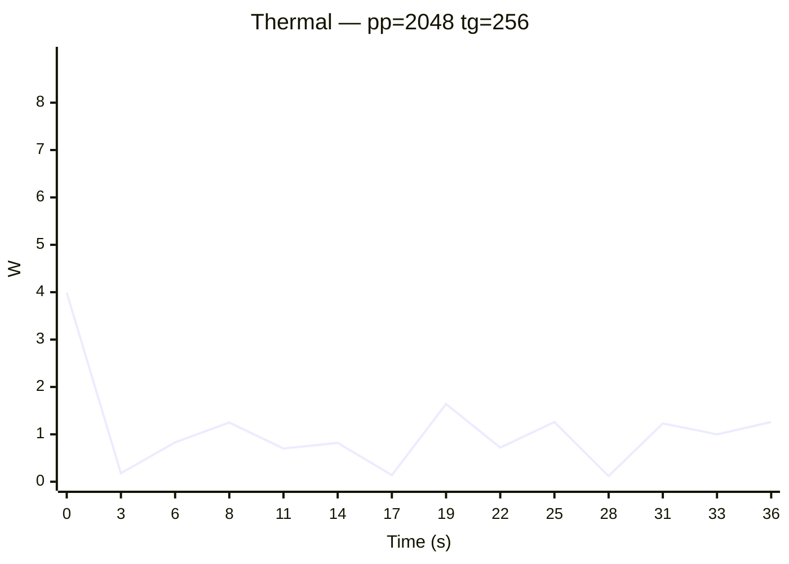
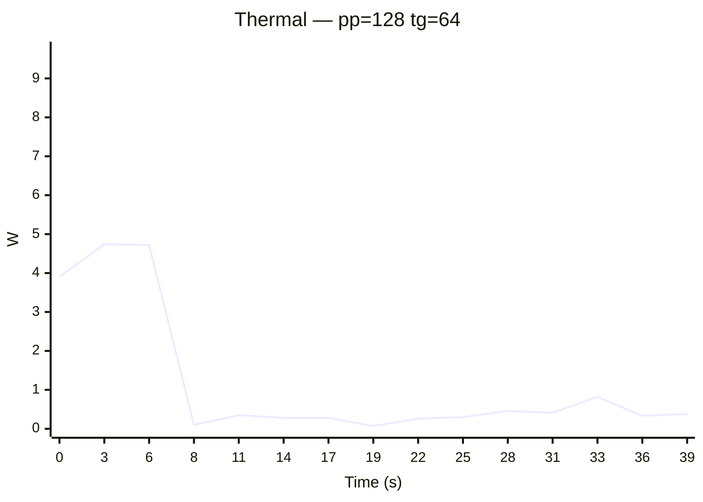
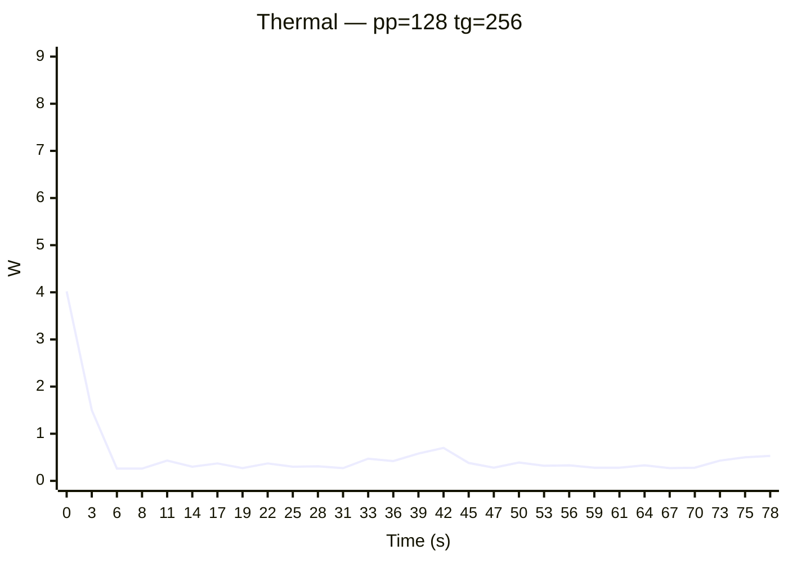
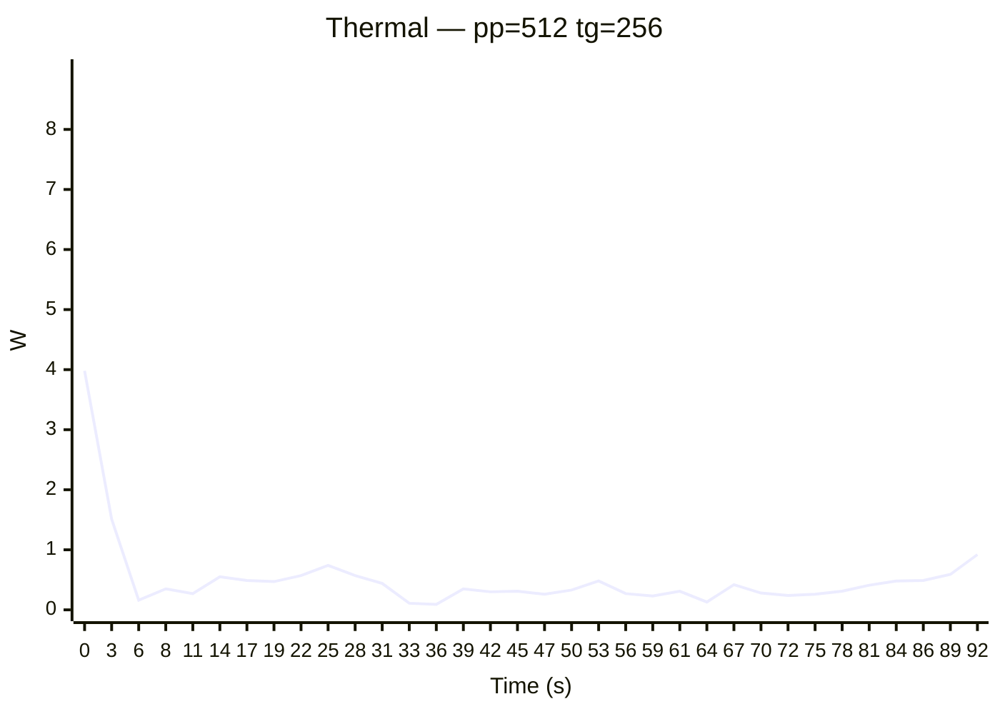
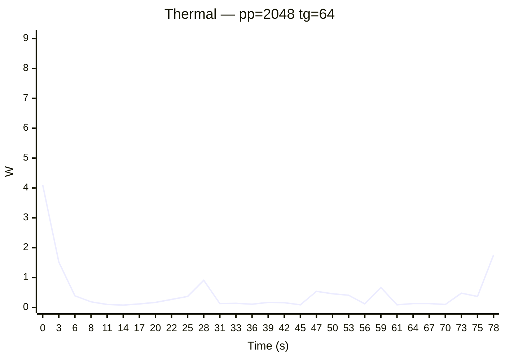
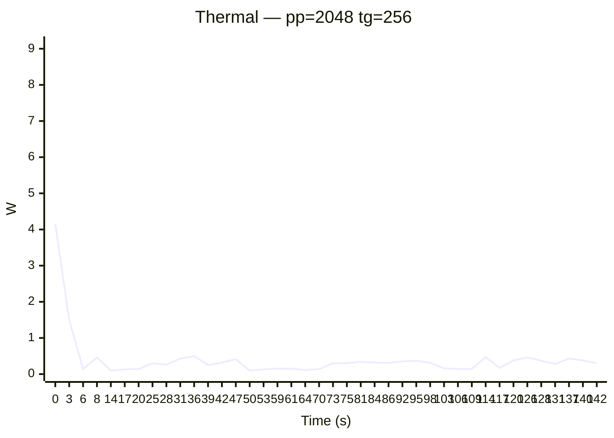
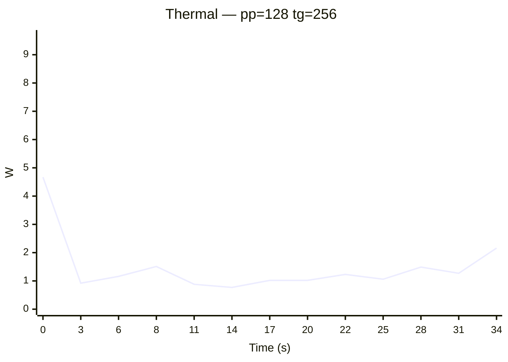

# minion64 (M1 Max) — Benchmark Summary

**Machine:** MacBook Pro M1 Max, 64GB unified memory, macOS 26.4.1  
**Tool:** llama-benchy | **Date:** 2026-04-28  
**Method:** runs per test, latency mode: generation

---

## Cross-Model Comparison

### Generation Throughput (TG tok/s)

| Model | Size | tg=64 @ pp=512 | tg=256 @ pp=512 | tg=64 @ pp=2048 | tg=256 @ pp=2048 | Tested from | Date |
|:------|-----:|---:|---:|---:|---:|:------|:------|
| gemma4:e2b | ? | 61.5 | 66.0 | 51.4 | 49.8 | minion64 (M1 Max) | 2026-04-28 |
| gemma4:26b | ? | 45.0 | 44.3 | 34.1 | 33.9 | minion64 (M1 Max) | 2026-04-28 |
| qwen3:32b | ? | 10.9 | 10.5 | 9.7 | 9.6 | minion64 (M1 Max) | 2026-04-28 |
| phi4:14b | ? | 22.3 | 24.2 | 22.4 | 23.1 | minion64 (M1 Max) | 2026-04-28 |
| mistral-small3.1:24b | ? | 14.6 | 14.6 | 14.0 | 13.7 | minion64 (M1 Max) | 2026-04-28 |
| qwen2.5-coder:32b | ? | 12.0 | 11.8 | 11.7 | 11.6 | minion64 (M1 Max) | 2026-04-28 |
| deepseek-r1:32b | ? | 11.7 | 11.7 | 11.0 | 11.1 | minion64 (M1 Max) | 2026-04-28 |
| command-r:35b | ? | 16.5 | 17.2 | 15.4 | 15.6 | minion64 (M1 Max) | 2026-04-28 |
| llama3.3:70b | ? | — | — | — | — | minion64 (M1 Max) | 2026-04-28 |
| deepseek-r1:70b | ? | — | — | — | — | minion64 (M1 Max) | 2026-04-28 |

### Prompt Processing Throughput (PP tok/s @ pp=512)

| Model | PP tok/s | TTFT (ms) | Tested from | Date |
|:------|---:|---:|:------|:------|
| gemma4:e2b | ~1,415 | ~521 | minion64 (M1 Max) | 2026-04-28 |
| gemma4:26b | ~767 | ~825 | minion64 (M1 Max) | 2026-04-28 |
| qwen3:32b | 92 | ~5,284 | minion64 (M1 Max) | 2026-04-28 |
| phi4:14b | ~230 | ~2,163 | minion64 (M1 Max) | 2026-04-28 |
| mistral-small3.1:24b | 0 | 0 | minion64 (M1 Max) | 2026-04-28 |
| qwen2.5-coder:32b | 94 | ~5,027 | minion64 (M1 Max) | 2026-04-28 |
| deepseek-r1:32b | 91 | ~5,318 | minion64 (M1 Max) | 2026-04-28 |
| command-r:35b | ~126 | ~4,090 | minion64 (M1 Max) | 2026-04-28 |
| llama3.3:70b | 0 | 0 | minion64 (M1 Max) | 2026-04-28 |
| deepseek-r1:70b | 0 | 0 | minion64 (M1 Max) | 2026-04-28 |

### Thermal Profile (peak across all tests)

| Model | GPU peak °C | CPU W peak | Tested from | Date | Notes |
|:------|---:|---:|:------|:------|:------|
| gemma4:e2b | 0 | 6.91 | minion64 (M1 Max) | 2026-04-28 | |
| gemma4:26b | 0 | 5.22 | minion64 (M1 Max) | 2026-04-28 | |
| qwen3:32b | 0 | 4.74 | minion64 (M1 Max) | 2026-04-28 | |
| phi4:14b | 0 | 10.46 | minion64 (M1 Max) | 2026-04-28 | |
| mistral-small3.1:24b | 0 | 8.78 | minion64 (M1 Max) | 2026-04-28 | |
| qwen2.5-coder:32b | 0 | 9.45 | minion64 (M1 Max) | 2026-04-28 | |
| deepseek-r1:32b | 0 | 5.53 | minion64 (M1 Max) | 2026-04-28 | |
| command-r:35b | 0 | 4.22 | minion64 (M1 Max) | 2026-04-28 | |
| llama3.3:70b | 0 | 42.61 | minion64 (M1 Max) | 2026-04-28 | |
| deepseek-r1:70b | 0 | 42.23 | minion64 (M1 Max) | 2026-04-28 | |

---

*Per-model reports follow below.*

---

# Benchmark Report: gemma4:e2b

**Date:** 2026-04-28 01:05  
**Machine:** MacBook Pro M1 Max, 64GB unified memory, macOS 26.4.1  
**Endpoint:** http://localhost:11434/v1  
**Run platform:** Darwin 25.4.0 arm64  
**Runs per test:** 3  

---

## Summary

| pp | tg | Duration (s) | GPU peak °C | CPU W peak |
|---:|---:|---:|---:|---:|
| 128 | 64 | 20 | 0 | 6.91 |
| 128 | 256 | 17 | 0 | 4.57 |
| 512 | 64 | 8 | 0 | 3.99 |
| 512 | 256 | 18 | 0 | 3.98 |
| 2048 | 64 | 11 | 0 | 3.83 |
| 2048 | 256 | 25 | 0 | 4.25 |

---

## pp=128 tg=64

| model      |   test |             t/s |     peak t/s |      ttfr (ms) |   est_ppt (ms) |   e2e_ttft (ms) |
|:-----------|-------:|----------------:|-------------:|---------------:|---------------:|----------------:|
| gemma4:e2b |  pp128 | 966.23 ± 177.31 |              | 325.56 ± 27.42 | 129.75 ± 27.42 |  325.56 ± 27.42 |
| gemma4:e2b |   tg64 |    67.63 ± 2.57 | 68.33 ± 2.87 |                |                |                 |

### Thermal Data

```mermaid
xychart-beta
  title "Thermal — pp=128 tg=64"
  x-axis "Time (s)" [0, 3, 6, 8, 11, 14, 17, 19]
  y-axis "W" 0 --> 11.91
  line "CPU W" [3.39, 4.74, 2.87, 6.91, 6.31, 4.29, 2.14, 1.57]
```

<details><summary>Raw readings</summary>

| Time (s) | GPU °C | GPU util % | GPU W | CPU W |
|---:|---:|---:|---:|---:|
| 0 | None | None | None | 3.39 |
| 3 | None | None | None | 4.74 |
| 6 | None | None | None | 2.87 |
| 8 | None | None | None | 6.91 |
| 11 | None | None | None | 6.31 |
| 14 | None | None | None | 4.29 |
| 17 | None | None | None | 2.14 |
| 19 | None | None | None | 1.57 |

</details>

---

## pp=128 tg=256

| model      |   test |             t/s |     peak t/s |      ttfr (ms) |   est_ppt (ms) |   e2e_ttft (ms) |
|:-----------|-------:|----------------:|-------------:|---------------:|---------------:|----------------:|
| gemma4:e2b |  pp128 | 873.22 ± 268.01 |              | 354.71 ± 63.88 | 165.52 ± 63.88 |  354.71 ± 63.88 |
| gemma4:e2b |  tg256 |    62.81 ± 1.15 | 67.67 ± 3.09 |                |                |                 |

### Thermal Data

```mermaid
xychart-beta
  title "Thermal — pp=128 tg=256"
  x-axis "Time (s)" [0, 3, 6, 8, 11, 14, 17]
  y-axis "W" 0 --> 9.57
  line "CPU W" [4.57, 1.79, 1.52, 1.69, 1.59, 1.72, 0.53]
```

<details><summary>Raw readings</summary>

| Time (s) | GPU °C | GPU util % | GPU W | CPU W |
|---:|---:|---:|---:|---:|
| 0 | None | None | None | 4.57 |
| 3 | None | None | None | 1.79 |
| 6 | None | None | None | 1.52 |
| 8 | None | None | None | 1.69 |
| 11 | None | None | None | 1.59 |
| 14 | None | None | None | 1.72 |
| 17 | None | None | None | 0.53 |

</details>

---

## pp=512 tg=64

| model      |   test |             t/s |     peak t/s |      ttfr (ms) |   est_ppt (ms) |   e2e_ttft (ms) |
|:-----------|-------:|----------------:|-------------:|---------------:|---------------:|----------------:|
| gemma4:e2b |  pp512 | 1435.12 ± 16.19 |              | 522.88 ± 15.25 | 331.12 ± 15.25 |  522.88 ± 15.25 |
| gemma4:e2b |   tg64 |    61.53 ± 1.26 | 62.00 ± 1.41 |                |                |                 |

### Thermal Data

```mermaid
xychart-beta
  title "Thermal — pp=512 tg=64"
  x-axis "Time (s)" [0, 3, 6]
  y-axis "W" 0 --> 8.99
  line "CPU W" [3.99, 1.21, 0.61]
```

<details><summary>Raw readings</summary>

| Time (s) | GPU °C | GPU util % | GPU W | CPU W |
|---:|---:|---:|---:|---:|
| 0 | None | None | None | 3.99 |
| 3 | None | None | None | 1.21 |
| 6 | None | None | None | 0.61 |

</details>

---

## pp=512 tg=256

| model      |   test |             t/s |     peak t/s |      ttfr (ms) |   est_ppt (ms) |   e2e_ttft (ms) |
|:-----------|-------:|----------------:|-------------:|---------------:|---------------:|----------------:|
| gemma4:e2b |  pp512 | 1394.48 ± 29.80 |              | 518.44 ± 12.22 | 326.98 ± 12.22 |  518.44 ± 12.22 |
| gemma4:e2b |  tg256 |    65.98 ± 3.32 | 76.33 ± 8.22 |                |                |                 |

### Thermal Data

```mermaid
xychart-beta
  title "Thermal — pp=512 tg=256"
  x-axis "Time (s)" [0, 3, 6, 8, 11, 14, 17]
  y-axis "W" 0 --> 8.98
  line "CPU W" [3.98, 1.48, 1.52, 1.62, 1.47, 1.1, 1.1]
```

<details><summary>Raw readings</summary>

| Time (s) | GPU °C | GPU util % | GPU W | CPU W |
|---:|---:|---:|---:|---:|
| 0 | None | None | None | 3.98 |
| 3 | None | None | None | 1.48 |
| 6 | None | None | None | 1.52 |
| 8 | None | None | None | 1.62 |
| 11 | None | None | None | 1.47 |
| 14 | None | None | None | 1.1 |
| 17 | None | None | None | 1.1 |

</details>

---

## pp=2048 tg=64

| model      |   test |             t/s |     peak t/s |       ttfr (ms) |    est_ppt (ms) |   e2e_ttft (ms) |
|:-----------|-------:|----------------:|-------------:|----------------:|----------------:|----------------:|
| gemma4:e2b | pp2048 | 1373.92 ± 43.97 |              | 1539.55 ± 49.37 | 1354.55 ± 49.37 | 1539.55 ± 49.37 |
| gemma4:e2b |   tg64 |    51.40 ± 1.39 | 53.67 ± 1.70 |                 |                 |                 |

### Thermal Data

```mermaid
xychart-beta
  title "Thermal — pp=2048 tg=64"
  x-axis "Time (s)" [0, 3, 6, 8, 11]
  y-axis "W" 0 --> 8.83
  line "CPU W" [3.83, 0.32, 0.19, 0.24, 0.07]
```

<details><summary>Raw readings</summary>

| Time (s) | GPU °C | GPU util % | GPU W | CPU W |
|---:|---:|---:|---:|---:|
| 0 | None | None | None | 3.83 |
| 3 | None | None | None | 0.32 |
| 6 | None | None | None | 0.19 |
| 8 | None | None | None | 0.24 |
| 11 | None | None | None | 0.07 |

</details>

---

## pp=2048 tg=256

| model      |   test |            t/s |     peak t/s |       ttfr (ms) |    est_ppt (ms) |   e2e_ttft (ms) |
|:-----------|-------:|---------------:|-------------:|----------------:|----------------:|----------------:|
| gemma4:e2b | pp2048 | 1394.03 ± 6.73 |              | 1513.66 ± 32.57 | 1326.46 ± 32.57 | 1513.66 ± 32.57 |
| gemma4:e2b |  tg256 |   49.81 ± 4.73 | 59.33 ± 1.70 |                 |                 |                 |

### Thermal Data

```mermaid
xychart-beta
  title "Thermal — pp=2048 tg=256"
  x-axis "Time (s)" [0, 3, 6, 8, 11, 14, 17, 19, 22]
  y-axis "W" 0 --> 9.25
  line "CPU W" [4.25, 0.12, 0.93, 1.36, 0.11, 0.93, 1.41, 1.3, 1.39]
```

<details><summary>Raw readings</summary>

| Time (s) | GPU °C | GPU util % | GPU W | CPU W |
|---:|---:|---:|---:|---:|
| 0 | None | None | None | 4.25 |
| 3 | None | None | None | 0.12 |
| 6 | None | None | None | 0.93 |
| 8 | None | None | None | 1.36 |
| 11 | None | None | None | 0.11 |
| 14 | None | None | None | 0.93 |
| 17 | None | None | None | 1.41 |
| 19 | None | None | None | 1.3 |
| 22 | None | None | None | 1.39 |

</details>

---

# Benchmark Report: gemma4:26b

**Date:** 2026-04-28 01:07  
**Machine:** MacBook Pro M1 Max, 64GB unified memory, macOS 26.4.1  
**Endpoint:** http://localhost:11434/v1  
**Run platform:** Darwin 25.4.0 arm64  
**Runs per test:** 3  

---

## Summary

| pp | tg | Duration (s) | GPU peak °C | CPU W peak |
|---:|---:|---:|---:|---:|
| 128 | 64 | 31 | 0 | 5.22 |
| 128 | 256 | 22 | 0 | 3.94 |
| 512 | 64 | 10 | 0 | 3.9 |
| 512 | 256 | 24 | 0 | 3.99 |
| 2048 | 64 | 18 | 0 | 4.09 |
| 2048 | 256 | 38 | 0 | 3.99 |

---

## pp=128 tg=64

| model      |   test |            t/s |     peak t/s |      ttfr (ms) |   est_ppt (ms) |   e2e_ttft (ms) |
|:-----------|-------:|---------------:|-------------:|---------------:|---------------:|----------------:|
| gemma4:26b |  pp128 | 443.82 ± 80.12 |              | 499.97 ± 65.23 | 279.90 ± 65.23 |  499.97 ± 65.23 |
| gemma4:26b |   tg64 |   45.99 ± 1.05 | 47.33 ± 0.94 |                |                |                 |

### Thermal Data

```mermaid
xychart-beta
  title "Thermal — pp=128 tg=64"
  x-axis "Time (s)" [0, 3, 6, 8, 11, 14, 17, 20, 22, 25, 28, 31]
  y-axis "W" 0 --> 10.219999999999999
  line "CPU W" [3.84, 4.13, 4.04, 4.48, 4.09, 4.68, 5.22, 3.66, 2.15, 1.44, 0.98, 0.06]
```

<details><summary>Raw readings</summary>

| Time (s) | GPU °C | GPU util % | GPU W | CPU W |
|---:|---:|---:|---:|---:|
| 0 | None | None | None | 3.84 |
| 3 | None | None | None | 4.13 |
| 6 | None | None | None | 4.04 |
| 8 | None | None | None | 4.48 |
| 11 | None | None | None | 4.09 |
| 14 | None | None | None | 4.68 |
| 17 | None | None | None | 5.22 |
| 20 | None | None | None | 3.66 |
| 22 | None | None | None | 2.15 |
| 25 | None | None | None | 1.44 |
| 28 | None | None | None | 0.98 |
| 31 | None | None | None | 0.06 |

</details>

---

## pp=128 tg=256

| model      |   test |            t/s |      peak t/s |     ttfr (ms) |   est_ppt (ms) |   e2e_ttft (ms) |
|:-----------|-------:|---------------:|--------------:|--------------:|---------------:|----------------:|
| gemma4:26b |  pp128 | 477.15 ± 11.29 |               | 452.60 ± 3.90 |  245.91 ± 3.90 |   452.60 ± 3.90 |
| gemma4:26b |  tg256 |   50.56 ± 2.57 | 64.00 ± 13.49 |               |                |                 |

### Thermal Data

```mermaid
xychart-beta
  title "Thermal — pp=128 tg=256"
  x-axis "Time (s)" [0, 3, 6, 8, 11, 14, 17, 19, 22]
  y-axis "W" 0 --> 8.94
  line "CPU W" [3.94, 0.35, 1.4, 1.4, 1.05, 1.05, 1.62, 1.5, 0.19]
```

<details><summary>Raw readings</summary>

| Time (s) | GPU °C | GPU util % | GPU W | CPU W |
|---:|---:|---:|---:|---:|
| 0 | None | None | None | 3.94 |
| 3 | None | None | None | 0.35 |
| 6 | None | None | None | 1.4 |
| 8 | None | None | None | 1.4 |
| 11 | None | None | None | 1.05 |
| 14 | None | None | None | 1.05 |
| 17 | None | None | None | 1.62 |
| 19 | None | None | None | 1.5 |
| 22 | None | None | None | 0.19 |

</details>

---

## pp=512 tg=64

| model      |   test |            t/s |     peak t/s |      ttfr (ms) |   est_ppt (ms) |   e2e_ttft (ms) |
|:-----------|-------:|---------------:|-------------:|---------------:|---------------:|----------------:|
| gemma4:26b |  pp512 | 761.53 ± 10.10 |              | 829.48 ± 24.45 | 620.83 ± 24.45 |  829.48 ± 24.45 |
| gemma4:26b |   tg64 |   45.03 ± 0.81 | 47.00 ± 1.41 |                |                |                 |

### Thermal Data

```mermaid
xychart-beta
  title "Thermal — pp=512 tg=64"
  x-axis "Time (s)" [0, 3, 6, 8]
  y-axis "W" 0 --> 8.9
  line "CPU W" [3.9, 0.06, 1.0, 1.05]
```

<details><summary>Raw readings</summary>

| Time (s) | GPU °C | GPU util % | GPU W | CPU W |
|---:|---:|---:|---:|---:|
| 0 | None | None | None | 3.9 |
| 3 | None | None | None | 0.06 |
| 6 | None | None | None | 1.0 |
| 8 | None | None | None | 1.05 |

</details>

---

## pp=512 tg=256

| model      |   test |            t/s |     peak t/s |     ttfr (ms) |   est_ppt (ms) |   e2e_ttft (ms) |
|:-----------|-------:|---------------:|-------------:|--------------:|---------------:|----------------:|
| gemma4:26b |  pp512 | 772.84 ± 15.37 |              | 819.73 ± 7.49 |  612.97 ± 7.49 |   819.73 ± 7.49 |
| gemma4:26b |  tg256 |   44.32 ± 1.36 | 51.33 ± 5.56 |               |                |                 |

### Thermal Data

```mermaid
xychart-beta
  title "Thermal — pp=512 tg=256"
  x-axis "Time (s)" [0, 3, 6, 8, 11, 14, 17, 19, 22]
  y-axis "W" 0 --> 8.99
  line "CPU W" [3.99, 0.12, 1.11, 1.02, 1.07, 0.99, 0.07, 1.48, 1.46]
```

<details><summary>Raw readings</summary>

| Time (s) | GPU °C | GPU util % | GPU W | CPU W |
|---:|---:|---:|---:|---:|
| 0 | None | None | None | 3.99 |
| 3 | None | None | None | 0.12 |
| 6 | None | None | None | 1.11 |
| 8 | None | None | None | 1.02 |
| 11 | None | None | None | 1.07 |
| 14 | None | None | None | 0.99 |
| 17 | None | None | None | 0.07 |
| 19 | None | None | None | 1.48 |
| 22 | None | None | None | 1.46 |

</details>

---

## pp=2048 tg=64

| model      |   test |            t/s |     peak t/s |       ttfr (ms) |    est_ppt (ms) |   e2e_ttft (ms) |
|:-----------|-------:|---------------:|-------------:|----------------:|----------------:|----------------:|
| gemma4:26b | pp2048 | 689.33 ± 15.83 |              | 2887.07 ± 73.94 | 2685.51 ± 73.94 | 2887.07 ± 73.94 |
| gemma4:26b |   tg64 |   34.07 ± 4.76 | 37.00 ± 7.07 |                 |                 |                 |

### Thermal Data

```mermaid
xychart-beta
  title "Thermal — pp=2048 tg=64"
  x-axis "Time (s)" [0, 3, 6, 8, 11, 14, 17]
  y-axis "W" 0 --> 9.09
  line "CPU W" [4.09, 2.25, 1.19, 0.14, 0.73, 0.36, 1.1]
```

<details><summary>Raw readings</summary>

| Time (s) | GPU °C | GPU util % | GPU W | CPU W |
|---:|---:|---:|---:|---:|
| 0 | None | None | None | 4.09 |
| 3 | None | None | None | 2.25 |
| 6 | None | None | None | 1.19 |
| 8 | None | None | None | 0.14 |
| 11 | None | None | None | 0.73 |
| 14 | None | None | None | 0.36 |
| 17 | None | None | None | 1.1 |

</details>

---

## pp=2048 tg=256

| model      |   test |           t/s |     peak t/s |       ttfr (ms) |    est_ppt (ms) |   e2e_ttft (ms) |
|:-----------|-------:|--------------:|-------------:|----------------:|----------------:|----------------:|
| gemma4:26b | pp2048 | 704.77 ± 1.37 |              | 2828.59 ± 15.66 | 2623.11 ± 15.66 | 2828.59 ± 15.66 |
| gemma4:26b |  tg256 |  33.88 ± 3.33 | 41.00 ± 2.16 |                 |                 |                 |

### Thermal Data



<details><summary>Raw readings</summary>

| Time (s) | GPU °C | GPU util % | GPU W | CPU W |
|---:|---:|---:|---:|---:|
| 0 | None | None | None | 3.99 |
| 3 | None | None | None | 0.18 |
| 6 | None | None | None | 0.83 |
| 8 | None | None | None | 1.25 |
| 11 | None | None | None | 0.7 |
| 14 | None | None | None | 0.82 |
| 17 | None | None | None | 0.14 |
| 19 | None | None | None | 1.64 |
| 22 | None | None | None | 0.72 |
| 25 | None | None | None | 1.26 |
| 28 | None | None | None | 0.12 |
| 31 | None | None | None | 1.23 |
| 33 | None | None | None | 1.0 |
| 36 | None | None | None | 1.26 |

</details>

---

# Benchmark Report: qwen3:32b

**Date:** 2026-04-28 01:22  
**Machine:** MacBook Pro M1 Max, 64GB unified memory, macOS 26.4.1  
**Endpoint:** http://localhost:11434/v1  
**Run platform:** Darwin 25.4.0 arm64  
**Runs per test:** 3  

---

## Summary

| pp | tg | Duration (s) | GPU peak °C | CPU W peak |
|---:|---:|---:|---:|---:|
| 128 | 64 | 42 | 0 | 4.74 |
| 128 | 256 | 80 | 0 | 4.02 |
| 512 | 64 | 38 | 0 | 4.02 |
| 512 | 256 | 93 | 0 | 3.98 |
| 2048 | 64 | 79 | 0 | 4.1 |
| 2048 | 256 | 146 | 0 | 4.15 |

---

## pp=128 tg=64

| model     |   test |          t/s |     peak t/s |      ttfr (ms) |   est_ppt (ms) |   e2e_ttft (ms) |
|:----------|-------:|-------------:|-------------:|---------------:|---------------:|----------------:|
| qwen3:32b |  pp128 | 94.62 ± 1.58 |              | 1601.12 ± 8.48 | 1289.16 ± 8.48 |  1601.12 ± 8.48 |
| qwen3:32b |   tg64 | 10.97 ± 0.14 | 12.00 ± 0.82 |                |                |                 |

### Thermal Data



<details><summary>Raw readings</summary>

| Time (s) | GPU °C | GPU util % | GPU W | CPU W |
|---:|---:|---:|---:|---:|
| 0 | None | None | None | 3.9 |
| 3 | None | None | None | 4.74 |
| 6 | None | None | None | 4.72 |
| 8 | None | None | None | 0.1 |
| 11 | None | None | None | 0.35 |
| 14 | None | None | None | 0.28 |
| 17 | None | None | None | 0.28 |
| 19 | None | None | None | 0.07 |
| 22 | None | None | None | 0.26 |
| 25 | None | None | None | 0.3 |
| 28 | None | None | None | 0.46 |
| 31 | None | None | None | 0.41 |
| 33 | None | None | None | 0.82 |
| 36 | None | None | None | 0.33 |
| 39 | None | None | None | 0.38 |

</details>

---

## pp=128 tg=256

| model     |   test |           t/s |     peak t/s |        ttfr (ms) |     est_ppt (ms) |    e2e_ttft (ms) |
|:----------|-------:|--------------:|-------------:|-----------------:|-----------------:|-----------------:|
| qwen3:32b |  pp128 | 103.01 ± 6.88 |              | 1455.94 ± 109.16 | 1178.14 ± 109.16 | 1455.94 ± 109.16 |
| qwen3:32b |  tg256 |  10.87 ± 0.08 | 13.00 ± 0.82 |                  |                  |                  |

### Thermal Data



<details><summary>Raw readings</summary>

| Time (s) | GPU °C | GPU util % | GPU W | CPU W |
|---:|---:|---:|---:|---:|
| 0 | None | None | None | 4.02 |
| 3 | None | None | None | 1.5 |
| 6 | None | None | None | 0.26 |
| 8 | None | None | None | 0.26 |
| 11 | None | None | None | 0.43 |
| 14 | None | None | None | 0.3 |
| 17 | None | None | None | 0.37 |
| 19 | None | None | None | 0.27 |
| 22 | None | None | None | 0.37 |
| 25 | None | None | None | 0.3 |
| 28 | None | None | None | 0.31 |
| 31 | None | None | None | 0.27 |
| 33 | None | None | None | 0.47 |
| 36 | None | None | None | 0.42 |
| 39 | None | None | None | 0.58 |
| 42 | None | None | None | 0.7 |
| 45 | None | None | None | 0.38 |
| 47 | None | None | None | 0.28 |
| 50 | None | None | None | 0.39 |
| 53 | None | None | None | 0.32 |
| 56 | None | None | None | 0.33 |
| 59 | None | None | None | 0.28 |
| 61 | None | None | None | 0.28 |
| 64 | None | None | None | 0.33 |
| 67 | None | None | None | 0.27 |
| 70 | None | None | None | 0.28 |
| 73 | None | None | None | 0.43 |
| 75 | None | None | None | 0.5 |
| 78 | None | None | None | 0.53 |

</details>

---

## pp=512 tg=64

| model     |   test |          t/s |     peak t/s |        ttfr (ms) |     est_ppt (ms) |    e2e_ttft (ms) |
|:----------|-------:|-------------:|-------------:|-----------------:|-----------------:|-----------------:|
| qwen3:32b |  pp512 | 88.44 ± 3.07 |              | 5397.56 ± 236.47 | 5117.67 ± 236.47 | 5397.56 ± 236.47 |
| qwen3:32b |   tg64 | 10.88 ± 0.35 | 12.67 ± 0.94 |                  |                  |                  |

### Thermal Data

```mermaid
xychart-beta
  title "Thermal — pp=512 tg=64"
  x-axis "Time (s)" [0, 3, 6, 8, 11, 14, 17, 20, 22, 25, 28, 31, 34, 36]
  y-axis "W" 0 --> 9.02
  line "CPU W" [4.02, 1.59, 0.09, 0.1, 0.34, 0.3, 0.17, 0.28, 0.38, 0.3, 0.08, 0.18, 0.39, 0.28]
```

<details><summary>Raw readings</summary>

| Time (s) | GPU °C | GPU util % | GPU W | CPU W |
|---:|---:|---:|---:|---:|
| 0 | None | None | None | 4.02 |
| 3 | None | None | None | 1.59 |
| 6 | None | None | None | 0.09 |
| 8 | None | None | None | 0.1 |
| 11 | None | None | None | 0.34 |
| 14 | None | None | None | 0.3 |
| 17 | None | None | None | 0.17 |
| 20 | None | None | None | 0.28 |
| 22 | None | None | None | 0.38 |
| 25 | None | None | None | 0.3 |
| 28 | None | None | None | 0.08 |
| 31 | None | None | None | 0.18 |
| 34 | None | None | None | 0.39 |
| 36 | None | None | None | 0.28 |

</details>

---

## pp=512 tg=256

| model     |   test |           t/s |     peak t/s |        ttfr (ms) |     est_ppt (ms) |    e2e_ttft (ms) |
|:----------|-------:|--------------:|-------------:|-----------------:|-----------------:|-----------------:|
| qwen3:32b |  pp512 | 95.51 ± 16.83 |              | 5171.38 ± 478.25 | 4893.22 ± 478.25 | 5171.38 ± 478.25 |
| qwen3:32b |  tg256 |  10.49 ± 0.05 | 12.33 ± 0.47 |                  |                  |                  |

### Thermal Data



<details><summary>Raw readings</summary>

| Time (s) | GPU °C | GPU util % | GPU W | CPU W |
|---:|---:|---:|---:|---:|
| 0 | None | None | None | 3.98 |
| 3 | None | None | None | 1.51 |
| 6 | None | None | None | 0.16 |
| 8 | None | None | None | 0.35 |
| 11 | None | None | None | 0.27 |
| 14 | None | None | None | 0.55 |
| 17 | None | None | None | 0.49 |
| 19 | None | None | None | 0.47 |
| 22 | None | None | None | 0.57 |
| 25 | None | None | None | 0.74 |
| 28 | None | None | None | 0.57 |
| 31 | None | None | None | 0.44 |
| 33 | None | None | None | 0.11 |
| 36 | None | None | None | 0.09 |
| 39 | None | None | None | 0.35 |
| 42 | None | None | None | 0.3 |
| 45 | None | None | None | 0.31 |
| 47 | None | None | None | 0.26 |
| 50 | None | None | None | 0.33 |
| 53 | None | None | None | 0.48 |
| 56 | None | None | None | 0.27 |
| 59 | None | None | None | 0.23 |
| 61 | None | None | None | 0.31 |
| 64 | None | None | None | 0.13 |
| 67 | None | None | None | 0.42 |
| 70 | None | None | None | 0.28 |
| 72 | None | None | None | 0.24 |
| 75 | None | None | None | 0.26 |
| 78 | None | None | None | 0.31 |
| 81 | None | None | None | 0.41 |
| 84 | None | None | None | 0.48 |
| 86 | None | None | None | 0.49 |
| 89 | None | None | None | 0.59 |
| 92 | None | None | None | 0.92 |

</details>

---

## pp=2048 tg=64

| model     |   test |          t/s |     peak t/s |         ttfr (ms) |      est_ppt (ms) |     e2e_ttft (ms) |
|:----------|-------:|-------------:|-------------:|------------------:|------------------:|------------------:|
| qwen3:32b | pp2048 | 94.91 ± 0.54 |              | 18594.34 ± 602.78 | 18314.74 ± 602.78 | 18594.34 ± 602.78 |
| qwen3:32b |   tg64 |  9.69 ± 0.09 | 11.00 ± 0.00 |                   |                   |                   |

### Thermal Data



<details><summary>Raw readings</summary>

| Time (s) | GPU °C | GPU util % | GPU W | CPU W |
|---:|---:|---:|---:|---:|
| 0 | None | None | None | 4.1 |
| 3 | None | None | None | 1.52 |
| 6 | None | None | None | 0.39 |
| 8 | None | None | None | 0.19 |
| 11 | None | None | None | 0.1 |
| 14 | None | None | None | 0.08 |
| 17 | None | None | None | 0.12 |
| 20 | None | None | None | 0.17 |
| 22 | None | None | None | 0.27 |
| 25 | None | None | None | 0.37 |
| 28 | None | None | None | 0.91 |
| 31 | None | None | None | 0.13 |
| 33 | None | None | None | 0.14 |
| 36 | None | None | None | 0.11 |
| 39 | None | None | None | 0.17 |
| 42 | None | None | None | 0.16 |
| 45 | None | None | None | 0.09 |
| 47 | None | None | None | 0.54 |
| 50 | None | None | None | 0.46 |
| 53 | None | None | None | 0.41 |
| 56 | None | None | None | 0.12 |
| 59 | None | None | None | 0.67 |
| 61 | None | None | None | 0.09 |
| 64 | None | None | None | 0.13 |
| 67 | None | None | None | 0.13 |
| 70 | None | None | None | 0.1 |
| 73 | None | None | None | 0.48 |
| 75 | None | None | None | 0.37 |
| 78 | None | None | None | 1.76 |

</details>

---

## pp=2048 tg=256

| model     |   test |          t/s |     peak t/s |         ttfr (ms) |      est_ppt (ms) |     e2e_ttft (ms) |
|:----------|-------:|-------------:|-------------:|------------------:|------------------:|------------------:|
| qwen3:32b | pp2048 | 93.11 ± 1.35 |              | 20362.57 ± 797.66 | 20084.09 ± 797.66 | 20362.57 ± 797.66 |
| qwen3:32b |  tg256 |  9.56 ± 0.06 | 11.67 ± 0.47 |                   |                   |                   |

### Thermal Data



<details><summary>Raw readings</summary>

| Time (s) | GPU °C | GPU util % | GPU W | CPU W |
|---:|---:|---:|---:|---:|
| 0 | None | None | None | 4.15 |
| 3 | None | None | None | 1.5 |
| 6 | None | None | None | 0.14 |
| 8 | None | None | None | 0.46 |
| 11 | None | None | None | 0.1 |
| 14 | None | None | None | 0.1 |
| 17 | None | None | None | 0.13 |
| 20 | None | None | None | 0.14 |
| 22 | None | None | None | 0.25 |
| 25 | None | None | None | 0.3 |
| 28 | None | None | None | 0.26 |
| 31 | None | None | None | 0.43 |
| 33 | None | None | None | 0.33 |
| 36 | None | None | None | 0.5 |
| 39 | None | None | None | 0.25 |
| 42 | None | None | None | 0.32 |
| 45 | None | None | None | 0.47 |
| 47 | None | None | None | 0.41 |
| 50 | None | None | None | 0.1 |
| 53 | None | None | None | 0.13 |
| 56 | None | None | None | 0.14 |
| 59 | None | None | None | 0.15 |
| 61 | None | None | None | 0.15 |
| 64 | None | None | None | 0.11 |
| 67 | None | None | None | 0.14 |
| 70 | None | None | None | 0.14 |
| 73 | None | None | None | 0.3 |
| 75 | None | None | None | 0.3 |
| 78 | None | None | None | 0.7 |
| 81 | None | None | None | 0.34 |
| 84 | None | None | None | 0.32 |
| 86 | None | None | None | 0.31 |
| 89 | None | None | None | 0.53 |
| 92 | None | None | None | 0.35 |
| 95 | None | None | None | 0.37 |
| 98 | None | None | None | 0.31 |
| 100 | None | None | None | 0.15 |
| 103 | None | None | None | 0.16 |
| 106 | None | None | None | 0.14 |
| 109 | None | None | None | 0.14 |
| 112 | None | None | None | 0.14 |
| 114 | None | None | None | 0.47 |
| 117 | None | None | None | 0.17 |
| 120 | None | None | None | 0.38 |
| 123 | None | None | None | 0.37 |
| 126 | None | None | None | 0.46 |
| 128 | None | None | None | 0.37 |
| 131 | None | None | None | 0.28 |
| 134 | None | None | None | 0.33 |
| 137 | None | None | None | 0.43 |
| 140 | None | None | None | 0.38 |
| 142 | None | None | None | 0.3 |
| 145 | None | None | None | 0.37 |

</details>

---

# Benchmark Report: phi4:14b

**Date:** 2026-04-28 02:50  
**Machine:** MacBook Pro M1 Max, 64GB unified memory, macOS 26.4.1  
**Endpoint:** http://localhost:11434/v1  
**Run platform:** Darwin 25.4.0 arm64  
**Runs per test:** 3  

---

## Summary

| pp | tg | Duration (s) | GPU peak °C | CPU W peak |
|---:|---:|---:|---:|---:|
| 128 | 64 | 25 | 0 | 4.95 |
| 128 | 256 | 34 | 0 | 4.67 |
| 512 | 64 | 18 | 0 | 10.46 |
| 512 | 256 | 41 | 0 | 4.77 |
| 2048 | 64 | 37 | 0 | 5.38 |
| 2048 | 256 | 64 | 0 | 9.04 |

---

## pp=128 tg=64

| model    |   test |            t/s |     peak t/s |     ttfr (ms) |   est_ppt (ms) |   e2e_ttft (ms) |
|:---------|-------:|---------------:|-------------:|--------------:|---------------:|----------------:|
| phi4:14b |  pp128 | 257.91 ± 15.91 |              | 581.83 ± 0.26 |  443.31 ± 0.26 |   581.83 ± 0.26 |
| phi4:14b |   tg64 |   25.10 ± 0.78 | 27.00 ± 1.63 |               |                |                 |

### Thermal Data

```mermaid
xychart-beta
  title "Thermal — pp=128 tg=64"
  x-axis "Time (s)" [0, 3, 6, 8, 11, 14, 17, 20, 22, 25]
  y-axis "W" 0 --> 9.95
  line "CPU W" [4.36, 4.95, 4.42, 4.18, 4.72, 1.01, 1.04, 1.1, 0.83, 0.5]
```

<details><summary>Raw readings</summary>

| Time (s) | GPU °C | GPU util % | GPU W | CPU W |
|---:|---:|---:|---:|---:|
| 0 | None | None | None | 4.36 |
| 3 | None | None | None | 4.95 |
| 6 | None | None | None | 4.42 |
| 8 | None | None | None | 4.18 |
| 11 | None | None | None | 4.72 |
| 14 | None | None | None | 1.01 |
| 17 | None | None | None | 1.04 |
| 20 | None | None | None | 1.1 |
| 22 | None | None | None | 0.83 |
| 25 | None | None | None | 0.5 |

</details>

---

## pp=128 tg=256

| model    |   test |           t/s |     peak t/s |      ttfr (ms) |   est_ppt (ms) |   e2e_ttft (ms) |
|:---------|-------:|--------------:|-------------:|---------------:|---------------:|----------------:|
| phi4:14b |  pp128 | 270.40 ± 5.21 |              | 539.44 ± 37.96 | 413.70 ± 37.96 |  539.44 ± 37.96 |
| phi4:14b |  tg256 |  25.34 ± 0.17 | 29.33 ± 0.47 |                |                |                 |

### Thermal Data



<details><summary>Raw readings</summary>

| Time (s) | GPU °C | GPU util % | GPU W | CPU W |
|---:|---:|---:|---:|---:|
| 0 | None | None | None | 4.67 |
| 3 | None | None | None | 0.92 |
| 6 | None | None | None | 1.16 |
| 8 | None | None | None | 1.51 |
| 11 | None | None | None | 0.88 |
| 14 | None | None | None | 0.77 |
| 17 | None | None | None | 1.02 |
| 20 | None | None | None | 1.02 |
| 22 | None | None | None | 1.23 |
| 25 | None | None | None | 1.06 |
| 28 | None | None | None | 1.49 |
| 31 | None | None | None | 1.27 |
| 34 | None | None | None | 2.16 |

</details>

---

## pp=512 tg=64

| model    |   test |            t/s |     peak t/s |       ttfr (ms) |    est_ppt (ms) |   e2e_ttft (ms) |
|:---------|-------:|---------------:|-------------:|----------------:|----------------:|----------------:|
| phi4:14b |  pp512 | 227.25 ± 10.29 |              | 2175.30 ± 98.81 | 2047.63 ± 98.81 | 2175.30 ± 98.81 |
| phi4:14b |   tg64 |   22.26 ± 1.98 | 24.67 ± 0.94 |                 |                 |                 |

### Thermal Data

```mermaid
xychart-beta
  title "Thermal — pp=512 tg=64"
  x-axis "Time (s)" [0, 3, 6, 8, 11, 14, 17]
  y-axis "W" 0 --> 15.46
  line "CPU W" [5.13, 0.76, 1.04, 1.13, 10.46, 3.54, 1.21]
```

<details><summary>Raw readings</summary>

| Time (s) | GPU °C | GPU util % | GPU W | CPU W |
|---:|---:|---:|---:|---:|
| 0 | None | None | None | 5.13 |
| 3 | None | None | None | 0.76 |
| 6 | None | None | None | 1.04 |
| 8 | None | None | None | 1.13 |
| 11 | None | None | None | 10.46 |
| 14 | None | None | None | 3.54 |
| 17 | None | None | None | 1.21 |

</details>

---

## pp=512 tg=256

| model    |   test |           t/s |     peak t/s |        ttfr (ms) |     est_ppt (ms) |    e2e_ttft (ms) |
|:---------|-------:|--------------:|-------------:|-----------------:|-----------------:|-----------------:|
| phi4:14b |  pp512 | 232.15 ± 5.89 |              | 2149.76 ± 104.77 | 2022.32 ± 104.77 | 2149.76 ± 104.77 |
| phi4:14b |  tg256 |  24.19 ± 0.54 | 27.67 ± 1.70 |                  |                  |                  |

### Thermal Data

```mermaid
xychart-beta
  title "Thermal — pp=512 tg=256"
  x-axis "Time (s)" [0, 3, 6, 8, 11, 14, 17, 20, 22, 25, 28, 31, 34, 36, 39]
  y-axis "W" 0 --> 9.77
  line "CPU W" [4.77, 2.34, 2.65, 2.45, 2.97, 2.27, 2.86, 2.04, 1.5, 1.96, 3.41, 1.36, 2.73, 1.6, 2.79]
```

<details><summary>Raw readings</summary>

| Time (s) | GPU °C | GPU util % | GPU W | CPU W |
|---:|---:|---:|---:|---:|
| 0 | None | None | None | 4.77 |
| 3 | None | None | None | 2.34 |
| 6 | None | None | None | 2.65 |
| 8 | None | None | None | 2.45 |
| 11 | None | None | None | 2.97 |
| 14 | None | None | None | 2.27 |
| 17 | None | None | None | 2.86 |
| 20 | None | None | None | 2.04 |
| 22 | None | None | None | 1.5 |
| 25 | None | None | None | 1.96 |
| 28 | None | None | None | 3.41 |
| 31 | None | None | None | 1.36 |
| 34 | None | None | None | 2.73 |
| 36 | None | None | None | 1.6 |
| 39 | None | None | None | 2.79 |

</details>

---

## pp=2048 tg=64

| model    |   test |           t/s |     peak t/s |        ttfr (ms) |     est_ppt (ms) |    e2e_ttft (ms) |
|:---------|-------:|--------------:|-------------:|-----------------:|-----------------:|-----------------:|
| phi4:14b | pp2048 | 224.89 ± 1.92 |              | 8292.40 ± 293.62 | 8167.09 ± 293.62 | 8292.40 ± 293.62 |
| phi4:14b |   tg64 |  22.42 ± 0.19 | 24.67 ± 0.47 |                  |                  |                  |

### Thermal Data

```mermaid
xychart-beta
  title "Thermal — pp=2048 tg=64"
  x-axis "Time (s)" [0, 3, 6, 8, 11, 14, 17, 20, 22, 25, 28, 31, 34, 37]
  y-axis "W" 0 --> 10.379999999999999
  line "CPU W" [4.93, 0.57, 1.09, 1.38, 1.58, 2.66, 0.72, 1.18, 5.38, 2.87, 2.92, 1.33, 2.2, 0.84]
```

<details><summary>Raw readings</summary>

| Time (s) | GPU °C | GPU util % | GPU W | CPU W |
|---:|---:|---:|---:|---:|
| 0 | None | None | None | 4.93 |
| 3 | None | None | None | 0.57 |
| 6 | None | None | None | 1.09 |
| 8 | None | None | None | 1.38 |
| 11 | None | None | None | 1.58 |
| 14 | None | None | None | 2.66 |
| 17 | None | None | None | 0.72 |
| 20 | None | None | None | 1.18 |
| 22 | None | None | None | 5.38 |
| 25 | None | None | None | 2.87 |
| 28 | None | None | None | 2.92 |
| 31 | None | None | None | 1.33 |
| 34 | None | None | None | 2.2 |
| 37 | None | None | None | 0.84 |

</details>

---

## pp=2048 tg=256

| model    |   test |           t/s |     peak t/s |        ttfr (ms) |     est_ppt (ms) |    e2e_ttft (ms) |
|:---------|-------:|--------------:|-------------:|-----------------:|-----------------:|-----------------:|
| phi4:14b | pp2048 | 223.37 ± 2.10 |              | 8449.21 ± 334.83 | 8319.28 ± 334.83 | 8449.21 ± 334.83 |
| phi4:14b |  tg256 |  23.12 ± 1.14 | 26.67 ± 2.87 |                  |                  |                  |

### Thermal Data

```mermaid
xychart-beta
  title "Thermal — pp=2048 tg=256"
  x-axis "Time (s)" [0, 3, 6, 8, 11, 14, 17, 20, 22, 25, 28, 31, 34, 36, 39, 42, 45, 48, 50, 53, 56, 59, 62]
  y-axis "W" 0 --> 14.04
  line "CPU W" [5.11, 1.12, 1.09, 1.05, 1.87, 1.25, 1.5, 1.55, 5.12, 1.82, 2.45, 1.38, 1.99, 1.81, 1.39, 1.5, 1.43, 0.66, 0.73, 1.43, 0.46, 9.04, 0.83]
```

<details><summary>Raw readings</summary>

| Time (s) | GPU °C | GPU util % | GPU W | CPU W |
|---:|---:|---:|---:|---:|
| 0 | None | None | None | 5.11 |
| 3 | None | None | None | 1.12 |
| 6 | None | None | None | 1.09 |
| 8 | None | None | None | 1.05 |
| 11 | None | None | None | 1.87 |
| 14 | None | None | None | 1.25 |
| 17 | None | None | None | 1.5 |
| 20 | None | None | None | 1.55 |
| 22 | None | None | None | 5.12 |
| 25 | None | None | None | 1.82 |
| 28 | None | None | None | 2.45 |
| 31 | None | None | None | 1.38 |
| 34 | None | None | None | 1.99 |
| 36 | None | None | None | 1.81 |
| 39 | None | None | None | 1.39 |
| 42 | None | None | None | 1.5 |
| 45 | None | None | None | 1.43 |
| 48 | None | None | None | 0.66 |
| 50 | None | None | None | 0.73 |
| 53 | None | None | None | 1.43 |
| 56 | None | None | None | 0.46 |
| 59 | None | None | None | 9.04 |
| 62 | None | None | None | 0.83 |

</details>

---

# Benchmark Report: mistral-small3.1:24b

**Date:** 2026-04-28 03:00  
**Machine:** MacBook Pro M1 Max, 64GB unified memory, macOS 26.4.1  
**Endpoint:** http://localhost:11434/v1  
**Run platform:** Darwin 25.4.0 arm64  
**Runs per test:** 3  

---

## Summary

| pp | tg | Duration (s) | GPU peak °C | CPU W peak |
|---:|---:|---:|---:|---:|
| 128 | 64 | 19 | 0 | 8.78 |
| 128 | 256 | 11 | 0 | 4.95 |
| 512 | 64 | 23 | 0 | 4.77 |
| 512 | 256 | 43 | 0 | 4.46 |
| 2048 | 64 | 62 | 0 | 5.14 |
| 2048 | 256 | 87 | 0 | 4.48 |

---

## pp=128 tg=64

| model                |   test |          t/s |     peak t/s |     ttfr (ms) |   est_ppt (ms) |   e2e_ttft (ms) |
|:---------------------|-------:|-------------:|-------------:|--------------:|---------------:|----------------:|
| mistral-small3.1:24b |  pp128 | 26.26 ± 4.35 |              | 227.65 ± 5.79 |   39.03 ± 5.79 |   227.65 ± 5.79 |
| mistral-small3.1:24b |   tg64 | 13.68 ± 0.15 | 15.00 ± 0.00 |               |                |                 |

### Thermal Data

```mermaid
xychart-beta
  title "Thermal — pp=128 tg=64"
  x-axis "Time (s)" [0, 3, 6, 8, 11, 14, 17]
  y-axis "W" 0 --> 13.78
  line "CPU W" [4.82, 8.78, 0.45, 0.66, 2.87, 3.16, 0.86]
```

<details><summary>Raw readings</summary>

| Time (s) | GPU °C | GPU util % | GPU W | CPU W |
|---:|---:|---:|---:|---:|
| 0 | None | None | None | 4.82 |
| 3 | None | None | None | 8.78 |
| 6 | None | None | None | 0.45 |
| 8 | None | None | None | 0.66 |
| 11 | None | None | None | 2.87 |
| 14 | None | None | None | 3.16 |
| 17 | None | None | None | 0.86 |

</details>

---

## pp=128 tg=256

| model                |   test |          t/s |     peak t/s |   ttfr (ms) |   est_ppt (ms) |   e2e_ttft (ms) |
|:---------------------|-------:|-------------:|-------------:|------------:|---------------:|----------------:|
| mistral-small3.1:24b |  tg256 | 13.46 ± 0.12 | 15.15 ± 0.21 |             |                |                 |

### Thermal Data

```mermaid
xychart-beta
  title "Thermal — pp=128 tg=256"
  x-axis "Time (s)" [0, 3, 6, 8, 11]
  y-axis "W" 0 --> 9.95
  line "CPU W" [4.95, 0.5, 2.55, 0.82, 0.62]
```

<details><summary>Raw readings</summary>

| Time (s) | GPU °C | GPU util % | GPU W | CPU W |
|---:|---:|---:|---:|---:|
| 0 | None | None | None | 4.95 |
| 3 | None | None | None | 0.5 |
| 6 | None | None | None | 2.55 |
| 8 | None | None | None | 0.82 |
| 11 | None | None | None | 0.62 |

</details>

---

## pp=512 tg=64

| model                |   test |          t/s |     peak t/s |   ttfr (ms) |   est_ppt (ms) |   e2e_ttft (ms) |
|:---------------------|-------:|-------------:|-------------:|------------:|---------------:|----------------:|
| mistral-small3.1:24b |   tg64 | 14.62 ± 0.29 | 16.33 ± 1.25 |             |                |                 |

### Thermal Data

```mermaid
xychart-beta
  title "Thermal — pp=512 tg=64"
  x-axis "Time (s)" [0, 3, 6, 8, 11, 14, 17, 20, 22]
  y-axis "W" 0 --> 9.77
  line "CPU W" [4.77, 0.73, 2.39, 0.81, 1.06, 0.89, 0.74, 1.08, 0.88]
```

<details><summary>Raw readings</summary>

| Time (s) | GPU °C | GPU util % | GPU W | CPU W |
|---:|---:|---:|---:|---:|
| 0 | None | None | None | 4.77 |
| 3 | None | None | None | 0.73 |
| 6 | None | None | None | 2.39 |
| 8 | None | None | None | 0.81 |
| 11 | None | None | None | 1.06 |
| 14 | None | None | None | 0.89 |
| 17 | None | None | None | 0.74 |
| 20 | None | None | None | 1.08 |
| 22 | None | None | None | 0.88 |

</details>

---

## pp=512 tg=256

| model                |   test |          t/s |     peak t/s |   ttfr (ms) |   est_ppt (ms) |   e2e_ttft (ms) |
|:---------------------|-------:|-------------:|-------------:|------------:|---------------:|----------------:|
| mistral-small3.1:24b |  tg256 | 14.61 ± 0.31 | 18.00 ± 1.41 |             |                |                 |

### Thermal Data

```mermaid
xychart-beta
  title "Thermal — pp=512 tg=256"
  x-axis "Time (s)" [0, 3, 6, 8, 11, 14, 17, 20, 22, 25, 28, 31, 34, 36, 39, 42]
  y-axis "W" 0 --> 9.46
  line "CPU W" [4.46, 1.64, 2.81, 1.18, 0.81, 0.49, 0.82, 1.35, 2.87, 0.66, 1.33, 0.95, 0.52, 0.83, 0.92, 0.33]
```

<details><summary>Raw readings</summary>

| Time (s) | GPU °C | GPU util % | GPU W | CPU W |
|---:|---:|---:|---:|---:|
| 0 | None | None | None | 4.46 |
| 3 | None | None | None | 1.64 |
| 6 | None | None | None | 2.81 |
| 8 | None | None | None | 1.18 |
| 11 | None | None | None | 0.81 |
| 14 | None | None | None | 0.49 |
| 17 | None | None | None | 0.82 |
| 20 | None | None | None | 1.35 |
| 22 | None | None | None | 2.87 |
| 25 | None | None | None | 0.66 |
| 28 | None | None | None | 1.33 |
| 31 | None | None | None | 0.95 |
| 34 | None | None | None | 0.52 |
| 36 | None | None | None | 0.83 |
| 39 | None | None | None | 0.92 |
| 42 | None | None | None | 0.33 |

</details>

---

## pp=2048 tg=64

| model                |   test |           t/s |     peak t/s |         ttfr (ms) |      est_ppt (ms) |     e2e_ttft (ms) |
|:---------------------|-------:|--------------:|-------------:|------------------:|------------------:|------------------:|
| mistral-small3.1:24b | pp2048 | 157.07 ± 0.83 |              | 13610.28 ± 206.44 | 12219.99 ± 206.44 | 13610.28 ± 206.44 |
| mistral-small3.1:24b |   tg64 |  13.98 ± 0.30 | 16.00 ± 0.82 |                   |                   |                   |

### Thermal Data

```mermaid
xychart-beta
  title "Thermal — pp=2048 tg=64"
  x-axis "Time (s)" [0, 3, 6, 8, 11, 14, 17, 20, 22, 25, 28, 31, 34, 37, 39, 42, 45, 48, 51, 53, 56, 59, 62]
  y-axis "W" 0 --> 10.14
  line "CPU W" [5.14, 0.89, 1.02, 0.5, 0.34, 0.76, 0.54, 1.49, 0.81, 0.58, 0.54, 0.39, 0.72, 0.56, 0.62, 0.54, 0.57, 0.35, 0.75, 0.96, 0.88, 0.79, 0.4]
```

<details><summary>Raw readings</summary>

| Time (s) | GPU °C | GPU util % | GPU W | CPU W |
|---:|---:|---:|---:|---:|
| 0 | None | None | None | 5.14 |
| 3 | None | None | None | 0.89 |
| 6 | None | None | None | 1.02 |
| 8 | None | None | None | 0.5 |
| 11 | None | None | None | 0.34 |
| 14 | None | None | None | 0.76 |
| 17 | None | None | None | 0.54 |
| 20 | None | None | None | 1.49 |
| 22 | None | None | None | 0.81 |
| 25 | None | None | None | 0.58 |
| 28 | None | None | None | 0.54 |
| 31 | None | None | None | 0.39 |
| 34 | None | None | None | 0.72 |
| 37 | None | None | None | 0.56 |
| 39 | None | None | None | 0.62 |
| 42 | None | None | None | 0.54 |
| 45 | None | None | None | 0.57 |
| 48 | None | None | None | 0.35 |
| 51 | None | None | None | 0.75 |
| 53 | None | None | None | 0.96 |
| 56 | None | None | None | 0.88 |
| 59 | None | None | None | 0.79 |
| 62 | None | None | None | 0.4 |

</details>

---

## pp=2048 tg=256

| model                |   test |           t/s |     peak t/s |         ttfr (ms) |      est_ppt (ms) |     e2e_ttft (ms) |
|:---------------------|-------:|--------------:|-------------:|------------------:|------------------:|------------------:|
| mistral-small3.1:24b | pp2048 | 153.84 ± 2.64 |              | 13459.95 ± 190.87 | 12106.88 ± 190.87 | 13459.95 ± 190.87 |
| mistral-small3.1:24b |  tg256 |  13.73 ± 0.79 | 16.33 ± 2.05 |                   |                   |                   |

### Thermal Data

```mermaid
xychart-beta
  title "Thermal — pp=2048 tg=256"
  x-axis "Time (s)" [0, 3, 6, 8, 11, 14, 17, 20, 22, 25, 28, 31, 34, 37, 39, 42, 45, 48, 51, 53, 56, 59, 62, 65, 67, 70, 73, 76, 79, 81, 84, 87]
  y-axis "W" 0 --> 9.48
  line "CPU W" [4.48, 0.92, 2.74, 0.4, 0.55, 0.61, 0.67, 0.69, 0.8, 1.37, 0.75, 0.98, 0.99, 1.04, 0.5, 0.86, 0.63, 0.39, 0.72, 0.72, 0.72, 0.48, 0.65, 2.67, 0.89, 0.38, 0.71, 1.12, 1.67, 1.06, 0.74, 0.33]
```

<details><summary>Raw readings</summary>

| Time (s) | GPU °C | GPU util % | GPU W | CPU W |
|---:|---:|---:|---:|---:|
| 0 | None | None | None | 4.48 |
| 3 | None | None | None | 0.92 |
| 6 | None | None | None | 2.74 |
| 8 | None | None | None | 0.4 |
| 11 | None | None | None | 0.55 |
| 14 | None | None | None | 0.61 |
| 17 | None | None | None | 0.67 |
| 20 | None | None | None | 0.69 |
| 22 | None | None | None | 0.8 |
| 25 | None | None | None | 1.37 |
| 28 | None | None | None | 0.75 |
| 31 | None | None | None | 0.98 |
| 34 | None | None | None | 0.99 |
| 37 | None | None | None | 1.04 |
| 39 | None | None | None | 0.5 |
| 42 | None | None | None | 0.86 |
| 45 | None | None | None | 0.63 |
| 48 | None | None | None | 0.39 |
| 51 | None | None | None | 0.72 |
| 53 | None | None | None | 0.72 |
| 56 | None | None | None | 0.72 |
| 59 | None | None | None | 0.48 |
| 62 | None | None | None | 0.65 |
| 65 | None | None | None | 2.67 |
| 67 | None | None | None | 0.89 |
| 70 | None | None | None | 0.38 |
| 73 | None | None | None | 0.71 |
| 76 | None | None | None | 1.12 |
| 79 | None | None | None | 1.67 |
| 81 | None | None | None | 1.06 |
| 84 | None | None | None | 0.74 |
| 87 | None | None | None | 0.33 |

</details>

---

# Benchmark Report: qwen2.5-coder:32b

**Date:** 2026-04-28 03:15  
**Machine:** MacBook Pro M1 Max, 64GB unified memory, macOS 26.4.1  
**Endpoint:** http://localhost:11434/v1  
**Run platform:** Darwin 25.4.0 arm64  
**Runs per test:** 3  

---

## Summary

| pp | tg | Duration (s) | GPU peak °C | CPU W peak |
|---:|---:|---:|---:|---:|
| 128 | 64 | 26 | 0 | 5.04 |
| 128 | 256 | 74 | 0 | 4.87 |
| 512 | 64 | 35 | 0 | 4.77 |
| 512 | 256 | 87 | 0 | 9.45 |
| 2048 | 64 | 80 | 0 | 4.44 |
| 2048 | 256 | 135 | 0 | 5.72 |

---

## pp=128 tg=64

| model             |   test |           t/s |     peak t/s |      ttfr (ms) |   est_ppt (ms) |   e2e_ttft (ms) |
|:------------------|-------:|--------------:|-------------:|---------------:|---------------:|----------------:|
| qwen2.5-coder:32b |  pp128 | 128.67 ± 1.87 |              | 996.49 ± 10.88 | 785.03 ± 10.88 |  996.49 ± 10.88 |
| qwen2.5-coder:32b |   tg64 |  12.86 ± 1.65 | 16.00 ± 4.97 |                |                |                 |

### Thermal Data

```mermaid
xychart-beta
  title "Thermal — pp=128 tg=64"
  x-axis "Time (s)" [0, 3, 6, 8, 11, 14, 17, 20, 23, 25]
  y-axis "W" 0 --> 10.04
  line "CPU W" [5.04, 4.25, 0.96, 0.79, 0.88, 0.59, 0.66, 0.49, 0.65, 0.92]
```

<details><summary>Raw readings</summary>

| Time (s) | GPU °C | GPU util % | GPU W | CPU W |
|---:|---:|---:|---:|---:|
| 0 | None | None | None | 5.04 |
| 3 | None | None | None | 4.25 |
| 6 | None | None | None | 0.96 |
| 8 | None | None | None | 0.79 |
| 11 | None | None | None | 0.88 |
| 14 | None | None | None | 0.59 |
| 17 | None | None | None | 0.66 |
| 20 | None | None | None | 0.49 |
| 23 | None | None | None | 0.65 |
| 25 | None | None | None | 0.92 |

</details>

---

## pp=128 tg=256

| model             |   test |           t/s |     peak t/s |       ttfr (ms) |   est_ppt (ms) |   e2e_ttft (ms) |
|:------------------|-------:|--------------:|-------------:|----------------:|---------------:|----------------:|
| qwen2.5-coder:32b |  pp128 | 100.24 ± 1.65 |              | 1241.57 ± 16.62 | 997.90 ± 16.62 | 1241.57 ± 16.62 |
| qwen2.5-coder:32b |  tg256 |  11.89 ± 0.11 | 14.67 ± 0.94 |                 |                |                 |

### Thermal Data

```mermaid
xychart-beta
  title "Thermal — pp=128 tg=256"
  x-axis "Time (s)" [0, 3, 6, 8, 11, 14, 17, 20, 23, 25, 28, 31, 34, 37, 39, 42, 45, 48, 51, 54, 56, 59, 62, 65, 68, 70, 73]
  y-axis "W" 0 --> 9.870000000000001
  line "CPU W" [4.87, 2.54, 0.77, 1.14, 0.63, 1.26, 0.87, 0.85, 0.85, 0.94, 0.77, 0.68, 1.25, 1.0, 3.04, 0.78, 0.72, 1.46, 0.58, 1.42, 0.9, 1.05, 0.83, 1.19, 0.73, 0.79, 0.89]
```

<details><summary>Raw readings</summary>

| Time (s) | GPU °C | GPU util % | GPU W | CPU W |
|---:|---:|---:|---:|---:|
| 0 | None | None | None | 4.87 |
| 3 | None | None | None | 2.54 |
| 6 | None | None | None | 0.77 |
| 8 | None | None | None | 1.14 |
| 11 | None | None | None | 0.63 |
| 14 | None | None | None | 1.26 |
| 17 | None | None | None | 0.87 |
| 20 | None | None | None | 0.85 |
| 23 | None | None | None | 0.85 |
| 25 | None | None | None | 0.94 |
| 28 | None | None | None | 0.77 |
| 31 | None | None | None | 0.68 |
| 34 | None | None | None | 1.25 |
| 37 | None | None | None | 1.0 |
| 39 | None | None | None | 3.04 |
| 42 | None | None | None | 0.78 |
| 45 | None | None | None | 0.72 |
| 48 | None | None | None | 1.46 |
| 51 | None | None | None | 0.58 |
| 54 | None | None | None | 1.42 |
| 56 | None | None | None | 0.9 |
| 59 | None | None | None | 1.05 |
| 62 | None | None | None | 0.83 |
| 65 | None | None | None | 1.19 |
| 68 | None | None | None | 0.73 |
| 70 | None | None | None | 0.79 |
| 73 | None | None | None | 0.89 |

</details>

---

## pp=512 tg=64

| model             |   test |          t/s |     peak t/s |        ttfr (ms) |     est_ppt (ms) |    e2e_ttft (ms) |
|:------------------|-------:|-------------:|-------------:|-----------------:|-----------------:|-----------------:|
| qwen2.5-coder:32b |  pp512 | 94.78 ± 2.24 |              | 4971.24 ± 206.76 | 4725.87 ± 206.76 | 4971.24 ± 206.76 |
| qwen2.5-coder:32b |   tg64 | 12.01 ± 0.13 | 15.00 ± 1.41 |                  |                  |                  |

### Thermal Data

```mermaid
xychart-beta
  title "Thermal — pp=512 tg=64"
  x-axis "Time (s)" [0, 3, 6, 8, 11, 14, 17, 20, 22, 25, 28, 31, 34]
  y-axis "W" 0 --> 9.77
  line "CPU W" [4.77, 3.22, 0.94, 0.69, 1.22, 0.32, 0.4, 0.89, 0.93, 0.54, 1.05, 0.88, 0.59]
```

<details><summary>Raw readings</summary>

| Time (s) | GPU °C | GPU util % | GPU W | CPU W |
|---:|---:|---:|---:|---:|
| 0 | None | None | None | 4.77 |
| 3 | None | None | None | 3.22 |
| 6 | None | None | None | 0.94 |
| 8 | None | None | None | 0.69 |
| 11 | None | None | None | 1.22 |
| 14 | None | None | None | 0.32 |
| 17 | None | None | None | 0.4 |
| 20 | None | None | None | 0.89 |
| 22 | None | None | None | 0.93 |
| 25 | None | None | None | 0.54 |
| 28 | None | None | None | 1.05 |
| 31 | None | None | None | 0.88 |
| 34 | None | None | None | 0.59 |

</details>

---

## pp=512 tg=256

| model             |   test |          t/s |     peak t/s |        ttfr (ms) |     est_ppt (ms) |    e2e_ttft (ms) |
|:------------------|-------:|-------------:|-------------:|-----------------:|-----------------:|-----------------:|
| qwen2.5-coder:32b |  pp512 | 94.06 ± 1.78 |              | 5082.98 ± 387.82 | 4837.44 ± 387.82 | 5082.98 ± 387.82 |
| qwen2.5-coder:32b |  tg256 | 11.82 ± 0.20 | 15.33 ± 0.47 |                  |                  |                  |

### Thermal Data

```mermaid
xychart-beta
  title "Thermal — pp=512 tg=256"
  x-axis "Time (s)" [0, 3, 6, 8, 11, 14, 17, 20, 22, 25, 28, 31, 34, 37, 39, 42, 45, 48, 51, 53, 56, 59, 62, 65, 68, 70, 73, 76, 79, 82, 84]
  y-axis "W" 0 --> 14.45
  line "CPU W" [9.45, 2.57, 0.46, 2.98, 0.77, 1.43, 0.68, 0.58, 1.01, 1.07, 0.62, 0.98, 0.64, 1.14, 0.63, 0.9, 1.55, 0.59, 0.94, 0.83, 0.81, 0.38, 1.01, 1.08, 0.61, 0.55, 0.86, 0.72, 0.65, 1.43, 1.11]
```

<details><summary>Raw readings</summary>

| Time (s) | GPU °C | GPU util % | GPU W | CPU W |
|---:|---:|---:|---:|---:|
| 0 | None | None | None | 9.45 |
| 3 | None | None | None | 2.57 |
| 6 | None | None | None | 0.46 |
| 8 | None | None | None | 2.98 |
| 11 | None | None | None | 0.77 |
| 14 | None | None | None | 1.43 |
| 17 | None | None | None | 0.68 |
| 20 | None | None | None | 0.58 |
| 22 | None | None | None | 1.01 |
| 25 | None | None | None | 1.07 |
| 28 | None | None | None | 0.62 |
| 31 | None | None | None | 0.98 |
| 34 | None | None | None | 0.64 |
| 37 | None | None | None | 1.14 |
| 39 | None | None | None | 0.63 |
| 42 | None | None | None | 0.9 |
| 45 | None | None | None | 1.55 |
| 48 | None | None | None | 0.59 |
| 51 | None | None | None | 0.94 |
| 53 | None | None | None | 0.83 |
| 56 | None | None | None | 0.81 |
| 59 | None | None | None | 0.38 |
| 62 | None | None | None | 1.01 |
| 65 | None | None | None | 1.08 |
| 68 | None | None | None | 0.61 |
| 70 | None | None | None | 0.55 |
| 73 | None | None | None | 0.86 |
| 76 | None | None | None | 0.72 |
| 79 | None | None | None | 0.65 |
| 82 | None | None | None | 1.43 |
| 84 | None | None | None | 1.11 |

</details>

---

## pp=2048 tg=64

| model             |   test |          t/s |     peak t/s |         ttfr (ms) |      est_ppt (ms) |     e2e_ttft (ms) |
|:------------------|-------:|-------------:|-------------:|------------------:|------------------:|------------------:|
| qwen2.5-coder:32b | pp2048 | 94.22 ± 1.13 |              | 19583.51 ± 721.44 | 19341.90 ± 721.44 | 19583.51 ± 721.44 |
| qwen2.5-coder:32b |   tg64 | 11.65 ± 1.32 | 15.33 ± 4.71 |                   |                   |                   |

### Thermal Data

```mermaid
xychart-beta
  title "Thermal — pp=2048 tg=64"
  x-axis "Time (s)" [0, 3, 6, 8, 11, 14, 17, 20, 22, 25, 28, 31, 34, 37, 39, 42, 45, 48, 51, 53, 56, 59, 62, 65, 67, 70, 73, 76, 79]
  y-axis "W" 0 --> 9.440000000000001
  line "CPU W" [4.44, 3.92, 0.68, 0.81, 0.42, 0.4, 1.25, 2.99, 0.45, 0.9, 0.78, 3.02, 0.57, 0.7, 0.68, 0.33, 0.5, 0.56, 0.71, 0.5, 2.95, 0.99, 0.39, 0.56, 0.55, 0.81, 0.46, 0.87, 0.8]
```

<details><summary>Raw readings</summary>

| Time (s) | GPU °C | GPU util % | GPU W | CPU W |
|---:|---:|---:|---:|---:|
| 0 | None | None | None | 4.44 |
| 3 | None | None | None | 3.92 |
| 6 | None | None | None | 0.68 |
| 8 | None | None | None | 0.81 |
| 11 | None | None | None | 0.42 |
| 14 | None | None | None | 0.4 |
| 17 | None | None | None | 1.25 |
| 20 | None | None | None | 2.99 |
| 22 | None | None | None | 0.45 |
| 25 | None | None | None | 0.9 |
| 28 | None | None | None | 0.78 |
| 31 | None | None | None | 3.02 |
| 34 | None | None | None | 0.57 |
| 37 | None | None | None | 0.7 |
| 39 | None | None | None | 0.68 |
| 42 | None | None | None | 0.33 |
| 45 | None | None | None | 0.5 |
| 48 | None | None | None | 0.56 |
| 51 | None | None | None | 0.71 |
| 53 | None | None | None | 0.5 |
| 56 | None | None | None | 2.95 |
| 59 | None | None | None | 0.99 |
| 62 | None | None | None | 0.39 |
| 65 | None | None | None | 0.56 |
| 67 | None | None | None | 0.55 |
| 70 | None | None | None | 0.81 |
| 73 | None | None | None | 0.46 |
| 76 | None | None | None | 0.87 |
| 79 | None | None | None | 0.8 |

</details>

---

## pp=2048 tg=256

| model             |   test |          t/s |     peak t/s |         ttfr (ms) |      est_ppt (ms) |     e2e_ttft (ms) |
|:------------------|-------:|-------------:|-------------:|------------------:|------------------:|------------------:|
| qwen2.5-coder:32b | pp2048 | 93.71 ± 0.45 |              | 19547.22 ± 980.62 | 19304.42 ± 980.62 | 19547.22 ± 980.62 |
| qwen2.5-coder:32b |  tg256 | 11.61 ± 0.39 | 15.67 ± 1.25 |                   |                   |                   |

### Thermal Data

```mermaid
xychart-beta
  title "Thermal — pp=2048 tg=256"
  x-axis "Time (s)" [0, 3, 6, 8, 11, 17, 20, 22, 25, 28, 34, 36, 39, 42, 45, 51, 53, 56, 59, 62, 67, 70, 73, 76, 79, 84, 87, 90, 93, 96, 101, 104, 107, 110, 112, 118, 121, 124, 126, 129]
  y-axis "W" 0 --> 10.719999999999999
  line "CPU W" [5.72, 2.68, 0.6, 0.58, 1.0, 0.76, 1.06, 0.62, 0.69, 1.43, 0.76, 0.71, 0.98, 0.66, 1.12, 0.71, 0.32, 1.39, 0.74, 0.51, 0.82, 0.91, 0.53, 0.67, 0.81, 0.72, 1.04, 2.71, 0.61, 0.65, 0.35, 0.41, 0.61, 0.98, 0.79, 0.84, 0.78, 0.61, 0.83, 0.7]
```

<details><summary>Raw readings</summary>

| Time (s) | GPU °C | GPU util % | GPU W | CPU W |
|---:|---:|---:|---:|---:|
| 0 | None | None | None | 5.72 |
| 3 | None | None | None | 2.68 |
| 6 | None | None | None | 0.6 |
| 8 | None | None | None | 0.58 |
| 11 | None | None | None | 1.0 |
| 14 | None | None | None | 0.36 |
| 17 | None | None | None | 0.76 |
| 20 | None | None | None | 1.06 |
| 22 | None | None | None | 0.62 |
| 25 | None | None | None | 0.69 |
| 28 | None | None | None | 1.43 |
| 31 | None | None | None | 0.85 |
| 34 | None | None | None | 0.76 |
| 36 | None | None | None | 0.71 |
| 39 | None | None | None | 0.98 |
| 42 | None | None | None | 0.66 |
| 45 | None | None | None | 1.12 |
| 48 | None | None | None | 0.6 |
| 51 | None | None | None | 0.71 |
| 53 | None | None | None | 0.32 |
| 56 | None | None | None | 1.39 |
| 59 | None | None | None | 0.74 |
| 62 | None | None | None | 0.51 |
| 65 | None | None | None | 0.82 |
| 67 | None | None | None | 0.82 |
| 70 | None | None | None | 0.91 |
| 73 | None | None | None | 0.53 |
| 76 | None | None | None | 0.67 |
| 79 | None | None | None | 0.81 |
| 82 | None | None | None | 0.68 |
| 84 | None | None | None | 0.72 |
| 87 | None | None | None | 1.04 |
| 90 | None | None | None | 2.71 |
| 93 | None | None | None | 0.61 |
| 96 | None | None | None | 0.65 |
| 98 | None | None | None | 0.85 |
| 101 | None | None | None | 0.35 |
| 104 | None | None | None | 0.41 |
| 107 | None | None | None | 0.61 |
| 110 | None | None | None | 0.98 |
| 112 | None | None | None | 0.79 |
| 115 | None | None | None | 0.56 |
| 118 | None | None | None | 0.84 |
| 121 | None | None | None | 0.78 |
| 124 | None | None | None | 0.61 |
| 126 | None | None | None | 0.83 |
| 129 | None | None | None | 0.7 |
| 132 | None | None | None | 0.72 |

</details>

---

# Benchmark Report: deepseek-r1:32b

**Date:** 2026-04-28 03:30  
**Machine:** MacBook Pro M1 Max, 64GB unified memory, macOS 26.4.1  
**Endpoint:** http://localhost:11434/v1  
**Run platform:** Darwin 25.4.0 arm64  
**Runs per test:** 3  

---

## Summary

| pp | tg | Duration (s) | GPU peak °C | CPU W peak |
|---:|---:|---:|---:|---:|
| 128 | 64 | 43 | 0 | 5.53 |
| 128 | 256 | 73 | 0 | 4.22 |
| 512 | 64 | 35 | 0 | 4.17 |
| 512 | 256 | 86 | 0 | 4.0 |
| 2048 | 64 | 78 | 0 | 4.34 |
| 2048 | 256 | 134 | 0 | 4.01 |

---

## pp=128 tg=64

| model           |   test |          t/s |     peak t/s |       ttfr (ms) |    est_ppt (ms) |   e2e_ttft (ms) |
|:----------------|-------:|-------------:|-------------:|----------------:|----------------:|----------------:|
| deepseek-r1:32b |  pp128 | 95.25 ± 1.27 |              | 1444.86 ± 15.08 | 1270.33 ± 15.08 | 1444.86 ± 15.08 |
| deepseek-r1:32b |   tg64 | 11.61 ± 0.07 | 12.67 ± 0.47 |                 |                 |                 |

### Thermal Data

```mermaid
xychart-beta
  title "Thermal — pp=128 tg=64"
  x-axis "Time (s)" [0, 3, 6, 8, 11, 14, 17, 20, 22, 25, 28, 31, 34, 36, 39, 42]
  y-axis "W" 0 --> 10.530000000000001
  line "CPU W" [5.03, 0.6, 0.41, 4.69, 0.53, 0.75, 1.01, 0.73, 0.39, 1.48, 5.53, 2.64, 0.24, 0.5, 1.11, 0.04]
```

<details><summary>Raw readings</summary>

| Time (s) | GPU °C | GPU util % | GPU W | CPU W |
|---:|---:|---:|---:|---:|
| 0 | None | None | None | 5.03 |
| 3 | None | None | None | 0.6 |
| 6 | None | None | None | 0.41 |
| 8 | None | None | None | 4.69 |
| 11 | None | None | None | 0.53 |
| 14 | None | None | None | 0.75 |
| 17 | None | None | None | 1.01 |
| 20 | None | None | None | 0.73 |
| 22 | None | None | None | 0.39 |
| 25 | None | None | None | 1.48 |
| 28 | None | None | None | 5.53 |
| 31 | None | None | None | 2.64 |
| 34 | None | None | None | 0.24 |
| 36 | None | None | None | 0.5 |
| 39 | None | None | None | 1.11 |
| 42 | None | None | None | 0.04 |

</details>

---

## pp=128 tg=256

| model           |   test |            t/s |     peak t/s |        ttfr (ms) |     est_ppt (ms) |    e2e_ttft (ms) |
|:----------------|-------:|---------------:|-------------:|-----------------:|-----------------:|-----------------:|
| deepseek-r1:32b |  pp128 | 111.33 ± 13.21 |              | 1320.85 ± 104.78 | 1119.98 ± 104.78 | 1320.85 ± 104.78 |
| deepseek-r1:32b |  tg256 |   11.82 ± 0.07 | 13.67 ± 0.47 |                  |                  |                  |

### Thermal Data

```mermaid
xychart-beta
  title "Thermal — pp=128 tg=256"
  x-axis "Time (s)" [0, 3, 6, 8, 11, 14, 17, 19, 22, 25, 28, 31, 33, 36, 39, 42, 45, 47, 50, 53, 56, 59, 61, 64, 67, 70, 73]
  y-axis "W" 0 --> 9.219999999999999
  line "CPU W" [4.22, 1.95, 0.26, 0.46, 0.22, 0.2, 0.34, 0.21, 0.31, 0.69, 0.24, 0.69, 0.34, 0.26, 0.45, 0.27, 1.59, 0.53, 0.5, 2.02, 0.37, 0.3, 0.49, 0.24, 0.26, 0.33, 0.06]
```

<details><summary>Raw readings</summary>

| Time (s) | GPU °C | GPU util % | GPU W | CPU W |
|---:|---:|---:|---:|---:|
| 0 | None | None | None | 4.22 |
| 3 | None | None | None | 1.95 |
| 6 | None | None | None | 0.26 |
| 8 | None | None | None | 0.46 |
| 11 | None | None | None | 0.22 |
| 14 | None | None | None | 0.2 |
| 17 | None | None | None | 0.34 |
| 19 | None | None | None | 0.21 |
| 22 | None | None | None | 0.31 |
| 25 | None | None | None | 0.69 |
| 28 | None | None | None | 0.24 |
| 31 | None | None | None | 0.69 |
| 33 | None | None | None | 0.34 |
| 36 | None | None | None | 0.26 |
| 39 | None | None | None | 0.45 |
| 42 | None | None | None | 0.27 |
| 45 | None | None | None | 1.59 |
| 47 | None | None | None | 0.53 |
| 50 | None | None | None | 0.5 |
| 53 | None | None | None | 2.02 |
| 56 | None | None | None | 0.37 |
| 59 | None | None | None | 0.3 |
| 61 | None | None | None | 0.49 |
| 64 | None | None | None | 0.24 |
| 67 | None | None | None | 0.26 |
| 70 | None | None | None | 0.33 |
| 73 | None | None | None | 0.06 |

</details>

---

## pp=512 tg=64

| model           |   test |          t/s |     peak t/s |        ttfr (ms) |     est_ppt (ms) |    e2e_ttft (ms) |
|:----------------|-------:|-------------:|-------------:|-----------------:|-----------------:|-----------------:|
| deepseek-r1:32b |  pp512 | 94.35 ± 8.61 |              | 5266.40 ± 264.89 | 5065.54 ± 264.89 | 5266.40 ± 264.89 |
| deepseek-r1:32b |   tg64 | 11.69 ± 0.07 | 13.33 ± 0.47 |                  |                  |                  |

### Thermal Data

```mermaid
xychart-beta
  title "Thermal — pp=512 tg=64"
  x-axis "Time (s)" [0, 3, 6, 8, 11, 14, 17, 20, 22, 25, 28, 31, 34]
  y-axis "W" 0 --> 9.17
  line "CPU W" [4.17, 1.98, 0.06, 2.52, 0.21, 0.16, 0.24, 0.27, 0.61, 0.78, 0.31, 0.5, 0.24]
```

<details><summary>Raw readings</summary>

| Time (s) | GPU °C | GPU util % | GPU W | CPU W |
|---:|---:|---:|---:|---:|
| 0 | None | None | None | 4.17 |
| 3 | None | None | None | 1.98 |
| 6 | None | None | None | 0.06 |
| 8 | None | None | None | 2.52 |
| 11 | None | None | None | 0.21 |
| 14 | None | None | None | 0.16 |
| 17 | None | None | None | 0.24 |
| 20 | None | None | None | 0.27 |
| 22 | None | None | None | 0.61 |
| 25 | None | None | None | 0.78 |
| 28 | None | None | None | 0.31 |
| 31 | None | None | None | 0.5 |
| 34 | None | None | None | 0.24 |

</details>

---

## pp=512 tg=256

| model           |   test |          t/s |     peak t/s |        ttfr (ms) |     est_ppt (ms) |    e2e_ttft (ms) |
|:----------------|-------:|-------------:|-------------:|-----------------:|-----------------:|-----------------:|
| deepseek-r1:32b |  pp512 | 87.21 ± 5.63 |              | 5369.46 ± 156.59 | 5169.22 ± 156.59 | 5369.46 ± 156.59 |
| deepseek-r1:32b |  tg256 | 11.69 ± 0.12 | 14.33 ± 1.25 |                  |                  |                  |

### Thermal Data

```mermaid
xychart-beta
  title "Thermal — pp=512 tg=256"
  x-axis "Time (s)" [0, 3, 6, 8, 11, 14, 17, 20, 22, 25, 28, 31, 34, 36, 39, 42, 45, 48, 50, 53, 56, 59, 62, 64, 67, 70, 73, 76, 78, 81, 84]
  y-axis "W" 0 --> 9.0
  line "CPU W" [4.0, 0.76, 0.84, 0.68, 0.28, 0.36, 0.33, 0.34, 0.21, 0.37, 0.39, 0.06, 1.8, 0.53, 0.34, 0.25, 0.23, 1.01, 0.2, 0.65, 0.41, 0.09, 0.1, 0.34, 0.58, 0.8, 0.54, 0.33, 0.35, 0.18, 0.37]
```

<details><summary>Raw readings</summary>

| Time (s) | GPU °C | GPU util % | GPU W | CPU W |
|---:|---:|---:|---:|---:|
| 0 | None | None | None | 4.0 |
| 3 | None | None | None | 0.76 |
| 6 | None | None | None | 0.84 |
| 8 | None | None | None | 0.68 |
| 11 | None | None | None | 0.28 |
| 14 | None | None | None | 0.36 |
| 17 | None | None | None | 0.33 |
| 20 | None | None | None | 0.34 |
| 22 | None | None | None | 0.21 |
| 25 | None | None | None | 0.37 |
| 28 | None | None | None | 0.39 |
| 31 | None | None | None | 0.06 |
| 34 | None | None | None | 1.8 |
| 36 | None | None | None | 0.53 |
| 39 | None | None | None | 0.34 |
| 42 | None | None | None | 0.25 |
| 45 | None | None | None | 0.23 |
| 48 | None | None | None | 1.01 |
| 50 | None | None | None | 0.2 |
| 53 | None | None | None | 0.65 |
| 56 | None | None | None | 0.41 |
| 59 | None | None | None | 0.09 |
| 62 | None | None | None | 0.1 |
| 64 | None | None | None | 0.34 |
| 67 | None | None | None | 0.58 |
| 70 | None | None | None | 0.8 |
| 73 | None | None | None | 0.54 |
| 76 | None | None | None | 0.33 |
| 78 | None | None | None | 0.35 |
| 81 | None | None | None | 0.18 |
| 84 | None | None | None | 0.37 |

</details>

---

## pp=2048 tg=64

| model           |   test |          t/s |     peak t/s |         ttfr (ms) |      est_ppt (ms) |     e2e_ttft (ms) |
|:----------------|-------:|-------------:|-------------:|------------------:|------------------:|------------------:|
| deepseek-r1:32b | pp2048 | 94.77 ± 0.83 |              | 18984.49 ± 781.17 | 18783.70 ± 781.17 | 18984.49 ± 781.17 |
| deepseek-r1:32b |   tg64 | 10.96 ± 0.19 | 12.33 ± 0.94 |                   |                   |                   |

### Thermal Data

```mermaid
xychart-beta
  title "Thermal — pp=2048 tg=64"
  x-axis "Time (s)" [0, 3, 6, 8, 11, 14, 17, 20, 22, 25, 28, 31, 34, 37, 39, 42, 45, 48, 51, 53, 56, 59, 62, 64, 67, 70, 73, 76]
  y-axis "W" 0 --> 9.34
  line "CPU W" [4.34, 2.81, 0.05, 0.05, 0.12, 0.34, 0.05, 0.05, 0.26, 2.37, 2.09, 0.06, 0.13, 0.06, 0.05, 0.15, 0.12, 0.31, 0.23, 1.66, 0.12, 0.05, 0.06, 0.08, 0.07, 0.06, 0.22, 0.32]
```

<details><summary>Raw readings</summary>

| Time (s) | GPU °C | GPU util % | GPU W | CPU W |
|---:|---:|---:|---:|---:|
| 0 | None | None | None | 4.34 |
| 3 | None | None | None | 2.81 |
| 6 | None | None | None | 0.05 |
| 8 | None | None | None | 0.05 |
| 11 | None | None | None | 0.12 |
| 14 | None | None | None | 0.34 |
| 17 | None | None | None | 0.05 |
| 20 | None | None | None | 0.05 |
| 22 | None | None | None | 0.26 |
| 25 | None | None | None | 2.37 |
| 28 | None | None | None | 2.09 |
| 31 | None | None | None | 0.06 |
| 34 | None | None | None | 0.13 |
| 37 | None | None | None | 0.06 |
| 39 | None | None | None | 0.05 |
| 42 | None | None | None | 0.15 |
| 45 | None | None | None | 0.12 |
| 48 | None | None | None | 0.31 |
| 51 | None | None | None | 0.23 |
| 53 | None | None | None | 1.66 |
| 56 | None | None | None | 0.12 |
| 59 | None | None | None | 0.05 |
| 62 | None | None | None | 0.06 |
| 64 | None | None | None | 0.08 |
| 67 | None | None | None | 0.07 |
| 70 | None | None | None | 0.06 |
| 73 | None | None | None | 0.22 |
| 76 | None | None | None | 0.32 |

</details>

---

## pp=2048 tg=256

| model           |   test |          t/s |     peak t/s |         ttfr (ms) |      est_ppt (ms) |     e2e_ttft (ms) |
|:----------------|-------:|-------------:|-------------:|------------------:|------------------:|------------------:|
| deepseek-r1:32b | pp2048 | 94.60 ± 0.38 |              | 19603.66 ± 188.13 | 19401.74 ± 188.13 | 19603.66 ± 188.13 |
| deepseek-r1:32b |  tg256 | 11.05 ± 0.03 | 13.67 ± 0.94 |                   |                   |                   |

### Thermal Data

```mermaid
xychart-beta
  title "Thermal — pp=2048 tg=256"
  x-axis "Time (s)" [0, 3, 6, 8, 11, 17, 19, 22, 25, 28, 33, 36, 39, 42, 45, 50, 53, 56, 59, 61, 67, 70, 73, 75, 78, 84, 86, 89, 92, 95, 100, 103, 106, 109, 112, 117, 120, 123, 126, 128]
  y-axis "W" 0 --> 9.01
  line "CPU W" [4.01, 0.07, 0.09, 0.09, 0.06, 0.05, 0.06, 1.91, 0.28, 0.37, 0.18, 0.27, 0.23, 1.76, 0.46, 0.12, 0.09, 0.06, 0.12, 0.05, 0.61, 0.69, 0.26, 0.32, 0.23, 0.22, 0.87, 0.92, 0.05, 0.09, 0.07, 0.34, 0.08, 0.32, 0.23, 0.32, 0.22, 0.24, 0.31, 0.22]
```

<details><summary>Raw readings</summary>

| Time (s) | GPU °C | GPU util % | GPU W | CPU W |
|---:|---:|---:|---:|---:|
| 0 | None | None | None | 4.01 |
| 3 | None | None | None | 0.07 |
| 6 | None | None | None | 0.09 |
| 8 | None | None | None | 0.09 |
| 11 | None | None | None | 0.06 |
| 14 | None | None | None | 0.08 |
| 17 | None | None | None | 0.05 |
| 19 | None | None | None | 0.06 |
| 22 | None | None | None | 1.91 |
| 25 | None | None | None | 0.28 |
| 28 | None | None | None | 0.37 |
| 31 | None | None | None | 0.18 |
| 33 | None | None | None | 0.18 |
| 36 | None | None | None | 0.27 |
| 39 | None | None | None | 0.23 |
| 42 | None | None | None | 1.76 |
| 45 | None | None | None | 0.46 |
| 47 | None | None | None | 0.05 |
| 50 | None | None | None | 0.12 |
| 53 | None | None | None | 0.09 |
| 56 | None | None | None | 0.06 |
| 59 | None | None | None | 0.12 |
| 61 | None | None | None | 0.05 |
| 64 | None | None | None | 0.05 |
| 67 | None | None | None | 0.61 |
| 70 | None | None | None | 0.69 |
| 73 | None | None | None | 0.26 |
| 75 | None | None | None | 0.32 |
| 78 | None | None | None | 0.23 |
| 81 | None | None | None | 0.83 |
| 84 | None | None | None | 0.22 |
| 86 | None | None | None | 0.87 |
| 89 | None | None | None | 0.92 |
| 92 | None | None | None | 0.05 |
| 95 | None | None | None | 0.09 |
| 98 | None | None | None | 0.05 |
| 100 | None | None | None | 0.07 |
| 103 | None | None | None | 0.34 |
| 106 | None | None | None | 0.08 |
| 109 | None | None | None | 0.32 |
| 112 | None | None | None | 0.23 |
| 114 | None | None | None | 0.23 |
| 117 | None | None | None | 0.32 |
| 120 | None | None | None | 0.22 |
| 123 | None | None | None | 0.24 |
| 126 | None | None | None | 0.31 |
| 128 | None | None | None | 0.22 |
| 131 | None | None | None | 0.28 |

</details>

---

# Benchmark Report: command-r:35b

**Date:** 2026-04-28 03:41  
**Machine:** MacBook Pro M1 Max, 64GB unified memory, macOS 26.4.1  
**Endpoint:** http://localhost:11434/v1  
**Run platform:** Darwin 25.4.0 arm64  
**Runs per test:** 3  

---

## Summary

| pp | tg | Duration (s) | GPU peak °C | CPU W peak |
|---:|---:|---:|---:|---:|
| 128 | 64 | 20 | 0 | 4.22 |
| 128 | 256 | 17 | 0 | 4.0 |
| 512 | 64 | 23 | 0 | 3.99 |
| 512 | 256 | 39 | 0 | 4.05 |
| 2048 | 64 | 63 | 0 | 4.05 |
| 2048 | 256 | 78 | 0 | 3.97 |

---

## pp=128 tg=64

| model         |   test |            t/s |     peak t/s |       ttfr (ms) |    est_ppt (ms) |   e2e_ttft (ms) |
|:--------------|-------:|---------------:|-------------:|----------------:|----------------:|----------------:|
| command-r:35b |  pp128 | 165.97 ± 20.77 |              | 925.05 ± 106.71 | 720.29 ± 106.71 | 925.05 ± 106.71 |
| command-r:35b |   tg64 |   17.24 ± 0.19 | 18.00 ± 0.00 |                 |                 |                 |

### Thermal Data

```mermaid
xychart-beta
  title "Thermal — pp=128 tg=64"
  x-axis "Time (s)" [0, 3, 6, 8, 11, 14, 17, 19]
  y-axis "W" 0 --> 9.219999999999999
  line "CPU W" [4.22, 2.99, 0.78, 0.06, 0.44, 0.3, 0.3, 0.6]
```

<details><summary>Raw readings</summary>

| Time (s) | GPU °C | GPU util % | GPU W | CPU W |
|---:|---:|---:|---:|---:|
| 0 | None | None | None | 4.22 |
| 3 | None | None | None | 2.99 |
| 6 | None | None | None | 0.78 |
| 8 | None | None | None | 0.06 |
| 11 | None | None | None | 0.44 |
| 14 | None | None | None | 0.3 |
| 17 | None | None | None | 0.3 |
| 19 | None | None | None | 0.6 |

</details>

---

## pp=128 tg=256

| model         |   test |            t/s |     peak t/s |      ttfr (ms) |   est_ppt (ms) |   e2e_ttft (ms) |
|:--------------|-------:|---------------:|-------------:|---------------:|---------------:|----------------:|
| command-r:35b |  pp128 | 130.47 ± 11.69 |              | 1076.08 ± 2.90 |  840.82 ± 2.90 |  1076.08 ± 2.90 |
| command-r:35b |  tg256 |   17.22 ± 0.18 | 18.33 ± 0.47 |                |                |                 |

### Thermal Data

```mermaid
xychart-beta
  title "Thermal — pp=128 tg=256"
  x-axis "Time (s)" [0, 3, 6, 8, 11, 14]
  y-axis "W" 0 --> 9.0
  line "CPU W" [4.0, 2.24, 0.32, 0.34, 0.46, 0.44]
```

<details><summary>Raw readings</summary>

| Time (s) | GPU °C | GPU util % | GPU W | CPU W |
|---:|---:|---:|---:|---:|
| 0 | None | None | None | 4.0 |
| 3 | None | None | None | 2.24 |
| 6 | None | None | None | 0.32 |
| 8 | None | None | None | 0.34 |
| 11 | None | None | None | 0.46 |
| 14 | None | None | None | 0.44 |

</details>

---

## pp=512 tg=64

| model         |   test |           t/s |     peak t/s |       ttfr (ms) |    est_ppt (ms) |   e2e_ttft (ms) |
|:--------------|-------:|--------------:|-------------:|----------------:|----------------:|----------------:|
| command-r:35b |  pp512 | 125.09 ± 1.17 |              | 4125.53 ± 27.06 | 3887.57 ± 27.06 | 4125.53 ± 27.06 |
| command-r:35b |   tg64 |  16.53 ± 0.06 | 18.00 ± 0.00 |                 |                 |                 |

### Thermal Data

```mermaid
xychart-beta
  title "Thermal — pp=512 tg=64"
  x-axis "Time (s)" [0, 3, 6, 8, 11, 14, 17, 19, 22]
  y-axis "W" 0 --> 8.99
  line "CPU W" [3.99, 0.22, 0.06, 0.37, 0.06, 0.05, 0.05, 0.06, 0.53]
```

<details><summary>Raw readings</summary>

| Time (s) | GPU °C | GPU util % | GPU W | CPU W |
|---:|---:|---:|---:|---:|
| 0 | None | None | None | 3.99 |
| 3 | None | None | None | 0.22 |
| 6 | None | None | None | 0.06 |
| 8 | None | None | None | 0.37 |
| 11 | None | None | None | 0.06 |
| 14 | None | None | None | 0.05 |
| 17 | None | None | None | 0.05 |
| 19 | None | None | None | 0.06 |
| 22 | None | None | None | 0.53 |

</details>

---

## pp=512 tg=256

| model         |   test |           t/s |     peak t/s |        ttfr (ms) |     est_ppt (ms) |    e2e_ttft (ms) |
|:--------------|-------:|--------------:|-------------:|-----------------:|-----------------:|-----------------:|
| command-r:35b |  pp512 | 127.56 ± 1.11 |              | 4054.16 ± 148.69 | 3819.23 ± 148.69 | 4054.16 ± 148.69 |
| command-r:35b |  tg256 |  17.18 ± 0.07 | 18.67 ± 0.47 |                  |                  |                  |

### Thermal Data

```mermaid
xychart-beta
  title "Thermal — pp=512 tg=256"
  x-axis "Time (s)" [0, 3, 6, 8, 11, 14, 17, 20, 22, 25, 28, 31, 33, 36]
  y-axis "W" 0 --> 9.05
  line "CPU W" [4.05, 0.06, 0.05, 0.37, 0.06, 0.85, 0.27, 0.04, 0.16, 0.4, 0.31, 0.4, 0.31, 0.32]
```

<details><summary>Raw readings</summary>

| Time (s) | GPU °C | GPU util % | GPU W | CPU W |
|---:|---:|---:|---:|---:|
| 0 | None | None | None | 4.05 |
| 3 | None | None | None | 0.06 |
| 6 | None | None | None | 0.05 |
| 8 | None | None | None | 0.37 |
| 11 | None | None | None | 0.06 |
| 14 | None | None | None | 0.85 |
| 17 | None | None | None | 0.27 |
| 20 | None | None | None | 0.04 |
| 22 | None | None | None | 0.16 |
| 25 | None | None | None | 0.4 |
| 28 | None | None | None | 0.31 |
| 31 | None | None | None | 0.4 |
| 33 | None | None | None | 0.31 |
| 36 | None | None | None | 0.32 |

</details>

---

## pp=2048 tg=64

| model         |   test |           t/s |     peak t/s |         ttfr (ms) |      est_ppt (ms) |     e2e_ttft (ms) |
|:--------------|-------:|--------------:|-------------:|------------------:|------------------:|------------------:|
| command-r:35b | pp2048 | 118.26 ± 0.76 |              | 16458.10 ± 305.48 | 16227.92 ± 305.48 | 16458.10 ± 305.48 |
| command-r:35b |   tg64 |  15.37 ± 0.13 | 16.00 ± 0.00 |                   |                   |                   |

### Thermal Data

```mermaid
xychart-beta
  title "Thermal — pp=2048 tg=64"
  x-axis "Time (s)" [0, 3, 6, 8, 11, 14, 17, 20, 22, 25, 28, 31, 34, 36, 39, 42, 45, 47, 50, 53, 56, 59, 61]
  y-axis "W" 0 --> 9.05
  line "CPU W" [4.05, 0.14, 0.05, 0.05, 2.29, 0.05, 0.07, 0.74, 0.06, 0.05, 0.08, 0.04, 0.1, 0.07, 0.37, 2.93, 0.05, 0.39, 0.06, 0.06, 0.11, 0.29, 0.49]
```

<details><summary>Raw readings</summary>

| Time (s) | GPU °C | GPU util % | GPU W | CPU W |
|---:|---:|---:|---:|---:|
| 0 | None | None | None | 4.05 |
| 3 | None | None | None | 0.14 |
| 6 | None | None | None | 0.05 |
| 8 | None | None | None | 0.05 |
| 11 | None | None | None | 2.29 |
| 14 | None | None | None | 0.05 |
| 17 | None | None | None | 0.07 |
| 20 | None | None | None | 0.74 |
| 22 | None | None | None | 0.06 |
| 25 | None | None | None | 0.05 |
| 28 | None | None | None | 0.08 |
| 31 | None | None | None | 0.04 |
| 34 | None | None | None | 0.1 |
| 36 | None | None | None | 0.07 |
| 39 | None | None | None | 0.37 |
| 42 | None | None | None | 2.93 |
| 45 | None | None | None | 0.05 |
| 47 | None | None | None | 0.39 |
| 50 | None | None | None | 0.06 |
| 53 | None | None | None | 0.06 |
| 56 | None | None | None | 0.11 |
| 59 | None | None | None | 0.29 |
| 61 | None | None | None | 0.49 |

</details>

---

## pp=2048 tg=256

| model         |   test |           t/s |     peak t/s |         ttfr (ms) |      est_ppt (ms) |     e2e_ttft (ms) |
|:--------------|-------:|--------------:|-------------:|------------------:|------------------:|------------------:|
| command-r:35b | pp2048 | 119.48 ± 0.44 |              | 16245.58 ± 189.63 | 16014.03 ± 189.63 | 16245.58 ± 189.63 |
| command-r:35b |  tg256 |  15.55 ± 0.24 | 17.00 ± 1.41 |                   |                   |                   |

### Thermal Data

```mermaid
xychart-beta
  title "Thermal — pp=2048 tg=256"
  x-axis "Time (s)" [0, 3, 6, 8, 11, 14, 17, 20, 22, 25, 28, 31, 33, 36, 39, 42, 45, 47, 50, 53, 56, 59, 61, 64, 67, 70, 73, 75, 78]
  y-axis "W" 0 --> 8.97
  line "CPU W" [3.97, 0.64, 0.14, 0.05, 0.14, 0.07, 0.05, 0.32, 0.28, 0.05, 0.9, 0.05, 0.13, 0.05, 0.17, 0.36, 0.33, 0.28, 0.31, 2.62, 1.68, 0.06, 0.05, 0.19, 0.06, 0.08, 0.3, 0.48, 0.08]
```

<details><summary>Raw readings</summary>

| Time (s) | GPU °C | GPU util % | GPU W | CPU W |
|---:|---:|---:|---:|---:|
| 0 | None | None | None | 3.97 |
| 3 | None | None | None | 0.64 |
| 6 | None | None | None | 0.14 |
| 8 | None | None | None | 0.05 |
| 11 | None | None | None | 0.14 |
| 14 | None | None | None | 0.07 |
| 17 | None | None | None | 0.05 |
| 20 | None | None | None | 0.32 |
| 22 | None | None | None | 0.28 |
| 25 | None | None | None | 0.05 |
| 28 | None | None | None | 0.9 |
| 31 | None | None | None | 0.05 |
| 33 | None | None | None | 0.13 |
| 36 | None | None | None | 0.05 |
| 39 | None | None | None | 0.17 |
| 42 | None | None | None | 0.36 |
| 45 | None | None | None | 0.33 |
| 47 | None | None | None | 0.28 |
| 50 | None | None | None | 0.31 |
| 53 | None | None | None | 2.62 |
| 56 | None | None | None | 1.68 |
| 59 | None | None | None | 0.06 |
| 61 | None | None | None | 0.05 |
| 64 | None | None | None | 0.19 |
| 67 | None | None | None | 0.06 |
| 70 | None | None | None | 0.08 |
| 73 | None | None | None | 0.3 |
| 75 | None | None | None | 0.48 |
| 78 | None | None | None | 0.08 |

</details>

---

# Benchmark Report: llama3.3:70b

**Date:** 2026-04-28 03:58  
**Machine:** MacBook Pro M1 Max, 64GB unified memory, macOS 26.4.1  
**Endpoint:** http://localhost:11434/v1  
**Run platform:** Darwin 25.4.0 arm64  
**Runs per test:** 3  

---

## Summary

| pp | tg | Duration (s) | GPU peak °C | CPU W peak |
|---:|---:|---:|---:|---:|
| 128 | 64 | 16 | 0 | 32.41 |
| 128 | 256 | 13 | 0 | 41.11 |
| 512 | 64 | 11 | 0 | 33.48 |
| 512 | 256 | 12 | 0 | 38.33 |
| 2048 | 64 | 12 | 0 | 42.35 |
| 2048 | 256 | 12 | 0 | 42.61 |

---

## pp=128 tg=64

llama-benchy (0.3.7)
Date: 2026-04-28 03:57:17
Benchmarking model: llama3.3:70b at http://localhost:11434/v1
Concurrency levels: [1]
Error loading tokenizer: Repo id must use alphanumeric chars, '-', '_' or '.'. The name cannot start or end with '-' or '.' and the maximum length is 96: 'llama3.3:70b'.
Falling back to 'gpt2' tokenizer as approximation.
Loading text from cache: /Users/llm-worker/.cache/llama-benchy/cc6a0b5782734ee3b9069aa3b64cc62c.txt
Total tokens available in text corpus: 159385
Warming up...
Warmup failed: HTTP 500: {"error":{"message":"model runner has unexpectedly stopped, this may be due to resource limitations or an internal error, check ollama server logs for details","type":"api_error","param":null,"code":null}}

### Thermal Data

```mermaid
xychart-beta
  title "Thermal — pp=128 tg=64"
  x-axis "Time (s)" [0, 3, 6, 8, 11, 14]
  y-axis "W" 0 --> 37.41
  line "CPU W" [4.38, 2.64, 2.64, 1.86, 0.05, 32.41]
```

<details><summary>Raw readings</summary>

| Time (s) | GPU °C | GPU util % | GPU W | CPU W |
|---:|---:|---:|---:|---:|
| 0 | None | None | None | 4.38 |
| 3 | None | None | None | 2.64 |
| 6 | None | None | None | 2.64 |
| 8 | None | None | None | 1.86 |
| 11 | None | None | None | 0.05 |
| 14 | None | None | None | 32.41 |

</details>

---

## pp=128 tg=256

llama-benchy (0.3.7)
Date: 2026-04-28 03:57:33
Benchmarking model: llama3.3:70b at http://localhost:11434/v1
Concurrency levels: [1]
Error loading tokenizer: Repo id must use alphanumeric chars, '-', '_' or '.'. The name cannot start or end with '-' or '.' and the maximum length is 96: 'llama3.3:70b'.
Falling back to 'gpt2' tokenizer as approximation.
Loading text from cache: /Users/llm-worker/.cache/llama-benchy/cc6a0b5782734ee3b9069aa3b64cc62c.txt
Total tokens available in text corpus: 159385
Warming up...
Warmup failed: HTTP 500: {"error":{"message":"model runner has unexpectedly stopped, this may be due to resource limitations or an internal error, check ollama server logs for details","type":"api_error","param":null,"code":null}}

### Thermal Data

```mermaid
xychart-beta
  title "Thermal — pp=128 tg=256"
  x-axis "Time (s)" [0, 3, 6, 8, 11]
  y-axis "W" 0 --> 46.11
  line "CPU W" [4.44, 3.36, 1.83, 41.11, 33.04]
```

<details><summary>Raw readings</summary>

| Time (s) | GPU °C | GPU util % | GPU W | CPU W |
|---:|---:|---:|---:|---:|
| 0 | None | None | None | 4.44 |
| 3 | None | None | None | 3.36 |
| 6 | None | None | None | 1.83 |
| 8 | None | None | None | 41.11 |
| 11 | None | None | None | 33.04 |

</details>

---

## pp=512 tg=64

llama-benchy (0.3.7)
Date: 2026-04-28 03:57:45
Benchmarking model: llama3.3:70b at http://localhost:11434/v1
Concurrency levels: [1]
Error loading tokenizer: Repo id must use alphanumeric chars, '-', '_' or '.'. The name cannot start or end with '-' or '.' and the maximum length is 96: 'llama3.3:70b'.
Falling back to 'gpt2' tokenizer as approximation.
Loading text from cache: /Users/llm-worker/.cache/llama-benchy/cc6a0b5782734ee3b9069aa3b64cc62c.txt
Total tokens available in text corpus: 159385
Warming up...
Warmup failed: HTTP 500: {"error":{"message":"model runner has unexpectedly stopped, this may be due to resource limitations or an internal error, check ollama server logs for details","type":"api_error","param":null,"code":null}}

### Thermal Data

```mermaid
xychart-beta
  title "Thermal — pp=512 tg=64"
  x-axis "Time (s)" [0, 3, 6, 9]
  y-axis "W" 0 --> 38.48
  line "CPU W" [4.06, 3.43, 3.22, 33.48]
```

<details><summary>Raw readings</summary>

| Time (s) | GPU °C | GPU util % | GPU W | CPU W |
|---:|---:|---:|---:|---:|
| 0 | None | None | None | 4.06 |
| 3 | None | None | None | 3.43 |
| 6 | None | None | None | 3.22 |
| 9 | None | None | None | 33.48 |

</details>

---

## pp=512 tg=256

llama-benchy (0.3.7)
Date: 2026-04-28 03:57:56
Benchmarking model: llama3.3:70b at http://localhost:11434/v1
Concurrency levels: [1]
Error loading tokenizer: Repo id must use alphanumeric chars, '-', '_' or '.'. The name cannot start or end with '-' or '.' and the maximum length is 96: 'llama3.3:70b'.
Falling back to 'gpt2' tokenizer as approximation.
Loading text from cache: /Users/llm-worker/.cache/llama-benchy/cc6a0b5782734ee3b9069aa3b64cc62c.txt
Total tokens available in text corpus: 159385
Warming up...
Warmup failed: HTTP 500: {"error":{"message":"model runner has unexpectedly stopped, this may be due to resource limitations or an internal error, check ollama server logs for details","type":"api_error","param":null,"code":null}}

### Thermal Data

```mermaid
xychart-beta
  title "Thermal — pp=512 tg=256"
  x-axis "Time (s)" [0, 3, 6, 9, 12]
  y-axis "W" 0 --> 43.33
  line "CPU W" [4.3, 3.58, 3.59, 38.33, 0.25]
```

<details><summary>Raw readings</summary>

| Time (s) | GPU °C | GPU util % | GPU W | CPU W |
|---:|---:|---:|---:|---:|
| 0 | None | None | None | 4.3 |
| 3 | None | None | None | 3.58 |
| 6 | None | None | None | 3.59 |
| 9 | None | None | None | 38.33 |
| 12 | None | None | None | 0.25 |

</details>

---

## pp=2048 tg=64

llama-benchy (0.3.7)
Date: 2026-04-28 03:58:09
Benchmarking model: llama3.3:70b at http://localhost:11434/v1
Concurrency levels: [1]
Error loading tokenizer: Repo id must use alphanumeric chars, '-', '_' or '.'. The name cannot start or end with '-' or '.' and the maximum length is 96: 'llama3.3:70b'.
Falling back to 'gpt2' tokenizer as approximation.
Loading text from cache: /Users/llm-worker/.cache/llama-benchy/cc6a0b5782734ee3b9069aa3b64cc62c.txt
Total tokens available in text corpus: 159385
Warming up...
Warmup failed: HTTP 500: {"error":{"message":"model runner has unexpectedly stopped, this may be due to resource limitations or an internal error, check ollama server logs for details","type":"api_error","param":null,"code":null}}

### Thermal Data

```mermaid
xychart-beta
  title "Thermal — pp=2048 tg=64"
  x-axis "Time (s)" [0, 3, 6, 9, 11]
  y-axis "W" 0 --> 47.35
  line "CPU W" [4.55, 3.45, 1.42, 42.35, 3.15]
```

<details><summary>Raw readings</summary>

| Time (s) | GPU °C | GPU util % | GPU W | CPU W |
|---:|---:|---:|---:|---:|
| 0 | None | None | None | 4.55 |
| 3 | None | None | None | 3.45 |
| 6 | None | None | None | 1.42 |
| 9 | None | None | None | 42.35 |
| 11 | None | None | None | 3.15 |

</details>

---

## pp=2048 tg=256

llama-benchy (0.3.7)
Date: 2026-04-28 03:58:21
Benchmarking model: llama3.3:70b at http://localhost:11434/v1
Concurrency levels: [1]
Error loading tokenizer: Repo id must use alphanumeric chars, '-', '_' or '.'. The name cannot start or end with '-' or '.' and the maximum length is 96: 'llama3.3:70b'.
Falling back to 'gpt2' tokenizer as approximation.
Loading text from cache: /Users/llm-worker/.cache/llama-benchy/cc6a0b5782734ee3b9069aa3b64cc62c.txt
Total tokens available in text corpus: 159385
Warming up...
Warmup failed: HTTP 500: {"error":{"message":"model runner has unexpectedly stopped, this may be due to resource limitations or an internal error, check ollama server logs for details","type":"api_error","param":null,"code":null}}

### Thermal Data

```mermaid
xychart-beta
  title "Thermal — pp=2048 tg=256"
  x-axis "Time (s)" [0, 3, 6, 9, 12]
  y-axis "W" 0 --> 47.61
  line "CPU W" [4.36, 3.46, 2.54, 42.61, 0.47]
```

<details><summary>Raw readings</summary>

| Time (s) | GPU °C | GPU util % | GPU W | CPU W |
|---:|---:|---:|---:|---:|
| 0 | None | None | None | 4.36 |
| 3 | None | None | None | 3.46 |
| 6 | None | None | None | 2.54 |
| 9 | None | None | None | 42.61 |
| 12 | None | None | None | 0.47 |

</details>

---

# Benchmark Report: deepseek-r1:70b

**Date:** 2026-04-28 04:15  
**Machine:** MacBook Pro M1 Max, 64GB unified memory, macOS 26.4.1  
**Endpoint:** http://localhost:11434/v1  
**Run platform:** Darwin 25.4.0 arm64  
**Runs per test:** 3  

---

## Summary

| pp | tg | Duration (s) | GPU peak °C | CPU W peak |
|---:|---:|---:|---:|---:|
| 128 | 64 | 11 | 0 | 40.6 |
| 128 | 256 | 11 | 0 | 39.85 |
| 512 | 64 | 11 | 0 | 41.76 |
| 512 | 256 | 10 | 0 | 34.46 |
| 2048 | 64 | 11 | 0 | 42.23 |
| 2048 | 256 | 11 | 0 | 36.24 |

---

## pp=128 tg=64

llama-benchy (0.3.7)
Date: 2026-04-28 04:13:58
Benchmarking model: deepseek-r1:70b at http://localhost:11434/v1
Concurrency levels: [1]
Error loading tokenizer: Repo id must use alphanumeric chars, '-', '_' or '.'. The name cannot start or end with '-' or '.' and the maximum length is 96: 'deepseek-r1:70b'.
Falling back to 'gpt2' tokenizer as approximation.
Loading text from cache: /Users/llm-worker/.cache/llama-benchy/cc6a0b5782734ee3b9069aa3b64cc62c.txt
Total tokens available in text corpus: 159385
Warming up...
Warmup failed: HTTP 500: {"error":{"message":"model runner has unexpectedly stopped, this may be due to resource limitations or an internal error, check ollama server logs for details","type":"api_error","param":null,"code":null}}

### Thermal Data

```mermaid
xychart-beta
  title "Thermal — pp=128 tg=64"
  x-axis "Time (s)" [0, 3, 6, 9, 11]
  y-axis "W" 0 --> 45.6
  line "CPU W" [4.42, 3.48, 1.58, 40.6, 0.12]
```

<details><summary>Raw readings</summary>

| Time (s) | GPU °C | GPU util % | GPU W | CPU W |
|---:|---:|---:|---:|---:|
| 0 | None | None | None | 4.42 |
| 3 | None | None | None | 3.48 |
| 6 | None | None | None | 1.58 |
| 9 | None | None | None | 40.6 |
| 11 | None | None | None | 0.12 |

</details>

---

## pp=128 tg=256

llama-benchy (0.3.7)
Date: 2026-04-28 04:14:10
Benchmarking model: deepseek-r1:70b at http://localhost:11434/v1
Concurrency levels: [1]
Error loading tokenizer: Repo id must use alphanumeric chars, '-', '_' or '.'. The name cannot start or end with '-' or '.' and the maximum length is 96: 'deepseek-r1:70b'.
Falling back to 'gpt2' tokenizer as approximation.
Loading text from cache: /Users/llm-worker/.cache/llama-benchy/cc6a0b5782734ee3b9069aa3b64cc62c.txt
Total tokens available in text corpus: 159385
Warming up...
Warmup failed: HTTP 500: {"error":{"message":"model runner has unexpectedly stopped, this may be due to resource limitations or an internal error, check ollama server logs for details","type":"api_error","param":null,"code":null}}

### Thermal Data

```mermaid
xychart-beta
  title "Thermal — pp=128 tg=256"
  x-axis "Time (s)" [0, 3, 6, 9]
  y-axis "W" 0 --> 44.85
  line "CPU W" [3.89, 3.25, 2.43, 39.85]
```

<details><summary>Raw readings</summary>

| Time (s) | GPU °C | GPU util % | GPU W | CPU W |
|---:|---:|---:|---:|---:|
| 0 | None | None | None | 3.89 |
| 3 | None | None | None | 3.25 |
| 6 | None | None | None | 2.43 |
| 9 | None | None | None | 39.85 |

</details>

---

## pp=512 tg=64

llama-benchy (0.3.7)
Date: 2026-04-28 04:14:20
Benchmarking model: deepseek-r1:70b at http://localhost:11434/v1
Concurrency levels: [1]
Error loading tokenizer: Repo id must use alphanumeric chars, '-', '_' or '.'. The name cannot start or end with '-' or '.' and the maximum length is 96: 'deepseek-r1:70b'.
Falling back to 'gpt2' tokenizer as approximation.
Loading text from cache: /Users/llm-worker/.cache/llama-benchy/cc6a0b5782734ee3b9069aa3b64cc62c.txt
Total tokens available in text corpus: 159385
Warming up...
Warmup failed: HTTP 500: {"error":{"message":"model runner has unexpectedly stopped, this may be due to resource limitations or an internal error, check ollama server logs for details","type":"api_error","param":null,"code":null}}

### Thermal Data

```mermaid
xychart-beta
  title "Thermal — pp=512 tg=64"
  x-axis "Time (s)" [0, 3, 6, 9]
  y-axis "W" 0 --> 46.76
  line "CPU W" [3.94, 3.25, 3.41, 41.76]
```

<details><summary>Raw readings</summary>

| Time (s) | GPU °C | GPU util % | GPU W | CPU W |
|---:|---:|---:|---:|---:|
| 0 | None | None | None | 3.94 |
| 3 | None | None | None | 3.25 |
| 6 | None | None | None | 3.41 |
| 9 | None | None | None | 41.76 |

</details>

---

## pp=512 tg=256

llama-benchy (0.3.7)
Date: 2026-04-28 04:14:31
Benchmarking model: deepseek-r1:70b at http://localhost:11434/v1
Concurrency levels: [1]
Error loading tokenizer: Repo id must use alphanumeric chars, '-', '_' or '.'. The name cannot start or end with '-' or '.' and the maximum length is 96: 'deepseek-r1:70b'.
Falling back to 'gpt2' tokenizer as approximation.
Loading text from cache: /Users/llm-worker/.cache/llama-benchy/cc6a0b5782734ee3b9069aa3b64cc62c.txt
Total tokens available in text corpus: 159385
Warming up...
Warmup failed: HTTP 500: {"error":{"message":"model runner has unexpectedly stopped, this may be due to resource limitations or an internal error, check ollama server logs for details","type":"api_error","param":null,"code":null}}

### Thermal Data

```mermaid
xychart-beta
  title "Thermal — pp=512 tg=256"
  x-axis "Time (s)" [0, 3, 6, 9]
  y-axis "W" 0 --> 39.46
  line "CPU W" [3.9, 3.19, 2.96, 34.46]
```

<details><summary>Raw readings</summary>

| Time (s) | GPU °C | GPU util % | GPU W | CPU W |
|---:|---:|---:|---:|---:|
| 0 | None | None | None | 3.9 |
| 3 | None | None | None | 3.19 |
| 6 | None | None | None | 2.96 |
| 9 | None | None | None | 34.46 |

</details>

---

## pp=2048 tg=64

llama-benchy (0.3.7)
Date: 2026-04-28 04:14:42
Benchmarking model: deepseek-r1:70b at http://localhost:11434/v1
Concurrency levels: [1]
Error loading tokenizer: Repo id must use alphanumeric chars, '-', '_' or '.'. The name cannot start or end with '-' or '.' and the maximum length is 96: 'deepseek-r1:70b'.
Falling back to 'gpt2' tokenizer as approximation.
Loading text from cache: /Users/llm-worker/.cache/llama-benchy/cc6a0b5782734ee3b9069aa3b64cc62c.txt
Total tokens available in text corpus: 159385
Warming up...
Warmup failed: HTTP 500: {"error":{"message":"model runner has unexpectedly stopped, this may be due to resource limitations or an internal error, check ollama server logs for details","type":"api_error","param":null,"code":null}}

### Thermal Data

```mermaid
xychart-beta
  title "Thermal — pp=2048 tg=64"
  x-axis "Time (s)" [0, 3, 6, 9]
  y-axis "W" 0 --> 47.23
  line "CPU W" [3.92, 3.35, 3.44, 42.23]
```

<details><summary>Raw readings</summary>

| Time (s) | GPU °C | GPU util % | GPU W | CPU W |
|---:|---:|---:|---:|---:|
| 0 | None | None | None | 3.92 |
| 3 | None | None | None | 3.35 |
| 6 | None | None | None | 3.44 |
| 9 | None | None | None | 42.23 |

</details>

---

## pp=2048 tg=256

llama-benchy (0.3.7)
Date: 2026-04-28 04:14:52
Benchmarking model: deepseek-r1:70b at http://localhost:11434/v1
Concurrency levels: [1]
Error loading tokenizer: Repo id must use alphanumeric chars, '-', '_' or '.'. The name cannot start or end with '-' or '.' and the maximum length is 96: 'deepseek-r1:70b'.
Falling back to 'gpt2' tokenizer as approximation.
Loading text from cache: /Users/llm-worker/.cache/llama-benchy/cc6a0b5782734ee3b9069aa3b64cc62c.txt
Total tokens available in text corpus: 159385
Warming up...
Warmup failed: HTTP 500: {"error":{"message":"model runner has unexpectedly stopped, this may be due to resource limitations or an internal error, check ollama server logs for details","type":"api_error","param":null,"code":null}}

### Thermal Data

```mermaid
xychart-beta
  title "Thermal — pp=2048 tg=256"
  x-axis "Time (s)" [0, 3, 6, 9]
  y-axis "W" 0 --> 41.24
  line "CPU W" [3.88, 3.32, 3.31, 36.24]
```

<details><summary>Raw readings</summary>

| Time (s) | GPU °C | GPU util % | GPU W | CPU W |
|---:|---:|---:|---:|---:|
| 0 | None | None | None | 3.88 |
| 3 | None | None | None | 3.32 |
| 6 | None | None | None | 3.31 |
| 9 | None | None | None | 36.24 |

</details>

---

