# Apple M4 Mac Mini 16GB — Benchmark Summary

**Machine:** Apple M4, 16GB unified memory, macOS
**Tool:** llama-benchy | **Date:** 2026-04-19
**Method:** 3 runs per test, latency mode: generation

---

## Cross-Model Comparison

### Generation Throughput (TG tok/s)

| Model | Size | tg=64 @ pp=512 | tg=256 @ pp=512 | tg=64 @ pp=2048 | tg=256 @ pp=2048 | Tested from | Date |
|:------|-----:|---:|---:|---:|---:|:------|:------|
| gemma4:e4b | ? | 27.0 | 26.4 | 26.5 | 26.0 | Apple M4 Mac Mini 16GB | 2026-04-19 |
| qwen3:8b | ? | 19.5 | 19.5 | 18.8 | 18.7 | Apple M4 Mac Mini 16GB | 2026-04-19 |
| qwen2.5:14b | ? | 11.3 | 11.3 | 10.9 | 10.8 | Apple M4 Mac Mini 16GB | 2026-04-19 |
| mistral-nemo | ? | 14.5 | 14.5 | 14.0 | 14.0 | Apple M4 Mac Mini 16GB | 2026-04-19 |
| jjansen/adapt-finance-llama2-7b | ? | 24.4 | 24.2 | 21.9 | 21.5 | Apple M4 Mac Mini 16GB | 2026-04-19 |

### Prompt Processing Throughput (PP tok/s @ pp=512)

| Model | PP tok/s | TTFT (ms) | Tested from | Date |
|:------|---:|---:|:------|:------|
| gemma4:e4b | ~360 | 1,457 | Apple M4 Mac Mini 16GB | 2026-04-19 |
| qwen3:8b | ~224 | 2,271 | Apple M4 Mac Mini 16GB | 2026-04-19 |
| qwen2.5:14b | ~127 | 3,942 | Apple M4 Mac Mini 16GB | 2026-04-19 |
| mistral-nemo | ~154 | 3,146 | Apple M4 Mac Mini 16GB | 2026-04-19 |
| jjansen/adapt-finance-llama2-7b | ~274 | 1,514 | Apple M4 Mac Mini 16GB | 2026-04-19 |

### Thermal Profile (peak across all tests)

| Model | GPU peak | CPU peak | Tested from | Date | Notes |
|:------|---:|---:|:------|:------|:------|
| gemma4:e4b | 0°C | 4.93°C | Apple M4 Mac Mini 16GB | 2026-04-19 | |
| qwen3:8b | 0°C | 5.57°C | Apple M4 Mac Mini 16GB | 2026-04-19 | |
| qwen2.5:14b | 0°C | 8.56°C | Apple M4 Mac Mini 16GB | 2026-04-19 | |
| mistral-nemo | 0°C | 6.46°C | Apple M4 Mac Mini 16GB | 2026-04-19 | |
| jjansen/adapt-finance-llama2-7b | 0°C | 9.51°C | Apple M4 Mac Mini 16GB | 2026-04-19 | |

---

*Per-model reports follow below.*

---

# Benchmark Report: gemma4:e4b

**Date:** 2026-04-19 14:16  
**Machine:** Apple M4, 16GB unified memory, macOS  
**Endpoint:** http://localhost:11434/v1  
**Run platform:** Darwin arm64  
**Runs per test:** 3  

---

## Summary

| pp | tg | Duration (s) | GPU peak °C | CPU peak °C |
|---:|---:|---:|---:|---:|
| 512 | 64 | 87 | 0 | 3.78 |
| 512 | 256 | 153 | 0 | 4.68 |
| 2048 | 64 | 127 | 0 | 3.04 |
| 2048 | 256 | 138 | 0 | 4.93 |

---

## pp=512 tg=64

| model      |   test |           t/s |     peak t/s |      ttfr (ms) |   est_ppt (ms) |   e2e_ttft (ms) |
|:-----------|-------:|--------------:|-------------:|---------------:|---------------:|----------------:|
| gemma4:e4b |  pp512 | 360.90 ± 9.89 |              | 1471.18 ± 9.69 | 1298.37 ± 9.69 |  1471.18 ± 9.69 |
| gemma4:e4b |   tg64 |  27.01 ± 0.57 | 29.00 ± 0.00 |                |                |                 |

### Temperatures & Utilization

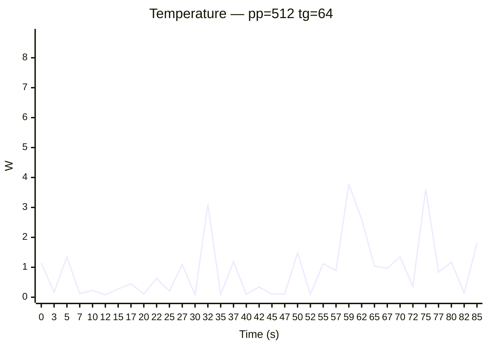
```mermaid
xychart-beta
  title "Temperature — pp=512 tg=64"
  x-axis "Time (s)" [0, 3, 5, 7, 10, 12, 15, 17, 20, 22, 25, 27, 30, 32, 35, 37, 40, 42, 45, 47, 50, 52, 55, 57, 59, 62, 65, 67, 70, 72, 75, 77, 80, 82, 85]
  y-axis "W" 0 --> 8.78
  line "CPU W" [1.14, 0.17, 1.35, 0.12, 0.23, 0.08, 0.28, 0.45, 0.11, 0.63, 0.21, 1.09, 0.08, 3.1, 0.1, 1.18, 0.1, 0.34, 0.1, 0.11, 1.48, 0.1, 1.12, 0.89, 3.78, 2.61, 1.04, 0.97, 1.35, 0.36, 3.61, 0.84, 1.17, 0.14, 1.8]
```

Raw readings

| Time (s) | GPU °C | GPU util % | GPU W | CPU °C |
|---:|---:|---:|---:|---:|
| 0 | None | None | None | 1.14 |
| 3 | None | None | None | 0.17 |
| 5 | None | None | None | 1.35 |
| 7 | None | None | None | 0.12 |
| 10 | None | None | None | 0.23 |
| 12 | None | None | None | 0.08 |
| 15 | None | None | None | 0.28 |
| 17 | None | None | None | 0.45 |
| 20 | None | None | None | 0.11 |
| 22 | None | None | None | 0.63 |
| 25 | None | None | None | 0.21 |
| 27 | None | None | None | 1.09 |
| 30 | None | None | None | 0.08 |
| 32 | None | None | None | 3.1 |
| 35 | None | None | None | 0.1 |
| 37 | None | None | None | 1.18 |
| 40 | None | None | None | 0.1 |
| 42 | None | None | None | 0.34 |
| 45 | None | None | None | 0.1 |
| 47 | None | None | None | 0.11 |
| 50 | None | None | None | 1.48 |
| 52 | None | None | None | 0.1 |
| 55 | None | None | None | 1.12 |
| 57 | None | None | None | 0.89 |
| 59 | None | None | None | 3.78 |
| 62 | None | None | None | 2.61 |
| 65 | None | None | None | 1.04 |
| 67 | None | None | None | 0.97 |
| 70 | None | None | None | 1.35 |
| 72 | None | None | None | 0.36 |
| 75 | None | None | None | 3.61 |
| 77 | None | None | None | 0.84 |
| 80 | None | None | None | 1.17 |
| 82 | None | None | None | 0.14 |
| 85 | None | None | None | 1.8 |

---

## pp=512 tg=256

| model      |   test |            t/s |     peak t/s |       ttfr (ms) |    est_ppt (ms) |   e2e_ttft (ms) |
|:-----------|-------:|---------------:|-------------:|----------------:|----------------:|----------------:|
| gemma4:e4b |  pp512 | 359.02 ± 11.65 |              | 1442.14 ± 97.91 | 1275.15 ± 97.91 | 1442.14 ± 97.91 |
| gemma4:e4b |  tg256 |   26.41 ± 0.55 | 29.00 ± 0.00 |                 |                 |                 |

### Temperatures & Utilization

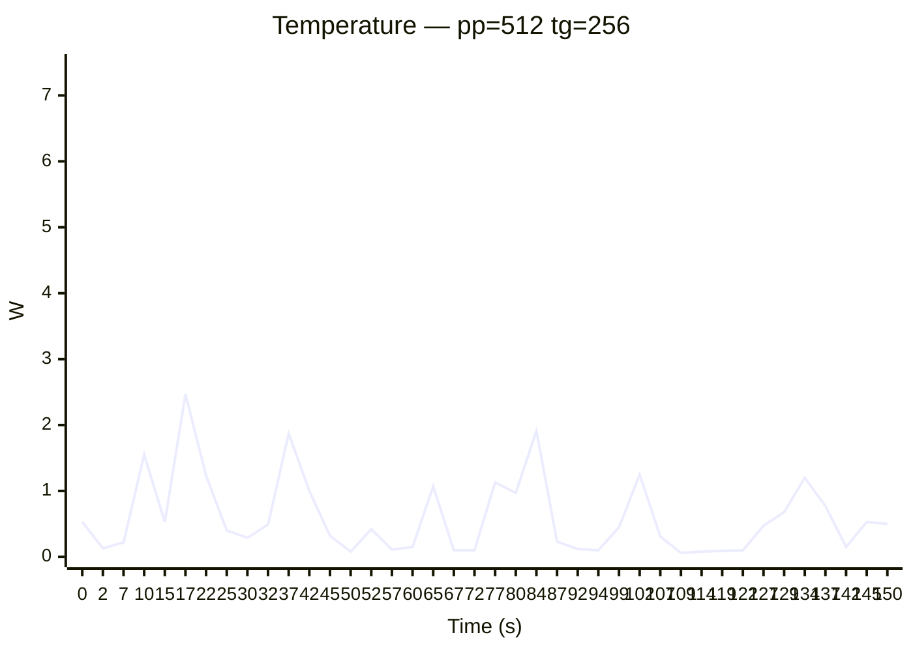
```mermaid
xychart-beta
  title "Temperature — pp=512 tg=256"
  x-axis "Time (s)" [0, 2, 7, 10, 15, 17, 22, 25, 30, 32, 37, 42, 45, 50, 52, 57, 60, 65, 67, 72, 77, 80, 84, 87, 92, 94, 99, 102, 107, 109, 114, 119, 122, 127, 129, 134, 137, 142, 145, 150]
  y-axis "W" 0 --> 7.470000000000001
  line "CPU W" [0.53, 0.13, 0.22, 1.55, 0.53, 2.47, 1.23, 0.4, 0.29, 0.49, 1.87, 1.0, 0.32, 0.08, 0.42, 0.11, 0.15, 1.07, 0.1, 0.1, 1.13, 0.97, 1.91, 0.23, 0.12, 0.1, 0.45, 1.25, 0.31, 0.06, 0.08, 0.09, 0.1, 0.47, 0.68, 1.2, 0.77, 0.15, 0.53, 0.5]
```

Raw readings

| Time (s) | GPU °C | GPU util % | GPU W | CPU °C |
|---:|---:|---:|---:|---:|
| 0 | None | None | None | 0.53 |
| 2 | None | None | None | 0.13 |
| 5 | None | None | None | 0.98 |
| 7 | None | None | None | 0.22 |
| 10 | None | None | None | 1.55 |
| 12 | None | None | None | 1.39 |
| 15 | None | None | None | 0.53 |
| 17 | None | None | None | 2.47 |
| 20 | None | None | None | 0.17 |
| 22 | None | None | None | 1.23 |
| 25 | None | None | None | 0.4 |
| 27 | None | None | None | 0.27 |
| 30 | None | None | None | 0.29 |
| 32 | None | None | None | 0.49 |
| 35 | None | None | None | 0.1 |
| 37 | None | None | None | 1.87 |
| 40 | None | None | None | 0.55 |
| 42 | None | None | None | 1.0 |
| 45 | None | None | None | 0.32 |
| 47 | None | None | None | 0.35 |
| 50 | None | None | None | 0.08 |
| 52 | None | None | None | 0.42 |
| 55 | None | None | None | 0.13 |
| 57 | None | None | None | 0.11 |
| 60 | None | None | None | 0.15 |
| 62 | None | None | None | 0.32 |
| 65 | None | None | None | 1.07 |
| 67 | None | None | None | 0.1 |
| 70 | None | None | None | 1.45 |
| 72 | None | None | None | 0.1 |
| 75 | None | None | None | 0.78 |
| 77 | None | None | None | 1.13 |
| 80 | None | None | None | 0.97 |
| 82 | None | None | None | 0.21 |
| 84 | None | None | None | 1.91 |
| 87 | None | None | None | 0.23 |
| 89 | None | None | None | 1.25 |
| 92 | None | None | None | 0.12 |
| 94 | None | None | None | 0.1 |
| 97 | None | None | None | 2.06 |
| 99 | None | None | None | 0.45 |
| 102 | None | None | None | 1.25 |
| 104 | None | None | None | 1.39 |
| 107 | None | None | None | 0.31 |
| 109 | None | None | None | 0.06 |
| 112 | None | None | None | 0.14 |
| 114 | None | None | None | 0.08 |
| 117 | None | None | None | 4.68 |
| 119 | None | None | None | 0.09 |
| 122 | None | None | None | 0.1 |
| 124 | None | None | None | 0.46 |
| 127 | None | None | None | 0.47 |
| 129 | None | None | None | 0.68 |
| 132 | None | None | None | 0.07 |
| 134 | None | None | None | 1.2 |
| 137 | None | None | None | 0.77 |
| 139 | None | None | None | 0.84 |
| 142 | None | None | None | 0.15 |
| 145 | None | None | None | 0.53 |
| 147 | None | None | None | 0.81 |
| 150 | None | None | None | 0.5 |
| 152 | None | None | None | 2.2 |

---

## pp=2048 tg=64

| model      |   test |           t/s |     peak t/s |        ttfr (ms) |     est_ppt (ms) |    e2e_ttft (ms) |
|:-----------|-------:|--------------:|-------------:|-----------------:|-----------------:|-----------------:|
| gemma4:e4b | pp2048 | 361.23 ± 2.19 |              | 5350.97 ± 144.32 | 5178.83 ± 144.32 | 5350.97 ± 144.32 |
| gemma4:e4b |   tg64 |  26.49 ± 0.36 | 29.00 ± 0.00 |                  |                  |                  |

### Temperatures & Utilization

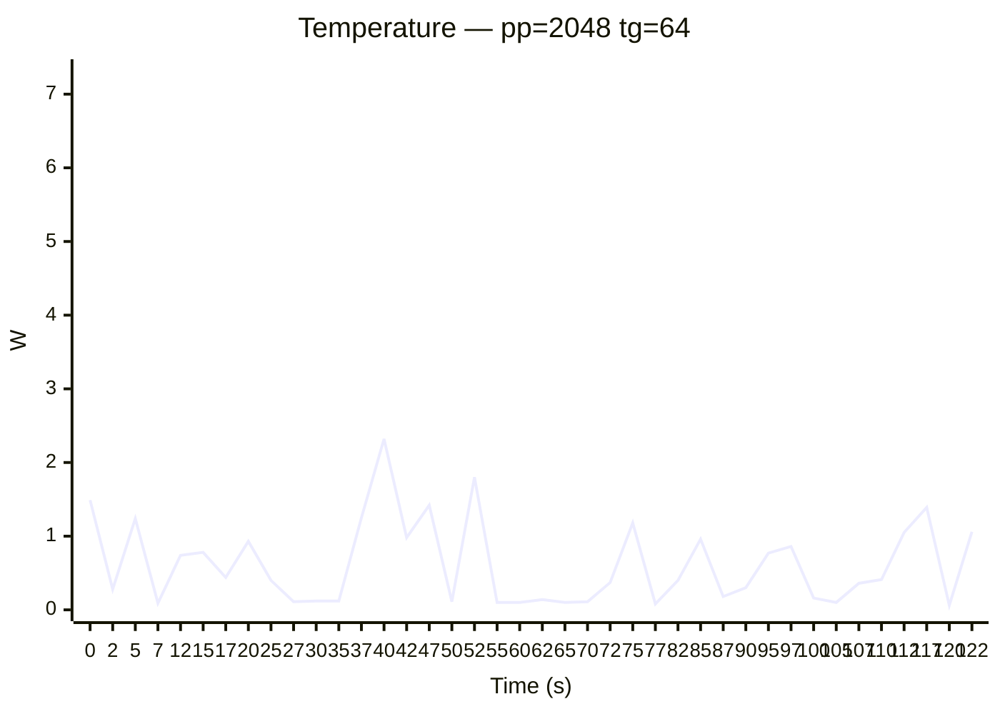
```mermaid
xychart-beta
  title "Temperature — pp=2048 tg=64"
  x-axis "Time (s)" [0, 2, 5, 7, 12, 15, 17, 20, 25, 27, 30, 35, 37, 40, 42, 47, 50, 52, 55, 60, 62, 65, 70, 72, 75, 77, 82, 85, 87, 90, 95, 97, 100, 105, 107, 110, 112, 117, 120, 122]
  y-axis "W" 0 --> 7.32
  line "CPU W" [1.49, 0.28, 1.24, 0.09, 0.74, 0.78, 0.44, 0.93, 0.4, 0.11, 0.12, 0.12, 1.25, 2.32, 0.98, 1.42, 0.11, 1.8, 0.1, 0.1, 0.14, 0.1, 0.11, 0.37, 1.18, 0.08, 0.4, 0.96, 0.18, 0.3, 0.77, 0.86, 0.16, 0.1, 0.36, 0.41, 1.05, 1.39, 0.06, 1.06]
```

Raw readings

| Time (s) | GPU °C | GPU util % | GPU W | CPU °C |
|---:|---:|---:|---:|---:|
| 0 | None | None | None | 1.49 |
| 2 | None | None | None | 0.28 |
| 5 | None | None | None | 1.24 |
| 7 | None | None | None | 0.09 |
| 10 | None | None | None | 1.61 |
| 12 | None | None | None | 0.74 |
| 15 | None | None | None | 0.78 |
| 17 | None | None | None | 0.44 |
| 20 | None | None | None | 0.93 |
| 22 | None | None | None | 0.18 |
| 25 | None | None | None | 0.4 |
| 27 | None | None | None | 0.11 |
| 30 | None | None | None | 0.12 |
| 32 | None | None | None | 0.13 |
| 35 | None | None | None | 0.12 |
| 37 | None | None | None | 1.25 |
| 40 | None | None | None | 2.32 |
| 42 | None | None | None | 0.98 |
| 45 | None | None | None | 0.47 |
| 47 | None | None | None | 1.42 |
| 50 | None | None | None | 0.11 |
| 52 | None | None | None | 1.8 |
| 55 | None | None | None | 0.1 |
| 57 | None | None | None | 0.5 |
| 60 | None | None | None | 0.1 |
| 62 | None | None | None | 0.14 |
| 65 | None | None | None | 0.1 |
| 67 | None | None | None | 0.14 |
| 70 | None | None | None | 0.11 |
| 72 | None | None | None | 0.37 |
| 75 | None | None | None | 1.18 |
| 77 | None | None | None | 0.08 |
| 80 | None | None | None | 1.32 |
| 82 | None | None | None | 0.4 |
| 85 | None | None | None | 0.96 |
| 87 | None | None | None | 0.18 |
| 90 | None | None | None | 0.3 |
| 92 | None | None | None | 0.38 |
| 95 | None | None | None | 0.77 |
| 97 | None | None | None | 0.86 |
| 100 | None | None | None | 0.16 |
| 102 | None | None | None | 3.04 |
| 105 | None | None | None | 0.1 |
| 107 | None | None | None | 0.36 |
| 110 | None | None | None | 0.41 |
| 112 | None | None | None | 1.05 |
| 115 | None | None | None | 0.06 |
| 117 | None | None | None | 1.39 |
| 120 | None | None | None | 0.06 |
| 122 | None | None | None | 1.06 |
| 125 | None | None | None | 0.61 |

---

## pp=2048 tg=256

| model      |   test |           t/s |     peak t/s |        ttfr (ms) |     est_ppt (ms) |    e2e_ttft (ms) |
|:-----------|-------:|--------------:|-------------:|-----------------:|-----------------:|-----------------:|
| gemma4:e4b | pp2048 | 362.42 ± 2.78 |              | 5236.67 ± 105.35 | 5070.70 ± 105.35 | 5236.67 ± 105.35 |
| gemma4:e4b |  tg256 |  26.03 ± 0.31 | 29.00 ± 0.00 |                  |                  |                  |

### Temperatures & Utilization

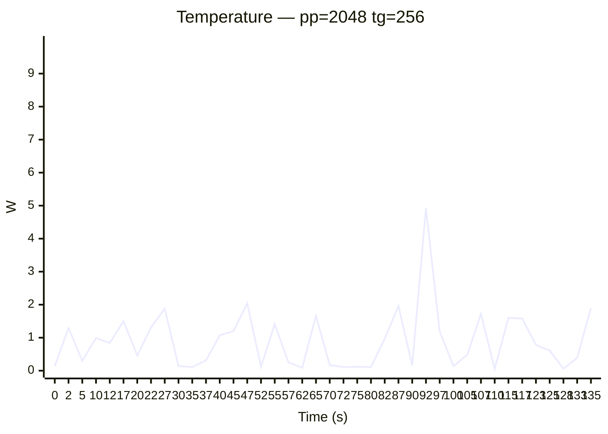
```mermaid
xychart-beta
  title "Temperature — pp=2048 tg=256"
  x-axis "Time (s)" [0, 2, 5, 10, 12, 17, 20, 22, 27, 30, 35, 37, 40, 45, 47, 52, 55, 57, 62, 65, 70, 72, 75, 80, 82, 87, 90, 92, 97, 100, 105, 107, 110, 115, 117, 123, 125, 128, 133, 135]
  y-axis "W" 0 --> 9.93
  line "CPU W" [0.14, 1.29, 0.3, 0.99, 0.84, 1.5, 0.46, 1.31, 1.88, 0.14, 0.11, 0.31, 1.07, 1.2, 2.04, 0.12, 1.41, 0.25, 0.09, 1.66, 0.17, 0.11, 0.12, 0.11, 0.97, 1.96, 0.16, 4.93, 1.19, 0.14, 0.48, 1.72, 0.05, 1.6, 1.58, 0.78, 0.61, 0.06, 0.39, 1.9]
```

Raw readings

| Time (s) | GPU °C | GPU util % | GPU W | CPU °C |
|---:|---:|---:|---:|---:|
| 0 | None | None | None | 0.14 |
| 2 | None | None | None | 1.29 |
| 5 | None | None | None | 0.3 |
| 7 | None | None | None | 0.22 |
| 10 | None | None | None | 0.99 |
| 12 | None | None | None | 0.84 |
| 15 | None | None | None | 0.8 |
| 17 | None | None | None | 1.5 |
| 20 | None | None | None | 0.46 |
| 22 | None | None | None | 1.31 |
| 25 | None | None | None | 0.1 |
| 27 | None | None | None | 1.88 |
| 30 | None | None | None | 0.14 |
| 32 | None | None | None | 0.52 |
| 35 | None | None | None | 0.11 |
| 37 | None | None | None | 0.31 |
| 40 | None | None | None | 1.07 |
| 42 | None | None | None | 1.21 |
| 45 | None | None | None | 1.2 |
| 47 | None | None | None | 2.04 |
| 50 | None | None | None | 0.89 |
| 52 | None | None | None | 0.12 |
| 55 | None | None | None | 1.41 |
| 57 | None | None | None | 0.25 |
| 60 | None | None | None | 1.05 |
| 62 | None | None | None | 0.09 |
| 65 | None | None | None | 1.66 |
| 67 | None | None | None | 0.13 |
| 70 | None | None | None | 0.17 |
| 72 | None | None | None | 0.11 |
| 75 | None | None | None | 0.12 |
| 77 | None | None | None | 0.1 |
| 80 | None | None | None | 0.11 |
| 82 | None | None | None | 0.97 |
| 85 | None | None | None | 0.09 |
| 87 | None | None | None | 1.96 |
| 90 | None | None | None | 0.16 |
| 92 | None | None | None | 4.93 |
| 95 | None | None | None | 1.13 |
| 97 | None | None | None | 1.19 |
| 100 | None | None | None | 0.14 |
| 102 | None | None | None | 2.08 |
| 105 | None | None | None | 0.48 |
| 107 | None | None | None | 1.72 |
| 110 | None | None | None | 0.05 |
| 112 | None | None | None | 1.01 |
| 115 | None | None | None | 1.6 |
| 117 | None | None | None | 1.58 |
| 120 | None | None | None | 1.71 |
| 123 | None | None | None | 0.78 |
| 125 | None | None | None | 0.61 |
| 128 | None | None | None | 0.06 |
| 130 | None | None | None | 1.11 |
| 133 | None | None | None | 0.39 |
| 135 | None | None | None | 1.9 |
| 138 | None | None | None | 0.07 |

---

# Benchmark Report: qwen3:8b

**Date:** 2026-04-19 14:33  
**Machine:** Apple M4, 16GB unified memory, macOS  
**Endpoint:** http://localhost:11434/v1  
**Run platform:** Darwin arm64  
**Runs per test:** 3  

---

## Summary

| pp | tg | Duration (s) | GPU peak °C | CPU peak °C |
|---:|---:|---:|---:|---:|
| 512 | 64 | 86 | 0 | 3.0 |
| 512 | 256 | 69 | 0 | 3.61 |
| 2048 | 64 | 39 | 0 | 2.89 |
| 2048 | 256 | 71 | 0 | 5.57 |

---

## pp=512 tg=64

| model    |   test |           t/s |     peak t/s |        ttfr (ms) |     est_ppt (ms) |    e2e_ttft (ms) |
|:---------|-------:|--------------:|-------------:|-----------------:|-----------------:|-----------------:|
| qwen3:8b |  pp512 | 228.02 ± 1.28 |              | 2324.00 ± 123.04 | 2105.82 ± 123.04 | 2324.00 ± 123.04 |
| qwen3:8b |   tg64 |  19.50 ± 0.06 | 20.00 ± 0.00 |                  |                  |                  |

### Temperatures & Utilization

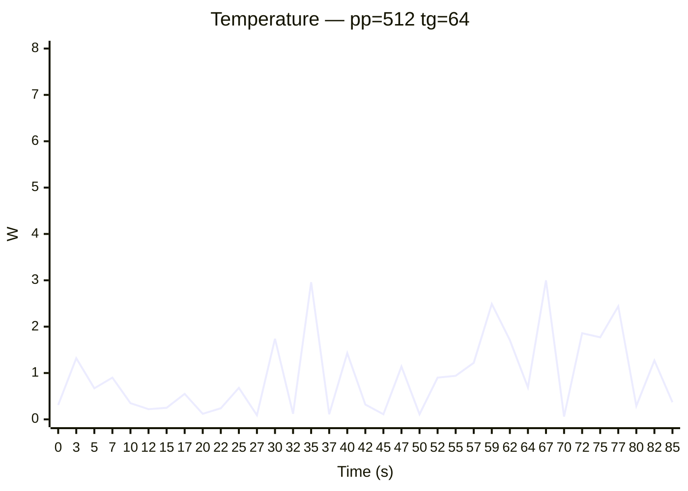
```mermaid
xychart-beta
  title "Temperature — pp=512 tg=64"
  x-axis "Time (s)" [0, 3, 5, 7, 10, 12, 15, 17, 20, 22, 25, 27, 30, 32, 35, 37, 40, 42, 45, 47, 50, 52, 55, 57, 59, 62, 64, 67, 70, 72, 75, 77, 80, 82, 85]
  y-axis "W" 0 --> 8.0
  line "CPU W" [0.31, 1.32, 0.67, 0.9, 0.35, 0.22, 0.25, 0.55, 0.12, 0.24, 0.68, 0.09, 1.74, 0.12, 2.96, 0.11, 1.43, 0.32, 0.11, 1.14, 0.11, 0.9, 0.94, 1.22, 2.49, 1.71, 0.69, 3.0, 0.06, 1.86, 1.77, 2.44, 0.29, 1.27, 0.37]
```

Raw readings

| Time (s) | GPU °C | GPU util % | GPU W | CPU °C |
|---:|---:|---:|---:|---:|
| 0 | None | None | None | 0.31 |
| 3 | None | None | None | 1.32 |
| 5 | None | None | None | 0.67 |
| 7 | None | None | None | 0.9 |
| 10 | None | None | None | 0.35 |
| 12 | None | None | None | 0.22 |
| 15 | None | None | None | 0.25 |
| 17 | None | None | None | 0.55 |
| 20 | None | None | None | 0.12 |
| 22 | None | None | None | 0.24 |
| 25 | None | None | None | 0.68 |
| 27 | None | None | None | 0.09 |
| 30 | None | None | None | 1.74 |
| 32 | None | None | None | 0.12 |
| 35 | None | None | None | 2.96 |
| 37 | None | None | None | 0.11 |
| 40 | None | None | None | 1.43 |
| 42 | None | None | None | 0.32 |
| 45 | None | None | None | 0.11 |
| 47 | None | None | None | 1.14 |
| 50 | None | None | None | 0.11 |
| 52 | None | None | None | 0.9 |
| 55 | None | None | None | 0.94 |
| 57 | None | None | None | 1.22 |
| 59 | None | None | None | 2.49 |
| 62 | None | None | None | 1.71 |
| 64 | None | None | None | 0.69 |
| 67 | None | None | None | 3.0 |
| 70 | None | None | None | 0.06 |
| 72 | None | None | None | 1.86 |
| 75 | None | None | None | 1.77 |
| 77 | None | None | None | 2.44 |
| 80 | None | None | None | 0.29 |
| 82 | None | None | None | 1.27 |
| 85 | None | None | None | 0.37 |

---

## pp=512 tg=256

| model    |   test |           t/s |     peak t/s |        ttfr (ms) |     est_ppt (ms) |    e2e_ttft (ms) |
|:---------|-------:|--------------:|-------------:|-----------------:|-----------------:|-----------------:|
| qwen3:8b |  pp512 | 220.47 ± 4.97 |              | 2218.95 ± 174.52 | 2075.32 ± 174.52 | 2218.95 ± 174.52 |
| qwen3:8b |  tg256 |  19.52 ± 0.03 | 20.00 ± 0.00 |                  |                  |                  |

### Temperatures & Utilization

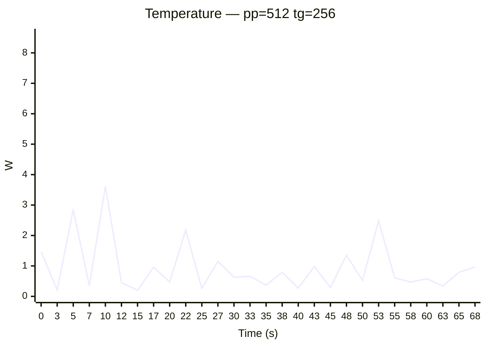
```mermaid
xychart-beta
  title "Temperature — pp=512 tg=256"
  x-axis "Time (s)" [0, 3, 5, 7, 10, 12, 15, 17, 20, 22, 25, 27, 30, 33, 35, 38, 40, 43, 45, 48, 50, 53, 55, 58, 60, 63, 65, 68]
  y-axis "W" 0 --> 8.61
  line "CPU W" [1.47, 0.21, 2.85, 0.35, 3.61, 0.45, 0.2, 0.96, 0.47, 2.18, 0.26, 1.15, 0.63, 0.66, 0.37, 0.79, 0.27, 0.98, 0.29, 1.35, 0.52, 2.48, 0.61, 0.47, 0.58, 0.34, 0.79, 0.97]
```

Raw readings

| Time (s) | GPU °C | GPU util % | GPU W | CPU °C |
|---:|---:|---:|---:|---:|
| 0 | None | None | None | 1.47 |
| 3 | None | None | None | 0.21 |
| 5 | None | None | None | 2.85 |
| 7 | None | None | None | 0.35 |
| 10 | None | None | None | 3.61 |
| 12 | None | None | None | 0.45 |
| 15 | None | None | None | 0.2 |
| 17 | None | None | None | 0.96 |
| 20 | None | None | None | 0.47 |
| 22 | None | None | None | 2.18 |
| 25 | None | None | None | 0.26 |
| 27 | None | None | None | 1.15 |
| 30 | None | None | None | 0.63 |
| 33 | None | None | None | 0.66 |
| 35 | None | None | None | 0.37 |
| 38 | None | None | None | 0.79 |
| 40 | None | None | None | 0.27 |
| 43 | None | None | None | 0.98 |
| 45 | None | None | None | 0.29 |
| 48 | None | None | None | 1.35 |
| 50 | None | None | None | 0.52 |
| 53 | None | None | None | 2.48 |
| 55 | None | None | None | 0.61 |
| 58 | None | None | None | 0.47 |
| 60 | None | None | None | 0.58 |
| 63 | None | None | None | 0.34 |
| 65 | None | None | None | 0.79 |
| 68 | None | None | None | 0.97 |

---

## pp=2048 tg=64

| model    |   test |           t/s |     peak t/s |       ttfr (ms) |    est_ppt (ms) |   e2e_ttft (ms) |
|:---------|-------:|--------------:|-------------:|----------------:|----------------:|----------------:|
| qwen3:8b | pp2048 | 212.23 ± 1.00 |              | 8728.89 ± 79.06 | 8583.28 ± 79.06 | 8728.89 ± 79.06 |
| qwen3:8b |   tg64 |  18.80 ± 0.02 | 19.00 ± 0.00 |                 |                 |                 |

### Temperatures & Utilization

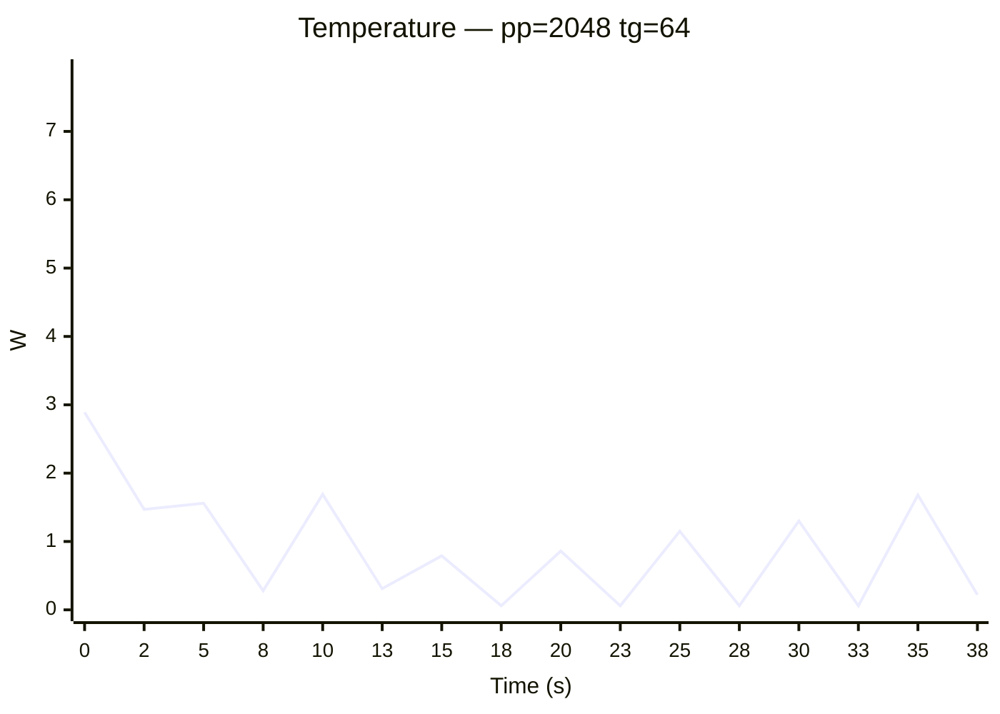
```mermaid
xychart-beta
  title "Temperature — pp=2048 tg=64"
  x-axis "Time (s)" [0, 2, 5, 8, 10, 13, 15, 18, 20, 23, 25, 28, 30, 33, 35, 38]
  y-axis "W" 0 --> 7.890000000000001
  line "CPU W" [2.89, 1.47, 1.56, 0.28, 1.69, 0.31, 0.79, 0.06, 0.86, 0.06, 1.15, 0.06, 1.3, 0.06, 1.68, 0.22]
```

Raw readings

| Time (s) | GPU °C | GPU util % | GPU W | CPU °C |
|---:|---:|---:|---:|---:|
| 0 | None | None | None | 2.89 |
| 2 | None | None | None | 1.47 |
| 5 | None | None | None | 1.56 |
| 8 | None | None | None | 0.28 |
| 10 | None | None | None | 1.69 |
| 13 | None | None | None | 0.31 |
| 15 | None | None | None | 0.79 |
| 18 | None | None | None | 0.06 |
| 20 | None | None | None | 0.86 |
| 23 | None | None | None | 0.06 |
| 25 | None | None | None | 1.15 |
| 28 | None | None | None | 0.06 |
| 30 | None | None | None | 1.3 |
| 33 | None | None | None | 0.06 |
| 35 | None | None | None | 1.68 |
| 38 | None | None | None | 0.22 |

---

## pp=2048 tg=256

| model    |   test |           t/s |     peak t/s |        ttfr (ms) |     est_ppt (ms) |    e2e_ttft (ms) |
|:---------|-------:|--------------:|-------------:|-----------------:|-----------------:|-----------------:|
| qwen3:8b | pp2048 | 203.48 ± 3.94 |              | 9253.40 ± 203.38 | 9106.56 ± 203.38 | 9253.40 ± 203.38 |
| qwen3:8b |  tg256 |  18.69 ± 0.03 | 19.00 ± 0.00 |                  |                  |                  |

### Temperatures & Utilization

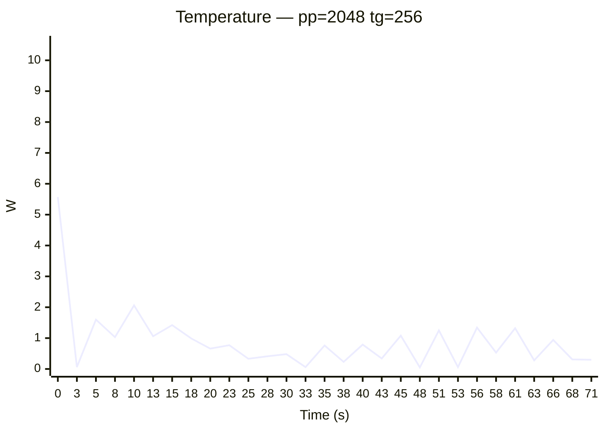
```mermaid
xychart-beta
  title "Temperature — pp=2048 tg=256"
  x-axis "Time (s)" [0, 3, 5, 8, 10, 13, 15, 18, 20, 23, 25, 28, 30, 33, 35, 38, 40, 43, 45, 48, 51, 53, 56, 58, 61, 63, 66, 68, 71]
  y-axis "W" 0 --> 10.57
  line "CPU W" [5.57, 0.06, 1.6, 1.03, 2.06, 1.06, 1.42, 0.99, 0.66, 0.77, 0.33, 0.41, 0.48, 0.06, 0.76, 0.23, 0.79, 0.34, 1.08, 0.05, 1.25, 0.06, 1.34, 0.53, 1.32, 0.28, 0.94, 0.31, 0.3]
```

Raw readings

| Time (s) | GPU °C | GPU util % | GPU W | CPU °C |
|---:|---:|---:|---:|---:|
| 0 | None | None | None | 5.57 |
| 3 | None | None | None | 0.06 |
| 5 | None | None | None | 1.6 |
| 8 | None | None | None | 1.03 |
| 10 | None | None | None | 2.06 |
| 13 | None | None | None | 1.06 |
| 15 | None | None | None | 1.42 |
| 18 | None | None | None | 0.99 |
| 20 | None | None | None | 0.66 |
| 23 | None | None | None | 0.77 |
| 25 | None | None | None | 0.33 |
| 28 | None | None | None | 0.41 |
| 30 | None | None | None | 0.48 |
| 33 | None | None | None | 0.06 |
| 35 | None | None | None | 0.76 |
| 38 | None | None | None | 0.23 |
| 40 | None | None | None | 0.79 |
| 43 | None | None | None | 0.34 |
| 45 | None | None | None | 1.08 |
| 48 | None | None | None | 0.05 |
| 51 | None | None | None | 1.25 |
| 53 | None | None | None | 0.06 |
| 56 | None | None | None | 1.34 |
| 58 | None | None | None | 0.53 |
| 61 | None | None | None | 1.32 |
| 63 | None | None | None | 0.28 |
| 66 | None | None | None | 0.94 |
| 68 | None | None | None | 0.31 |
| 71 | None | None | None | 0.3 |

---

# Benchmark Report: qwen2.5:14b

**Date:** 2026-04-19 15:16  
**Machine:** Apple M4, 16GB unified memory, macOS  
**Endpoint:** http://localhost:11434/v1  
**Run platform:** Darwin arm64  
**Runs per test:** 3  

---

## Summary

| pp | tg | Duration (s) | GPU peak °C | CPU peak °C |
|---:|---:|---:|---:|---:|
| 512 | 64 | 91 | 0 | 8.56 |
| 512 | 256 | 155 | 0 | 4.16 |
| 2048 | 64 | 128 | 0 | 2.96 |
| 2048 | 256 | 170 | 0 | 5.2 |

---

## pp=512 tg=64

| model       |   test |           t/s |     peak t/s |        ttfr (ms) |     est_ppt (ms) |    e2e_ttft (ms) |
|:------------|-------:|--------------:|-------------:|-----------------:|-----------------:|-----------------:|
| qwen2.5:14b |  pp512 | 127.57 ± 0.85 |              | 3860.89 ± 193.66 | 3627.55 ± 193.66 | 3860.89 ± 193.66 |
| qwen2.5:14b |   tg64 |  11.31 ± 0.03 | 12.00 ± 0.00 |                  |                  |                  |

### Temperatures & Utilization

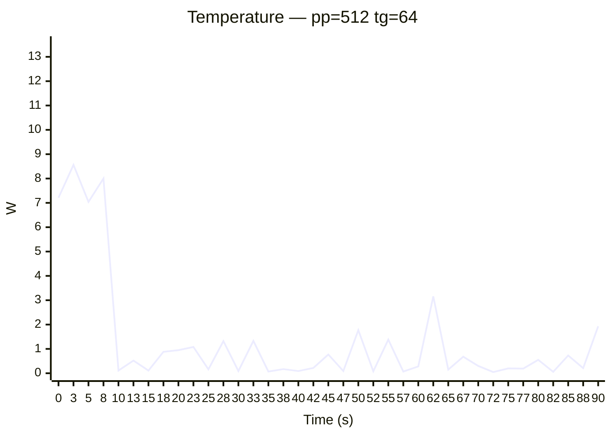
```mermaid
xychart-beta
  title "Temperature — pp=512 tg=64"
  x-axis "Time (s)" [0, 3, 5, 8, 10, 13, 15, 18, 20, 23, 25, 28, 30, 33, 35, 38, 40, 42, 45, 47, 50, 52, 55, 57, 60, 62, 65, 67, 70, 72, 75, 77, 80, 82, 85, 88, 90]
  y-axis "W" 0 --> 13.56
  line "CPU W" [7.21, 8.56, 7.04, 8.0, 0.11, 0.52, 0.11, 0.88, 0.95, 1.08, 0.16, 1.32, 0.09, 1.33, 0.07, 0.17, 0.09, 0.22, 0.77, 0.09, 1.77, 0.08, 1.38, 0.07, 0.28, 3.16, 0.15, 0.68, 0.3, 0.05, 0.2, 0.19, 0.55, 0.06, 0.73, 0.21, 1.93]
```

Raw readings

| Time (s) | GPU °C | GPU util % | GPU W | CPU °C |
|---:|---:|---:|---:|---:|
| 0 | None | None | None | 7.21 |
| 3 | None | None | None | 8.56 |
| 5 | None | None | None | 7.04 |
| 8 | None | None | None | 8.0 |
| 10 | None | None | None | 0.11 |
| 13 | None | None | None | 0.52 |
| 15 | None | None | None | 0.11 |
| 18 | None | None | None | 0.88 |
| 20 | None | None | None | 0.95 |
| 23 | None | None | None | 1.08 |
| 25 | None | None | None | 0.16 |
| 28 | None | None | None | 1.32 |
| 30 | None | None | None | 0.09 |
| 33 | None | None | None | 1.33 |
| 35 | None | None | None | 0.07 |
| 38 | None | None | None | 0.17 |
| 40 | None | None | None | 0.09 |
| 42 | None | None | None | 0.22 |
| 45 | None | None | None | 0.77 |
| 47 | None | None | None | 0.09 |
| 50 | None | None | None | 1.77 |
| 52 | None | None | None | 0.08 |
| 55 | None | None | None | 1.38 |
| 57 | None | None | None | 0.07 |
| 60 | None | None | None | 0.28 |
| 62 | None | None | None | 3.16 |
| 65 | None | None | None | 0.15 |
| 67 | None | None | None | 0.68 |
| 70 | None | None | None | 0.3 |
| 72 | None | None | None | 0.05 |
| 75 | None | None | None | 0.2 |
| 77 | None | None | None | 0.19 |
| 80 | None | None | None | 0.55 |
| 82 | None | None | None | 0.06 |
| 85 | None | None | None | 0.73 |
| 88 | None | None | None | 0.21 |
| 90 | None | None | None | 1.93 |

---

## pp=512 tg=256

| model       |   test |           t/s |     peak t/s |        ttfr (ms) |     est_ppt (ms) |    e2e_ttft (ms) |
|:------------|-------:|--------------:|-------------:|-----------------:|-----------------:|-----------------:|
| qwen2.5:14b |  pp512 | 126.34 ± 1.41 |              | 4022.19 ± 142.75 | 3824.27 ± 142.75 | 4022.19 ± 142.75 |
| qwen2.5:14b |  tg256 |  11.32 ± 0.02 | 12.00 ± 0.00 |                  |                  |                  |

### Temperatures & Utilization

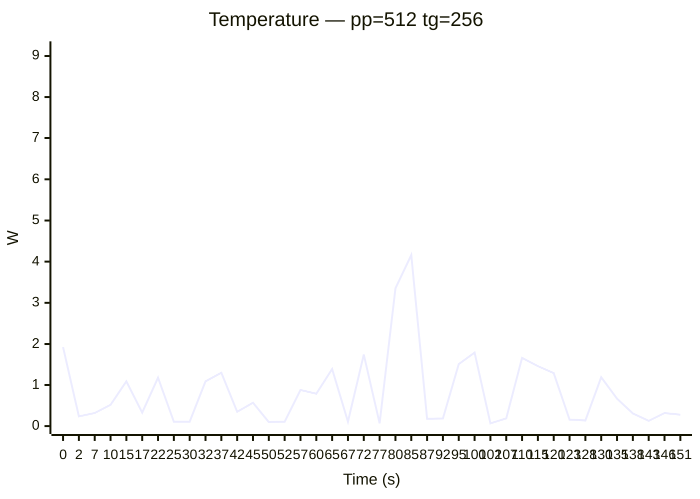
```mermaid
xychart-beta
  title "Temperature — pp=512 tg=256"
  x-axis "Time (s)" [0, 2, 7, 10, 15, 17, 22, 25, 30, 32, 37, 42, 45, 50, 52, 57, 60, 65, 67, 72, 77, 80, 85, 87, 92, 95, 100, 102, 107, 110, 115, 120, 123, 128, 130, 135, 138, 143, 146, 151]
  y-axis "W" 0 --> 9.16
  line "CPU W" [1.92, 0.24, 0.32, 0.52, 1.09, 0.33, 1.18, 0.11, 0.11, 1.09, 1.3, 0.35, 0.57, 0.1, 0.11, 0.88, 0.79, 1.39, 0.11, 1.74, 0.07, 3.35, 4.16, 0.18, 0.19, 1.51, 1.79, 0.07, 0.19, 1.66, 1.46, 1.29, 0.16, 0.14, 1.19, 0.67, 0.31, 0.13, 0.32, 0.28]
```

Raw readings

| Time (s) | GPU °C | GPU util % | GPU W | CPU °C |
|---:|---:|---:|---:|---:|
| 0 | None | None | None | 1.92 |
| 2 | None | None | None | 0.24 |
| 5 | None | None | None | 1.81 |
| 7 | None | None | None | 0.32 |
| 10 | None | None | None | 0.52 |
| 12 | None | None | None | 0.32 |
| 15 | None | None | None | 1.09 |
| 17 | None | None | None | 0.33 |
| 20 | None | None | None | 0.12 |
| 22 | None | None | None | 1.18 |
| 25 | None | None | None | 0.11 |
| 27 | None | None | None | 0.47 |
| 30 | None | None | None | 0.11 |
| 32 | None | None | None | 1.09 |
| 35 | None | None | None | 0.5 |
| 37 | None | None | None | 1.3 |
| 40 | None | None | None | 1.13 |
| 42 | None | None | None | 0.35 |
| 45 | None | None | None | 0.57 |
| 47 | None | None | None | 0.29 |
| 50 | None | None | None | 0.1 |
| 52 | None | None | None | 0.11 |
| 55 | None | None | None | 0.63 |
| 57 | None | None | None | 0.88 |
| 60 | None | None | None | 0.79 |
| 62 | None | None | None | 0.33 |
| 65 | None | None | None | 1.39 |
| 67 | None | None | None | 0.11 |
| 70 | None | None | None | 0.99 |
| 72 | None | None | None | 1.74 |
| 75 | None | None | None | 0.43 |
| 77 | None | None | None | 0.07 |
| 80 | None | None | None | 3.35 |
| 82 | None | None | None | 0.2 |
| 85 | None | None | None | 4.16 |
| 87 | None | None | None | 0.18 |
| 90 | None | None | None | 1.56 |
| 92 | None | None | None | 0.19 |
| 95 | None | None | None | 1.51 |
| 97 | None | None | None | 0.17 |
| 100 | None | None | None | 1.79 |
| 102 | None | None | None | 0.07 |
| 105 | None | None | None | 1.41 |
| 107 | None | None | None | 0.19 |
| 110 | None | None | None | 1.66 |
| 113 | None | None | None | 0.17 |
| 115 | None | None | None | 1.46 |
| 118 | None | None | None | 0.31 |
| 120 | None | None | None | 1.29 |
| 123 | None | None | None | 0.16 |
| 125 | None | None | None | 1.24 |
| 128 | None | None | None | 0.14 |
| 130 | None | None | None | 1.19 |
| 133 | None | None | None | 0.12 |
| 135 | None | None | None | 0.67 |
| 138 | None | None | None | 0.31 |
| 140 | None | None | None | 0.33 |
| 143 | None | None | None | 0.13 |
| 146 | None | None | None | 0.32 |
| 148 | None | None | None | 0.11 |
| 151 | None | None | None | 0.28 |
| 153 | None | None | None | 0.13 |

---

## pp=2048 tg=64

| model       |   test |           t/s |     peak t/s |         ttfr (ms) |      est_ppt (ms) |     e2e_ttft (ms) |
|:------------|-------:|--------------:|-------------:|------------------:|------------------:|------------------:|
| qwen2.5:14b | pp2048 | 113.02 ± 0.55 |              | 16628.86 ± 148.16 | 16430.19 ± 148.16 | 16628.86 ± 148.16 |
| qwen2.5:14b |   tg64 |  10.92 ± 0.01 | 11.00 ± 0.00 |                   |                   |                   |

### Temperatures & Utilization

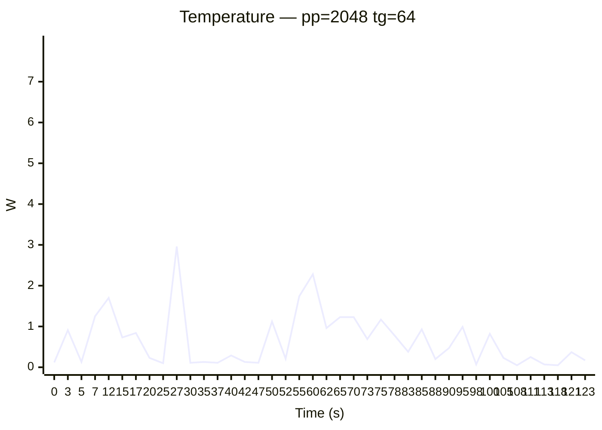
```mermaid
xychart-beta
  title "Temperature — pp=2048 tg=64"
  x-axis "Time (s)" [0, 3, 5, 7, 12, 15, 17, 20, 25, 27, 30, 35, 37, 40, 42, 47, 50, 52, 55, 60, 62, 65, 70, 73, 75, 78, 83, 85, 88, 90, 95, 98, 100, 105, 108, 111, 113, 118, 121, 123]
  y-axis "W" 0 --> 7.96
  line "CPU W" [0.12, 0.91, 0.13, 1.25, 1.7, 0.73, 0.84, 0.23, 0.1, 2.96, 0.11, 0.13, 0.11, 0.29, 0.13, 0.11, 1.12, 0.21, 1.74, 2.28, 0.96, 1.23, 1.23, 0.69, 1.17, 0.78, 0.38, 0.93, 0.2, 0.47, 0.99, 0.07, 0.82, 0.23, 0.05, 0.25, 0.07, 0.05, 0.37, 0.17]
```

Raw readings

| Time (s) | GPU °C | GPU util % | GPU W | CPU °C |
|---:|---:|---:|---:|---:|
| 0 | None | None | None | 0.12 |
| 3 | None | None | None | 0.91 |
| 5 | None | None | None | 0.13 |
| 7 | None | None | None | 1.25 |
| 10 | None | None | None | 0.88 |
| 12 | None | None | None | 1.7 |
| 15 | None | None | None | 0.73 |
| 17 | None | None | None | 0.84 |
| 20 | None | None | None | 0.23 |
| 22 | None | None | None | 0.36 |
| 25 | None | None | None | 0.1 |
| 27 | None | None | None | 2.96 |
| 30 | None | None | None | 0.11 |
| 32 | None | None | None | 1.45 |
| 35 | None | None | None | 0.13 |
| 37 | None | None | None | 0.11 |
| 40 | None | None | None | 0.29 |
| 42 | None | None | None | 0.13 |
| 45 | None | None | None | 1.06 |
| 47 | None | None | None | 0.11 |
| 50 | None | None | None | 1.12 |
| 52 | None | None | None | 0.21 |
| 55 | None | None | None | 1.74 |
| 57 | None | None | None | 1.63 |
| 60 | None | None | None | 2.28 |
| 62 | None | None | None | 0.96 |
| 65 | None | None | None | 1.23 |
| 67 | None | None | None | 0.31 |
| 70 | None | None | None | 1.23 |
| 73 | None | None | None | 0.69 |
| 75 | None | None | None | 1.17 |
| 78 | None | None | None | 0.78 |
| 80 | None | None | None | 1.25 |
| 83 | None | None | None | 0.38 |
| 85 | None | None | None | 0.93 |
| 88 | None | None | None | 0.2 |
| 90 | None | None | None | 0.47 |
| 93 | None | None | None | 0.05 |
| 95 | None | None | None | 0.99 |
| 98 | None | None | None | 0.07 |
| 100 | None | None | None | 0.82 |
| 103 | None | None | None | 0.13 |
| 105 | None | None | None | 0.23 |
| 108 | None | None | None | 0.05 |
| 111 | None | None | None | 0.25 |
| 113 | None | None | None | 0.07 |
| 116 | None | None | None | 0.57 |
| 118 | None | None | None | 0.05 |
| 121 | None | None | None | 0.37 |
| 123 | None | None | None | 0.17 |
| 126 | None | None | None | 0.16 |

---

## pp=2048 tg=256

| model       |   test |           t/s |     peak t/s |         ttfr (ms) |      est_ppt (ms) |     e2e_ttft (ms) |
|:------------|-------:|--------------:|-------------:|------------------:|------------------:|------------------:|
| qwen2.5:14b | pp2048 | 109.85 ± 2.97 |              | 17397.87 ± 423.56 | 17197.49 ± 423.56 | 17397.87 ± 423.56 |
| qwen2.5:14b |  tg256 |  10.84 ± 0.04 | 11.00 ± 0.00 |                   |                   |                   |

### Temperatures & Utilization

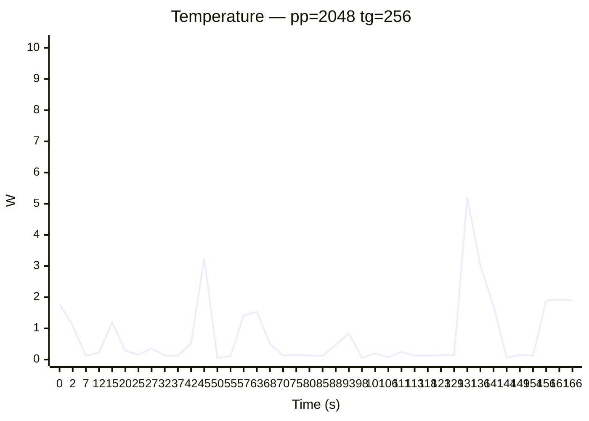
```mermaid
xychart-beta
  title "Temperature — pp=2048 tg=256"
  x-axis "Time (s)" [0, 2, 7, 12, 15, 20, 25, 27, 32, 37, 42, 45, 50, 55, 57, 63, 68, 70, 75, 80, 85, 88, 93, 98, 101, 106, 111, 113, 118, 123, 129, 131, 136, 141, 144, 149, 154, 156, 161, 166]
  y-axis "W" 0 --> 10.2
  line "CPU W" [1.78, 1.09, 0.12, 0.23, 1.19, 0.28, 0.16, 0.36, 0.13, 0.12, 0.52, 3.25, 0.05, 0.11, 1.42, 1.53, 0.5, 0.13, 0.15, 0.13, 0.12, 0.48, 0.84, 0.05, 0.2, 0.07, 0.25, 0.13, 0.13, 0.14, 0.15, 5.2, 3.0, 1.73, 0.06, 0.15, 0.13, 1.89, 1.93, 1.9]
```

Raw readings

| Time (s) | GPU °C | GPU util % | GPU W | CPU °C |
|---:|---:|---:|---:|---:|
| 0 | None | None | None | 1.78 |
| 2 | None | None | None | 1.09 |
| 5 | None | None | None | 1.63 |
| 7 | None | None | None | 0.12 |
| 10 | None | None | None | 1.66 |
| 12 | None | None | None | 0.23 |
| 15 | None | None | None | 1.19 |
| 17 | None | None | None | 0.15 |
| 20 | None | None | None | 0.28 |
| 22 | None | None | None | 0.88 |
| 25 | None | None | None | 0.16 |
| 27 | None | None | None | 0.36 |
| 30 | None | None | None | 0.13 |
| 32 | None | None | None | 0.13 |
| 35 | None | None | None | 0.91 |
| 37 | None | None | None | 0.12 |
| 40 | None | None | None | 0.43 |
| 42 | None | None | None | 0.52 |
| 45 | None | None | None | 3.25 |
| 47 | None | None | None | 1.07 |
| 50 | None | None | None | 0.05 |
| 52 | None | None | None | 1.81 |
| 55 | None | None | None | 0.11 |
| 57 | None | None | None | 1.42 |
| 60 | None | None | None | 0.05 |
| 63 | None | None | None | 1.53 |
| 65 | None | None | None | 0.23 |
| 68 | None | None | None | 0.5 |
| 70 | None | None | None | 0.13 |
| 73 | None | None | None | 0.39 |
| 75 | None | None | None | 0.15 |
| 78 | None | None | None | 0.34 |
| 80 | None | None | None | 0.13 |
| 83 | None | None | None | 0.52 |
| 85 | None | None | None | 0.12 |
| 88 | None | None | None | 0.48 |
| 90 | None | None | None | 0.06 |
| 93 | None | None | None | 0.84 |
| 96 | None | None | None | 0.05 |
| 98 | None | None | None | 0.05 |
| 101 | None | None | None | 0.2 |
| 103 | None | None | None | 0.24 |
| 106 | None | None | None | 0.07 |
| 108 | None | None | None | 0.15 |
| 111 | None | None | None | 0.25 |
| 113 | None | None | None | 0.13 |
| 116 | None | None | None | 0.45 |
| 118 | None | None | None | 0.13 |
| 121 | None | None | None | 0.98 |
| 123 | None | None | None | 0.14 |
| 126 | None | None | None | 2.36 |
| 129 | None | None | None | 0.15 |
| 131 | None | None | None | 5.2 |
| 134 | None | None | None | 0.06 |
| 136 | None | None | None | 3.0 |
| 139 | None | None | None | 0.06 |
| 141 | None | None | None | 1.73 |
| 144 | None | None | None | 0.06 |
| 146 | None | None | None | 1.67 |
| 149 | None | None | None | 0.15 |
| 151 | None | None | None | 2.12 |
| 154 | None | None | None | 0.13 |
| 156 | None | None | None | 1.89 |
| 159 | None | None | None | 0.12 |
| 161 | None | None | None | 1.93 |
| 164 | None | None | None | 0.16 |
| 166 | None | None | None | 1.9 |
| 169 | None | None | None | 0.14 |

---

# Benchmark Report: mistral-nemo

**Date:** 2026-04-19 16:17  
**Machine:** Apple M4, 16GB unified memory, macOS  
**Endpoint:** http://localhost:11434/v1  
**Run platform:** Darwin arm64  
**Runs per test:** 3  

---

## Summary

| pp | tg | Duration (s) | GPU peak °C | CPU peak °C |
|---:|---:|---:|---:|---:|
| 512 | 64 | 57 | 0 | 6.46 |
| 512 | 256 | 85 | 0 | 3.71 |
| 2048 | 64 | 73 | 0 | 1.55 |
| 2048 | 256 | 116 | 0 | 3.78 |

---

## pp=512 tg=64

| model        |   test |           t/s |     peak t/s |        ttfr (ms) |     est_ppt (ms) |    e2e_ttft (ms) |
|:-------------|-------:|--------------:|-------------:|-----------------:|-----------------:|-----------------:|
| mistral-nemo |  pp512 | 156.20 ± 2.01 |              | 3114.55 ± 112.30 | 2989.03 ± 112.30 | 3114.55 ± 112.30 |
| mistral-nemo |   tg64 |  14.51 ± 0.01 | 15.00 ± 0.00 |                  |                  |                  |

### Temperatures & Utilization

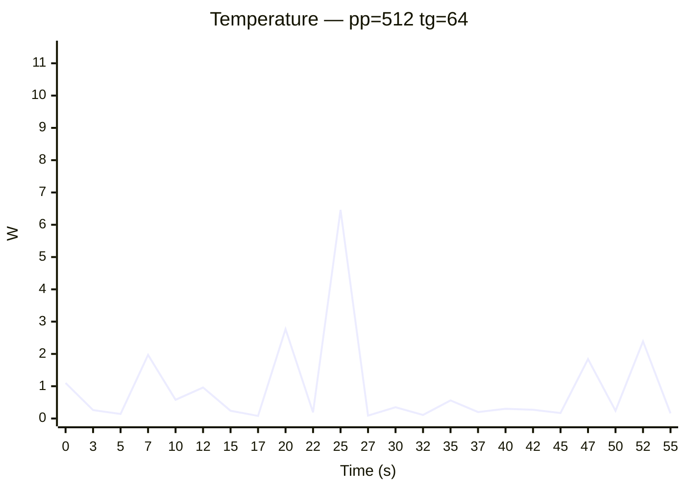
```mermaid
xychart-beta
  title "Temperature — pp=512 tg=64"
  x-axis "Time (s)" [0, 3, 5, 7, 10, 12, 15, 17, 20, 22, 25, 27, 30, 32, 35, 37, 40, 42, 45, 47, 50, 52, 55]
  y-axis "W" 0 --> 11.46
  line "CPU W" [1.1, 0.26, 0.14, 1.97, 0.58, 0.96, 0.24, 0.08, 2.77, 0.19, 6.46, 0.09, 0.35, 0.11, 0.56, 0.2, 0.3, 0.27, 0.17, 1.84, 0.24, 2.39, 0.16]
```

Raw readings

| Time (s) | GPU °C | GPU util % | GPU W | CPU °C |
|---:|---:|---:|---:|---:|
| 0 | None | None | None | 1.1 |
| 3 | None | None | None | 0.26 |
| 5 | None | None | None | 0.14 |
| 7 | None | None | None | 1.97 |
| 10 | None | None | None | 0.58 |
| 12 | None | None | None | 0.96 |
| 15 | None | None | None | 0.24 |
| 17 | None | None | None | 0.08 |
| 20 | None | None | None | 2.77 |
| 22 | None | None | None | 0.19 |
| 25 | None | None | None | 6.46 |
| 27 | None | None | None | 0.09 |
| 30 | None | None | None | 0.35 |
| 32 | None | None | None | 0.11 |
| 35 | None | None | None | 0.56 |
| 37 | None | None | None | 0.2 |
| 40 | None | None | None | 0.3 |
| 42 | None | None | None | 0.27 |
| 45 | None | None | None | 0.17 |
| 47 | None | None | None | 1.84 |
| 50 | None | None | None | 0.24 |
| 52 | None | None | None | 2.39 |
| 55 | None | None | None | 0.16 |

---

## pp=512 tg=256

| model        |   test |           t/s |     peak t/s |        ttfr (ms) |     est_ppt (ms) |    e2e_ttft (ms) |
|:-------------|-------:|--------------:|-------------:|-----------------:|-----------------:|-----------------:|
| mistral-nemo |  pp512 | 151.69 ± 5.16 |              | 3177.52 ± 183.83 | 3051.26 ± 183.83 | 3177.52 ± 183.83 |
| mistral-nemo |  tg256 |  14.50 ± 0.06 | 15.00 ± 0.00 |                  |                  |                  |

### Temperatures & Utilization

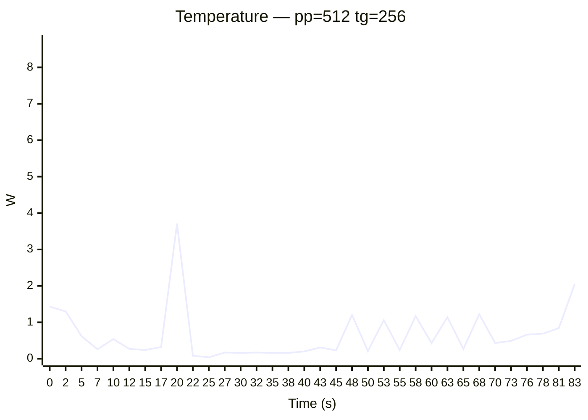
```mermaid
xychart-beta
  title "Temperature — pp=512 tg=256"
  x-axis "Time (s)" [0, 2, 5, 7, 10, 12, 15, 17, 20, 22, 25, 27, 30, 32, 35, 38, 40, 43, 45, 48, 50, 53, 55, 58, 60, 63, 65, 68, 70, 73, 76, 78, 81, 83]
  y-axis "W" 0 --> 8.71
  line "CPU W" [1.43, 1.3, 0.62, 0.26, 0.54, 0.27, 0.24, 0.32, 3.71, 0.08, 0.04, 0.17, 0.16, 0.17, 0.16, 0.16, 0.2, 0.31, 0.23, 1.2, 0.21, 1.06, 0.24, 1.17, 0.43, 1.14, 0.27, 1.22, 0.43, 0.49, 0.66, 0.69, 0.84, 2.05]
```

Raw readings

| Time (s) | GPU °C | GPU util % | GPU W | CPU °C |
|---:|---:|---:|---:|---:|
| 0 | None | None | None | 1.43 |
| 2 | None | None | None | 1.3 |
| 5 | None | None | None | 0.62 |
| 7 | None | None | None | 0.26 |
| 10 | None | None | None | 0.54 |
| 12 | None | None | None | 0.27 |
| 15 | None | None | None | 0.24 |
| 17 | None | None | None | 0.32 |
| 20 | None | None | None | 3.71 |
| 22 | None | None | None | 0.08 |
| 25 | None | None | None | 0.04 |
| 27 | None | None | None | 0.17 |
| 30 | None | None | None | 0.16 |
| 32 | None | None | None | 0.17 |
| 35 | None | None | None | 0.16 |
| 38 | None | None | None | 0.16 |
| 40 | None | None | None | 0.2 |
| 43 | None | None | None | 0.31 |
| 45 | None | None | None | 0.23 |
| 48 | None | None | None | 1.2 |
| 50 | None | None | None | 0.21 |
| 53 | None | None | None | 1.06 |
| 55 | None | None | None | 0.24 |
| 58 | None | None | None | 1.17 |
| 60 | None | None | None | 0.43 |
| 63 | None | None | None | 1.14 |
| 65 | None | None | None | 0.27 |
| 68 | None | None | None | 1.22 |
| 70 | None | None | None | 0.43 |
| 73 | None | None | None | 0.49 |
| 76 | None | None | None | 0.66 |
| 78 | None | None | None | 0.69 |
| 81 | None | None | None | 0.84 |
| 83 | None | None | None | 2.05 |

---

## pp=2048 tg=64

| model        |   test |           t/s |     peak t/s |         ttfr (ms) |      est_ppt (ms) |     e2e_ttft (ms) |
|:-------------|-------:|--------------:|-------------:|------------------:|------------------:|------------------:|
| mistral-nemo | pp2048 | 146.90 ± 0.37 |              | 12340.21 ± 277.33 | 12211.55 ± 277.33 | 12340.21 ± 277.33 |
| mistral-nemo |   tg64 |  14.00 ± 0.12 | 15.00 ± 0.00 |                   |                   |                   |

### Temperatures & Utilization

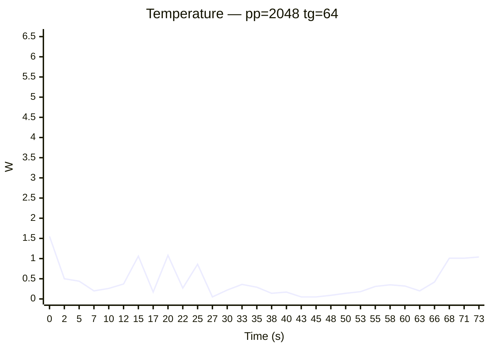
```mermaid
xychart-beta
  title "Temperature — pp=2048 tg=64"
  x-axis "Time (s)" [0, 2, 5, 7, 10, 12, 15, 17, 20, 22, 25, 27, 30, 33, 35, 38, 40, 43, 45, 48, 50, 53, 55, 58, 60, 63, 66, 68, 71, 73]
  y-axis "W" 0 --> 6.55
  line "CPU W" [1.55, 0.5, 0.44, 0.2, 0.26, 0.37, 1.06, 0.17, 1.08, 0.27, 0.86, 0.05, 0.22, 0.36, 0.29, 0.14, 0.17, 0.05, 0.05, 0.09, 0.14, 0.18, 0.31, 0.35, 0.32, 0.2, 0.42, 1.01, 1.01, 1.04]
```

Raw readings

| Time (s) | GPU °C | GPU util % | GPU W | CPU °C |
|---:|---:|---:|---:|---:|
| 0 | None | None | None | 1.55 |
| 2 | None | None | None | 0.5 |
| 5 | None | None | None | 0.44 |
| 7 | None | None | None | 0.2 |
| 10 | None | None | None | 0.26 |
| 12 | None | None | None | 0.37 |
| 15 | None | None | None | 1.06 |
| 17 | None | None | None | 0.17 |
| 20 | None | None | None | 1.08 |
| 22 | None | None | None | 0.27 |
| 25 | None | None | None | 0.86 |
| 27 | None | None | None | 0.05 |
| 30 | None | None | None | 0.22 |
| 33 | None | None | None | 0.36 |
| 35 | None | None | None | 0.29 |
| 38 | None | None | None | 0.14 |
| 40 | None | None | None | 0.17 |
| 43 | None | None | None | 0.05 |
| 45 | None | None | None | 0.05 |
| 48 | None | None | None | 0.09 |
| 50 | None | None | None | 0.14 |
| 53 | None | None | None | 0.18 |
| 55 | None | None | None | 0.31 |
| 58 | None | None | None | 0.35 |
| 60 | None | None | None | 0.32 |
| 63 | None | None | None | 0.2 |
| 66 | None | None | None | 0.42 |
| 68 | None | None | None | 1.01 |
| 71 | None | None | None | 1.01 |
| 73 | None | None | None | 1.04 |

---

## pp=2048 tg=256

| model        |   test |           t/s |     peak t/s |         ttfr (ms) |      est_ppt (ms) |     e2e_ttft (ms) |
|:-------------|-------:|--------------:|-------------:|------------------:|------------------:|------------------:|
| mistral-nemo | pp2048 | 146.81 ± 0.35 |              | 12968.35 ± 289.03 | 12840.15 ± 289.03 | 12968.35 ± 289.03 |
| mistral-nemo |  tg256 |  14.03 ± 0.01 | 15.00 ± 0.00 |                   |                   |                   |

### Temperatures & Utilization

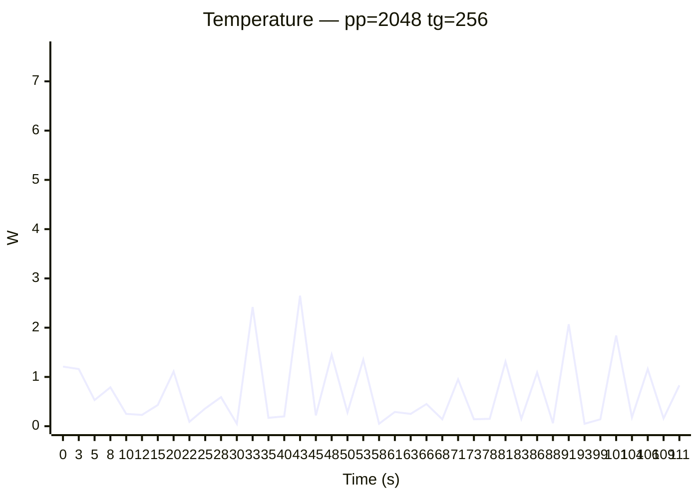
```mermaid
xychart-beta
  title "Temperature — pp=2048 tg=256"
  x-axis "Time (s)" [0, 3, 5, 8, 10, 12, 15, 20, 22, 25, 28, 30, 33, 35, 40, 43, 45, 48, 50, 53, 58, 61, 63, 66, 68, 71, 73, 78, 81, 83, 86, 88, 91, 93, 99, 101, 104, 106, 109, 111]
  y-axis "W" 0 --> 7.65
  line "CPU W" [1.21, 1.16, 0.53, 0.79, 0.25, 0.23, 0.43, 1.11, 0.09, 0.36, 0.59, 0.05, 2.42, 0.17, 0.2, 2.65, 0.22, 1.45, 0.28, 1.35, 0.05, 0.29, 0.25, 0.45, 0.14, 0.95, 0.14, 0.15, 1.31, 0.15, 1.09, 0.06, 2.07, 0.05, 0.14, 1.84, 0.18, 1.16, 0.16, 0.83]
```

Raw readings

| Time (s) | GPU °C | GPU util % | GPU W | CPU °C |
|---:|---:|---:|---:|---:|
| 0 | None | None | None | 1.21 |
| 3 | None | None | None | 1.16 |
| 5 | None | None | None | 0.53 |
| 8 | None | None | None | 0.79 |
| 10 | None | None | None | 0.25 |
| 12 | None | None | None | 0.23 |
| 15 | None | None | None | 0.43 |
| 17 | None | None | None | 3.78 |
| 20 | None | None | None | 1.11 |
| 22 | None | None | None | 0.09 |
| 25 | None | None | None | 0.36 |
| 28 | None | None | None | 0.59 |
| 30 | None | None | None | 0.05 |
| 33 | None | None | None | 2.42 |
| 35 | None | None | None | 0.17 |
| 38 | None | None | None | 3.02 |
| 40 | None | None | None | 0.2 |
| 43 | None | None | None | 2.65 |
| 45 | None | None | None | 0.22 |
| 48 | None | None | None | 1.45 |
| 50 | None | None | None | 0.28 |
| 53 | None | None | None | 1.35 |
| 55 | None | None | None | 0.21 |
| 58 | None | None | None | 0.05 |
| 61 | None | None | None | 0.29 |
| 63 | None | None | None | 0.25 |
| 66 | None | None | None | 0.45 |
| 68 | None | None | None | 0.14 |
| 71 | None | None | None | 0.95 |
| 73 | None | None | None | 0.14 |
| 76 | None | None | None | 1.13 |
| 78 | None | None | None | 0.15 |
| 81 | None | None | None | 1.31 |
| 83 | None | None | None | 0.15 |
| 86 | None | None | None | 1.09 |
| 88 | None | None | None | 0.06 |
| 91 | None | None | None | 2.07 |
| 93 | None | None | None | 0.05 |
| 96 | None | None | None | 1.25 |
| 99 | None | None | None | 0.14 |
| 101 | None | None | None | 1.84 |
| 104 | None | None | None | 0.18 |
| 106 | None | None | None | 1.16 |
| 109 | None | None | None | 0.16 |
| 111 | None | None | None | 0.83 |
| 114 | None | None | None | 0.42 |

---

# Benchmark Report: jjansen/adapt-finance-llama2-7b

**Date:** 2026-04-19 17:18  
**Machine:** Apple M4, 16GB unified memory, macOS  
**Endpoint:** http://localhost:11434/v1  
**Run platform:** Darwin arm64  
**Runs per test:** 3  

---

## Summary

| pp | tg | Duration (s) | GPU peak °C | CPU peak °C |
|---:|---:|---:|---:|---:|
| 512 | 64 | 62 | 0 | 9.51 |
| 512 | 256 | 33 | 0 | 6.06 |
| 2048 | 64 | 37 | 0 | 2.23 |
| 2048 | 256 | 49 | 0 | 5.02 |

---

## pp=512 tg=64

| model                           |   test |           t/s |     peak t/s |       ttfr (ms) |    est_ppt (ms) |   e2e_ttft (ms) |
|:--------------------------------|-------:|--------------:|-------------:|----------------:|----------------:|----------------:|
| jjansen/adapt-finance-llama2-7b |  pp512 | 255.02 ± 3.17 |              | 1538.90 ± 17.84 | 1427.58 ± 17.84 | 1538.90 ± 17.84 |
| jjansen/adapt-finance-llama2-7b |   tg64 |  24.38 ± 0.01 | 25.00 ± 0.00 |                 |                 |                 |

### Temperatures & Utilization

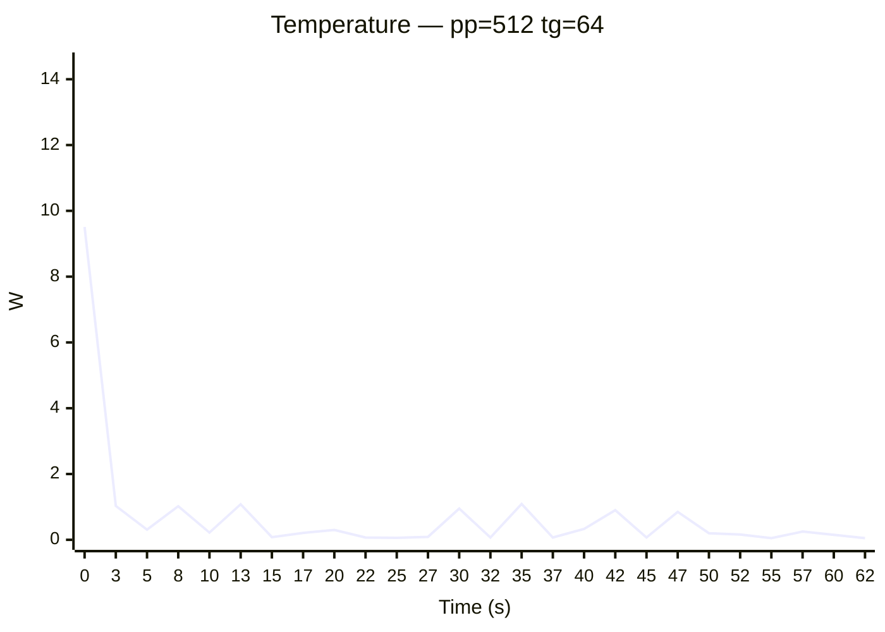
```mermaid
xychart-beta
  title "Temperature — pp=512 tg=64"
  x-axis "Time (s)" [0, 3, 5, 8, 10, 13, 15, 17, 20, 22, 25, 27, 30, 32, 35, 37, 40, 42, 45, 47, 50, 52, 55, 57, 60, 62]
  y-axis "W" 0 --> 14.51
  line "CPU W" [9.51, 1.03, 0.31, 1.02, 0.22, 1.08, 0.08, 0.21, 0.3, 0.07, 0.06, 0.09, 0.95, 0.07, 1.09, 0.07, 0.33, 0.9, 0.07, 0.85, 0.2, 0.16, 0.05, 0.25, 0.15, 0.05]
```

Raw readings

| Time (s) | GPU °C | GPU util % | GPU W | CPU °C |
|---:|---:|---:|---:|---:|
| 0 | None | None | None | 9.51 |
| 3 | None | None | None | 1.03 |
| 5 | None | None | None | 0.31 |
| 8 | None | None | None | 1.02 |
| 10 | None | None | None | 0.22 |
| 13 | None | None | None | 1.08 |
| 15 | None | None | None | 0.08 |
| 17 | None | None | None | 0.21 |
| 20 | None | None | None | 0.3 |
| 22 | None | None | None | 0.07 |
| 25 | None | None | None | 0.06 |
| 27 | None | None | None | 0.09 |
| 30 | None | None | None | 0.95 |
| 32 | None | None | None | 0.07 |
| 35 | None | None | None | 1.09 |
| 37 | None | None | None | 0.07 |
| 40 | None | None | None | 0.33 |
| 42 | None | None | None | 0.9 |
| 45 | None | None | None | 0.07 |
| 47 | None | None | None | 0.85 |
| 50 | None | None | None | 0.2 |
| 52 | None | None | None | 0.16 |
| 55 | None | None | None | 0.05 |
| 57 | None | None | None | 0.25 |
| 60 | None | None | None | 0.15 |
| 62 | None | None | None | 0.05 |

---

## pp=512 tg=256

| model                           |   test |            t/s |     peak t/s |       ttfr (ms) |    est_ppt (ms) |   e2e_ttft (ms) |
|:--------------------------------|-------:|---------------:|-------------:|----------------:|----------------:|----------------:|
| jjansen/adapt-finance-llama2-7b |  pp512 | 292.87 ± 14.37 |              | 1488.83 ± 59.08 | 1245.76 ± 59.08 | 1488.83 ± 59.08 |
| jjansen/adapt-finance-llama2-7b |  tg256 |   24.21 ± 0.04 | 25.00 ± 0.00 |                 |                 |                 |

### Temperatures & Utilization

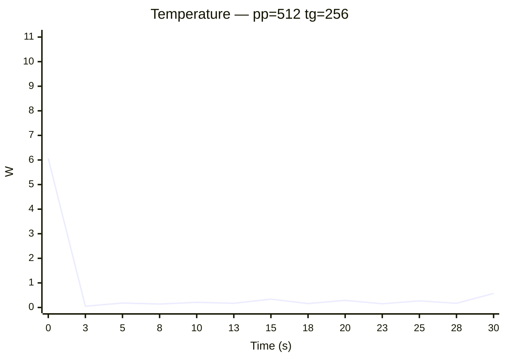
```mermaid
xychart-beta
  title "Temperature — pp=512 tg=256"
  x-axis "Time (s)" [0, 3, 5, 8, 10, 13, 15, 18, 20, 23, 25, 28, 30]
  y-axis "W" 0 --> 11.059999999999999
  line "CPU W" [6.06, 0.05, 0.18, 0.14, 0.21, 0.17, 0.34, 0.16, 0.29, 0.15, 0.27, 0.17, 0.57]
```

Raw readings

| Time (s) | GPU °C | GPU util % | GPU W | CPU °C |
|---:|---:|---:|---:|---:|
| 0 | None | None | None | 6.06 |
| 3 | None | None | None | 0.05 |
| 5 | None | None | None | 0.18 |
| 8 | None | None | None | 0.14 |
| 10 | None | None | None | 0.21 |
| 13 | None | None | None | 0.17 |
| 15 | None | None | None | 0.34 |
| 18 | None | None | None | 0.16 |
| 20 | None | None | None | 0.29 |
| 23 | None | None | None | 0.15 |
| 25 | None | None | None | 0.27 |
| 28 | None | None | None | 0.17 |
| 30 | None | None | None | 0.57 |

---

## pp=2048 tg=64

| model                           |   test |           t/s |     peak t/s |       ttfr (ms) |    est_ppt (ms) |   e2e_ttft (ms) |
|:--------------------------------|-------:|--------------:|-------------:|----------------:|----------------:|----------------:|
| jjansen/adapt-finance-llama2-7b | pp2048 | 258.93 ± 0.75 |              | 8076.63 ± 64.61 | 7833.54 ± 64.61 | 8076.63 ± 64.61 |
| jjansen/adapt-finance-llama2-7b |   tg64 |  21.91 ± 0.02 | 22.33 ± 0.47 |                 |                 |                 |

### Temperatures & Utilization

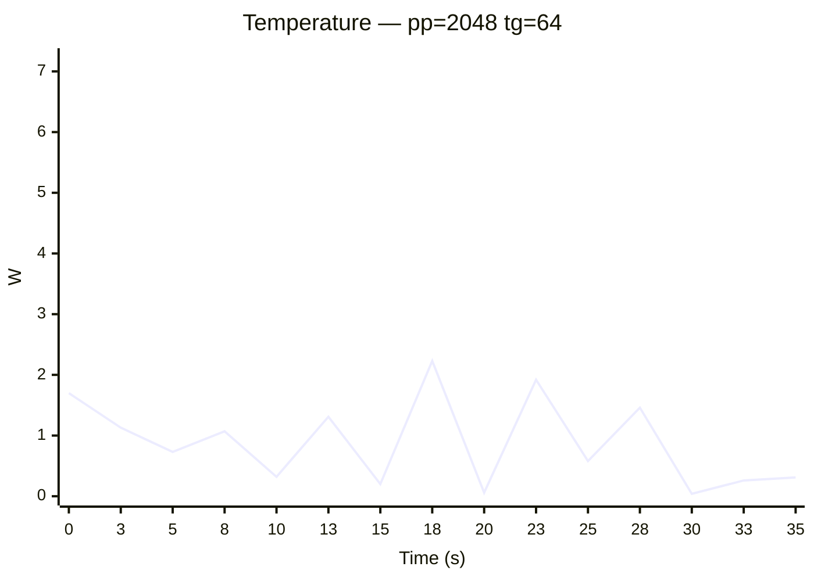
```mermaid
xychart-beta
  title "Temperature — pp=2048 tg=64"
  x-axis "Time (s)" [0, 3, 5, 8, 10, 13, 15, 18, 20, 23, 25, 28, 30, 33, 35]
  y-axis "W" 0 --> 7.23
  line "CPU W" [1.7, 1.13, 0.73, 1.07, 0.32, 1.31, 0.2, 2.23, 0.06, 1.92, 0.58, 1.46, 0.04, 0.26, 0.31]
```

Raw readings

| Time (s) | GPU °C | GPU util % | GPU W | CPU °C |
|---:|---:|---:|---:|---:|
| 0 | None | None | None | 1.7 |
| 3 | None | None | None | 1.13 |
| 5 | None | None | None | 0.73 |
| 8 | None | None | None | 1.07 |
| 10 | None | None | None | 0.32 |
| 13 | None | None | None | 1.31 |
| 15 | None | None | None | 0.2 |
| 18 | None | None | None | 2.23 |
| 20 | None | None | None | 0.06 |
| 23 | None | None | None | 1.92 |
| 25 | None | None | None | 0.58 |
| 28 | None | None | None | 1.46 |
| 30 | None | None | None | 0.04 |
| 33 | None | None | None | 0.26 |
| 35 | None | None | None | 0.31 |

---

## pp=2048 tg=256

| model                           |   test |           t/s |     peak t/s |        ttfr (ms) |     est_ppt (ms) |    e2e_ttft (ms) |
|:--------------------------------|-------:|--------------:|-------------:|-----------------:|-----------------:|-----------------:|
| jjansen/adapt-finance-llama2-7b | pp2048 | 257.56 ± 1.75 |              | 8373.62 ± 350.36 | 8131.08 ± 350.36 | 8373.62 ± 350.36 |
| jjansen/adapt-finance-llama2-7b |  tg256 |  21.53 ± 0.16 | 22.33 ± 0.47 |                  |                  |                  |

### Temperatures & Utilization

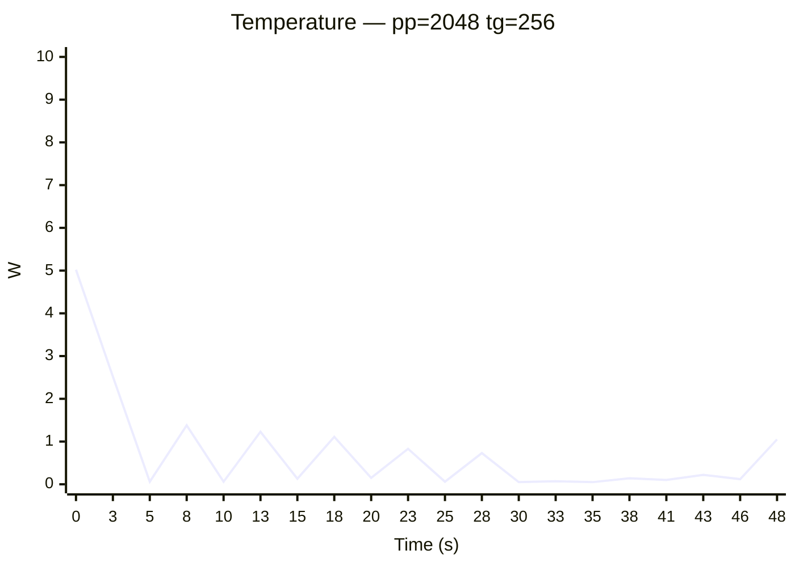
```mermaid
xychart-beta
  title "Temperature — pp=2048 tg=256"
  x-axis "Time (s)" [0, 3, 5, 8, 10, 13, 15, 18, 20, 23, 25, 28, 30, 33, 35, 38, 41, 43, 46, 48]
  y-axis "W" 0 --> 10.02
  line "CPU W" [5.02, 2.52, 0.06, 1.38, 0.06, 1.23, 0.13, 1.11, 0.15, 0.83, 0.06, 0.73, 0.05, 0.07, 0.05, 0.14, 0.1, 0.22, 0.12, 1.05]
```

Raw readings

| Time (s) | GPU °C | GPU util % | GPU W | CPU °C |
|---:|---:|---:|---:|---:|
| 0 | None | None | None | 5.02 |
| 3 | None | None | None | 2.52 |
| 5 | None | None | None | 0.06 |
| 8 | None | None | None | 1.38 |
| 10 | None | None | None | 0.06 |
| 13 | None | None | None | 1.23 |
| 15 | None | None | None | 0.13 |
| 18 | None | None | None | 1.11 |
| 20 | None | None | None | 0.15 |
| 23 | None | None | None | 0.83 |
| 25 | None | None | None | 0.06 |
| 28 | None | None | None | 0.73 |
| 30 | None | None | None | 0.05 |
| 33 | None | None | None | 0.07 |
| 35 | None | None | None | 0.05 |
| 38 | None | None | None | 0.14 |
| 41 | None | None | None | 0.1 |
| 43 | None | None | None | 0.22 |
| 46 | None | None | None | 0.12 |
| 48 | None | None | None | 1.05 |

---

