# Stealth Machine — Full Benchmark Summary

**Machine:** stealth (AMD) — Ryzen 7 3700X, RTX 2080 SUPER 8GB VRAM, 32GB RAM  
**Tool:** llama-benchy 0.3.5 | **Date:** 2026-04-10  
**Method:** 3 runs per test, latency mode: generation, GPU/CPU temps polled every 2s

---

## Cross-Model Comparison

### Generation Throughput (TG tok/s)

| Model | Size | tg=64 @ pp=512 | tg=256 @ pp=512 | tg=64 @ pp=2048 | tg=256 @ pp=2048 | Tested from | Date |
|:------|-----:|---:|---:|---:|---:|:------|:------|
| gemma3:4b | 3.2GB | 102.2 | 101.0 | ~102 | ~101 | stealth (local) | 2026-04-10 |
| nemotron-mini | 2.6GB | 81.4 | 91.8 | ~81 | ~92 | stealth (local) | 2026-04-10 |
| qwen2.5-coder:7b | 4.5GB | 77.8 | 77.4 | ~78 | ~77 | stealth (local) | 2026-04-10 |
| llama3.1:8b | 4.7GB | 74.8 | 74.3 | ~75 | ~74 | stealth (local) | 2026-04-10 |
| qwen3:8b | 4.9GB | 73.6 | 73.1 | ~74 | ~73 | stealth (local) | 2026-04-10 |
| deepseek-r1:8b | 4.9GB | 73.3 | 72.9 | ~73 | ~73 | stealth (local) | 2026-04-10 |
| gemma4:e2b | 6.8GB | 43.3 | 43.2 | 43.9 | 42.2 | stealth (local) | 2026-04-18 |
| gemma4:26b ⚠️ | 17.2GB | 15.1 | 14.8 | 13.6 | 13.5 | stealth (local) | 2026-04-18 |
| qwen3:14b | 8.7GB | 12.5 | 12.4 | 11.6 | 11.6 | stealth (local) | 2026-04-10 |
| qwen2.5-coder:14b | 8.4GB | 10.7 | 10.7 | ~11 | ~11 | stealth (local) | 2026-04-10 |
| deepseek-r1:14b | 8.4GB | 10.8 | 10.6 | 10.8 | 10.6 | stealth (local) | 2026-04-10 |
| phi4 (14B) | 8.5GB | 10.7 | 10.7 | 10.7 | 10.7 | stealth (local) | 2026-04-10 |
| qwen3.6 ⚠️ | 22.8GB | 6.81 | 7.05 | 6.60 | 6.96 | stealth (local) | 2026-04-18 |
| qwen3:32b ⚠️ | 19.3GB | 3.0 | 3.0 | 3.0 | 3.0 | stealth (local) | 2026-04-10 |

> ⚠️ gemma4:26b has ~9GB RAM spill (17.2GB model, 8GB VRAM). MoE architecture keeps TG faster than dense 14B models despite spill, but TTFT is ~3× worse.  
> ⚠️ qwen3:32b has ~11GB RAM spill — bottlenecked by system memory bandwidth, not VRAM.  
> ⚠️ qwen3.6 has ~14.8GB RAM spill (22.8GB model, 8GB VRAM) — heavily memory-bandwidth-bound; slower TG than smaller models.

### Prompt Processing Throughput (PP tok/s @ pp=512)

| Model | PP tok/s | TTFT (ms) | Tested from | Date |
|:------|---:|---:|:------|:------|
| nemotron-mini | ~4,318 | 266 | stealth (local) | 2026-04-10 |
| gemma3:4b | ~3,938 | 418 | stealth (local) | 2026-04-10 |
| gemma4:e2b | ~3,406 | 447 | stealth (local) | 2026-04-18 |
| llama3.1:8b | ~2,191 | 367 | stealth (local) | 2026-04-10 |
| gemma4:26b ⚠️ | ~450 | 1,430 | stealth (local) | 2026-04-18 |
| qwen2.5-coder:7b | ~2,436 | 319 | stealth (local) | 2026-04-10 |
| deepseek-r1:8b | ~1,931 | 364 | stealth (local) | 2026-04-10 |
| qwen3:8b | ~1,891 | 357 | stealth (local) | 2026-04-10 |
| qwen2.5-coder:14b | ~1,119 | 769 | stealth (local) | 2026-04-10 |
| phi4 (14B) | ~844 | 746 | stealth (local) | 2026-04-10 |
| qwen3:14b | ~710 | 898 | stealth (local) | 2026-04-10 |
| deepseek-r1:14b | ~608 | 966 | stealth (local) | 2026-04-10 |
| qwen3.6 ⚠️ | ~374 | 1,905 | stealth (local) | 2026-04-18 |
| qwen3:32b | ~200 | 3,153 | stealth (local) | 2026-04-10 |

### Thermal Profile (peak across all tests)

| Model | GPU peak | CPU peak | Tested from | Date | Notes |
|:------|---:|---:|:------|:------|:------|
| gemma4:e2b | 48°C | 67°C | stealth (local) | 2026-04-18 | Coolest GPU — low util (~25-52%) despite near-full VRAM |
| nemotron-mini | 54°C | 54°C | stealth (local) | 2026-04-10 | Lightest overall thermal load |
| qwen2.5-coder:7b | 58°C | 57°C | stealth (local) | 2026-04-10 | |
| gemma3:4b | 61°C | 59°C | stealth (local) | 2026-04-10 | |
| llama3.1:8b | 64°C | 59°C | stealth (local) | 2026-04-10 | |
| qwen3:8b | 68°C | 60°C | stealth (local) | 2026-04-10 | |
| deepseek-r1:8b | 68°C | 62°C | stealth (local) | 2026-04-10 | |
| qwen2.5-coder:14b | 59°C | 71°C | stealth (local) | 2026-04-10 | CPU higher — VRAM pressure |
| phi4 (14B) | 61°C | 71°C | stealth (local) | 2026-04-10 | |
| qwen3:14b | 60°C | 70°C | stealth (local) | 2026-04-10 | |
| deepseek-r1:14b | 57°C | 70°C | stealth (local) | 2026-04-10 | |
| gemma4:26b ⚠️ | 54°C | 73°C | stealth (local) | 2026-04-18 | ~9GB RAM spill; GPU spiky (0→93% bursts) |
| qwen3.6 ⚠️ | 54°C | 72°C | stealth (local) | 2026-04-18 | ~14.8GB RAM spill (22.8GB model); GPU bursts to 90% during prefill only |
| qwen3:32b | 60°C | **79°C** | stealth (local) | 2026-04-10 | CPU elevated by RAM spill |

---

## Swarm Routing Recommendations

| Route | Current model | Verdict | Alternative |
|:------|:-------------|:--------|:------------|
| conversational (M4) | qwen3:8b | ✅ Stays on M4 | — |
| general/research | qwen3:14b | ✅ Best 14B reasoning | — |
| code | qwen2.5-coder:14b | ✅ Solid, matches qwen3:14b TG speed | qwen2.5-coder:7b for 6× faster TG |
| verify (2-pass CoT) | deepseek-r1:14b | ⚠️ Slowest 14B PP (608 tok/s) | deepseek-r1:8b = 73 tok/s TG, much faster |
| heavy verify | qwen3:32b | ⚠️ 3 tok/s TG — use sparingly | phi4 as faster 14B alternative |

---

## Key Takeaways

- **8B models are 6× faster** than 14B on this GPU (73 vs 12 tok/s TG) — worth routing shorter tasks to 8B
- **nemotron-mini is the fastest** for PP throughput (4,318 tok/s) and coolest thermals — ideal for high-volume tasks
- **deepseek-r1:8b matches llama3.1:8b and qwen3:8b** in TG speed (~73 tok/s) but brings native CoT — strong candidate for verify route
- **qwen3:32b is throttled by RAM spill** (3 tok/s) — only use for tasks where quality justifies the wait
- **CPU is the bottleneck for 32b**, not GPU — Ryzen 7 3700X memory bandwidth limits RAM-spill models
- **gemma4:e2b fills the gap between 8B and 14B** — 43 tok/s TG and blazing PP (~3,400 tok/s @ pp=512), but slower than 8B models on TG; mostly running from RAM (only ~1.9GB VRAM active)
- **gemma4:26b MoE beats 14B dense models in TG** (15 vs 12 tok/s) despite being 17GB — MoE only activates 4B params per token so compute is light; TTFT penalty is severe (1,430ms) due to ~9GB RAM spill; not worth routing to unless quality demands it
- **qwen3.6 (22.8GB) is the most RAM-spill-bound model tested** — ~14.8GB spills to system RAM; 7 tok/s TG and ~374 tok/s PP @ pp=512; TTFT ~1,900ms; only practical for tasks where quality justifies significant latency

---

*Full per-model reports with temperature charts follow below.*

---

# Benchmark Report: qwen3:14b

**Date:** 2026-04-10 15:46  
**Target machine:** stealth — RTX 2080 SUPER 8GB VRAM, Ryzen 7 3700X, 32GB RAM  
**Endpoint:** http://100.118.160.122:11434/v1  
**Tested from:** stealth (AMD) — local  
**Runs per test:** 3  

---

## Summary

| pp | tg | Duration (s) | GPU peak °C | CPU peak °C |
|---:|---:|---:|---:|---:|
| 128 | 64 | 29 | 40 | 63.2 |
| 128 | 256 | 66 | 44 | 66.5 |
| 512 | 64 | 22 | 46 | 66.6 |
| 512 | 256 | 69 | 50 | 67.8 |
| 2048 | 64 | 29 | 59 | 67.6 |
| 2048 | 256 | 79 | 60 | 69.0 |

---

## pp=128 tg=64

| model     |   test |            t/s |     peak t/s |     ttfr (ms) |   est_ppt (ms) |   e2e_ttft (ms) |
|:----------|-------:|---------------:|-------------:|--------------:|---------------:|----------------:|
| qwen3:14b |  pp128 | 340.71 ± 30.32 |              | 572.20 ± 9.88 |  339.59 ± 9.88 |   572.20 ± 9.88 |
| qwen3:14b |   tg64 |   12.75 ± 0.03 | 13.00 ± 0.00 |               |                |                 |

### Temperatures & Utilization

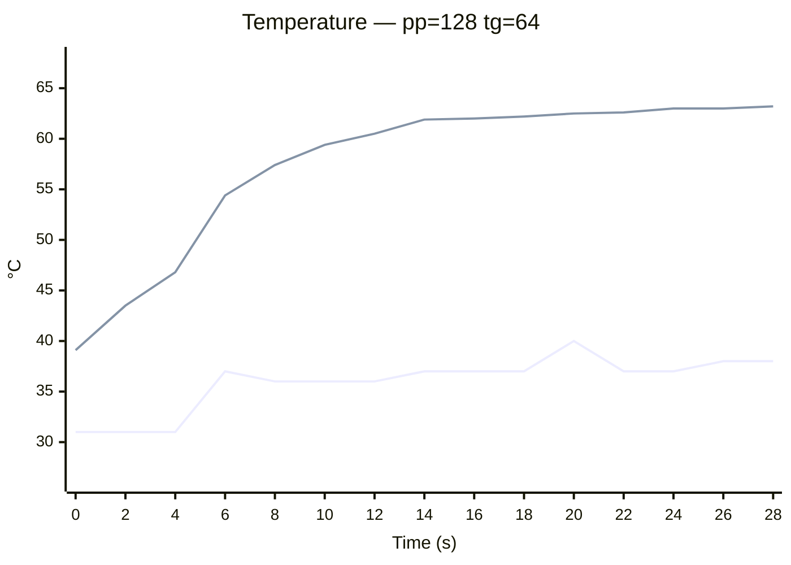
```mermaid
xychart-beta
  title "Temperature — pp=128 tg=64"
  x-axis "Time (s)" [0, 2, 4, 6, 8, 10, 12, 14, 16, 18, 20, 22, 24, 26, 28]
  y-axis "°C" 26 --> 68.2
  line "GPU °C" [31, 31, 31, 37, 36, 36, 36, 37, 37, 37, 40, 37, 37, 38, 38]
  line "CPU °C" [39.1, 43.5, 46.8, 54.4, 57.4, 59.4, 60.5, 61.9, 62.0, 62.2, 62.5, 62.6, 63.0, 63.0, 63.2]
```

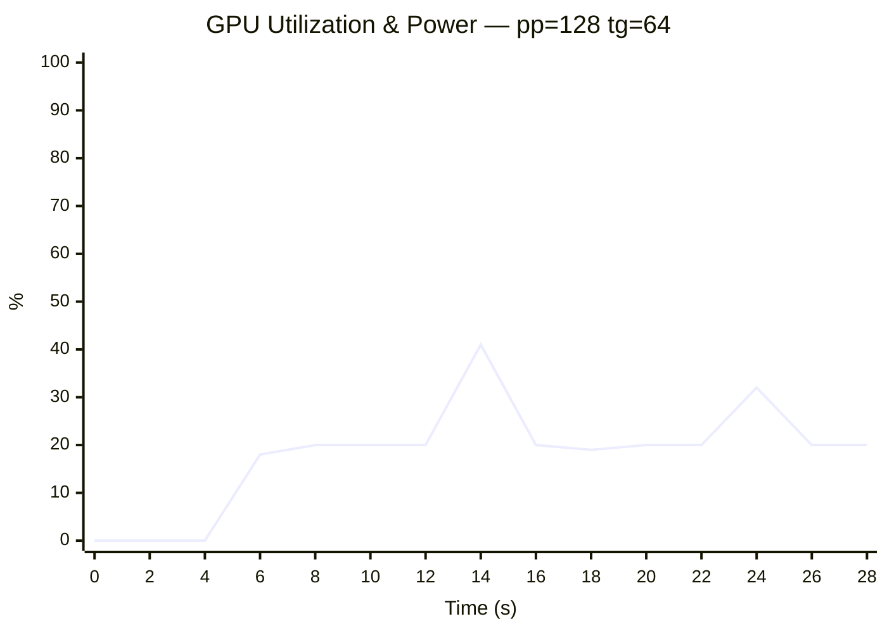
```mermaid
xychart-beta
  title "GPU Utilization & Power — pp=128 tg=64"
  x-axis "Time (s)" [0, 2, 4, 6, 8, 10, 12, 14, 16, 18, 20, 22, 24, 26, 28]
  y-axis "%" 0 --> 100
  line "GPU util %" [0, 0, 0, 18, 20, 20, 20, 41, 20, 19, 20, 20, 32, 20, 20]
```

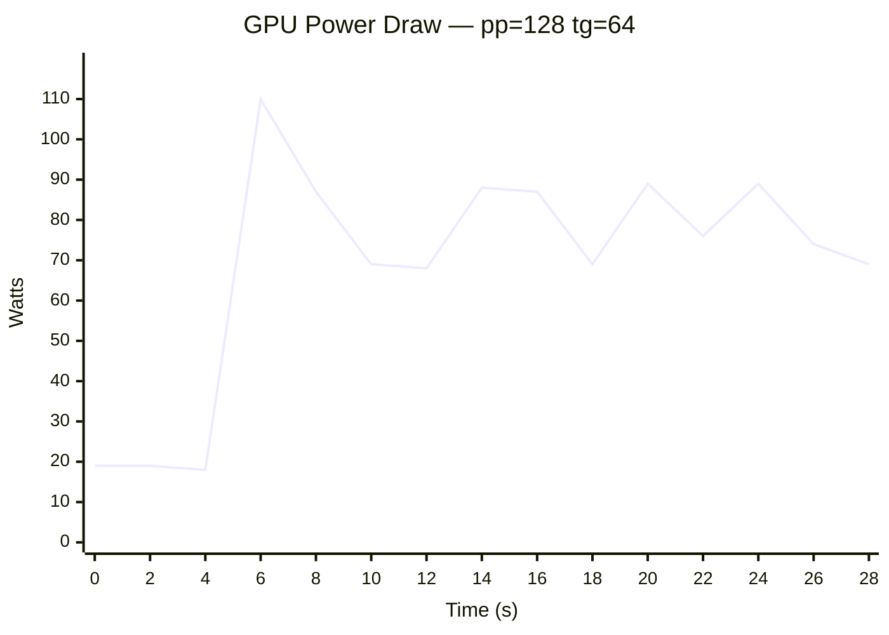
```mermaid
xychart-beta
  title "GPU Power Draw — pp=128 tg=64"
  x-axis "Time (s)" [0, 2, 4, 6, 8, 10, 12, 14, 16, 18, 20, 22, 24, 26, 28]
  y-axis "Watts" 0 --> 119
  line "Power (W)" [19, 19, 18, 110, 87, 69, 68, 88, 87, 69, 89, 76, 89, 74, 69]
```

Raw readings

| Time (s) | GPU °C | GPU util % | GPU W | CPU °C |
|---:|---:|---:|---:|---:|
| 0 | 31 | 0 | 19.05 | 39.1 |
| 2 | 31 | 0 | 19.0 | 43.5 |
| 4 | 31 | 0 | 18.3 | 46.8 |
| 6 | 37 | 18 | 109.68 | 54.4 |
| 8 | 36 | 20 | 86.73 | 57.4 |
| 10 | 36 | 20 | 68.56 | 59.4 |
| 12 | 36 | 20 | 68.47 | 60.5 |
| 14 | 37 | 41 | 88.18 | 61.9 |
| 16 | 37 | 20 | 87.47 | 62.0 |
| 18 | 37 | 19 | 68.55 | 62.2 |
| 20 | 40 | 20 | 89.09 | 62.5 |
| 22 | 37 | 20 | 76.08 | 62.6 |
| 24 | 37 | 32 | 88.71 | 63.0 |
| 26 | 38 | 20 | 74.29 | 63.0 |
| 28 | 38 | 20 | 68.75 | 63.2 |

---

## pp=128 tg=256

| model     |   test |           t/s |     peak t/s |      ttfr (ms) |   est_ppt (ms) |   e2e_ttft (ms) |
|:----------|-------:|--------------:|-------------:|---------------:|---------------:|----------------:|
| qwen3:14b |  pp128 | 349.43 ± 7.47 |              | 572.41 ± 15.68 | 327.27 ± 15.68 |  572.41 ± 15.68 |
| qwen3:14b |  tg256 |  12.67 ± 0.01 | 13.00 ± 0.00 |                |                |                 |

### Temperatures & Utilization

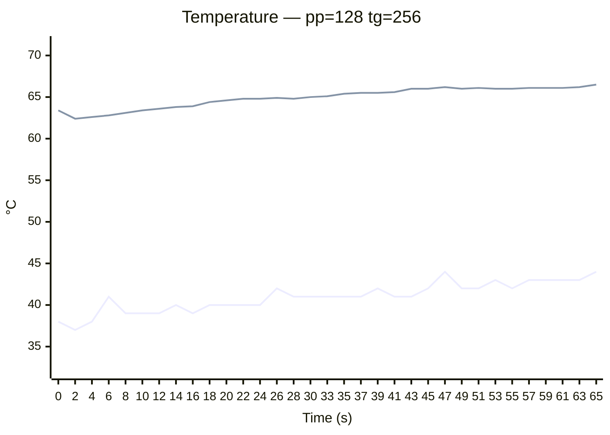
```mermaid
xychart-beta
  title "Temperature — pp=128 tg=256"
  x-axis "Time (s)" [0, 2, 4, 6, 8, 10, 12, 14, 16, 18, 20, 22, 24, 26, 28, 30, 33, 35, 37, 39, 41, 43, 45, 47, 49, 51, 53, 55, 57, 59, 61, 63, 65]
  y-axis "°C" 32 --> 71.5
  line "GPU °C" [38, 37, 38, 41, 39, 39, 39, 40, 39, 40, 40, 40, 40, 42, 41, 41, 41, 41, 41, 42, 41, 41, 42, 44, 42, 42, 43, 42, 43, 43, 43, 43, 44]
  line "CPU °C" [63.4, 62.4, 62.6, 62.8, 63.1, 63.4, 63.6, 63.8, 63.9, 64.4, 64.6, 64.8, 64.8, 64.9, 64.8, 65.0, 65.1, 65.4, 65.5, 65.5, 65.6, 66.0, 66.0, 66.2, 66.0, 66.1, 66.0, 66.0, 66.1, 66.1, 66.1, 66.2, 66.5]
```

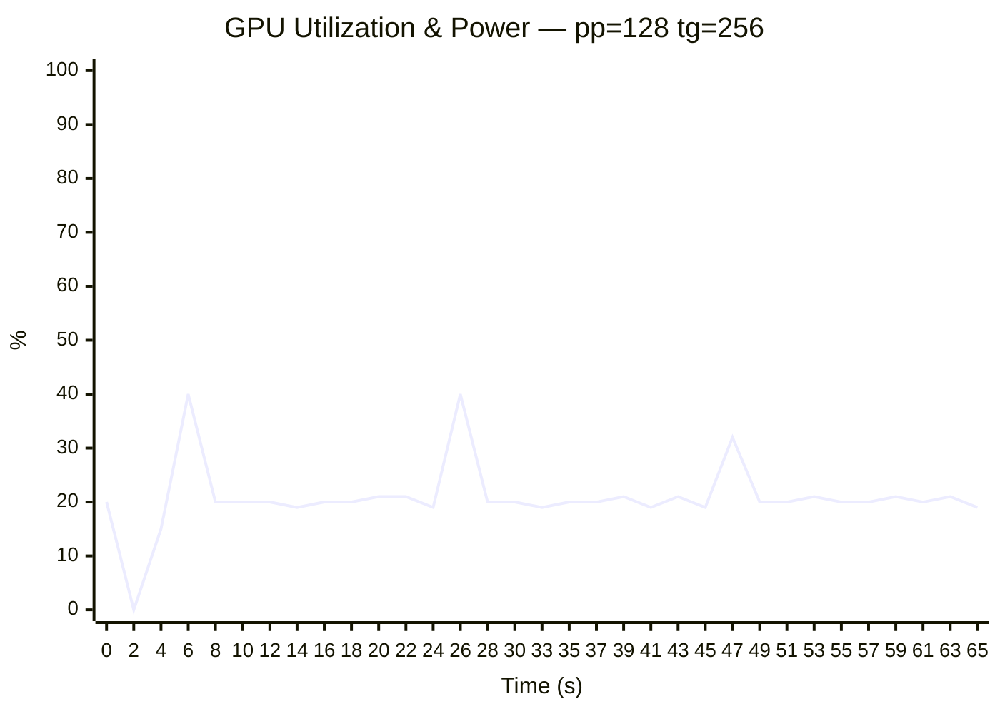
```mermaid
xychart-beta
  title "GPU Utilization & Power — pp=128 tg=256"
  x-axis "Time (s)" [0, 2, 4, 6, 8, 10, 12, 14, 16, 18, 20, 22, 24, 26, 28, 30, 33, 35, 37, 39, 41, 43, 45, 47, 49, 51, 53, 55, 57, 59, 61, 63, 65]
  y-axis "%" 0 --> 100
  line "GPU util %" [20, 0, 15, 40, 20, 20, 20, 19, 20, 20, 21, 21, 19, 40, 20, 20, 19, 20, 20, 21, 19, 21, 19, 32, 20, 20, 21, 20, 20, 21, 20, 21, 19]
```

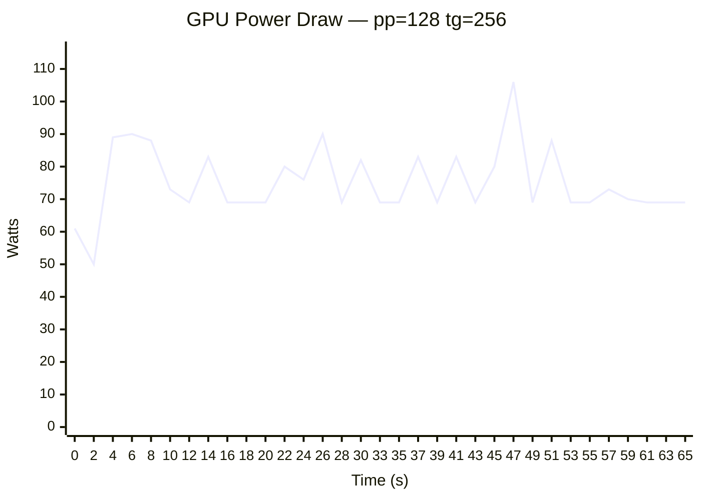
```mermaid
xychart-beta
  title "GPU Power Draw — pp=128 tg=256"
  x-axis "Time (s)" [0, 2, 4, 6, 8, 10, 12, 14, 16, 18, 20, 22, 24, 26, 28, 30, 33, 35, 37, 39, 41, 43, 45, 47, 49, 51, 53, 55, 57, 59, 61, 63, 65]
  y-axis "Watts" 0 --> 116
  line "Power (W)" [61, 50, 89, 90, 88, 73, 69, 83, 69, 69, 69, 80, 76, 90, 69, 82, 69, 69, 83, 69, 83, 69, 80, 106, 69, 88, 69, 69, 73, 70, 69, 69, 69]
```

Raw readings

| Time (s) | GPU °C | GPU util % | GPU W | CPU °C |
|---:|---:|---:|---:|---:|
| 0 | 38 | 20 | 60.83 | 63.4 |
| 2 | 37 | 0 | 49.58 | 62.4 |
| 4 | 38 | 15 | 88.6 | 62.6 |
| 6 | 41 | 40 | 89.92 | 62.8 |
| 8 | 39 | 20 | 88.11 | 63.1 |
| 10 | 39 | 20 | 72.82 | 63.4 |
| 12 | 39 | 20 | 68.79 | 63.6 |
| 14 | 40 | 19 | 82.63 | 63.8 |
| 16 | 39 | 20 | 68.9 | 63.9 |
| 18 | 40 | 20 | 69.05 | 64.4 |
| 20 | 40 | 21 | 69.04 | 64.6 |
| 22 | 40 | 21 | 79.64 | 64.8 |
| 24 | 40 | 19 | 75.92 | 64.8 |
| 26 | 42 | 40 | 89.85 | 64.9 |
| 28 | 41 | 20 | 68.94 | 64.8 |
| 30 | 41 | 20 | 82.44 | 65.0 |
| 33 | 41 | 19 | 68.95 | 65.1 |
| 35 | 41 | 20 | 69.03 | 65.4 |
| 37 | 41 | 20 | 83.13 | 65.5 |
| 39 | 42 | 21 | 69.19 | 65.5 |
| 41 | 41 | 19 | 83.24 | 65.6 |
| 43 | 41 | 21 | 69.28 | 66.0 |
| 45 | 42 | 19 | 80.39 | 66.0 |
| 47 | 44 | 32 | 106.44 | 66.2 |
| 49 | 42 | 20 | 69.1 | 66.0 |
| 51 | 42 | 20 | 88.4 | 66.1 |
| 53 | 43 | 21 | 69.24 | 66.0 |
| 55 | 42 | 20 | 69.25 | 66.0 |
| 57 | 43 | 20 | 72.65 | 66.1 |
| 59 | 43 | 21 | 70.47 | 66.1 |
| 61 | 43 | 20 | 69.25 | 66.1 |
| 63 | 43 | 21 | 69.37 | 66.2 |
| 65 | 44 | 19 | 69.36 | 66.5 |

---

## pp=512 tg=64

| model     |   test |            t/s |     peak t/s |     ttfr (ms) |   est_ppt (ms) |   e2e_ttft (ms) |
|:----------|-------:|---------------:|-------------:|--------------:|---------------:|----------------:|
| qwen3:14b |  pp512 | 709.30 ± 11.37 |              | 894.01 ± 5.12 |  657.43 ± 5.12 |   894.01 ± 5.12 |
| qwen3:14b |   tg64 |   12.48 ± 0.01 | 13.00 ± 0.00 |               |                |                 |

### Temperatures & Utilization

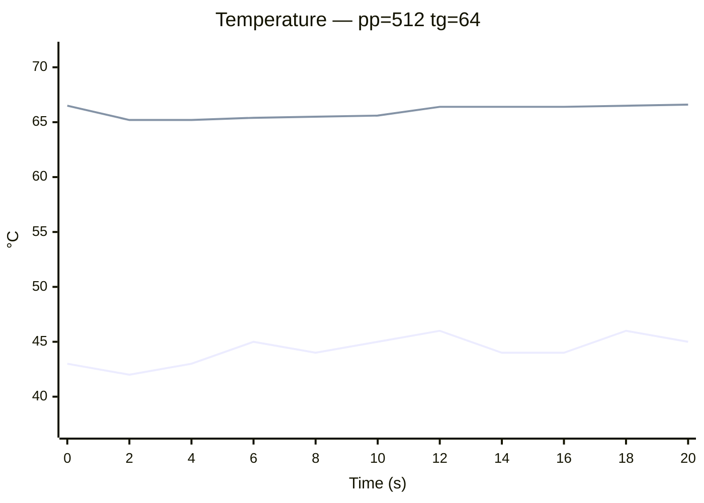
```mermaid
xychart-beta
  title "Temperature — pp=512 tg=64"
  x-axis "Time (s)" [0, 2, 4, 6, 8, 10, 12, 14, 16, 18, 20]
  y-axis "°C" 37 --> 71.6
  line "GPU °C" [43, 42, 43, 45, 44, 45, 46, 44, 44, 46, 45]
  line "CPU °C" [66.5, 65.2, 65.2, 65.4, 65.5, 65.6, 66.4, 66.4, 66.4, 66.5, 66.6]
```

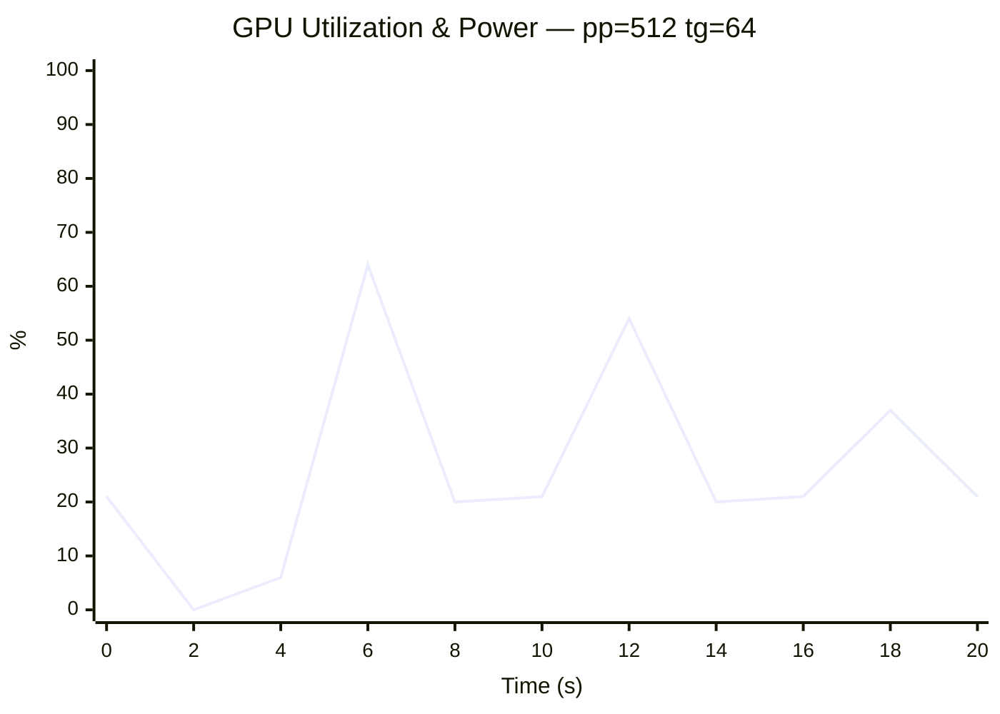
```mermaid
xychart-beta
  title "GPU Utilization & Power — pp=512 tg=64"
  x-axis "Time (s)" [0, 2, 4, 6, 8, 10, 12, 14, 16, 18, 20]
  y-axis "%" 0 --> 100
  line "GPU util %" [21, 0, 6, 64, 20, 21, 54, 20, 21, 37, 21]
```

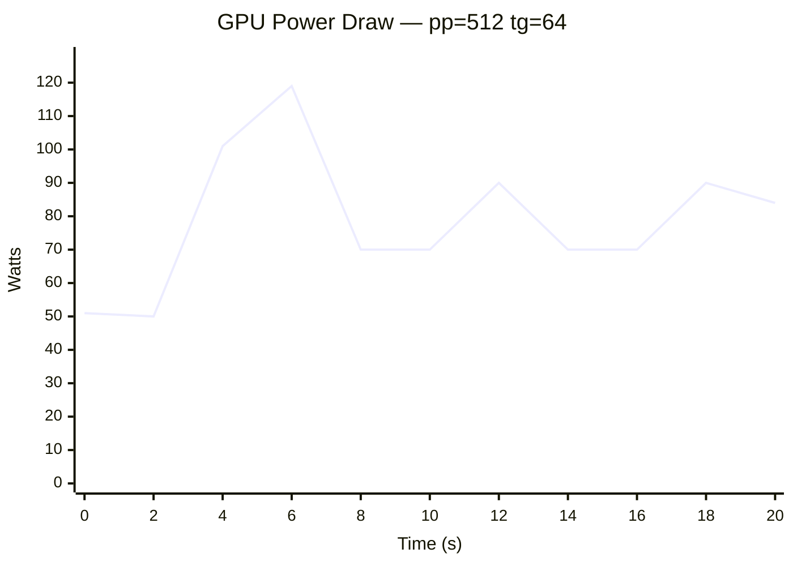
```mermaid
xychart-beta
  title "GPU Power Draw — pp=512 tg=64"
  x-axis "Time (s)" [0, 2, 4, 6, 8, 10, 12, 14, 16, 18, 20]
  y-axis "Watts" 0 --> 128
  line "Power (W)" [51, 50, 101, 119, 70, 70, 90, 70, 70, 90, 84]
```

Raw readings

| Time (s) | GPU °C | GPU util % | GPU W | CPU °C |
|---:|---:|---:|---:|---:|
| 0 | 43 | 21 | 51.48 | 66.5 |
| 2 | 42 | 0 | 50.03 | 65.2 |
| 4 | 43 | 6 | 101.49 | 65.2 |
| 6 | 45 | 64 | 118.57 | 65.4 |
| 8 | 44 | 20 | 70.11 | 65.5 |
| 10 | 45 | 21 | 70.13 | 65.6 |
| 12 | 46 | 54 | 90.18 | 66.4 |
| 14 | 44 | 20 | 70.1 | 66.4 |
| 16 | 44 | 21 | 70.37 | 66.4 |
| 18 | 46 | 37 | 90.34 | 66.5 |
| 20 | 45 | 21 | 84.38 | 66.6 |

---

## pp=512 tg=256

| model     |   test |           t/s |     peak t/s |     ttfr (ms) |   est_ppt (ms) |   e2e_ttft (ms) |
|:----------|-------:|--------------:|-------------:|--------------:|---------------:|----------------:|
| qwen3:14b |  pp512 | 710.88 ± 3.88 |              | 902.90 ± 3.49 |  665.85 ± 3.49 |   902.90 ± 3.49 |
| qwen3:14b |  tg256 |  12.38 ± 0.01 | 13.00 ± 0.00 |               |                |                 |

### Temperatures & Utilization

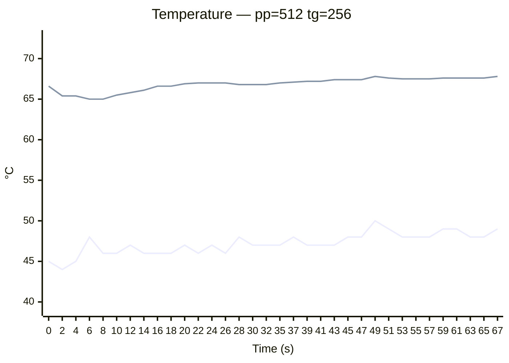
```mermaid
xychart-beta
  title "Temperature — pp=512 tg=256"
  x-axis "Time (s)" [0, 2, 4, 6, 8, 10, 12, 14, 16, 18, 20, 22, 24, 26, 28, 30, 32, 35, 37, 39, 41, 43, 45, 47, 49, 51, 53, 55, 57, 59, 61, 63, 65, 67]
  y-axis "°C" 39 --> 72.8
  line "GPU °C" [45, 44, 45, 48, 46, 46, 47, 46, 46, 46, 47, 46, 47, 46, 48, 47, 47, 47, 48, 47, 47, 47, 48, 48, 50, 49, 48, 48, 48, 49, 49, 48, 48, 49]
  line "CPU °C" [66.6, 65.4, 65.4, 65.0, 65.0, 65.5, 65.8, 66.1, 66.6, 66.6, 66.9, 67.0, 67.0, 67.0, 66.8, 66.8, 66.8, 67.0, 67.1, 67.2, 67.2, 67.4, 67.4, 67.4, 67.8, 67.6, 67.5, 67.5, 67.5, 67.6, 67.6, 67.6, 67.6, 67.8]
```

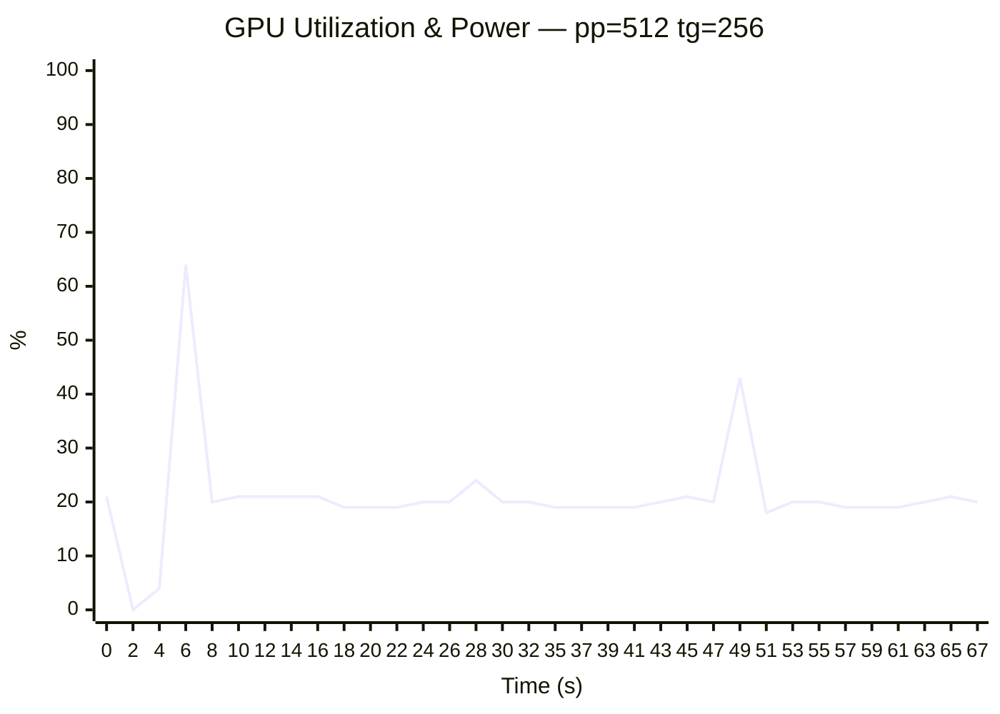
```mermaid
xychart-beta
  title "GPU Utilization & Power — pp=512 tg=256"
  x-axis "Time (s)" [0, 2, 4, 6, 8, 10, 12, 14, 16, 18, 20, 22, 24, 26, 28, 30, 32, 35, 37, 39, 41, 43, 45, 47, 49, 51, 53, 55, 57, 59, 61, 63, 65, 67]
  y-axis "%" 0 --> 100
  line "GPU util %" [21, 0, 4, 64, 20, 21, 21, 21, 21, 19, 19, 19, 20, 20, 24, 20, 20, 19, 19, 19, 19, 20, 21, 20, 43, 18, 20, 20, 19, 19, 19, 20, 21, 20]
```

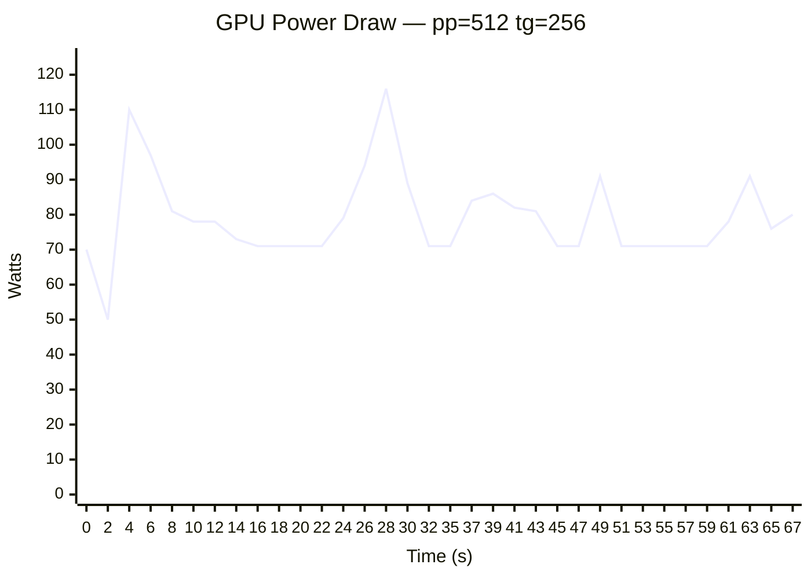
```mermaid
xychart-beta
  title "GPU Power Draw — pp=512 tg=256"
  x-axis "Time (s)" [0, 2, 4, 6, 8, 10, 12, 14, 16, 18, 20, 22, 24, 26, 28, 30, 32, 35, 37, 39, 41, 43, 45, 47, 49, 51, 53, 55, 57, 59, 61, 63, 65, 67]
  y-axis "Watts" 0 --> 125
  line "Power (W)" [70, 50, 110, 97, 81, 78, 78, 73, 71, 71, 71, 71, 79, 94, 116, 89, 71, 71, 84, 86, 82, 81, 71, 71, 91, 71, 71, 71, 71, 71, 78, 91, 76, 80]
```

Raw readings

| Time (s) | GPU °C | GPU util % | GPU W | CPU °C |
|---:|---:|---:|---:|---:|
| 0 | 45 | 21 | 70.24 | 66.6 |
| 2 | 44 | 0 | 50.17 | 65.4 |
| 4 | 45 | 4 | 110.02 | 65.4 |
| 6 | 48 | 64 | 96.66 | 65.0 |
| 8 | 46 | 20 | 80.84 | 65.0 |
| 10 | 46 | 21 | 78.34 | 65.5 |
| 12 | 47 | 21 | 78.49 | 65.8 |
| 14 | 46 | 21 | 73.28 | 66.1 |
| 16 | 46 | 21 | 70.65 | 66.6 |
| 18 | 46 | 19 | 70.66 | 66.6 |
| 20 | 47 | 19 | 70.57 | 66.9 |
| 22 | 46 | 19 | 70.58 | 67.0 |
| 24 | 47 | 20 | 78.51 | 67.0 |
| 26 | 46 | 20 | 93.8 | 67.0 |
| 28 | 48 | 24 | 115.5 | 66.8 |
| 30 | 47 | 20 | 89.05 | 66.8 |
| 32 | 47 | 20 | 70.61 | 66.8 |
| 35 | 47 | 19 | 70.93 | 67.0 |
| 37 | 48 | 19 | 84.29 | 67.1 |
| 39 | 47 | 19 | 86.18 | 67.2 |
| 41 | 47 | 19 | 81.67 | 67.2 |
| 43 | 47 | 20 | 81.25 | 67.4 |
| 45 | 48 | 21 | 70.71 | 67.4 |
| 47 | 48 | 20 | 70.84 | 67.4 |
| 49 | 50 | 43 | 90.88 | 67.8 |
| 51 | 49 | 18 | 70.64 | 67.6 |
| 53 | 48 | 20 | 70.63 | 67.5 |
| 55 | 48 | 20 | 70.69 | 67.5 |
| 57 | 48 | 19 | 70.85 | 67.5 |
| 59 | 49 | 19 | 70.94 | 67.6 |
| 61 | 49 | 19 | 77.53 | 67.6 |
| 63 | 48 | 20 | 91.16 | 67.6 |
| 65 | 48 | 21 | 75.54 | 67.6 |
| 67 | 49 | 20 | 79.77 | 67.8 |

---

## pp=2048 tg=64

| model     |   test |           t/s |     peak t/s |       ttfr (ms) |    est_ppt (ms) |   e2e_ttft (ms) |
|:----------|-------:|--------------:|-------------:|----------------:|----------------:|----------------:|
| qwen3:14b | pp2048 | 765.56 ± 9.85 |              | 2693.36 ± 44.93 | 2458.56 ± 44.93 | 2693.36 ± 44.93 |
| qwen3:14b |   tg64 |  11.46 ± 0.02 | 12.00 ± 0.00 |                 |                 |                 |

### Temperatures & Utilization

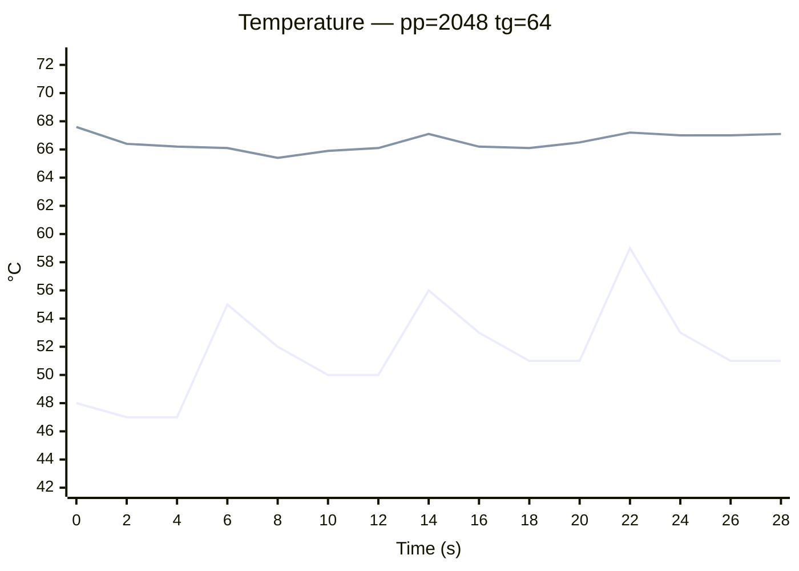
```mermaid
xychart-beta
  title "Temperature — pp=2048 tg=64"
  x-axis "Time (s)" [0, 2, 4, 6, 8, 10, 12, 14, 16, 18, 20, 22, 24, 26, 28]
  y-axis "°C" 42 --> 72.6
  line "GPU °C" [48, 47, 47, 55, 52, 50, 50, 56, 53, 51, 51, 59, 53, 51, 51]
  line "CPU °C" [67.6, 66.4, 66.2, 66.1, 65.4, 65.9, 66.1, 67.1, 66.2, 66.1, 66.5, 67.2, 67.0, 67.0, 67.1]
```

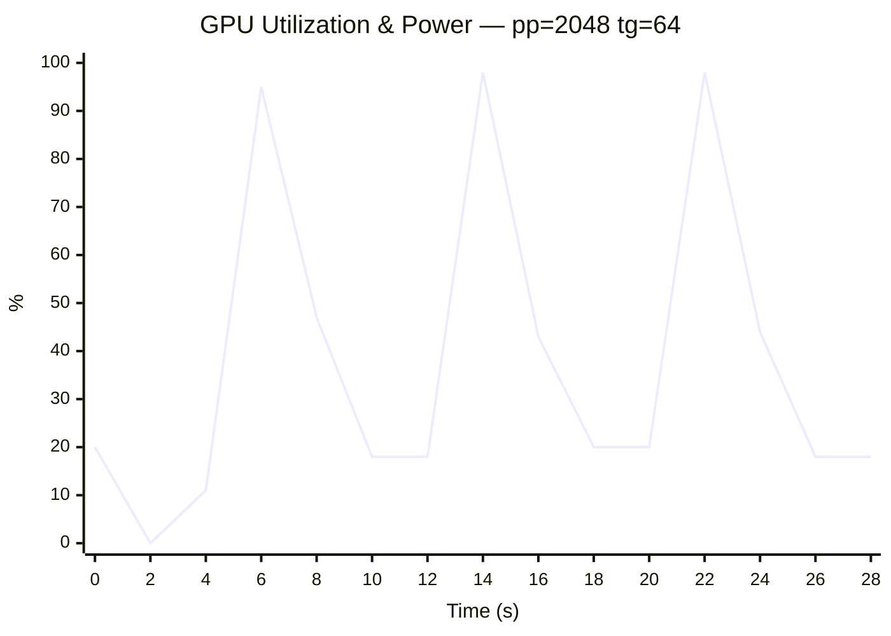
```mermaid
xychart-beta
  title "GPU Utilization & Power — pp=2048 tg=64"
  x-axis "Time (s)" [0, 2, 4, 6, 8, 10, 12, 14, 16, 18, 20, 22, 24, 26, 28]
  y-axis "%" 0 --> 100
  line "GPU util %" [20, 0, 11, 95, 47, 18, 18, 98, 43, 20, 20, 98, 44, 18, 18]
```

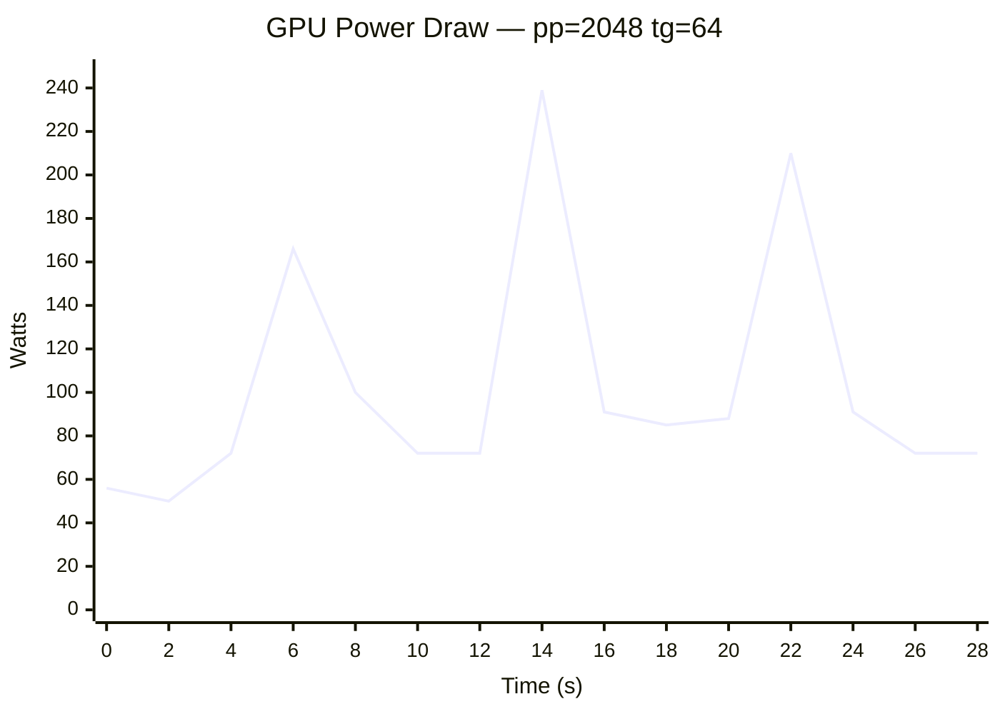
```mermaid
xychart-beta
  title "GPU Power Draw — pp=2048 tg=64"
  x-axis "Time (s)" [0, 2, 4, 6, 8, 10, 12, 14, 16, 18, 20, 22, 24, 26, 28]
  y-axis "Watts" 0 --> 248
  line "Power (W)" [56, 50, 72, 166, 100, 72, 72, 239, 91, 85, 88, 210, 91, 72, 72]
```

Raw readings

| Time (s) | GPU °C | GPU util % | GPU W | CPU °C |
|---:|---:|---:|---:|---:|
| 0 | 48 | 20 | 56.44 | 67.6 |
| 2 | 47 | 0 | 50.47 | 66.4 |
| 4 | 47 | 11 | 71.59 | 66.2 |
| 6 | 55 | 95 | 165.6 | 66.1 |
| 8 | 52 | 47 | 99.68 | 65.4 |
| 10 | 50 | 18 | 71.87 | 65.9 |
| 12 | 50 | 18 | 71.75 | 66.1 |
| 14 | 56 | 98 | 238.73 | 67.1 |
| 16 | 53 | 43 | 91.1 | 66.2 |
| 18 | 51 | 20 | 85.24 | 66.1 |
| 20 | 51 | 20 | 88.0 | 66.5 |
| 22 | 59 | 98 | 210.06 | 67.2 |
| 24 | 53 | 44 | 90.83 | 67.0 |
| 26 | 51 | 18 | 72.15 | 67.0 |
| 28 | 51 | 18 | 72.23 | 67.1 |

---

## pp=2048 tg=256

| model     |   test |            t/s |     peak t/s |        ttfr (ms) |     est_ppt (ms) |    e2e_ttft (ms) |
|:----------|-------:|---------------:|-------------:|-----------------:|-----------------:|-----------------:|
| qwen3:14b | pp2048 | 778.35 ± 25.69 |              | 2602.01 ± 137.51 | 2361.35 ± 137.51 | 2602.01 ± 137.51 |
| qwen3:14b |  tg256 |   11.42 ± 0.05 | 12.00 ± 0.00 |                  |                  |                  |

### Temperatures & Utilization

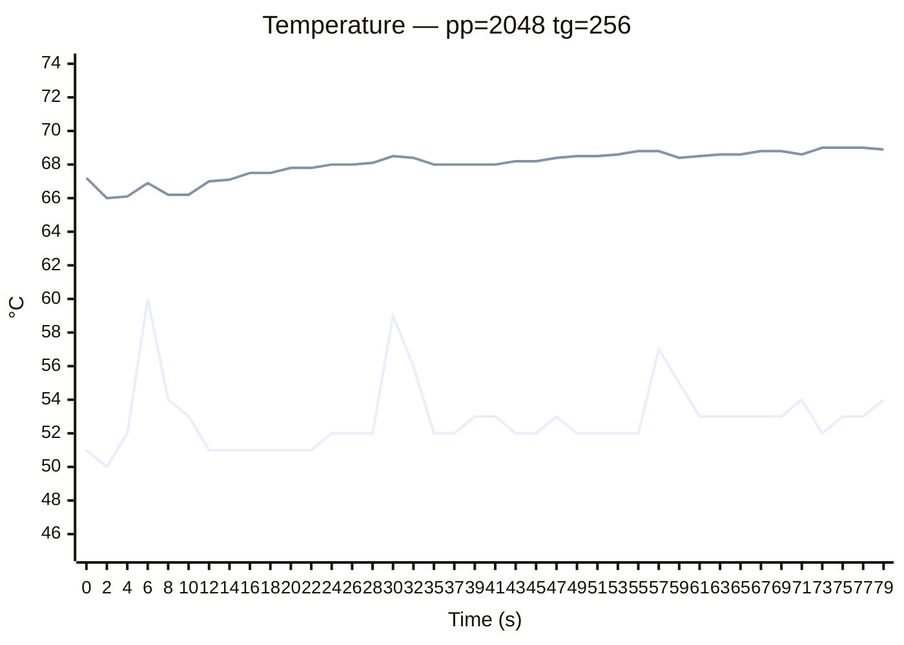
```mermaid
xychart-beta
  title "Temperature — pp=2048 tg=256"
  x-axis "Time (s)" [0, 2, 4, 6, 8, 10, 12, 14, 16, 18, 20, 22, 24, 26, 28, 30, 32, 35, 37, 39, 41, 43, 45, 47, 49, 51, 53, 55, 57, 59, 61, 63, 65, 67, 69, 71, 73, 75, 77, 79]
  y-axis "°C" 45 --> 74.0
  line "GPU °C" [51, 50, 52, 60, 54, 53, 51, 51, 51, 51, 51, 51, 52, 52, 52, 59, 56, 52, 52, 53, 53, 52, 52, 53, 52, 52, 52, 52, 57, 55, 53, 53, 53, 53, 53, 54, 52, 53, 53, 54]
  line "CPU °C" [67.2, 66.0, 66.1, 66.9, 66.2, 66.2, 67.0, 67.1, 67.5, 67.5, 67.8, 67.8, 68.0, 68.0, 68.1, 68.5, 68.4, 68.0, 68.0, 68.0, 68.0, 68.2, 68.2, 68.4, 68.5, 68.5, 68.6, 68.8, 68.8, 68.4, 68.5, 68.6, 68.6, 68.8, 68.8, 68.6, 69.0, 69.0, 69.0, 68.9]
```

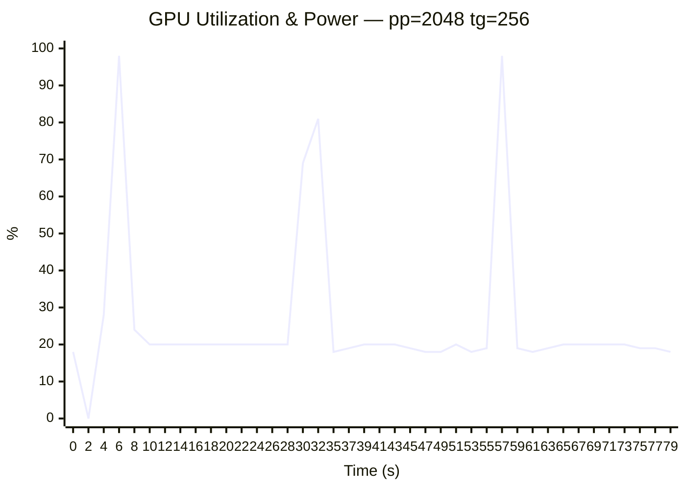
```mermaid
xychart-beta
  title "GPU Utilization & Power — pp=2048 tg=256"
  x-axis "Time (s)" [0, 2, 4, 6, 8, 10, 12, 14, 16, 18, 20, 22, 24, 26, 28, 30, 32, 35, 37, 39, 41, 43, 45, 47, 49, 51, 53, 55, 57, 59, 61, 63, 65, 67, 69, 71, 73, 75, 77, 79]
  y-axis "%" 0 --> 100
  line "GPU util %" [18, 0, 28, 98, 24, 20, 20, 20, 20, 20, 20, 20, 20, 20, 20, 69, 81, 18, 19, 20, 20, 20, 19, 18, 18, 20, 18, 19, 98, 19, 18, 19, 20, 20, 20, 20, 20, 19, 19, 18]
```

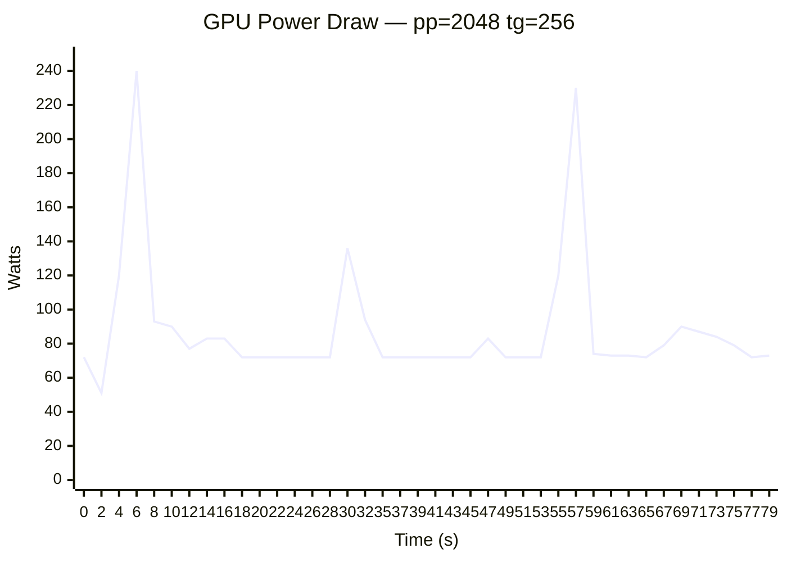
```mermaid
xychart-beta
  title "GPU Power Draw — pp=2048 tg=256"
  x-axis "Time (s)" [0, 2, 4, 6, 8, 10, 12, 14, 16, 18, 20, 22, 24, 26, 28, 30, 32, 35, 37, 39, 41, 43, 45, 47, 49, 51, 53, 55, 57, 59, 61, 63, 65, 67, 69, 71, 73, 75, 77, 79]
  y-axis "Watts" 0 --> 249
  line "Power (W)" [72, 51, 120, 240, 93, 90, 77, 83, 83, 72, 72, 72, 72, 72, 72, 136, 94, 72, 72, 72, 72, 72, 72, 83, 72, 72, 72, 120, 230, 74, 73, 73, 72, 79, 90, 87, 84, 79, 72, 73]
```

Raw readings

| Time (s) | GPU °C | GPU util % | GPU W | CPU °C |
|---:|---:|---:|---:|---:|
| 0 | 51 | 18 | 72.04 | 67.2 |
| 2 | 50 | 0 | 50.76 | 66.0 |
| 4 | 52 | 28 | 119.79 | 66.1 |
| 6 | 60 | 98 | 239.57 | 66.9 |
| 8 | 54 | 24 | 93.32 | 66.2 |
| 10 | 53 | 20 | 89.81 | 66.2 |
| 12 | 51 | 20 | 77.03 | 67.0 |
| 14 | 51 | 20 | 83.05 | 67.1 |
| 16 | 51 | 20 | 83.11 | 67.5 |
| 18 | 51 | 20 | 71.91 | 67.5 |
| 20 | 51 | 20 | 72.04 | 67.8 |
| 22 | 51 | 20 | 72.11 | 67.8 |
| 24 | 52 | 20 | 72.14 | 68.0 |
| 26 | 52 | 20 | 72.01 | 68.0 |
| 28 | 52 | 20 | 72.04 | 68.1 |
| 30 | 59 | 69 | 135.79 | 68.5 |
| 32 | 56 | 81 | 94.47 | 68.4 |
| 35 | 52 | 18 | 72.12 | 68.0 |
| 37 | 52 | 19 | 72.12 | 68.0 |
| 39 | 53 | 20 | 72.25 | 68.0 |
| 41 | 53 | 20 | 72.19 | 68.0 |
| 43 | 52 | 20 | 72.23 | 68.2 |
| 45 | 52 | 19 | 72.17 | 68.2 |
| 47 | 53 | 18 | 83.27 | 68.4 |
| 49 | 52 | 18 | 72.16 | 68.5 |
| 51 | 52 | 20 | 72.33 | 68.5 |
| 53 | 52 | 18 | 72.43 | 68.6 |
| 55 | 52 | 19 | 120.38 | 68.8 |
| 57 | 57 | 98 | 230.24 | 68.8 |
| 59 | 55 | 19 | 73.65 | 68.4 |
| 61 | 53 | 18 | 72.78 | 68.5 |
| 63 | 53 | 19 | 72.88 | 68.6 |
| 65 | 53 | 20 | 72.5 | 68.6 |
| 67 | 53 | 20 | 78.68 | 68.8 |
| 69 | 53 | 20 | 90.07 | 68.8 |
| 71 | 54 | 20 | 87.09 | 68.6 |
| 73 | 52 | 20 | 84.42 | 69.0 |
| 75 | 53 | 19 | 78.98 | 69.0 |
| 77 | 53 | 19 | 72.4 | 69.0 |
| 79 | 54 | 18 | 72.76 | 68.9 |

---

# Benchmark Report: deepseek-r1:14b

**Date:** 2026-04-10 15:58  
**Target machine:** stealth — RTX 2080 SUPER 8GB VRAM, Ryzen 7 3700X, 32GB RAM  
**Endpoint:** http://100.118.160.122:11434/v1  
**Tested from:** stealth (AMD) — local  
**Runs per test:** 3  

---

## Summary

| pp | tg | Duration (s) | GPU peak °C | CPU peak °C |
|---:|---:|---:|---:|---:|
| 128 | 64 | 42 | 41 | 63.9 |
| 128 | 256 | 76 | 46 | 68.5 |
| 512 | 64 | 25 | 48 | 67.9 |
| 512 | 256 | 79 | 51 | 68.6 |
| 2048 | 64 | 33 | 56 | 68.9 |
| 2048 | 256 | 93 | 57 | 69.8 |

---

## pp=128 tg=64

| model           |   test |            t/s |     peak t/s |     ttfr (ms) |   est_ppt (ms) |   e2e_ttft (ms) |
|:----------------|-------:|---------------:|-------------:|--------------:|---------------:|----------------:|
| deepseek-r1:14b |  pp128 | 247.68 ± 12.80 |              | 644.57 ± 7.71 |  431.72 ± 7.71 |   644.57 ± 7.71 |
| deepseek-r1:14b |   tg64 |   11.05 ± 0.01 | 12.00 ± 0.00 |               |                |                 |

### Temperatures & Utilization

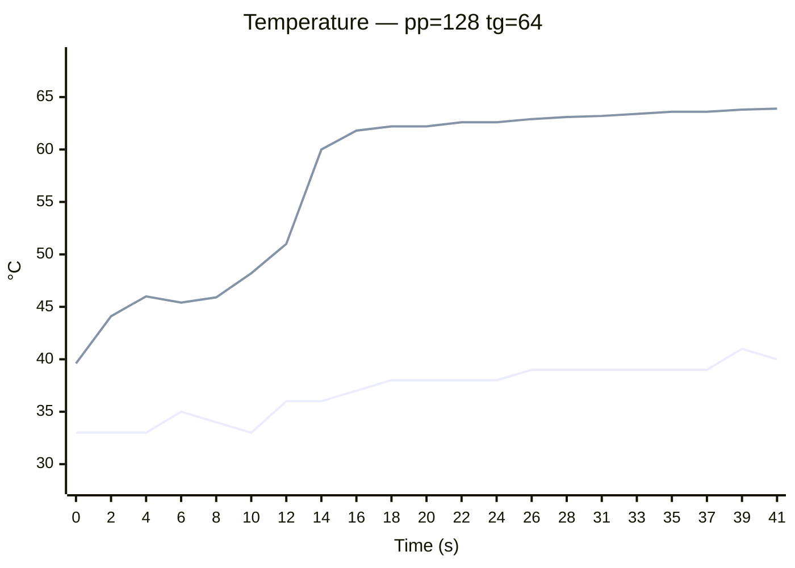
```mermaid
xychart-beta
  title "Temperature — pp=128 tg=64"
  x-axis "Time (s)" [0, 2, 4, 6, 8, 10, 12, 14, 16, 18, 20, 22, 24, 26, 28, 31, 33, 35, 37, 39, 41]
  y-axis "°C" 28 --> 68.9
  line "GPU °C" [33, 33, 33, 35, 34, 33, 36, 36, 37, 38, 38, 38, 38, 39, 39, 39, 39, 39, 39, 41, 40]
  line "CPU °C" [39.6, 44.1, 46.0, 45.4, 45.9, 48.2, 51.0, 60.0, 61.8, 62.2, 62.2, 62.6, 62.6, 62.9, 63.1, 63.2, 63.4, 63.6, 63.6, 63.8, 63.9]
```

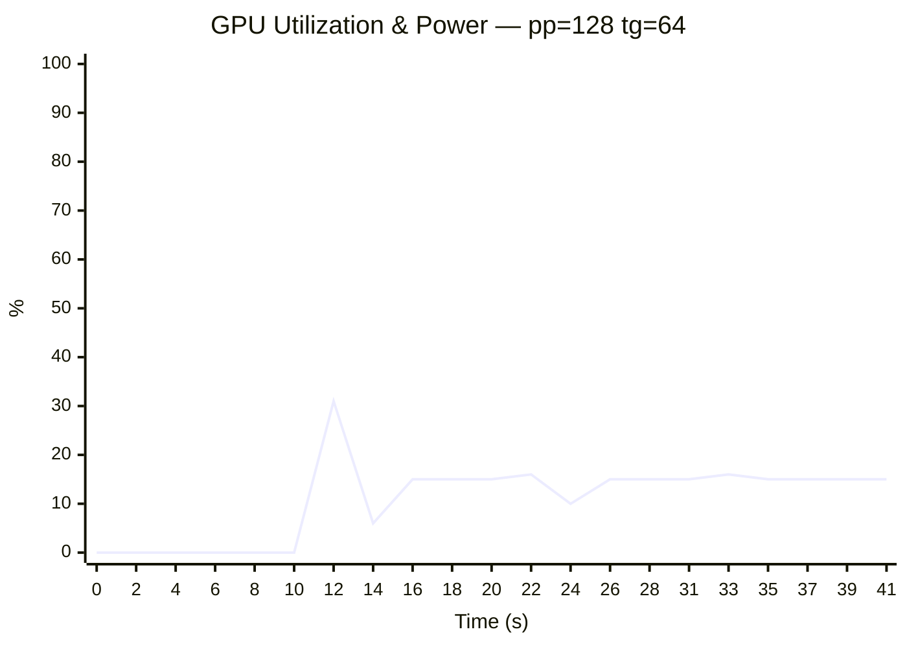
```mermaid
xychart-beta
  title "GPU Utilization & Power — pp=128 tg=64"
  x-axis "Time (s)" [0, 2, 4, 6, 8, 10, 12, 14, 16, 18, 20, 22, 24, 26, 28, 31, 33, 35, 37, 39, 41]
  y-axis "%" 0 --> 100
  line "GPU util %" [0, 0, 0, 0, 0, 0, 31, 6, 15, 15, 15, 16, 10, 15, 15, 15, 16, 15, 15, 15, 15]
```

```mermaid
xychart-beta
  title "GPU Power Draw — pp=128 tg=64"
  x-axis "Time (s)" [0, 2, 4, 6, 8, 10, 12, 14, 16, 18, 20, 22, 24, 26, 28, 31, 33, 35, 37, 39, 41]
  y-axis "Watts" 0 --> 185
  line "Power (W)" [19, 18, 18, 49, 18, 19, 60, 49, 66, 66, 66, 66, 175, 66, 66, 146, 67, 67, 109, 66, 75]
```

Raw readings

| Time (s) | GPU °C | GPU util % | GPU W | CPU °C |
|---:|---:|---:|---:|---:|
| 0 | 33 | 0 | 18.97 | 39.6 |
| 2 | 33 | 0 | 18.5 | 44.1 |
| 4 | 33 | 0 | 18.49 | 46.0 |
| 6 | 35 | 0 | 49.38 | 45.4 |
| 8 | 34 | 0 | 18.42 | 45.9 |
| 10 | 33 | 0 | 18.53 | 48.2 |
| 12 | 36 | 31 | 59.85 | 51.0 |
| 14 | 36 | 6 | 49.42 | 60.0 |
| 16 | 37 | 15 | 66.34 | 61.8 |
| 18 | 38 | 15 | 66.44 | 62.2 |
| 20 | 38 | 15 | 66.43 | 62.2 |
| 22 | 38 | 16 | 66.37 | 62.6 |
| 24 | 38 | 10 | 175.3 | 62.6 |
| 26 | 39 | 15 | 66.35 | 62.9 |
| 28 | 39 | 15 | 66.27 | 63.1 |
| 31 | 39 | 15 | 146.12 | 63.2 |
| 33 | 39 | 16 | 66.52 | 63.4 |
| 35 | 39 | 15 | 66.62 | 63.6 |
| 37 | 39 | 15 | 109.17 | 63.6 |
| 39 | 41 | 15 | 65.96 | 63.8 |
| 41 | 40 | 15 | 75.37 | 63.9 |

---

## pp=128 tg=256

| model           |   test |           t/s |     peak t/s |      ttfr (ms) |   est_ppt (ms) |   e2e_ttft (ms) |
|:----------------|-------:|--------------:|-------------:|---------------:|---------------:|----------------:|
| deepseek-r1:14b |  pp128 | 261.50 ± 3.37 |              | 645.76 ± 12.43 | 430.87 ± 12.43 |  645.76 ± 12.43 |
| deepseek-r1:14b |  tg256 |  10.95 ± 0.02 | 12.00 ± 0.00 |                |                |                 |

### Temperatures & Utilization

```mermaid
xychart-beta
  title "Temperature — pp=128 tg=256"
  x-axis "Time (s)" [0, 2, 4, 6, 8, 10, 12, 14, 16, 18, 20, 22, 24, 26, 28, 30, 33, 35, 37, 39, 41, 43, 45, 47, 49, 51, 53, 55, 57, 59, 61, 63, 65, 67, 69, 71, 73, 75]
  y-axis "°C" 34 --> 73.5
  line "GPU °C" [40, 39, 41, 41, 40, 40, 40, 41, 41, 41, 41, 41, 41, 42, 42, 43, 42, 43, 43, 43, 43, 43, 43, 43, 43, 44, 43, 46, 44, 45, 44, 44, 44, 44, 44, 44, 44, 45]
  line "CPU °C" [64.1, 62.9, 63.1, 64.2, 64.0, 64.2, 64.5, 64.6, 64.9, 65.0, 65.0, 65.4, 65.6, 65.9, 66.0, 66.0, 66.0, 66.5, 66.4, 66.2, 66.2, 66.5, 66.6, 66.6, 66.8, 66.6, 66.8, 66.6, 66.8, 66.9, 67.0, 68.5, 68.2, 68.1, 67.8, 67.6, 67.5, 67.6]
```

```mermaid
xychart-beta
  title "GPU Utilization & Power — pp=128 tg=256"
  x-axis "Time (s)" [0, 2, 4, 6, 8, 10, 12, 14, 16, 18, 20, 22, 24, 26, 28, 30, 33, 35, 37, 39, 41, 43, 45, 47, 49, 51, 53, 55, 57, 59, 61, 63, 65, 67, 69, 71, 73, 75]
  y-axis "%" 0 --> 100
  line "GPU util %" [15, 0, 0, 27, 15, 15, 15, 15, 15, 15, 16, 15, 15, 15, 16, 39, 15, 16, 16, 15, 16, 15, 15, 16, 16, 16, 14, 15, 15, 15, 15, 15, 15, 15, 16, 16, 16, 16]
```

```mermaid
xychart-beta
  title "GPU Power Draw — pp=128 tg=256"
  x-axis "Time (s)" [0, 2, 4, 6, 8, 10, 12, 14, 16, 18, 20, 22, 24, 26, 28, 30, 33, 35, 37, 39, 41, 43, 45, 47, 49, 51, 53, 55, 57, 59, 61, 63, 65, 67, 69, 71, 73, 75]
  y-axis "Watts" 0 --> 109
  line "Power (W)" [67, 50, 50, 86, 67, 67, 67, 76, 71, 68, 67, 67, 71, 79, 77, 86, 67, 67, 67, 67, 67, 67, 67, 67, 67, 67, 57, 100, 67, 67, 67, 67, 67, 67, 67, 67, 67, 67]
```

Raw readings

| Time (s) | GPU °C | GPU util % | GPU W | CPU °C |
|---:|---:|---:|---:|---:|
| 0 | 40 | 15 | 66.62 | 64.1 |
| 2 | 39 | 0 | 49.64 | 62.9 |
| 4 | 41 | 0 | 49.58 | 63.1 |
| 6 | 41 | 27 | 85.59 | 64.2 |
| 8 | 40 | 15 | 66.8 | 64.0 |
| 10 | 40 | 15 | 66.67 | 64.2 |
| 12 | 40 | 15 | 66.99 | 64.5 |
| 14 | 41 | 15 | 76.26 | 64.6 |
| 16 | 41 | 15 | 71.17 | 64.9 |
| 18 | 41 | 15 | 67.55 | 65.0 |
| 20 | 41 | 16 | 67.24 | 65.0 |
| 22 | 41 | 15 | 67.2 | 65.4 |
| 24 | 41 | 15 | 70.95 | 65.6 |
| 26 | 42 | 15 | 79.0 | 65.9 |
| 28 | 42 | 16 | 76.93 | 66.0 |
| 30 | 43 | 39 | 86.03 | 66.0 |
| 33 | 42 | 15 | 66.82 | 66.0 |
| 35 | 43 | 16 | 66.9 | 66.5 |
| 37 | 43 | 16 | 67.04 | 66.4 |
| 39 | 43 | 15 | 67.04 | 66.2 |
| 41 | 43 | 16 | 67.14 | 66.2 |
| 43 | 43 | 15 | 67.06 | 66.5 |
| 45 | 43 | 15 | 67.13 | 66.6 |
| 47 | 43 | 16 | 67.06 | 66.6 |
| 49 | 43 | 16 | 67.28 | 66.8 |
| 51 | 44 | 16 | 67.25 | 66.6 |
| 53 | 43 | 14 | 56.51 | 66.8 |
| 55 | 46 | 15 | 99.9 | 66.6 |
| 57 | 44 | 15 | 67.17 | 66.8 |
| 59 | 45 | 15 | 67.14 | 66.9 |
| 61 | 44 | 15 | 67.08 | 67.0 |
| 63 | 44 | 15 | 67.0 | 68.5 |
| 65 | 44 | 15 | 67.0 | 68.2 |
| 67 | 44 | 15 | 67.14 | 68.1 |
| 69 | 44 | 16 | 67.01 | 67.8 |
| 71 | 44 | 16 | 67.39 | 67.6 |
| 73 | 44 | 16 | 67.11 | 67.5 |
| 75 | 45 | 16 | 67.34 | 67.6 |

---

## pp=512 tg=64

| model           |   test |           t/s |     peak t/s |      ttfr (ms) |   est_ppt (ms) |   e2e_ttft (ms) |
|:----------------|-------:|--------------:|-------------:|---------------:|---------------:|----------------:|
| deepseek-r1:14b |  pp512 | 599.88 ± 1.53 |              | 967.11 ± 17.47 | 755.18 ± 17.47 |  967.11 ± 17.47 |
| deepseek-r1:14b |   tg64 |  10.76 ± 0.02 | 11.00 ± 0.00 |                |                |                 |

### Temperatures & Utilization

```mermaid
xychart-beta
  title "Temperature — pp=512 tg=64"
  x-axis "Time (s)" [0, 2, 4, 6, 8, 10, 12, 14, 16, 18, 20, 22, 24]
  y-axis "°C" 39 --> 72.9
  line "GPU °C" [44, 44, 44, 46, 45, 45, 48, 47, 47, 46, 48, 46, 46]
  line "CPU °C" [67.8, 66.4, 67.5, 67.4, 67.2, 67.1, 67.2, 67.1, 67.2, 67.8, 67.9, 67.8, 67.5]
```

```mermaid
xychart-beta
  title "GPU Utilization & Power — pp=512 tg=64"
  x-axis "Time (s)" [0, 2, 4, 6, 8, 10, 12, 14, 16, 18, 20, 22, 24]
  y-axis "%" 0 --> 100
  line "GPU util %" [15, 0, 0, 38, 14, 16, 15, 15, 15, 15, 55, 15, 14]
```

```mermaid
xychart-beta
  title "GPU Power Draw — pp=512 tg=64"
  x-axis "Time (s)" [0, 2, 4, 6, 8, 10, 12, 14, 16, 18, 20, 22, 24]
  y-axis "Watts" 0 --> 244
  line "Power (W)" [67, 50, 50, 87, 67, 67, 234, 79, 68, 68, 100, 68, 68]
```

Raw readings

| Time (s) | GPU °C | GPU util % | GPU W | CPU °C |
|---:|---:|---:|---:|---:|
| 0 | 44 | 15 | 67.15 | 67.8 |
| 2 | 44 | 0 | 49.95 | 66.4 |
| 4 | 44 | 0 | 50.25 | 67.5 |
| 6 | 46 | 38 | 87.12 | 67.4 |
| 8 | 45 | 14 | 67.49 | 67.2 |
| 10 | 45 | 16 | 67.41 | 67.1 |
| 12 | 48 | 15 | 234.25 | 67.2 |
| 14 | 47 | 15 | 79.31 | 67.1 |
| 16 | 47 | 15 | 67.85 | 67.2 |
| 18 | 46 | 15 | 67.75 | 67.8 |
| 20 | 48 | 55 | 100.0 | 67.9 |
| 22 | 46 | 15 | 67.99 | 67.8 |
| 24 | 46 | 14 | 68.07 | 67.5 |

---

## pp=512 tg=256

| model           |   test |            t/s |     peak t/s |      ttfr (ms) |   est_ppt (ms) |   e2e_ttft (ms) |
|:----------------|-------:|---------------:|-------------:|---------------:|---------------:|----------------:|
| deepseek-r1:14b |  pp512 | 615.63 ± 16.21 |              | 965.60 ± 23.85 | 754.84 ± 23.85 |  965.60 ± 23.85 |
| deepseek-r1:14b |  tg256 |   10.62 ± 0.01 | 11.00 ± 0.00 |                |                |                 |

### Temperatures & Utilization

```mermaid
xychart-beta
  title "Temperature — pp=512 tg=256"
  x-axis "Time (s)" [0, 2, 4, 6, 8, 10, 12, 14, 16, 18, 20, 22, 24, 26, 28, 30, 33, 35, 37, 39, 41, 43, 45, 47, 49, 51, 53, 55, 57, 59, 61, 63, 65, 67, 69, 71, 73, 75, 77]
  y-axis "°C" 40 --> 73.6
  line "GPU °C" [46, 45, 45, 48, 47, 47, 46, 47, 47, 47, 48, 47, 47, 47, 47, 51, 48, 48, 48, 48, 48, 49, 48, 48, 49, 48, 48, 49, 49, 49, 49, 50, 49, 49, 49, 49, 50, 49, 49]
  line "CPU °C" [67.4, 66.1, 67.6, 67.2, 67.0, 67.1, 67.1, 67.2, 67.1, 67.1, 67.1, 67.2, 67.5, 67.5, 67.5, 68.0, 67.6, 67.6, 67.8, 67.8, 67.9, 67.9, 68.0, 68.2, 68.4, 68.5, 68.6, 68.4, 68.1, 68.1, 68.1, 68.2, 68.1, 68.1, 68.1, 68.1, 68.0, 68.1, 68.4]
```

```mermaid
xychart-beta
  title "GPU Utilization & Power — pp=512 tg=256"
  x-axis "Time (s)" [0, 2, 4, 6, 8, 10, 12, 14, 16, 18, 20, 22, 24, 26, 28, 30, 33, 35, 37, 39, 41, 43, 45, 47, 49, 51, 53, 55, 57, 59, 61, 63, 65, 67, 69, 71, 73, 75, 77]
  y-axis "%" 0 --> 100
  line "GPU util %" [15, 0, 0, 61, 15, 16, 15, 16, 14, 16, 16, 14, 16, 16, 16, 14, 15, 15, 16, 16, 15, 16, 14, 15, 16, 14, 15, 50, 15, 14, 16, 14, 16, 15, 15, 16, 16, 14, 14]
```

```mermaid
xychart-beta
  title "GPU Power Draw — pp=512 tg=256"
  x-axis "Time (s)" [0, 2, 4, 6, 8, 10, 12, 14, 16, 18, 20, 22, 24, 26, 28, 30, 33, 35, 37, 39, 41, 43, 45, 47, 49, 51, 53, 55, 57, 59, 61, 63, 65, 67, 69, 71, 73, 75, 77]
  y-axis "Watts" 0 --> 244
  line "Power (W)" [68, 50, 50, 88, 68, 68, 69, 69, 74, 68, 68, 68, 68, 69, 68, 88, 68, 68, 79, 68, 68, 68, 68, 68, 68, 68, 68, 235, 88, 69, 68, 69, 68, 69, 77, 68, 68, 69, 72]
```

Raw readings

| Time (s) | GPU °C | GPU util % | GPU W | CPU °C |
|---:|---:|---:|---:|---:|
| 0 | 46 | 15 | 67.86 | 67.4 |
| 2 | 45 | 0 | 50.21 | 66.1 |
| 4 | 45 | 0 | 50.39 | 67.6 |
| 6 | 48 | 61 | 87.67 | 67.2 |
| 8 | 47 | 15 | 68.22 | 67.0 |
| 10 | 47 | 16 | 68.37 | 67.1 |
| 12 | 46 | 15 | 68.93 | 67.1 |
| 14 | 47 | 16 | 68.55 | 67.2 |
| 16 | 47 | 14 | 73.97 | 67.1 |
| 18 | 47 | 16 | 68.32 | 67.1 |
| 20 | 48 | 16 | 68.49 | 67.1 |
| 22 | 47 | 14 | 68.26 | 67.2 |
| 24 | 47 | 16 | 68.46 | 67.5 |
| 26 | 47 | 16 | 68.57 | 67.5 |
| 28 | 47 | 16 | 68.43 | 67.5 |
| 30 | 51 | 14 | 87.52 | 68.0 |
| 33 | 48 | 15 | 68.31 | 67.6 |
| 35 | 48 | 15 | 68.31 | 67.6 |
| 37 | 48 | 16 | 78.58 | 67.8 |
| 39 | 48 | 16 | 68.41 | 67.8 |
| 41 | 48 | 15 | 68.45 | 67.9 |
| 43 | 49 | 16 | 68.21 | 67.9 |
| 45 | 48 | 14 | 68.35 | 68.0 |
| 47 | 48 | 15 | 68.41 | 68.2 |
| 49 | 49 | 16 | 68.26 | 68.4 |
| 51 | 48 | 14 | 68.4 | 68.5 |
| 53 | 48 | 15 | 68.49 | 68.6 |
| 55 | 49 | 50 | 234.84 | 68.4 |
| 57 | 49 | 15 | 88.22 | 68.1 |
| 59 | 49 | 14 | 68.77 | 68.1 |
| 61 | 49 | 16 | 68.5 | 68.1 |
| 63 | 50 | 14 | 68.52 | 68.2 |
| 65 | 49 | 16 | 68.43 | 68.1 |
| 67 | 49 | 15 | 68.53 | 68.1 |
| 69 | 49 | 15 | 76.89 | 68.1 |
| 71 | 49 | 16 | 68.47 | 68.1 |
| 73 | 50 | 16 | 68.43 | 68.0 |
| 75 | 49 | 14 | 68.56 | 68.1 |
| 77 | 49 | 14 | 71.93 | 68.4 |

---

## pp=2048 tg=64

| model           |   test |           t/s |     peak t/s |       ttfr (ms) |    est_ppt (ms) |   e2e_ttft (ms) |
|:----------------|-------:|--------------:|-------------:|----------------:|----------------:|----------------:|
| deepseek-r1:14b | pp2048 | 670.94 ± 8.22 |              | 2933.09 ± 59.35 | 2724.83 ± 59.35 | 2933.09 ± 59.35 |
| deepseek-r1:14b |   tg64 |   9.72 ± 0.04 | 10.00 ± 0.00 |                 |                 |                 |

### Temperatures & Utilization

```mermaid
xychart-beta
  title "Temperature — pp=2048 tg=64"
  x-axis "Time (s)" [0, 2, 4, 6, 8, 10, 12, 14, 16, 18, 20, 22, 24, 26, 28, 30, 32]
  y-axis "°C" 43 --> 73.9
  line "GPU °C" [49, 48, 48, 54, 52, 51, 50, 50, 55, 54, 51, 50, 56, 53, 52, 51, 51]
  line "CPU °C" [68.4, 67.1, 68.9, 68.4, 67.4, 67.5, 67.6, 67.9, 68.5, 68.2, 68.2, 68.1, 68.5, 68.5, 68.4, 68.4, 68.4]
```

```mermaid
xychart-beta
  title "GPU Utilization & Power — pp=2048 tg=64"
  x-axis "Time (s)" [0, 2, 4, 6, 8, 10, 12, 14, 16, 18, 20, 22, 24, 26, 28, 30, 32]
  y-axis "%" 0 --> 100
  line "GPU util %" [16, 0, 3, 79, 82, 14, 13, 15, 97, 14, 15, 15, 44, 97, 14, 15, 13]
```

```mermaid
xychart-beta
  title "GPU Power Draw — pp=2048 tg=64"
  x-axis "Time (s)" [0, 2, 4, 6, 8, 10, 12, 14, 16, 18, 20, 22, 24, 26, 28, 30, 32]
  y-axis "Watts" 0 --> 251
  line "Power (W)" [60, 50, 51, 134, 91, 69, 70, 70, 241, 91, 69, 70, 133, 91, 70, 70, 70]
```

Raw readings

| Time (s) | GPU °C | GPU util % | GPU W | CPU °C |
|---:|---:|---:|---:|---:|
| 0 | 49 | 16 | 59.94 | 68.4 |
| 2 | 48 | 0 | 50.5 | 67.1 |
| 4 | 48 | 3 | 50.75 | 68.9 |
| 6 | 54 | 79 | 133.66 | 68.4 |
| 8 | 52 | 82 | 90.58 | 67.4 |
| 10 | 51 | 14 | 69.46 | 67.5 |
| 12 | 50 | 13 | 69.69 | 67.6 |
| 14 | 50 | 15 | 69.79 | 67.9 |
| 16 | 55 | 97 | 241.01 | 68.5 |
| 18 | 54 | 14 | 90.7 | 68.2 |
| 20 | 51 | 15 | 69.33 | 68.2 |
| 22 | 50 | 15 | 69.74 | 68.1 |
| 24 | 56 | 44 | 133.26 | 68.5 |
| 26 | 53 | 97 | 90.87 | 68.5 |
| 28 | 52 | 14 | 69.75 | 68.4 |
| 30 | 51 | 15 | 69.66 | 68.4 |
| 32 | 51 | 13 | 69.91 | 68.4 |

---

## pp=2048 tg=256

| model           |   test |           t/s |     peak t/s |       ttfr (ms) |    est_ppt (ms) |   e2e_ttft (ms) |
|:----------------|-------:|--------------:|-------------:|----------------:|----------------:|----------------:|
| deepseek-r1:14b | pp2048 | 668.80 ± 5.78 |              | 2920.89 ± 52.79 | 2710.40 ± 52.79 | 2920.89 ± 52.79 |
| deepseek-r1:14b |  tg256 |   9.64 ± 0.03 | 10.00 ± 0.00 |                 |                 |                 |

### Temperatures & Utilization

```mermaid
xychart-beta
  title "Temperature — pp=2048 tg=256"
  x-axis "Time (s)" [0, 2, 4, 6, 8, 10, 12, 16, 18, 20, 22, 24, 26, 28, 33, 35, 37, 39, 41, 43, 47, 49, 51, 53, 55, 57, 59, 63, 65, 67, 69, 71, 73, 75, 79, 81, 83, 85, 87, 89]
  y-axis "°C" 45 --> 74.8
  line "GPU °C" [51, 50, 51, 56, 55, 52, 51, 51, 51, 52, 51, 52, 51, 51, 52, 53, 56, 55, 52, 52, 52, 52, 52, 53, 52, 52, 52, 52, 57, 54, 52, 53, 52, 52, 53, 52, 52, 52, 52, 52]
  line "CPU °C" [68.2, 67.0, 68.2, 68.0, 67.6, 67.5, 67.6, 68.0, 68.2, 68.4, 68.4, 68.4, 68.4, 68.6, 68.6, 69.0, 69.2, 68.9, 68.8, 68.9, 68.9, 69.0, 69.0, 69.2, 69.4, 69.4, 69.2, 69.4, 68.2, 68.0, 68.1, 68.4, 68.9, 69.0, 69.2, 69.4, 69.5, 69.6, 69.8, 69.8]
```

```mermaid
xychart-beta
  title "GPU Utilization & Power — pp=2048 tg=256"
  x-axis "Time (s)" [0, 2, 4, 6, 8, 10, 12, 16, 18, 20, 22, 24, 26, 28, 33, 35, 37, 39, 41, 43, 47, 49, 51, 53, 55, 57, 59, 63, 65, 67, 69, 71, 73, 75, 79, 81, 83, 85, 87, 89]
  y-axis "%" 0 --> 100
  line "GPU util %" [13, 0, 0, 38, 96, 14, 14, 14, 15, 14, 15, 15, 15, 14, 14, 58, 97, 14, 15, 15, 15, 14, 15, 15, 13, 15, 15, 15, 97, 25, 15, 15, 14, 15, 14, 15, 15, 13, 15, 15]
```

```mermaid
xychart-beta
  title "GPU Power Draw — pp=2048 tg=256"
  x-axis "Time (s)" [0, 2, 4, 6, 8, 10, 12, 16, 18, 20, 22, 24, 26, 28, 33, 35, 37, 39, 41, 43, 47, 49, 51, 53, 55, 57, 59, 63, 65, 67, 69, 71, 73, 75, 79, 81, 83, 85, 87, 89]
  y-axis "Watts" 0 --> 265
  line "Power (W)" [70, 51, 51, 134, 90, 70, 70, 70, 70, 70, 70, 70, 70, 70, 70, 237, 255, 71, 70, 70, 70, 70, 71, 71, 71, 67, 70, 71, 183, 90, 70, 70, 65, 71, 68, 70, 70, 70, 62, 70]
```

Raw readings

| Time (s) | GPU °C | GPU util % | GPU W | CPU °C |
|---:|---:|---:|---:|---:|
| 0 | 51 | 13 | 70.02 | 68.2 |
| 2 | 50 | 0 | 50.87 | 67.0 |
| 4 | 51 | 0 | 51.02 | 68.2 |
| 6 | 56 | 38 | 134.21 | 68.0 |
| 8 | 55 | 96 | 90.05 | 67.6 |
| 10 | 52 | 14 | 69.75 | 67.5 |
| 12 | 51 | 14 | 70.08 | 67.6 |
| 14 | 53 | 15 | 70.08 | 67.8 |
| 16 | 51 | 14 | 69.98 | 68.0 |
| 18 | 51 | 15 | 69.97 | 68.2 |
| 20 | 52 | 14 | 70.0 | 68.4 |
| 22 | 51 | 15 | 69.67 | 68.4 |
| 24 | 52 | 15 | 69.92 | 68.4 |
| 26 | 51 | 15 | 69.92 | 68.4 |
| 28 | 51 | 14 | 69.95 | 68.6 |
| 30 | 51 | 15 | 69.93 | 68.6 |
| 33 | 52 | 14 | 69.92 | 68.6 |
| 35 | 53 | 58 | 236.58 | 69.0 |
| 37 | 56 | 97 | 255.37 | 69.2 |
| 39 | 55 | 14 | 70.57 | 68.9 |
| 41 | 52 | 15 | 70.05 | 68.8 |
| 43 | 52 | 15 | 70.02 | 68.9 |
| 45 | 52 | 13 | 67.13 | 68.9 |
| 47 | 52 | 15 | 70.02 | 68.9 |
| 49 | 52 | 14 | 70.41 | 69.0 |
| 51 | 52 | 15 | 70.66 | 69.0 |
| 53 | 53 | 15 | 70.64 | 69.2 |
| 55 | 52 | 13 | 70.51 | 69.4 |
| 57 | 52 | 15 | 66.75 | 69.4 |
| 59 | 52 | 15 | 70.43 | 69.2 |
| 61 | 52 | 15 | 70.1 | 69.4 |
| 63 | 52 | 15 | 70.59 | 69.4 |
| 65 | 57 | 97 | 182.66 | 68.2 |
| 67 | 54 | 25 | 89.82 | 68.0 |
| 69 | 52 | 15 | 70.38 | 68.1 |
| 71 | 53 | 15 | 70.45 | 68.4 |
| 73 | 52 | 14 | 64.68 | 68.9 |
| 75 | 52 | 15 | 70.6 | 69.0 |
| 77 | 53 | 14 | 70.36 | 69.1 |
| 79 | 53 | 14 | 67.52 | 69.2 |
| 81 | 52 | 15 | 70.2 | 69.4 |
| 83 | 52 | 15 | 69.87 | 69.5 |
| 85 | 52 | 13 | 70.29 | 69.6 |
| 87 | 52 | 15 | 62.0 | 69.8 |
| 89 | 52 | 15 | 70.0 | 69.8 |
| 91 | 53 | 15 | 69.82 | 69.6 |

---

# Benchmark Report: qwen2.5-coder:14b

**Date:** 2026-04-10 16:10  
**Target machine:** stealth — RTX 2080 SUPER 8GB VRAM, Ryzen 7 3700X, 32GB RAM  
**Endpoint:** http://100.118.160.122:11434/v1  
**Tested from:** stealth (AMD) — local  
**Runs per test:** 3  

---

## Summary

| pp | tg | Duration (s) | GPU peak °C | CPU peak °C |
|---:|---:|---:|---:|---:|
| 128 | 64 | 32 | 40 | 63.0 |
| 128 | 256 | 48 | 44 | 67.1 |
| 512 | 64 | 26 | 45 | 68.9 |
| 512 | 256 | 72 | 48 | 69.5 |
| 2048 | 64 | 34 | 57 | 70.6 |
| 2048 | 256 | 86 | 59 | 70.5 |

---

## pp=128 tg=64

| model             |   test |            t/s |     peak t/s |     ttfr (ms) |   est_ppt (ms) |   e2e_ttft (ms) |
|:------------------|-------:|---------------:|-------------:|--------------:|---------------:|----------------:|
| qwen2.5-coder:14b |  pp128 | 482.35 ± 42.61 |              | 455.45 ± 5.45 |  217.46 ± 5.45 |   455.45 ± 5.45 |
| qwen2.5-coder:14b |   tg64 |   11.03 ± 0.00 | 12.00 ± 0.00 |               |                |                 |

### Temperatures & Utilization

```mermaid
xychart-beta
  title "Temperature — pp=128 tg=64"
  x-axis "Time (s)" [0, 2, 4, 6, 8, 10, 12, 14, 16, 18, 20, 22, 24, 26, 28, 30]
  y-axis "°C" 28 --> 68.0
  line "GPU °C" [33, 33, 33, 35, 33, 33, 37, 38, 37, 37, 39, 38, 38, 40, 39, 38]
  line "CPU °C" [39.5, 44.2, 45.5, 47.0, 50.5, 52.5, 58.4, 58.5, 59.5, 60.6, 61.4, 61.6, 62.1, 62.5, 62.8, 63.0]
```

```mermaid
xychart-beta
  title "GPU Utilization & Power — pp=128 tg=64"
  x-axis "Time (s)" [0, 2, 4, 6, 8, 10, 12, 14, 16, 18, 20, 22, 24, 26, 28, 30]
  y-axis "%" 0 --> 100
  line "GPU util %" [0, 0, 1, 14, 0, 0, 27, 34, 16, 15, 40, 15, 15, 30, 15, 16]
```

```mermaid
xychart-beta
  title "GPU Power Draw — pp=128 tg=64"
  x-axis "Time (s)" [0, 2, 4, 6, 8, 10, 12, 14, 16, 18, 20, 22, 24, 26, 28, 30]
  y-axis "Watts" 0 --> 107
  line "Power (W)" [19, 19, 19, 60, 20, 21, 60, 86, 71, 66, 85, 66, 66, 98, 67, 66]
```

Raw readings

| Time (s) | GPU °C | GPU util % | GPU W | CPU °C |
|---:|---:|---:|---:|---:|
| 0 | 33 | 0 | 18.56 | 39.5 |
| 2 | 33 | 0 | 18.52 | 44.2 |
| 4 | 33 | 1 | 18.59 | 45.5 |
| 6 | 35 | 14 | 59.79 | 47.0 |
| 8 | 33 | 0 | 19.5 | 50.5 |
| 10 | 33 | 0 | 21.36 | 52.5 |
| 12 | 37 | 27 | 60.01 | 58.4 |
| 14 | 38 | 34 | 85.99 | 58.5 |
| 16 | 37 | 16 | 71.44 | 59.5 |
| 18 | 37 | 15 | 66.27 | 60.6 |
| 20 | 39 | 40 | 85.0 | 61.4 |
| 22 | 38 | 15 | 66.21 | 61.6 |
| 24 | 38 | 15 | 66.44 | 62.1 |
| 26 | 40 | 30 | 97.76 | 62.5 |
| 28 | 39 | 15 | 66.53 | 62.8 |
| 30 | 38 | 16 | 66.4 | 63.0 |

---

## pp=128 tg=256

| model             |   test |            t/s |     peak t/s |     ttfr (ms) |   est_ppt (ms) |   e2e_ttft (ms) |
|:------------------|-------:|---------------:|-------------:|--------------:|---------------:|----------------:|
| qwen2.5-coder:14b |  pp128 | 968.69 ± 43.72 |              | 466.75 ± 4.52 |  103.44 ± 4.52 |   466.75 ± 4.52 |
| qwen2.5-coder:14b |  tg256 |   10.91 ± 0.01 | 12.00 ± 0.00 |               |                |                 |

### Temperatures & Utilization

```mermaid
xychart-beta
  title "Temperature — pp=128 tg=256"
  x-axis "Time (s)" [0, 2, 4, 6, 8, 10, 12, 14, 16, 18, 20, 22, 24, 26, 28, 30, 32, 35, 37, 39, 41, 43, 45, 47]
  y-axis "°C" 33 --> 72.1
  line "GPU °C" [39, 38, 38, 38, 40, 39, 39, 40, 39, 40, 40, 40, 41, 40, 41, 42, 42, 42, 42, 42, 42, 44, 42, 42]
  line "CPU °C" [63.2, 62.2, 62.9, 67.1, 66.2, 65.8, 65.4, 65.2, 65.2, 65.1, 65.1, 65.0, 65.0, 65.1, 65.1, 65.1, 65.1, 65.4, 65.5, 65.6, 65.6, 65.5, 65.5, 65.5]
```

```mermaid
xychart-beta
  title "GPU Utilization & Power — pp=128 tg=256"
  x-axis "Time (s)" [0, 2, 4, 6, 8, 10, 12, 14, 16, 18, 20, 22, 24, 26, 28, 30, 32, 35, 37, 39, 41, 43, 45, 47]
  y-axis "%" 0 --> 100
  line "GPU util %" [16, 0, 0, 27, 16, 15, 15, 16, 15, 15, 16, 16, 16, 15, 16, 39, 15, 15, 15, 15, 15, 17, 16, 16]
```

```mermaid
xychart-beta
  title "GPU Power Draw — pp=128 tg=256"
  x-axis "Time (s)" [0, 2, 4, 6, 8, 10, 12, 14, 16, 18, 20, 22, 24, 26, 28, 30, 32, 35, 37, 39, 41, 43, 45, 47]
  y-axis "Watts" 0 --> 106
  line "Power (W)" [66, 49, 49, 75, 86, 72, 79, 78, 70, 70, 69, 67, 67, 66, 67, 97, 67, 67, 67, 67, 75, 87, 67, 67]
```

Raw readings

| Time (s) | GPU °C | GPU util % | GPU W | CPU °C |
|---:|---:|---:|---:|---:|
| 0 | 39 | 16 | 66.31 | 63.2 |
| 2 | 38 | 0 | 49.46 | 62.2 |
| 4 | 38 | 0 | 49.4 | 62.9 |
| 6 | 38 | 27 | 75.03 | 67.1 |
| 8 | 40 | 16 | 86.22 | 66.2 |
| 10 | 39 | 15 | 72.32 | 65.8 |
| 12 | 39 | 15 | 78.94 | 65.4 |
| 14 | 40 | 16 | 78.27 | 65.2 |
| 16 | 39 | 15 | 69.55 | 65.2 |
| 18 | 40 | 15 | 69.93 | 65.1 |
| 20 | 40 | 16 | 69.38 | 65.1 |
| 22 | 40 | 16 | 66.7 | 65.0 |
| 24 | 41 | 16 | 66.7 | 65.0 |
| 26 | 40 | 15 | 66.49 | 65.1 |
| 28 | 41 | 16 | 66.83 | 65.1 |
| 30 | 42 | 39 | 96.7 | 65.1 |
| 32 | 42 | 15 | 66.77 | 65.1 |
| 35 | 42 | 15 | 66.94 | 65.4 |
| 37 | 42 | 15 | 67.03 | 65.5 |
| 39 | 42 | 15 | 66.91 | 65.6 |
| 41 | 42 | 15 | 75.07 | 65.6 |
| 43 | 44 | 17 | 86.67 | 65.5 |
| 45 | 42 | 16 | 66.52 | 65.5 |
| 47 | 42 | 16 | 66.73 | 65.5 |

---

## pp=512 tg=64

| model             |   test |             t/s |     peak t/s |      ttfr (ms) |   est_ppt (ms) |   e2e_ttft (ms) |
|:------------------|-------:|----------------:|-------------:|---------------:|---------------:|----------------:|
| qwen2.5-coder:14b |  pp512 | 1087.59 ± 29.57 |              | 786.43 ± 26.85 | 427.95 ± 26.85 |  786.43 ± 26.85 |
| qwen2.5-coder:14b |   tg64 |    10.74 ± 0.03 | 11.00 ± 0.00 |                |                |                 |

### Temperatures & Utilization

```mermaid
xychart-beta
  title "Temperature — pp=512 tg=64"
  x-axis "Time (s)" [0, 2, 4, 6, 8, 10, 12, 14, 16, 18, 20, 22, 24]
  y-axis "°C" 36 --> 73.9
  line "GPU °C" [42, 41, 42, 42, 43, 43, 43, 45, 44, 43, 45, 45, 44]
  line "CPU °C" [65.6, 64.6, 66.0, 68.9, 67.9, 67.4, 67.0, 66.4, 66.4, 66.4, 66.6, 66.5, 66.8]
```

```mermaid
xychart-beta
  title "GPU Utilization & Power — pp=512 tg=64"
  x-axis "Time (s)" [0, 2, 4, 6, 8, 10, 12, 14, 16, 18, 20, 22, 24]
  y-axis "%" 0 --> 100
  line "GPU util %" [15, 0, 4, 20, 15, 14, 16, 22, 16, 15, 68, 14, 16]
```

```mermaid
xychart-beta
  title "GPU Power Draw — pp=512 tg=64"
  x-axis "Time (s)" [0, 2, 4, 6, 8, 10, 12, 14, 16, 18, 20, 22, 24]
  y-axis "Watts" 0 --> 129
  line "Power (W)" [50, 50, 50, 120, 87, 67, 67, 102, 67, 67, 86, 67, 67]
```

Raw readings

| Time (s) | GPU °C | GPU util % | GPU W | CPU °C |
|---:|---:|---:|---:|---:|
| 0 | 42 | 15 | 49.77 | 65.6 |
| 2 | 41 | 0 | 49.87 | 64.6 |
| 4 | 42 | 4 | 49.76 | 66.0 |
| 6 | 42 | 20 | 119.83 | 68.9 |
| 8 | 43 | 15 | 86.55 | 67.9 |
| 10 | 43 | 14 | 67.09 | 67.4 |
| 12 | 43 | 16 | 67.12 | 67.0 |
| 14 | 45 | 22 | 102.32 | 66.4 |
| 16 | 44 | 16 | 67.13 | 66.4 |
| 18 | 43 | 15 | 67.15 | 66.4 |
| 20 | 45 | 68 | 86.02 | 66.6 |
| 22 | 45 | 14 | 67.09 | 66.5 |
| 24 | 44 | 16 | 66.97 | 66.8 |

---

## pp=512 tg=256

| model             |   test |             t/s |     peak t/s |     ttfr (ms) |   est_ppt (ms) |   e2e_ttft (ms) |
|:------------------|-------:|----------------:|-------------:|--------------:|---------------:|----------------:|
| qwen2.5-coder:14b |  pp512 | 1149.72 ± 11.89 |              | 752.33 ± 0.67 |  392.85 ± 0.67 |   752.33 ± 0.67 |
| qwen2.5-coder:14b |  tg256 |    10.67 ± 0.01 | 11.00 ± 0.00 |               |                |                 |

### Temperatures & Utilization

```mermaid
xychart-beta
  title "Temperature — pp=512 tg=256"
  x-axis "Time (s)" [0, 2, 4, 6, 8, 10, 12, 14, 16, 18, 20, 22, 24, 26, 28, 30, 33, 35, 37, 39, 41, 43, 45, 47, 49, 51, 53, 55, 57, 59, 61, 63, 65, 67, 69, 71]
  y-axis "°C" 38 --> 74.5
  line "GPU °C" [45, 43, 43, 43, 45, 45, 44, 45, 44, 45, 45, 45, 47, 45, 46, 45, 46, 46, 46, 46, 46, 46, 46, 46, 48, 46, 47, 46, 47, 46, 46, 48, 47, 48, 47, 47]
  line "CPU °C" [66.9, 65.5, 66.9, 69.5, 68.4, 67.9, 67.6, 67.2, 67.1, 67.1, 67.1, 67.0, 66.9, 66.8, 66.8, 66.8, 66.9, 67.1, 67.2, 67.1, 67.2, 67.2, 67.4, 67.4, 67.0, 66.9, 66.9, 67.0, 67.1, 67.4, 67.5, 67.6, 67.6, 67.6, 67.6, 67.9]
```

```mermaid
xychart-beta
  title "GPU Utilization & Power — pp=512 tg=256"
  x-axis "Time (s)" [0, 2, 4, 6, 8, 10, 12, 14, 16, 18, 20, 22, 24, 26, 28, 30, 33, 35, 37, 39, 41, 43, 45, 47, 49, 51, 53, 55, 57, 59, 61, 63, 65, 67, 69, 71]
  y-axis "%" 0 --> 100
  line "GPU util %" [15, 0, 0, 9, 15, 16, 15, 16, 15, 16, 15, 16, 48, 15, 15, 16, 16, 16, 14, 16, 15, 14, 16, 16, 62, 15, 15, 15, 16, 15, 15, 16, 14, 16, 15, 15]
```

```mermaid
xychart-beta
  title "GPU Power Draw — pp=512 tg=256"
  x-axis "Time (s)" [0, 2, 4, 6, 8, 10, 12, 14, 16, 18, 20, 22, 24, 26, 28, 30, 33, 35, 37, 39, 41, 43, 45, 47, 49, 51, 53, 55, 57, 59, 61, 63, 65, 67, 69, 71]
  y-axis "Watts" 0 --> 148
  line "Power (W)" [50, 50, 50, 138, 86, 67, 67, 75, 67, 67, 67, 67, 94, 68, 68, 68, 68, 68, 76, 68, 68, 71, 68, 68, 87, 69, 68, 69, 68, 68, 68, 68, 68, 68, 68, 68]
```

Raw readings

| Time (s) | GPU °C | GPU util % | GPU W | CPU °C |
|---:|---:|---:|---:|---:|
| 0 | 45 | 15 | 50.15 | 66.9 |
| 2 | 43 | 0 | 49.8 | 65.5 |
| 4 | 43 | 0 | 49.78 | 66.9 |
| 6 | 43 | 9 | 138.27 | 69.5 |
| 8 | 45 | 15 | 86.39 | 68.4 |
| 10 | 45 | 16 | 67.34 | 67.9 |
| 12 | 44 | 15 | 67.4 | 67.6 |
| 14 | 45 | 16 | 75.32 | 67.2 |
| 16 | 44 | 15 | 67.33 | 67.1 |
| 18 | 45 | 16 | 67.29 | 67.1 |
| 20 | 45 | 15 | 67.3 | 67.1 |
| 22 | 45 | 16 | 67.45 | 67.0 |
| 24 | 47 | 48 | 93.93 | 66.9 |
| 26 | 45 | 15 | 67.54 | 66.8 |
| 28 | 46 | 15 | 67.6 | 66.8 |
| 30 | 45 | 16 | 67.84 | 66.8 |
| 33 | 46 | 16 | 67.62 | 66.9 |
| 35 | 46 | 16 | 67.75 | 67.1 |
| 37 | 46 | 14 | 75.79 | 67.2 |
| 39 | 46 | 16 | 67.83 | 67.1 |
| 41 | 46 | 15 | 67.79 | 67.2 |
| 43 | 46 | 14 | 71.0 | 67.2 |
| 45 | 46 | 16 | 67.8 | 67.4 |
| 47 | 46 | 16 | 67.79 | 67.4 |
| 49 | 48 | 62 | 87.18 | 67.0 |
| 51 | 46 | 15 | 69.18 | 66.9 |
| 53 | 47 | 15 | 67.86 | 66.9 |
| 55 | 46 | 15 | 68.93 | 67.0 |
| 57 | 47 | 16 | 67.98 | 67.1 |
| 59 | 46 | 15 | 68.07 | 67.4 |
| 61 | 46 | 15 | 68.11 | 67.5 |
| 63 | 48 | 16 | 67.96 | 67.6 |
| 65 | 47 | 14 | 68.0 | 67.6 |
| 67 | 48 | 16 | 68.46 | 67.6 |
| 69 | 47 | 15 | 67.93 | 67.6 |
| 71 | 47 | 15 | 68.13 | 67.9 |

---

## pp=2048 tg=64

| model             |   test |           t/s |     peak t/s |       ttfr (ms) |    est_ppt (ms) |   e2e_ttft (ms) |
|:------------------|-------:|--------------:|-------------:|----------------:|----------------:|----------------:|
| qwen2.5-coder:14b | pp2048 | 779.52 ± 3.92 |              | 2788.63 ± 65.12 | 2428.09 ± 65.12 | 2788.63 ± 65.12 |
| qwen2.5-coder:14b |   tg64 |   9.65 ± 0.04 | 10.00 ± 0.00 |                 |                 |                 |

### Temperatures & Utilization

```mermaid
xychart-beta
  title "Temperature — pp=2048 tg=64"
  x-axis "Time (s)" [0, 2, 4, 6, 8, 10, 12, 14, 16, 18, 20, 22, 24, 26, 28, 30, 32]
  y-axis "°C" 41 --> 75.6
  line "GPU °C" [48, 46, 46, 48, 54, 49, 48, 49, 53, 52, 49, 49, 49, 57, 52, 50, 49]
  line "CPU °C" [67.6, 66.4, 67.9, 70.6, 69.6, 69.1, 68.8, 68.5, 68.2, 67.1, 67.1, 67.2, 67.4, 67.1, 66.2, 66.5, 66.8]
```

```mermaid
xychart-beta
  title "GPU Utilization & Power — pp=2048 tg=64"
  x-axis "Time (s)" [0, 2, 4, 6, 8, 10, 12, 14, 16, 18, 20, 22, 24, 26, 28, 30, 32]
  y-axis "%" 0 --> 100
  line "GPU util %" [15, 0, 0, 9, 96, 13, 15, 15, 40, 96, 13, 15, 14, 97, 51, 13, 15]
```

```mermaid
xychart-beta
  title "GPU Power Draw — pp=2048 tg=64"
  x-axis "Time (s)" [0, 2, 4, 6, 8, 10, 12, 14, 16, 18, 20, 22, 24, 26, 28, 30, 32]
  y-axis "Watts" 0 --> 246
  line "Power (W)" [50, 50, 50, 122, 129, 88, 69, 69, 127, 88, 51, 69, 69, 237, 89, 69, 69]
```

Raw readings

| Time (s) | GPU °C | GPU util % | GPU W | CPU °C |
|---:|---:|---:|---:|---:|
| 0 | 48 | 15 | 50.26 | 67.6 |
| 2 | 46 | 0 | 50.23 | 66.4 |
| 4 | 46 | 0 | 50.21 | 67.9 |
| 6 | 48 | 9 | 122.01 | 70.6 |
| 8 | 54 | 96 | 128.97 | 69.6 |
| 10 | 49 | 13 | 87.81 | 69.1 |
| 12 | 48 | 15 | 69.44 | 68.8 |
| 14 | 49 | 15 | 69.2 | 68.5 |
| 16 | 53 | 40 | 127.32 | 68.2 |
| 18 | 52 | 96 | 87.93 | 67.1 |
| 20 | 49 | 13 | 50.65 | 67.1 |
| 22 | 49 | 15 | 69.16 | 67.2 |
| 24 | 49 | 14 | 69.24 | 67.4 |
| 26 | 57 | 97 | 236.92 | 67.1 |
| 28 | 52 | 51 | 88.79 | 66.2 |
| 30 | 50 | 13 | 69.36 | 66.5 |
| 32 | 49 | 15 | 69.37 | 66.8 |

---

## pp=2048 tg=256

| model             |   test |           t/s |     peak t/s |       ttfr (ms) |    est_ppt (ms) |   e2e_ttft (ms) |
|:------------------|-------:|--------------:|-------------:|----------------:|----------------:|----------------:|
| qwen2.5-coder:14b | pp2048 | 770.85 ± 7.96 |              | 2674.42 ± 78.77 | 2313.15 ± 78.77 | 2674.42 ± 78.77 |
| qwen2.5-coder:14b |  tg256 |   9.67 ± 0.07 | 10.00 ± 0.00 |                 |                 |                 |

### Temperatures & Utilization

```mermaid
xychart-beta
  title "Temperature — pp=2048 tg=256"
  x-axis "Time (s)" [0, 2, 4, 6, 8, 10, 12, 14, 16, 18, 20, 22, 24, 26, 30, 32, 35, 37, 39, 41, 43, 45, 47, 49, 51, 53, 55, 59, 61, 63, 65, 67, 69, 71, 73, 75, 77, 79, 81, 83]
  y-axis "°C" 43 --> 75.5
  line "GPU °C" [50, 49, 48, 49, 58, 51, 51, 50, 50, 50, 50, 50, 51, 50, 59, 52, 51, 51, 50, 51, 51, 51, 51, 51, 50, 51, 50, 55, 53, 51, 52, 51, 51, 52, 51, 51, 51, 51, 52, 51]
  line "CPU °C" [67.0, 65.6, 67.1, 70.5, 69.9, 69.1, 68.8, 68.8, 68.5, 68.2, 68.2, 68.1, 68.1, 68.1, 68.5, 68.0, 68.0, 68.0, 68.0, 68.2, 68.1, 68.1, 68.2, 68.4, 68.4, 68.2, 68.2, 67.9, 67.0, 67.2, 67.5, 67.8, 68.1, 68.2, 68.9, 68.8, 68.9, 69.1, 69.0, 69.1]
```

```mermaid
xychart-beta
  title "GPU Utilization & Power — pp=2048 tg=256"
  x-axis "Time (s)" [0, 2, 4, 6, 8, 10, 12, 14, 16, 18, 20, 22, 24, 26, 30, 32, 35, 37, 39, 41, 43, 45, 47, 49, 51, 53, 55, 59, 61, 63, 65, 67, 69, 71, 73, 75, 77, 79, 81, 83]
  y-axis "%" 0 --> 100
  line "GPU util %" [14, 0, 4, 32, 96, 14, 15, 15, 15, 15, 15, 15, 13, 15, 97, 14, 15, 15, 15, 15, 15, 15, 14, 15, 15, 15, 15, 97, 37, 15, 15, 15, 14, 15, 14, 14, 15, 14, 15, 15]
```

```mermaid
xychart-beta
  title "GPU Power Draw — pp=2048 tg=256"
  x-axis "Time (s)" [0, 2, 4, 6, 8, 10, 12, 14, 16, 18, 20, 22, 24, 26, 30, 32, 35, 37, 39, 41, 43, 45, 47, 49, 51, 53, 55, 59, 61, 63, 65, 67, 69, 71, 73, 75, 77, 79, 81, 83]
  y-axis "Watts" 0 --> 251
  line "Power (W)" [62, 50, 51, 125, 118, 87, 70, 70, 70, 69, 69, 70, 67, 70, 131, 90, 69, 70, 70, 67, 70, 70, 69, 70, 70, 70, 70, 241, 90, 70, 70, 70, 70, 70, 70, 66, 70, 70, 70, 70]
```

Raw readings

| Time (s) | GPU °C | GPU util % | GPU W | CPU °C |
|---:|---:|---:|---:|---:|
| 0 | 50 | 14 | 61.62 | 67.0 |
| 2 | 49 | 0 | 50.34 | 65.6 |
| 4 | 48 | 4 | 50.53 | 67.1 |
| 6 | 49 | 32 | 124.62 | 70.5 |
| 8 | 58 | 96 | 118.09 | 69.9 |
| 10 | 51 | 14 | 87.39 | 69.1 |
| 12 | 51 | 15 | 69.86 | 68.8 |
| 14 | 50 | 15 | 69.54 | 68.8 |
| 16 | 50 | 15 | 69.59 | 68.5 |
| 18 | 50 | 15 | 69.38 | 68.2 |
| 20 | 50 | 15 | 69.48 | 68.2 |
| 22 | 50 | 15 | 69.5 | 68.1 |
| 24 | 51 | 13 | 67.0 | 68.1 |
| 26 | 50 | 15 | 69.56 | 68.1 |
| 28 | 50 | 15 | 93.66 | 68.1 |
| 30 | 59 | 97 | 130.94 | 68.5 |
| 32 | 52 | 14 | 90.2 | 68.0 |
| 35 | 51 | 15 | 68.91 | 68.0 |
| 37 | 51 | 15 | 69.62 | 68.0 |
| 39 | 50 | 15 | 69.56 | 68.0 |
| 41 | 51 | 15 | 66.64 | 68.2 |
| 43 | 51 | 15 | 69.53 | 68.1 |
| 45 | 51 | 15 | 69.71 | 68.1 |
| 47 | 51 | 14 | 68.91 | 68.2 |
| 49 | 51 | 15 | 69.9 | 68.4 |
| 51 | 50 | 15 | 69.99 | 68.4 |
| 53 | 51 | 15 | 69.74 | 68.2 |
| 55 | 50 | 15 | 69.96 | 68.2 |
| 57 | 52 | 15 | 69.84 | 68.4 |
| 59 | 55 | 97 | 241.0 | 67.9 |
| 61 | 53 | 37 | 90.22 | 67.0 |
| 63 | 51 | 15 | 70.15 | 67.2 |
| 65 | 52 | 15 | 69.79 | 67.5 |
| 67 | 51 | 15 | 69.8 | 67.8 |
| 69 | 51 | 14 | 69.78 | 68.1 |
| 71 | 52 | 15 | 69.71 | 68.2 |
| 73 | 51 | 14 | 70.35 | 68.9 |
| 75 | 51 | 14 | 66.09 | 68.8 |
| 77 | 51 | 15 | 69.89 | 68.9 |
| 79 | 51 | 14 | 69.74 | 69.1 |
| 81 | 52 | 15 | 69.89 | 69.0 |
| 83 | 51 | 15 | 69.85 | 69.1 |
| 85 | 51 | 14 | 69.92 | 69.0 |

---

# Benchmark Report: phi4:latest

**Date:** 2026-04-10 16:18  
**Target machine:** stealth — RTX 2080 SUPER 8GB VRAM, Ryzen 7 3700X, 32GB RAM  
**Endpoint:** http://100.118.160.122:11434/v1  
**Tested from:** stealth (AMD) — local  
**Runs per test:** 3  

---

## Summary

| pp | tg | Duration (s) | GPU peak °C | CPU peak °C |
|---:|---:|---:|---:|---:|
| 128 | 64 | 45 | 46 | 67.0 |
| 128 | 256 | 74 | 49 | 68.9 |
| 512 | 64 | 25 | 54 | 68.8 |
| 512 | 256 | 78 | 58 | 69.9 |
| 2048 | 64 | 33 | 57 | 69.8 |
| 2048 | 256 | 90 | 61 | 70.6 |

---

## pp=128 tg=64

| model       |   test |            t/s |     peak t/s |      ttfr (ms) |   est_ppt (ms) |   e2e_ttft (ms) |
|:------------|-------:|---------------:|-------------:|---------------:|---------------:|----------------:|
| phi4:latest |  pp128 | 515.96 ± 41.06 |              | 427.86 ± 15.44 | 225.49 ± 15.44 |  427.86 ± 15.44 |
| phi4:latest |   tg64 |   11.00 ± 0.01 | 12.00 ± 0.00 |                |                |                 |

### Temperatures & Utilization

```mermaid
xychart-beta
  title "Temperature — pp=128 tg=64"
  x-axis "Time (s)" [0, 2, 4, 6, 8, 10, 12, 14, 16, 18, 20, 22, 24, 26, 28, 30, 32, 35, 37, 39, 41, 43, 45]
  y-axis "°C" 35 --> 72.0
  line "GPU °C" [40, 40, 40, 43, 40, 40, 42, 42, 42, 42, 42, 42, 42, 44, 45, 44, 44, 46, 45, 45, 46, 45, 45]
  line "CPU °C" [42.8, 46.8, 48.2, 50.1, 53.6, 55.4, 56.1, 60.5, 63.2, 63.4, 62.8, 63.5, 63.8, 67.0, 65.9, 65.6, 65.5, 65.4, 65.5, 65.8, 65.8, 65.9, 66.1]
```

```mermaid
xychart-beta
  title "GPU Utilization & Power — pp=128 tg=64"
  x-axis "Time (s)" [0, 2, 4, 6, 8, 10, 12, 14, 16, 18, 20, 22, 24, 26, 28, 30, 32, 35, 37, 39, 41, 43, 45]
  y-axis "%" 0 --> 100
  line "GPU util %" [1, 0, 0, 0, 0, 0, 34, 0, 0, 0, 0, 0, 0, 31, 23, 15, 15, 33, 15, 15, 42, 15, 15]
```

```mermaid
xychart-beta
  title "GPU Power Draw — pp=128 tg=64"
  x-axis "Time (s)" [0, 2, 4, 6, 8, 10, 12, 14, 16, 18, 20, 22, 24, 26, 28, 30, 32, 35, 37, 39, 41, 43, 45]
  y-axis "Watts" 0 --> 115
  line "Power (W)" [19, 18, 19, 61, 19, 19, 60, 50, 50, 50, 50, 49, 49, 74, 106, 71, 69, 88, 72, 80, 89, 69, 69]
```

Raw readings

| Time (s) | GPU °C | GPU util % | GPU W | CPU °C |
|---:|---:|---:|---:|---:|
| 0 | 40 | 1 | 18.62 | 42.8 |
| 2 | 40 | 0 | 18.49 | 46.8 |
| 4 | 40 | 0 | 18.57 | 48.2 |
| 6 | 43 | 0 | 60.66 | 50.1 |
| 8 | 40 | 0 | 18.79 | 53.6 |
| 10 | 40 | 0 | 18.57 | 55.4 |
| 12 | 42 | 34 | 60.45 | 56.1 |
| 14 | 42 | 0 | 49.72 | 60.5 |
| 16 | 42 | 0 | 49.61 | 63.2 |
| 18 | 42 | 0 | 49.65 | 63.4 |
| 20 | 42 | 0 | 49.7 | 62.8 |
| 22 | 42 | 0 | 49.44 | 63.5 |
| 24 | 42 | 0 | 49.43 | 63.8 |
| 26 | 44 | 31 | 74.0 | 67.0 |
| 28 | 45 | 23 | 105.93 | 65.9 |
| 30 | 44 | 15 | 70.77 | 65.6 |
| 32 | 44 | 15 | 68.64 | 65.5 |
| 35 | 46 | 33 | 88.15 | 65.4 |
| 37 | 45 | 15 | 72.23 | 65.5 |
| 39 | 45 | 15 | 79.53 | 65.8 |
| 41 | 46 | 42 | 89.27 | 65.8 |
| 43 | 45 | 15 | 69.24 | 65.9 |
| 45 | 45 | 15 | 69.2 | 66.1 |

---

## pp=128 tg=256

| model       |   test |            t/s |     peak t/s |     ttfr (ms) |   est_ppt (ms) |   e2e_ttft (ms) |
|:------------|-------:|---------------:|-------------:|--------------:|---------------:|----------------:|
| phi4:latest |  pp128 | 540.68 ± 25.19 |              | 446.16 ± 4.03 |  228.29 ± 4.03 |   446.16 ± 4.03 |
| phi4:latest |  tg256 |   10.89 ± 0.02 | 12.00 ± 0.00 |               |                |                 |

### Temperatures & Utilization

```mermaid
xychart-beta
  title "Temperature — pp=128 tg=256"
  x-axis "Time (s)" [0, 2, 4, 6, 8, 10, 12, 14, 16, 18, 20, 22, 24, 26, 28, 30, 33, 35, 37, 39, 41, 43, 45, 47, 49, 51, 53, 55, 57, 59, 61, 63, 65, 67, 69, 71, 73]
  y-axis "°C" 39 --> 73.9
  line "GPU °C" [46, 44, 44, 47, 46, 46, 46, 46, 47, 46, 47, 46, 46, 47, 47, 49, 48, 48, 47, 47, 47, 47, 47, 48, 48, 47, 48, 49, 48, 48, 48, 48, 49, 48, 48, 49, 49]
  line "CPU °C" [66.1, 64.6, 65.4, 65.2, 65.6, 66.0, 66.4, 66.6, 67.0, 67.0, 67.1, 67.2, 67.5, 67.4, 67.5, 67.5, 67.6, 67.9, 68.1, 68.1, 68.4, 68.4, 68.5, 68.5, 68.4, 68.5, 68.5, 68.2, 68.4, 68.2, 68.5, 68.8, 68.8, 68.8, 68.9, 68.9, 68.8]
```

```mermaid
xychart-beta
  title "GPU Utilization & Power — pp=128 tg=256"
  x-axis "Time (s)" [0, 2, 4, 6, 8, 10, 12, 14, 16, 18, 20, 22, 24, 26, 28, 30, 33, 35, 37, 39, 41, 43, 45, 47, 49, 51, 53, 55, 57, 59, 61, 63, 65, 67, 69, 71, 73]
  y-axis "%" 0 --> 100
  line "GPU util %" [15, 0, 0, 41, 15, 15, 15, 15, 15, 15, 15, 15, 15, 15, 15, 43, 15, 15, 15, 15, 15, 15, 15, 15, 15, 15, 15, 33, 15, 15, 15, 15, 15, 15, 15, 15, 15]
```

```mermaid
xychart-beta
  title "GPU Power Draw — pp=128 tg=256"
  x-axis "Time (s)" [0, 2, 4, 6, 8, 10, 12, 14, 16, 18, 20, 22, 24, 26, 28, 30, 33, 35, 37, 39, 41, 43, 45, 47, 49, 51, 53, 55, 57, 59, 61, 63, 65, 67, 69, 71, 73]
  y-axis "Watts" 0 --> 98
  line "Power (W)" [50, 50, 50, 89, 82, 69, 69, 69, 82, 81, 79, 69, 69, 69, 69, 88, 69, 69, 69, 69, 76, 69, 69, 69, 69, 69, 68, 89, 69, 69, 69, 69, 69, 69, 80, 69, 69]
```

Raw readings

| Time (s) | GPU °C | GPU util % | GPU W | CPU °C |
|---:|---:|---:|---:|---:|
| 0 | 46 | 15 | 50.03 | 66.1 |
| 2 | 44 | 0 | 50.03 | 64.6 |
| 4 | 44 | 0 | 49.98 | 65.4 |
| 6 | 47 | 41 | 88.81 | 65.2 |
| 8 | 46 | 15 | 81.5 | 65.6 |
| 10 | 46 | 15 | 68.62 | 66.0 |
| 12 | 46 | 15 | 68.63 | 66.4 |
| 14 | 46 | 15 | 68.71 | 66.6 |
| 16 | 47 | 15 | 81.52 | 67.0 |
| 18 | 46 | 15 | 80.69 | 67.0 |
| 20 | 47 | 15 | 79.49 | 67.1 |
| 22 | 46 | 15 | 68.89 | 67.2 |
| 24 | 46 | 15 | 68.98 | 67.5 |
| 26 | 47 | 15 | 69.07 | 67.4 |
| 28 | 47 | 15 | 69.29 | 67.5 |
| 30 | 49 | 43 | 88.5 | 67.5 |
| 33 | 48 | 15 | 68.86 | 67.6 |
| 35 | 48 | 15 | 68.85 | 67.9 |
| 37 | 47 | 15 | 69.12 | 68.1 |
| 39 | 47 | 15 | 69.02 | 68.1 |
| 41 | 47 | 15 | 76.16 | 68.4 |
| 43 | 47 | 15 | 69.12 | 68.4 |
| 45 | 47 | 15 | 69.31 | 68.5 |
| 47 | 48 | 15 | 69.07 | 68.5 |
| 49 | 48 | 15 | 69.31 | 68.4 |
| 51 | 47 | 15 | 69.03 | 68.5 |
| 53 | 48 | 15 | 68.23 | 68.5 |
| 55 | 49 | 33 | 88.9 | 68.2 |
| 57 | 48 | 15 | 69.15 | 68.4 |
| 59 | 48 | 15 | 68.88 | 68.2 |
| 61 | 48 | 15 | 69.14 | 68.5 |
| 63 | 48 | 15 | 68.99 | 68.8 |
| 65 | 49 | 15 | 69.2 | 68.8 |
| 67 | 48 | 15 | 69.25 | 68.8 |
| 69 | 48 | 15 | 80.31 | 68.9 |
| 71 | 49 | 15 | 69.22 | 68.9 |
| 73 | 49 | 15 | 69.18 | 68.8 |

---

## pp=512 tg=64

| model       |   test |            t/s |     peak t/s |      ttfr (ms) |   est_ppt (ms) |   e2e_ttft (ms) |
|:------------|-------:|---------------:|-------------:|---------------:|---------------:|----------------:|
| phi4:latest |  pp512 | 849.82 ± 20.36 |              | 743.83 ± 22.89 | 527.77 ± 22.89 |  743.83 ± 22.89 |
| phi4:latest |   tg64 |   10.74 ± 0.01 | 11.00 ± 0.00 |                |                |                 |

### Temperatures & Utilization

```mermaid
xychart-beta
  title "Temperature — pp=512 tg=64"
  x-axis "Time (s)" [0, 2, 4, 6, 8, 10, 12, 14, 16, 18, 20, 22, 24]
  y-axis "°C" 42 --> 73.8
  line "GPU °C" [48, 47, 48, 51, 49, 50, 54, 51, 49, 50, 50, 50, 49]
  line "CPU °C" [68.6, 67.4, 68.0, 67.6, 67.5, 67.6, 68.0, 68.0, 68.2, 68.5, 68.6, 68.6, 68.8]
```

```mermaid
xychart-beta
  title "GPU Utilization & Power — pp=512 tg=64"
  x-axis "Time (s)" [0, 2, 4, 6, 8, 10, 12, 14, 16, 18, 20, 22, 24]
  y-axis "%" 0 --> 100
  line "GPU util %" [15, 0, 1, 69, 15, 15, 34, 15, 15, 15, 15, 15, 15]
```

```mermaid
xychart-beta
  title "GPU Power Draw — pp=512 tg=64"
  x-axis "Time (s)" [0, 2, 4, 6, 8, 10, 12, 14, 16, 18, 20, 22, 24]
  y-axis "Watts" 0 --> 254
  line "Power (W)" [51, 50, 56, 87, 70, 77, 245, 69, 70, 70, 89, 70, 70]
```

Raw readings

| Time (s) | GPU °C | GPU util % | GPU W | CPU °C |
|---:|---:|---:|---:|---:|
| 0 | 48 | 15 | 50.7 | 68.6 |
| 2 | 47 | 0 | 50.5 | 67.4 |
| 4 | 48 | 1 | 55.81 | 68.0 |
| 6 | 51 | 69 | 87.06 | 67.6 |
| 8 | 49 | 15 | 69.63 | 67.5 |
| 10 | 50 | 15 | 76.98 | 67.6 |
| 12 | 54 | 34 | 244.89 | 68.0 |
| 14 | 51 | 15 | 68.82 | 68.0 |
| 16 | 49 | 15 | 69.57 | 68.2 |
| 18 | 50 | 15 | 69.62 | 68.5 |
| 20 | 50 | 15 | 88.56 | 68.6 |
| 22 | 50 | 15 | 69.59 | 68.6 |
| 24 | 49 | 15 | 69.74 | 68.8 |

---

## pp=512 tg=256

| model       |   test |           t/s |     peak t/s |      ttfr (ms) |   est_ppt (ms) |   e2e_ttft (ms) |
|:------------|-------:|--------------:|-------------:|---------------:|---------------:|----------------:|
| phi4:latest |  pp512 | 838.32 ± 8.99 |              | 749.16 ± 22.65 | 533.73 ± 22.65 |  749.16 ± 22.65 |
| phi4:latest |  tg256 |  10.65 ± 0.03 | 11.00 ± 0.00 |                |                |                 |

### Temperatures & Utilization

```mermaid
xychart-beta
  title "Temperature — pp=512 tg=256"
  x-axis "Time (s)" [0, 2, 4, 6, 8, 10, 12, 14, 16, 18, 20, 22, 24, 26, 28, 30, 33, 35, 37, 39, 41, 43, 45, 47, 49, 51, 53, 55, 57, 59, 61, 63, 65, 67, 69, 71, 73, 75, 77]
  y-axis "°C" 43 --> 74.9
  line "GPU °C" [51, 49, 48, 52, 50, 50, 50, 51, 50, 50, 50, 50, 50, 50, 51, 58, 52, 50, 52, 51, 50, 51, 51, 51, 51, 51, 51, 54, 51, 52, 51, 51, 52, 51, 51, 51, 52, 52, 51]
  line "CPU °C" [68.8, 67.1, 69.2, 69.0, 68.6, 68.6, 68.6, 68.6, 68.8, 68.8, 68.9, 69.0, 69.0, 69.0, 69.0, 69.4, 69.2, 69.1, 69.4, 69.2, 69.1, 69.1, 69.1, 69.1, 69.1, 69.2, 69.4, 69.1, 69.2, 69.4, 69.5, 69.6, 69.5, 69.6, 69.8, 69.9, 69.8, 69.8, 69.9]
```

```mermaid
xychart-beta
  title "GPU Utilization & Power — pp=512 tg=256"
  x-axis "Time (s)" [0, 2, 4, 6, 8, 10, 12, 14, 16, 18, 20, 22, 24, 26, 28, 30, 33, 35, 37, 39, 41, 43, 45, 47, 49, 51, 53, 55, 57, 59, 61, 63, 65, 67, 69, 71, 73, 75, 77]
  y-axis "%" 0 --> 100
  line "GPU util %" [15, 0, 0, 30, 15, 15, 15, 15, 15, 15, 14, 15, 14, 15, 15, 66, 15, 15, 14, 15, 14, 15, 15, 15, 15, 14, 15, 66, 15, 14, 15, 15, 16, 15, 15, 14, 15, 15, 15]
```

```mermaid
xychart-beta
  title "GPU Power Draw — pp=512 tg=256"
  x-axis "Time (s)" [0, 2, 4, 6, 8, 10, 12, 14, 16, 18, 20, 22, 24, 26, 28, 30, 33, 35, 37, 39, 41, 43, 45, 47, 49, 51, 53, 55, 57, 59, 61, 63, 65, 67, 69, 71, 73, 75, 77]
  y-axis "Watts" 0 --> 111
  line "Power (W)" [51, 51, 56, 88, 80, 69, 77, 69, 78, 69, 70, 70, 70, 75, 70, 90, 70, 70, 73, 70, 73, 69, 70, 70, 70, 75, 70, 102, 70, 70, 72, 70, 73, 70, 71, 70, 70, 71, 70]
```

Raw readings

| Time (s) | GPU °C | GPU util % | GPU W | CPU °C |
|---:|---:|---:|---:|---:|
| 0 | 51 | 15 | 50.75 | 68.8 |
| 2 | 49 | 0 | 50.64 | 67.1 |
| 4 | 48 | 0 | 55.58 | 69.2 |
| 6 | 52 | 30 | 87.6 | 69.0 |
| 8 | 50 | 15 | 79.99 | 68.6 |
| 10 | 50 | 15 | 69.47 | 68.6 |
| 12 | 50 | 15 | 77.06 | 68.6 |
| 14 | 51 | 15 | 69.47 | 68.6 |
| 16 | 50 | 15 | 77.67 | 68.8 |
| 18 | 50 | 15 | 69.44 | 68.8 |
| 20 | 50 | 14 | 69.67 | 68.9 |
| 22 | 50 | 15 | 69.95 | 69.0 |
| 24 | 50 | 14 | 69.59 | 69.0 |
| 26 | 50 | 15 | 75.21 | 69.0 |
| 28 | 51 | 15 | 69.84 | 69.0 |
| 30 | 58 | 66 | 90.36 | 69.4 |
| 33 | 52 | 15 | 70.35 | 69.2 |
| 35 | 50 | 15 | 69.64 | 69.1 |
| 37 | 52 | 14 | 72.88 | 69.4 |
| 39 | 51 | 15 | 69.88 | 69.2 |
| 41 | 50 | 14 | 72.58 | 69.1 |
| 43 | 51 | 15 | 69.36 | 69.1 |
| 45 | 51 | 15 | 69.93 | 69.1 |
| 47 | 51 | 15 | 70.08 | 69.1 |
| 49 | 51 | 15 | 69.66 | 69.1 |
| 51 | 51 | 14 | 75.03 | 69.2 |
| 53 | 51 | 15 | 69.97 | 69.4 |
| 55 | 54 | 66 | 101.66 | 69.1 |
| 57 | 51 | 15 | 69.95 | 69.2 |
| 59 | 52 | 14 | 69.71 | 69.4 |
| 61 | 51 | 15 | 72.38 | 69.5 |
| 63 | 51 | 15 | 69.7 | 69.6 |
| 65 | 52 | 16 | 72.75 | 69.5 |
| 67 | 51 | 15 | 69.89 | 69.6 |
| 69 | 51 | 15 | 70.56 | 69.8 |
| 71 | 51 | 14 | 70.32 | 69.9 |
| 73 | 52 | 15 | 69.97 | 69.8 |
| 75 | 52 | 15 | 70.71 | 69.8 |
| 77 | 51 | 15 | 70.21 | 69.9 |

---

## pp=2048 tg=64

| model       |   test |           t/s |     peak t/s |       ttfr (ms) |    est_ppt (ms) |   e2e_ttft (ms) |
|:------------|-------:|--------------:|-------------:|----------------:|----------------:|----------------:|
| phi4:latest | pp2048 | 717.83 ± 5.83 |              | 2783.87 ± 50.16 | 2565.76 ± 50.16 | 2783.87 ± 50.16 |
| phi4:latest |   tg64 |   9.74 ± 0.04 | 10.00 ± 0.00 |                 |                 |                 |

### Temperatures & Utilization

```mermaid
xychart-beta
  title "Temperature — pp=2048 tg=64"
  x-axis "Time (s)" [0, 2, 4, 6, 8, 10, 12, 14, 16, 18, 20, 22, 24, 26, 28, 30, 32]
  y-axis "°C" 45 --> 74.8
  line "GPU °C" [51, 50, 52, 56, 55, 53, 52, 53, 57, 55, 53, 53, 56, 57, 55, 53, 54]
  line "CPU °C" [69.8, 68.2, 68.9, 69.1, 69.0, 69.0, 69.0, 69.1, 69.5, 69.4, 69.2, 69.1, 69.4, 69.4, 69.1, 69.1, 69.1]
```

```mermaid
xychart-beta
  title "GPU Utilization & Power — pp=2048 tg=64"
  x-axis "Time (s)" [0, 2, 4, 6, 8, 10, 12, 14, 16, 18, 20, 22, 24, 26, 28, 30, 32]
  y-axis "%" 0 --> 100
  line "GPU util %" [15, 0, 0, 28, 98, 14, 14, 14, 98, 67, 14, 14, 15, 88, 14, 14, 13]
```

```mermaid
xychart-beta
  title "GPU Power Draw — pp=2048 tg=64"
  x-axis "Time (s)" [0, 2, 4, 6, 8, 10, 12, 14, 16, 18, 20, 22, 24, 26, 28, 30, 32]
  y-axis "Watts" 0 --> 249
  line "Power (W)" [69, 51, 85, 133, 92, 71, 71, 71, 239, 91, 71, 71, 225, 91, 77, 71, 70]
```

Raw readings

| Time (s) | GPU °C | GPU util % | GPU W | CPU °C |
|---:|---:|---:|---:|---:|
| 0 | 51 | 15 | 68.51 | 69.8 |
| 2 | 50 | 0 | 51.24 | 68.2 |
| 4 | 52 | 0 | 84.83 | 68.9 |
| 6 | 56 | 28 | 132.92 | 69.1 |
| 8 | 55 | 98 | 91.71 | 69.0 |
| 10 | 53 | 14 | 71.26 | 69.0 |
| 12 | 52 | 14 | 70.87 | 69.0 |
| 14 | 53 | 14 | 70.69 | 69.1 |
| 16 | 57 | 98 | 239.14 | 69.5 |
| 18 | 55 | 67 | 90.7 | 69.4 |
| 20 | 53 | 14 | 71.02 | 69.2 |
| 22 | 53 | 14 | 70.9 | 69.1 |
| 24 | 56 | 15 | 224.55 | 69.4 |
| 26 | 57 | 88 | 91.44 | 69.4 |
| 28 | 55 | 14 | 77.27 | 69.1 |
| 30 | 53 | 14 | 70.86 | 69.1 |
| 32 | 54 | 13 | 69.52 | 69.1 |

---

## pp=2048 tg=256

| model       |   test |           t/s |     peak t/s |       ttfr (ms) |    est_ppt (ms) |   e2e_ttft (ms) |
|:------------|-------:|--------------:|-------------:|----------------:|----------------:|----------------:|
| phi4:latest | pp2048 | 698.81 ± 2.08 |              | 2641.93 ± 13.41 | 2421.70 ± 13.41 | 2641.93 ± 13.41 |
| phi4:latest |  tg256 |   9.79 ± 0.03 | 10.00 ± 0.00 |                 |                 |                 |

### Temperatures & Utilization

```mermaid
xychart-beta
  title "Temperature — pp=2048 tg=256"
  x-axis "Time (s)" [0, 2, 4, 6, 8, 10, 12, 14, 18, 20, 22, 24, 26, 28, 30, 32, 37, 39, 41, 43, 45, 47, 49, 51, 55, 57, 59, 61, 63, 65, 67, 69, 73, 75, 77, 79, 81, 83, 85, 87]
  y-axis "°C" 47 --> 75.4
  line "GPU °C" [54, 52, 52, 58, 57, 53, 53, 54, 53, 54, 53, 53, 53, 53, 54, 53, 56, 54, 54, 53, 53, 54, 53, 53, 53, 54, 53, 54, 59, 58, 54, 54, 53, 53, 54, 53, 54, 53, 54, 53]
  line "CPU °C" [69.0, 67.8, 68.8, 68.5, 68.5, 68.5, 68.6, 68.8, 68.9, 68.9, 69.0, 68.9, 69.2, 69.2, 69.5, 69.6, 69.8, 69.6, 69.8, 69.9, 70.4, 70.2, 70.2, 70.2, 70.1, 70.0, 70.0, 70.0, 70.2, 70.4, 70.0, 70.0, 70.0, 70.0, 70.0, 70.1, 70.2, 70.2, 70.2, 70.4]
```

```mermaid
xychart-beta
  title "GPU Utilization & Power — pp=2048 tg=256"
  x-axis "Time (s)" [0, 2, 4, 6, 8, 10, 12, 14, 18, 20, 22, 24, 26, 28, 30, 32, 37, 39, 41, 43, 45, 47, 49, 51, 55, 57, 59, 61, 63, 65, 67, 69, 73, 75, 77, 79, 81, 83, 85, 87]
  y-axis "%" 0 --> 100
  line "GPU util %" [13, 0, 0, 73, 81, 13, 14, 14, 14, 14, 14, 14, 13, 14, 14, 14, 98, 14, 13, 14, 14, 14, 14, 14, 14, 14, 14, 14, 75, 81, 13, 14, 14, 14, 14, 14, 14, 14, 14, 14]
```

```mermaid
xychart-beta
  title "GPU Power Draw — pp=2048 tg=256"
  x-axis "Time (s)" [0, 2, 4, 6, 8, 10, 12, 14, 18, 20, 22, 24, 26, 28, 30, 32, 37, 39, 41, 43, 45, 47, 49, 51, 55, 57, 59, 61, 63, 65, 67, 69, 73, 75, 77, 79, 81, 83, 85, 87]
  y-axis "Watts" 0 --> 189
  line "Power (W)" [71, 51, 69, 137, 91, 71, 71, 71, 71, 71, 71, 71, 67, 71, 71, 71, 91, 71, 71, 71, 71, 71, 70, 71, 70, 71, 71, 71, 180, 89, 70, 71, 71, 71, 71, 71, 71, 71, 71, 71]
```

Raw readings

| Time (s) | GPU °C | GPU util % | GPU W | CPU °C |
|---:|---:|---:|---:|---:|
| 0 | 54 | 13 | 70.84 | 69.0 |
| 2 | 52 | 0 | 51.15 | 67.8 |
| 4 | 52 | 0 | 69.35 | 68.8 |
| 6 | 58 | 73 | 137.43 | 68.5 |
| 8 | 57 | 81 | 90.61 | 68.5 |
| 10 | 53 | 13 | 70.81 | 68.5 |
| 12 | 53 | 14 | 70.74 | 68.6 |
| 14 | 54 | 14 | 70.84 | 68.8 |
| 16 | 53 | 14 | 71.08 | 68.8 |
| 18 | 53 | 14 | 70.94 | 68.9 |
| 20 | 54 | 14 | 70.81 | 68.9 |
| 22 | 53 | 14 | 71.17 | 69.0 |
| 24 | 53 | 14 | 71.33 | 68.9 |
| 26 | 53 | 13 | 66.78 | 69.2 |
| 28 | 53 | 14 | 70.74 | 69.2 |
| 30 | 54 | 14 | 70.88 | 69.5 |
| 32 | 53 | 14 | 70.62 | 69.6 |
| 35 | 61 | 33 | 133.07 | 69.9 |
| 37 | 56 | 98 | 91.37 | 69.8 |
| 39 | 54 | 14 | 70.93 | 69.6 |
| 41 | 54 | 13 | 70.78 | 69.8 |
| 43 | 53 | 14 | 71.04 | 69.9 |
| 45 | 53 | 14 | 71.21 | 70.4 |
| 47 | 54 | 14 | 70.89 | 70.2 |
| 49 | 53 | 14 | 69.57 | 70.2 |
| 51 | 53 | 14 | 71.22 | 70.2 |
| 53 | 53 | 14 | 70.81 | 70.2 |
| 55 | 53 | 14 | 69.84 | 70.1 |
| 57 | 54 | 14 | 71.0 | 70.0 |
| 59 | 53 | 14 | 70.94 | 70.0 |
| 61 | 54 | 14 | 71.05 | 70.0 |
| 63 | 59 | 75 | 179.8 | 70.2 |
| 65 | 58 | 81 | 89.3 | 70.4 |
| 67 | 54 | 13 | 69.54 | 70.0 |
| 69 | 54 | 14 | 71.12 | 70.0 |
| 71 | 54 | 14 | 70.89 | 70.1 |
| 73 | 53 | 14 | 70.9 | 70.0 |
| 75 | 53 | 14 | 70.84 | 70.0 |
| 77 | 54 | 14 | 70.65 | 70.0 |
| 79 | 53 | 14 | 70.59 | 70.1 |
| 81 | 54 | 14 | 70.7 | 70.2 |
| 83 | 53 | 14 | 71.03 | 70.2 |
| 85 | 54 | 14 | 70.72 | 70.2 |
| 87 | 53 | 14 | 71.21 | 70.4 |
| 89 | 54 | 15 | 71.32 | 70.6 |

---

# Benchmark Report: deepseek-r1:8b

**Date:** 2026-04-10 16:21  
**Target machine:** stealth — RTX 2080 SUPER 8GB VRAM, Ryzen 7 3700X, 32GB RAM  
**Endpoint:** http://100.118.160.122:11434/v1  
**Tested from:** stealth (AMD) — local  
**Runs per test:** 3  

---

## Summary

| pp | tg | Duration (s) | GPU peak °C | CPU peak °C |
|---:|---:|---:|---:|---:|
| 128 | 64 | 14 | 55 | 54.5 |
| 128 | 256 | 20 | 59 | 61.9 |
| 512 | 64 | 7 | 60 | 60.0 |
| 512 | 256 | 15 | 64 | 57.6 |
| 2048 | 64 | 10 | 64 | 57.2 |
| 2048 | 256 | 18 | 68 | 56.9 |

---

## pp=128 tg=64

| model          |   test |              t/s |     peak t/s |     ttfr (ms) |   est_ppt (ms) |   e2e_ttft (ms) |
|:---------------|-------:|-----------------:|-------------:|--------------:|---------------:|----------------:|
| deepseek-r1:8b |  pp128 | 1498.94 ± 145.64 |              | 208.93 ± 9.47 |   84.09 ± 9.47 |   208.93 ± 9.47 |
| deepseek-r1:8b |   tg64 |     73.85 ± 0.19 | 75.07 ± 0.19 |               |                |                 |

### Temperatures & Utilization

```mermaid
xychart-beta
  title "Temperature — pp=128 tg=64"
  x-axis "Time (s)" [0, 2, 4, 6, 8, 10, 12, 14]
  y-axis "°C" 35 --> 60
  line "GPU °C" [40, 40, 40, 43, 43, 52, 54, 55]
  line "CPU °C" [42.4, 46.4, 48.1, 50.1, 52.6, 54.5, 54.4, 54.5]
```

```mermaid
xychart-beta
  title "GPU Utilization & Power — pp=128 tg=64"
  x-axis "Time (s)" [0, 2, 4, 6, 8, 10, 12, 14]
  y-axis "%" 0 --> 100
  line "GPU util %" [0, 0, 0, 20, 10, 42, 61, 86]
```

```mermaid
xychart-beta
  title "GPU Power Draw — pp=128 tg=64"
  x-axis "Time (s)" [0, 2, 4, 6, 8, 10, 12, 14]
  y-axis "Watts" 0 --> 252
  line "Power (W)" [19, 19, 50, 61, 50, 235, 243, 180]
```

Raw readings

| Time (s) | GPU °C | GPU util % | GPU W | CPU °C |
|---:|---:|---:|---:|---:|
| 0 | 40 | 0 | 18.67 | 42.4 |
| 2 | 40 | 0 | 18.53 | 46.4 |
| 4 | 40 | 0 | 49.54 | 48.1 |
| 6 | 43 | 20 | 61.14 | 50.1 |
| 8 | 43 | 10 | 49.81 | 52.6 |
| 10 | 52 | 42 | 235.13 | 54.5 |
| 12 | 54 | 61 | 242.72 | 54.4 |
| 14 | 55 | 86 | 179.95 | 54.5 |

---

## pp=128 tg=256

| model          |   test |          t/s |     peak t/s |   ttfr (ms) |   est_ppt (ms) |   e2e_ttft (ms) |
|:---------------|-------:|-------------:|-------------:|------------:|---------------:|----------------:|
| deepseek-r1:8b |  tg256 | 73.58 ± 0.08 | 74.00 ± 0.00 |             |                |                 |

### Temperatures & Utilization

```mermaid
xychart-beta
  title "Temperature — pp=128 tg=256"
  x-axis "Time (s)" [0, 2, 4, 6, 8, 10, 12, 14, 16, 18]
  y-axis "°C" 40 --> 66.9
  line "GPU °C" [55, 45, 45, 45, 45, 54, 56, 57, 58, 59]
  line "CPU °C" [54.5, 54.5, 53.9, 57.5, 61.9, 61.9, 60.9, 59.9, 59.1, 58.5]
```

```mermaid
xychart-beta
  title "GPU Utilization & Power — pp=128 tg=256"
  x-axis "Time (s)" [0, 2, 4, 6, 8, 10, 12, 14, 16, 18]
  y-axis "%" 0 --> 100
  line "GPU util %" [86, 0, 8, 0, 0, 53, 95, 86, 95, 95]
```

```mermaid
xychart-beta
  title "GPU Power Draw — pp=128 tg=256"
  x-axis "Time (s)" [0, 2, 4, 6, 8, 10, 12, 14, 16, 18]
  y-axis "Watts" 0 --> 256
  line "Power (W)" [180, 50, 51, 50, 50, 237, 239, 239, 245, 246]
```

Raw readings

| Time (s) | GPU °C | GPU util % | GPU W | CPU °C |
|---:|---:|---:|---:|---:|
| 0 | 55 | 86 | 179.95 | 54.5 |
| 2 | 45 | 0 | 50.02 | 54.5 |
| 4 | 45 | 8 | 50.61 | 53.9 |
| 6 | 45 | 0 | 49.92 | 57.5 |
| 8 | 45 | 0 | 49.85 | 61.9 |
| 10 | 54 | 53 | 237.21 | 61.9 |
| 12 | 56 | 95 | 238.99 | 60.9 |
| 14 | 57 | 86 | 239.13 | 59.9 |
| 16 | 58 | 95 | 245.06 | 59.1 |
| 18 | 59 | 95 | 246.45 | 58.5 |

---

## pp=512 tg=64

| model          |   test |              t/s |     peak t/s |      ttfr (ms) |   est_ppt (ms) |   e2e_ttft (ms) |
|:---------------|-------:|-----------------:|-------------:|---------------:|---------------:|----------------:|
| deepseek-r1:8b |  pp512 | 2021.93 ± 257.58 |              | 367.53 ± 18.30 | 241.20 ± 18.30 |  367.53 ± 18.30 |
| deepseek-r1:8b |   tg64 |     73.28 ± 0.23 | 74.50 ± 0.24 |                |                |                 |

### Temperatures & Utilization

```mermaid
xychart-beta
  title "Temperature — pp=512 tg=64"
  x-axis "Time (s)" [0, 2, 4, 6]
  y-axis "°C" 45 --> 65
  line "GPU °C" [60, 50, 50, 60]
  line "CPU °C" [59.8, 60.0, 58.6, 58.0]
```

```mermaid
xychart-beta
  title "GPU Utilization & Power — pp=512 tg=64"
  x-axis "Time (s)" [0, 2, 4, 6]
  y-axis "%" 0 --> 100
  line "GPU util %" [95, 0, 11, 87]
```

```mermaid
xychart-beta
  title "GPU Power Draw — pp=512 tg=64"
  x-axis "Time (s)" [0, 2, 4, 6]
  y-axis "Watts" 0 --> 258
  line "Power (W)" [64, 51, 230, 249]
```

Raw readings

| Time (s) | GPU °C | GPU util % | GPU W | CPU °C |
|---:|---:|---:|---:|---:|
| 0 | 60 | 95 | 63.51 | 59.8 |
| 2 | 50 | 0 | 50.72 | 60.0 |
| 4 | 50 | 11 | 230.02 | 58.6 |
| 6 | 60 | 87 | 248.55 | 58.0 |

---

## pp=512 tg=256

| model          |   test |             t/s |     peak t/s |      ttfr (ms) |   est_ppt (ms) |   e2e_ttft (ms) |
|:---------------|-------:|----------------:|-------------:|---------------:|---------------:|----------------:|
| deepseek-r1:8b |  pp512 | 1840.14 ± 14.48 |              | 360.68 ± 12.15 | 237.36 ± 12.15 |  360.68 ± 12.15 |
| deepseek-r1:8b |  tg256 |    72.92 ± 0.08 | 74.00 ± 0.00 |                |                |                 |

### Temperatures & Utilization

```mermaid
xychart-beta
  title "Temperature — pp=512 tg=256"
  x-axis "Time (s)" [0, 2, 4, 6, 8, 10, 12, 14]
  y-axis "°C" 46 --> 69
  line "GPU °C" [61, 51, 52, 61, 60, 63, 63, 64]
  line "CPU °C" [57.6, 56.5, 55.6, 55.5, 55.4, 55.4, 56.6, 57.5]
```

```mermaid
xychart-beta
  title "GPU Utilization & Power — pp=512 tg=256"
  x-axis "Time (s)" [0, 2, 4, 6, 8, 10, 12, 14]
  y-axis "%" 0 --> 100
  line "GPU util %" [87, 0, 0, 95, 95, 95, 95, 95]
```

```mermaid
xychart-beta
  title "GPU Power Draw — pp=512 tg=256"
  x-axis "Time (s)" [0, 2, 4, 6, 8, 10, 12, 14]
  y-axis "Watts" 0 --> 259
  line "Power (W)" [67, 51, 85, 249, 244, 250, 248, 249]
```

Raw readings

| Time (s) | GPU °C | GPU util % | GPU W | CPU °C |
|---:|---:|---:|---:|---:|
| 0 | 61 | 87 | 66.61 | 57.6 |
| 2 | 51 | 0 | 50.72 | 56.5 |
| 4 | 52 | 0 | 84.59 | 55.6 |
| 6 | 61 | 95 | 249.31 | 55.5 |
| 8 | 60 | 95 | 243.62 | 55.4 |
| 10 | 63 | 95 | 249.89 | 55.4 |
| 12 | 63 | 95 | 247.81 | 56.6 |
| 14 | 64 | 95 | 248.76 | 57.5 |

---

## pp=2048 tg=64

| model          |   test |             t/s |     peak t/s |       ttfr (ms) |   est_ppt (ms) |   e2e_ttft (ms) |
|:---------------|-------:|----------------:|-------------:|----------------:|---------------:|----------------:|
| deepseek-r1:8b | pp2048 | 1964.27 ± 23.02 |              | 1059.41 ± 40.06 | 937.31 ± 40.06 | 1059.41 ± 40.06 |
| deepseek-r1:8b |   tg64 |    70.39 ± 0.07 | 71.55 ± 0.07 |                 |                |                 |

### Temperatures & Utilization

```mermaid
xychart-beta
  title "Temperature — pp=2048 tg=64"
  x-axis "Time (s)" [0, 2, 4, 6, 8]
  y-axis "°C" 49 --> 69
  line "GPU °C" [63, 54, 54, 61, 64]
  line "CPU °C" [57.2, 56.2, 55.5, 55.4, 55.4]
```

```mermaid
xychart-beta
  title "GPU Utilization & Power — pp=2048 tg=64"
  x-axis "Time (s)" [0, 2, 4, 6, 8]
  y-axis "%" 0 --> 100
  line "GPU util %" [95, 0, 14, 95, 85]
```

```mermaid
xychart-beta
  title "GPU Power Draw — pp=2048 tg=64"
  x-axis "Time (s)" [0, 2, 4, 6, 8]
  y-axis "Watts" 0 --> 245
  line "Power (W)" [88, 52, 142, 234, 235]
```

Raw readings

| Time (s) | GPU °C | GPU util % | GPU W | CPU °C |
|---:|---:|---:|---:|---:|
| 0 | 63 | 95 | 87.98 | 57.2 |
| 2 | 54 | 0 | 51.61 | 56.2 |
| 4 | 54 | 14 | 141.74 | 55.5 |
| 6 | 61 | 95 | 233.54 | 55.4 |
| 8 | 64 | 85 | 235.07 | 55.4 |

---

## pp=2048 tg=256

| model          |   test |             t/s |     peak t/s |       ttfr (ms) |   est_ppt (ms) |   e2e_ttft (ms) |
|:---------------|-------:|----------------:|-------------:|----------------:|---------------:|----------------:|
| deepseek-r1:8b | pp2048 | 1974.14 ± 19.79 |              | 1019.62 ± 34.17 | 897.79 ± 34.17 | 1019.62 ± 34.17 |
| deepseek-r1:8b |  tg256 |    70.28 ± 0.15 | 71.00 ± 0.00 |                 |                |                 |

### Temperatures & Utilization

```mermaid
xychart-beta
  title "Temperature — pp=2048 tg=256"
  x-axis "Time (s)" [0, 2, 4, 6, 8, 10, 12, 14, 16]
  y-axis "°C" 50 --> 73
  line "GPU °C" [65, 55, 55, 64, 65, 66, 67, 67, 68]
  line "CPU °C" [55.2, 56.9, 56.1, 55.9, 55.8, 55.9, 55.8, 56.9, 56.6]
```

```mermaid
xychart-beta
  title "GPU Utilization & Power — pp=2048 tg=256"
  x-axis "Time (s)" [0, 2, 4, 6, 8, 10, 12, 14, 16]
  y-axis "%" 0 --> 100
  line "GPU util %" [99, 0, 0, 98, 95, 95, 95, 98, 95]
```

```mermaid
xychart-beta
  title "GPU Power Draw — pp=2048 tg=256"
  x-axis "Time (s)" [0, 2, 4, 6, 8, 10, 12, 14, 16]
  y-axis "Watts" 0 --> 256
  line "Power (W)" [173, 52, 212, 245, 246, 247, 246, 242, 245]
```

Raw readings

| Time (s) | GPU °C | GPU util % | GPU W | CPU °C |
|---:|---:|---:|---:|---:|
| 0 | 65 | 99 | 173.4 | 55.2 |
| 2 | 55 | 0 | 51.69 | 56.9 |
| 4 | 55 | 0 | 212.1 | 56.1 |
| 6 | 64 | 98 | 244.66 | 55.9 |
| 8 | 65 | 95 | 246.35 | 55.8 |
| 10 | 66 | 95 | 246.52 | 55.9 |
| 12 | 67 | 95 | 246.46 | 55.8 |
| 14 | 67 | 98 | 241.5 | 56.9 |
| 16 | 68 | 95 | 245.05 | 56.6 |

---

# Benchmark Report: qwen3:8b

**Date:** 2026-04-10 16:25  
**Target machine:** stealth — RTX 2080 SUPER 8GB VRAM, Ryzen 7 3700X, 32GB RAM  
**Endpoint:** http://100.118.160.122:11434/v1  
**Tested from:** stealth (AMD) — local  
**Runs per test:** 3  

---

## Summary

| pp | tg | Duration (s) | GPU peak °C | CPU peak °C |
|---:|---:|---:|---:|---:|
| 128 | 64 | 12 | 51 | 53.6 |
| 128 | 256 | 15 | 60 | 56.6 |
| 512 | 64 | 7 | 60 | 56.5 |
| 512 | 256 | 15 | 64 | 59.4 |
| 2048 | 64 | 9 | 64 | 60.0 |
| 2048 | 256 | 18 | 68 | 58.4 |

---

## pp=128 tg=64

| model    |   test |              t/s |     peak t/s |     ttfr (ms) |   est_ppt (ms) |   e2e_ttft (ms) |
|:---------|-------:|-----------------:|-------------:|--------------:|---------------:|----------------:|
| qwen3:8b |  pp128 | 1789.75 ± 105.94 |              | 198.52 ± 2.56 |   65.78 ± 2.56 |   198.52 ± 2.56 |
| qwen3:8b |   tg64 |     74.06 ± 0.05 | 75.29 ± 0.05 |               |                |                 |

### Temperatures & Utilization

```mermaid
xychart-beta
  title "Temperature — pp=128 tg=64"
  x-axis "Time (s)" [0, 2, 4, 6, 8, 10, 12]
  y-axis "°C" 35 --> 58.6
  line "GPU °C" [40, 40, 41, 42, 51, 50, 50]
  line "CPU °C" [42.0, 46.1, 47.9, 49.4, 52.2, 53.2, 53.6]
```

```mermaid
xychart-beta
  title "GPU Utilization & Power — pp=128 tg=64"
  x-axis "Time (s)" [0, 2, 4, 6, 8, 10, 12]
  y-axis "%" 0 --> 100
  line "GPU util %" [0, 0, 1, 21, 70, 76, 86]
```

```mermaid
xychart-beta
  title "GPU Power Draw — pp=128 tg=64"
  x-axis "Time (s)" [0, 2, 4, 6, 8, 10, 12]
  y-axis "Watts" 0 --> 242
  line "Power (W)" [19, 19, 50, 50, 232, 87, 93]
```

Raw readings

| Time (s) | GPU °C | GPU util % | GPU W | CPU °C |
|---:|---:|---:|---:|---:|
| 0 | 40 | 0 | 18.84 | 42.0 |
| 2 | 40 | 0 | 18.91 | 46.1 |
| 4 | 41 | 1 | 49.71 | 47.9 |
| 6 | 42 | 21 | 50.4 | 49.4 |
| 8 | 51 | 70 | 232.47 | 52.2 |
| 10 | 50 | 76 | 86.89 | 53.2 |
| 12 | 50 | 86 | 93.48 | 53.6 |

---

## pp=128 tg=256

| model    |   test |             t/s |     peak t/s |     ttfr (ms) |   est_ppt (ms) |   e2e_ttft (ms) |
|:---------|-------:|----------------:|-------------:|--------------:|---------------:|----------------:|
| qwen3:8b |  pp128 | 1643.83 ± 40.44 |              | 201.16 ± 4.30 |   70.79 ± 4.30 |   201.16 ± 4.30 |
| qwen3:8b |  tg256 |    73.77 ± 0.03 | 75.00 ± 0.00 |               |                |                 |

### Temperatures & Utilization

```mermaid
xychart-beta
  title "Temperature — pp=128 tg=256"
  x-axis "Time (s)" [0, 2, 4, 6, 8, 10, 12, 14]
  y-axis "°C" 40 --> 65
  line "GPU °C" [50, 45, 47, 56, 56, 58, 59, 60]
  line "CPU °C" [53.6, 53.2, 52.8, 53.4, 55.6, 55.4, 55.1, 56.6]
```

```mermaid
xychart-beta
  title "GPU Utilization & Power — pp=128 tg=256"
  x-axis "Time (s)" [0, 2, 4, 6, 8, 10, 12, 14]
  y-axis "%" 0 --> 100
  line "GPU util %" [86, 0, 9, 95, 94, 95, 86, 95]
```

```mermaid
xychart-beta
  title "GPU Power Draw — pp=128 tg=256"
  x-axis "Time (s)" [0, 2, 4, 6, 8, 10, 12, 14]
  y-axis "Watts" 0 --> 259
  line "Power (W)" [93, 50, 82, 243, 242, 245, 249, 249]
```

Raw readings

| Time (s) | GPU °C | GPU util % | GPU W | CPU °C |
|---:|---:|---:|---:|---:|
| 0 | 50 | 86 | 93.48 | 53.6 |
| 2 | 45 | 0 | 49.89 | 53.2 |
| 4 | 47 | 9 | 82.4 | 52.8 |
| 6 | 56 | 95 | 242.82 | 53.4 |
| 8 | 56 | 94 | 241.77 | 55.6 |
| 10 | 58 | 95 | 245.4 | 55.4 |
| 12 | 59 | 86 | 249.25 | 55.1 |
| 14 | 60 | 95 | 248.53 | 56.6 |

---

## pp=512 tg=64

| model    |   test |             t/s |     peak t/s |      ttfr (ms) |   est_ppt (ms) |   e2e_ttft (ms) |
|:---------|-------:|----------------:|-------------:|---------------:|---------------:|----------------:|
| qwen3:8b |  pp512 | 1887.85 ± 69.91 |              | 361.33 ± 17.79 | 237.08 ± 17.79 |  361.33 ± 17.79 |
| qwen3:8b |   tg64 |    73.58 ± 0.22 | 74.80 ± 0.23 |                |                |                 |

### Temperatures & Utilization

```mermaid
xychart-beta
  title "Temperature — pp=512 tg=64"
  x-axis "Time (s)" [0, 2, 4, 6]
  y-axis "°C" 45 --> 65
  line "GPU °C" [60, 50, 50, 60]
  line "CPU °C" [56.5, 55.4, 54.8, 55.0]
```

```mermaid
xychart-beta
  title "GPU Utilization & Power — pp=512 tg=64"
  x-axis "Time (s)" [0, 2, 4, 6]
  y-axis "%" 0 --> 100
  line "GPU util %" [95, 0, 15, 87]
```

```mermaid
xychart-beta
  title "GPU Power Draw — pp=512 tg=64"
  x-axis "Time (s)" [0, 2, 4, 6]
  y-axis "Watts" 0 --> 259
  line "Power (W)" [142, 51, 148, 250]
```

Raw readings

| Time (s) | GPU °C | GPU util % | GPU W | CPU °C |
|---:|---:|---:|---:|---:|
| 0 | 60 | 95 | 142.37 | 56.5 |
| 2 | 50 | 0 | 50.56 | 55.4 |
| 4 | 50 | 15 | 147.5 | 54.8 |
| 6 | 60 | 87 | 249.61 | 55.0 |

---

## pp=512 tg=256

| model    |   test |             t/s |     peak t/s |      ttfr (ms) |   est_ppt (ms) |   e2e_ttft (ms) |
|:---------|-------:|----------------:|-------------:|---------------:|---------------:|----------------:|
| qwen3:8b |  pp512 | 1894.74 ± 91.07 |              | 352.60 ± 11.94 | 229.54 ± 11.94 |  352.60 ± 11.94 |
| qwen3:8b |  tg256 |    73.10 ± 0.06 | 74.00 ± 0.00 |                |                |                 |

### Temperatures & Utilization

```mermaid
xychart-beta
  title "Temperature — pp=512 tg=256"
  x-axis "Time (s)" [0, 2, 4, 6, 8, 10, 12, 14]
  y-axis "°C" 46 --> 69
  line "GPU °C" [59, 51, 54, 61, 62, 63, 63, 64]
  line "CPU °C" [58.8, 59.4, 58.2, 57.6, 57.2, 56.8, 56.5, 57.5]
```

```mermaid
xychart-beta
  title "GPU Utilization & Power — pp=512 tg=256"
  x-axis "Time (s)" [0, 2, 4, 6, 8, 10, 12, 14]
  y-axis "%" 0 --> 100
  line "GPU util %" [86, 0, 5, 95, 95, 95, 95, 95]
```

```mermaid
xychart-beta
  title "GPU Power Draw — pp=512 tg=256"
  x-axis "Time (s)" [0, 2, 4, 6, 8, 10, 12, 14]
  y-axis "Watts" 0 --> 260
  line "Power (W)" [202, 51, 178, 247, 249, 251, 249, 248]
```

Raw readings

| Time (s) | GPU °C | GPU util % | GPU W | CPU °C |
|---:|---:|---:|---:|---:|
| 0 | 59 | 86 | 201.7 | 58.8 |
| 2 | 51 | 0 | 50.76 | 59.4 |
| 4 | 54 | 5 | 178.39 | 58.2 |
| 6 | 61 | 95 | 247.02 | 57.6 |
| 8 | 62 | 95 | 249.43 | 57.2 |
| 10 | 63 | 95 | 250.65 | 56.8 |
| 12 | 63 | 95 | 248.9 | 56.5 |
| 14 | 64 | 95 | 247.82 | 57.5 |

---

## pp=2048 tg=64

| model    |   test |            t/s |     peak t/s |      ttfr (ms) |   est_ppt (ms) |   e2e_ttft (ms) |
|:---------|-------:|---------------:|-------------:|---------------:|---------------:|----------------:|
| qwen3:8b | pp2048 | 1984.43 ± 3.44 |              | 994.36 ± 22.23 | 870.14 ± 22.23 |  994.36 ± 22.23 |
| qwen3:8b |   tg64 |   70.68 ± 0.28 | 71.85 ± 0.28 |                |                |                 |

### Temperatures & Utilization

```mermaid
xychart-beta
  title "Temperature — pp=2048 tg=64"
  x-axis "Time (s)" [0, 2, 4, 6, 8]
  y-axis "°C" 49 --> 69
  line "GPU °C" [64, 54, 56, 57, 64]
  line "CPU °C" [59.6, 60.0, 58.8, 58.1, 57.8]
```

```mermaid
xychart-beta
  title "GPU Utilization & Power — pp=2048 tg=64"
  x-axis "Time (s)" [0, 2, 4, 6, 8]
  y-axis "%" 0 --> 100
  line "GPU util %" [95, 0, 0, 98, 97]
```

```mermaid
xychart-beta
  title "GPU Power Draw — pp=2048 tg=64"
  x-axis "Time (s)" [0, 2, 4, 6, 8]
  y-axis "Watts" 0 --> 244
  line "Power (W)" [107, 52, 229, 234, 234]
```

Raw readings

| Time (s) | GPU °C | GPU util % | GPU W | CPU °C |
|---:|---:|---:|---:|---:|
| 0 | 64 | 95 | 106.52 | 59.6 |
| 2 | 54 | 0 | 51.59 | 60.0 |
| 4 | 56 | 0 | 228.91 | 58.8 |
| 6 | 57 | 98 | 233.74 | 58.1 |
| 8 | 64 | 97 | 234.41 | 57.8 |

---

## pp=2048 tg=256

| model    |   test |             t/s |     peak t/s |       ttfr (ms) |   est_ppt (ms) |   e2e_ttft (ms) |
|:---------|-------:|----------------:|-------------:|----------------:|---------------:|----------------:|
| qwen3:8b | pp2048 | 1975.06 ± 29.53 |              | 1037.23 ± 36.40 | 912.70 ± 36.40 | 1037.23 ± 36.40 |
| qwen3:8b |  tg256 |    70.37 ± 0.20 | 71.00 ± 0.00 |                 |                |                 |

### Temperatures & Utilization

```mermaid
xychart-beta
  title "Temperature — pp=2048 tg=256"
  x-axis "Time (s)" [0, 2, 4, 6, 8, 10, 12, 14, 16]
  y-axis "°C" 50 --> 73
  line "GPU °C" [65, 55, 55, 64, 65, 66, 67, 67, 68]
  line "CPU °C" [58.4, 57.4, 56.5, 56.1, 56.0, 56.9, 56.6, 56.4, 56.9]
```

```mermaid
xychart-beta
  title "GPU Utilization & Power — pp=2048 tg=256"
  x-axis "Time (s)" [0, 2, 4, 6, 8, 10, 12, 14, 16]
  y-axis "%" 0 --> 100
  line "GPU util %" [96, 0, 17, 95, 95, 98, 95, 89, 95]
```

```mermaid
xychart-beta
  title "GPU Power Draw — pp=2048 tg=256"
  x-axis "Time (s)" [0, 2, 4, 6, 8, 10, 12, 14, 16]
  y-axis "Watts" 0 --> 257
  line "Power (W)" [144, 52, 120, 244, 244, 247, 247, 244, 246]
```

Raw readings

| Time (s) | GPU °C | GPU util % | GPU W | CPU °C |
|---:|---:|---:|---:|---:|
| 0 | 65 | 96 | 143.72 | 58.4 |
| 2 | 55 | 0 | 51.91 | 57.4 |
| 4 | 55 | 17 | 120.38 | 56.5 |
| 6 | 64 | 95 | 244.44 | 56.1 |
| 8 | 65 | 95 | 243.87 | 56.0 |
| 10 | 66 | 98 | 247.1 | 56.9 |
| 12 | 67 | 95 | 246.7 | 56.6 |
| 14 | 67 | 89 | 244.23 | 56.4 |
| 16 | 68 | 95 | 246.08 | 56.9 |

---

# Benchmark Report: qwen2.5-coder:7b

**Date:** 2026-04-10 16:48  
**Target machine:** stealth — RTX 2080 SUPER 8GB VRAM, Ryzen 7 3700X, 32GB RAM  
**Endpoint:** http://100.118.160.122:11434/v1  
**Tested from:** stealth (AMD) — local  
**Runs per test:** 3  

---

## Summary

| pp | tg | Duration (s) | GPU peak °C | CPU peak °C |
|---:|---:|---:|---:|---:|
| 128 | 64 | 15 | 38 | 48.9 |
| 128 | 256 | 11 | 47 | 50.8 |
| 512 | 64 | 7 | 48 | 50.2 |
| 512 | 256 | 10 | 50 | 53.5 |
| 2048 | 64 | 9 | 52 | 53.4 |
| 2048 | 256 | 17 | 58 | 56.0 |

---

## pp=128 tg=64

| model            |   test |              t/s |     peak t/s |     ttfr (ms) |   est_ppt (ms) |   e2e_ttft (ms) |
|:-----------------|-------:|-----------------:|-------------:|--------------:|---------------:|----------------:|
| qwen2.5-coder:7b |  pp128 | 3863.45 ± 743.74 |              | 168.32 ± 3.21 |   27.71 ± 3.21 |   168.32 ± 3.21 |
| qwen2.5-coder:7b |   tg64 |     78.02 ± 0.16 | 79.27 ± 0.16 |               |                |                 |

### Temperatures & Utilization

```mermaid
xychart-beta
  title "Temperature — pp=128 tg=64"
  x-axis "Time (s)" [0, 2, 4, 6, 8, 10, 12, 14]
  y-axis "°C" 24 --> 53.9
  line "GPU °C" [29, 29, 29, 31, 30, 29, 34, 38]
  line "CPU °C" [39.2, 43.2, 43.8, 43.4, 43.6, 46.4, 48.8, 48.9]
```

```mermaid
xychart-beta
  title "GPU Utilization & Power — pp=128 tg=64"
  x-axis "Time (s)" [0, 2, 4, 6, 8, 10, 12, 14]
  y-axis "%" 0 --> 100
  line "GPU util %" [0, 0, 0, 21, 0, 1, 12, 78]
```

```mermaid
xychart-beta
  title "GPU Power Draw — pp=128 tg=64"
  x-axis "Time (s)" [0, 2, 4, 6, 8, 10, 12, 14]
  y-axis "Watts" 0 --> 245
  line "Power (W)" [20, 19, 20, 49, 19, 51, 236, 236]
```

Raw readings

| Time (s) | GPU °C | GPU util % | GPU W | CPU °C |
|---:|---:|---:|---:|---:|
| 0 | 29 | 0 | 19.91 | 39.2 |
| 2 | 29 | 0 | 19.22 | 43.2 |
| 4 | 29 | 0 | 19.5 | 43.8 |
| 6 | 31 | 21 | 49.43 | 43.4 |
| 8 | 30 | 0 | 19.17 | 43.6 |
| 10 | 29 | 1 | 50.66 | 46.4 |
| 12 | 34 | 12 | 235.74 | 48.8 |
| 14 | 38 | 78 | 235.64 | 48.9 |

---

## pp=128 tg=256

| model            |   test |              t/s |     peak t/s |     ttfr (ms) |   est_ppt (ms) |   e2e_ttft (ms) |
|:-----------------|-------:|-----------------:|-------------:|--------------:|---------------:|----------------:|
| qwen2.5-coder:7b |  pp128 | 2642.00 ± 211.72 |              | 172.58 ± 2.44 |   38.92 ± 2.44 |   172.58 ± 2.44 |
| qwen2.5-coder:7b |  tg256 |     77.29 ± 1.81 | 79.99 ± 0.02 |               |                |                 |

### Temperatures & Utilization

```mermaid
xychart-beta
  title "Temperature — pp=128 tg=256"
  x-axis "Time (s)" [0, 2, 4, 6, 8, 10]
  y-axis "°C" 29 --> 55.8
  line "GPU °C" [38, 34, 34, 45, 41, 47]
  line "CPU °C" [49.0, 50.1, 49.4, 50.6, 50.8, 50.5]
```

```mermaid
xychart-beta
  title "GPU Utilization & Power — pp=128 tg=256"
  x-axis "Time (s)" [0, 2, 4, 6, 8, 10]
  y-axis "%" 0 --> 100
  line "GPU util %" [78, 0, 8, 88, 89, 87]
```

```mermaid
xychart-beta
  title "GPU Power Draw — pp=128 tg=256"
  x-axis "Time (s)" [0, 2, 4, 6, 8, 10]
  y-axis "Watts" 0 --> 248
  line "Power (W)" [105, 49, 64, 238, 61, 239]
```

Raw readings

| Time (s) | GPU °C | GPU util % | GPU W | CPU °C |
|---:|---:|---:|---:|---:|
| 0 | 38 | 78 | 105.06 | 49.0 |
| 2 | 34 | 0 | 49.21 | 50.1 |
| 4 | 34 | 8 | 63.68 | 49.4 |
| 6 | 45 | 88 | 238.48 | 50.6 |
| 8 | 41 | 89 | 60.54 | 50.8 |
| 10 | 47 | 87 | 238.92 | 50.5 |

---

## pp=512 tg=64

| model            |   test |              t/s |     peak t/s |      ttfr (ms) |   est_ppt (ms) |   e2e_ttft (ms) |
|:-----------------|-------:|-----------------:|-------------:|---------------:|---------------:|----------------:|
| qwen2.5-coder:7b |  pp512 | 2517.80 ± 246.32 |              | 316.98 ± 33.47 | 182.66 ± 33.47 |  316.98 ± 33.47 |
| qwen2.5-coder:7b |   tg64 |     77.82 ± 1.21 | 79.54 ± 0.75 |                |                |                 |

### Temperatures & Utilization

```mermaid
xychart-beta
  title "Temperature — pp=512 tg=64"
  x-axis "Time (s)" [0, 2, 4, 6]
  y-axis "°C" 34 --> 55.2
  line "GPU °C" [48, 39, 41, 43]
  line "CPU °C" [50.2, 49.5, 49.0, 49.1]
```

```mermaid
xychart-beta
  title "GPU Utilization & Power — pp=512 tg=64"
  x-axis "Time (s)" [0, 2, 4, 6]
  y-axis "%" 0 --> 100
  line "GPU util %" [89, 0, 6, 80]
```

```mermaid
xychart-beta
  title "GPU Power Draw — pp=512 tg=64"
  x-axis "Time (s)" [0, 2, 4, 6]
  y-axis "Watts" 0 --> 157
  line "Power (W)" [61, 49, 148, 124]
```

Raw readings

| Time (s) | GPU °C | GPU util % | GPU W | CPU °C |
|---:|---:|---:|---:|---:|
| 0 | 48 | 89 | 60.79 | 50.2 |
| 2 | 39 | 0 | 49.49 | 49.5 |
| 4 | 41 | 6 | 147.57 | 49.0 |
| 6 | 43 | 80 | 124.5 | 49.1 |

---

## pp=512 tg=256

| model            |   test |              t/s |     peak t/s |     ttfr (ms) |   est_ppt (ms) |   e2e_ttft (ms) |
|:-----------------|-------:|-----------------:|-------------:|--------------:|---------------:|----------------:|
| qwen2.5-coder:7b |  pp512 | 2354.33 ± 106.77 |              | 321.95 ± 9.49 |  183.40 ± 9.49 |   321.95 ± 9.49 |
| qwen2.5-coder:7b |  tg256 |     77.38 ± 0.53 | 79.28 ± 0.91 |               |                |                 |

### Temperatures & Utilization

```mermaid
xychart-beta
  title "Temperature — pp=512 tg=256"
  x-axis "Time (s)" [0, 2, 4, 6, 8]
  y-axis "°C" 34 --> 58.5
  line "GPU °C" [49, 39, 39, 49, 50]
  line "CPU °C" [49.4, 50.2, 49.8, 50.9, 53.5]
```

```mermaid
xychart-beta
  title "GPU Utilization & Power — pp=512 tg=256"
  x-axis "Time (s)" [0, 2, 4, 6, 8]
  y-axis "%" 0 --> 100
  line "GPU util %" [80, 0, 0, 88, 79]
```

```mermaid
xychart-beta
  title "GPU Power Draw — pp=512 tg=256"
  x-axis "Time (s)" [0, 2, 4, 6, 8]
  y-axis "Watts" 0 --> 249
  line "Power (W)" [154, 50, 150, 239, 236]
```

Raw readings

| Time (s) | GPU °C | GPU util % | GPU W | CPU °C |
|---:|---:|---:|---:|---:|
| 0 | 49 | 80 | 153.97 | 49.4 |
| 2 | 39 | 0 | 49.74 | 50.2 |
| 4 | 39 | 0 | 150.03 | 49.8 |
| 6 | 49 | 88 | 239.18 | 50.9 |
| 8 | 50 | 79 | 235.98 | 53.5 |

---

## pp=2048 tg=64

| model            |   test |             t/s |     peak t/s |      ttfr (ms) |   est_ppt (ms) |   e2e_ttft (ms) |
|:-----------------|-------:|----------------:|-------------:|---------------:|---------------:|----------------:|
| qwen2.5-coder:7b | pp2048 | 2313.81 ± 19.97 |              | 932.82 ± 26.22 | 797.60 ± 26.22 |  932.82 ± 26.22 |
| qwen2.5-coder:7b |   tg64 |    76.09 ± 0.91 | 77.31 ± 0.92 |                |                |                 |

### Temperatures & Utilization

```mermaid
xychart-beta
  title "Temperature — pp=2048 tg=64"
  x-axis "Time (s)" [0, 2, 4, 6, 8]
  y-axis "°C" 36 --> 58.4
  line "GPU °C" [52, 41, 41, 50, 52]
  line "CPU °C" [53.0, 51.9, 51.0, 51.1, 53.4]
```

```mermaid
xychart-beta
  title "GPU Utilization & Power — pp=2048 tg=64"
  x-axis "Time (s)" [0, 2, 4, 6, 8]
  y-axis "%" 0 --> 100
  line "GPU util %" [89, 0, 3, 94, 93]
```

```mermaid
xychart-beta
  title "GPU Power Draw — pp=2048 tg=64"
  x-axis "Time (s)" [0, 2, 4, 6, 8]
  y-axis "Watts" 0 --> 246
  line "Power (W)" [174, 50, 116, 235, 236]
```

Raw readings

| Time (s) | GPU °C | GPU util % | GPU W | CPU °C |
|---:|---:|---:|---:|---:|
| 0 | 52 | 89 | 174.02 | 53.0 |
| 2 | 41 | 0 | 49.68 | 51.9 |
| 4 | 41 | 3 | 116.4 | 51.0 |
| 6 | 50 | 94 | 234.62 | 51.1 |
| 8 | 52 | 93 | 236.16 | 53.4 |

---

## pp=2048 tg=256

| model            |   test |             t/s |     peak t/s |      ttfr (ms) |   est_ppt (ms) |   e2e_ttft (ms) |
|:-----------------|-------:|----------------:|-------------:|---------------:|---------------:|----------------:|
| qwen2.5-coder:7b | pp2048 | 2276.22 ± 32.97 |              | 937.49 ± 15.68 | 802.97 ± 15.68 |  937.49 ± 15.68 |
| qwen2.5-coder:7b |  tg256 |    76.23 ± 0.86 | 77.33 ± 0.94 |                |                |                 |

### Temperatures & Utilization

```mermaid
xychart-beta
  title "Temperature — pp=2048 tg=256"
  x-axis "Time (s)" [0, 2, 4, 6, 8, 10, 12, 14, 16]
  y-axis "°C" 39 --> 63
  line "GPU °C" [53, 44, 44, 54, 55, 56, 57, 58, 58]
  line "CPU °C" [56.0, 55.9, 54.5, 53.9, 55.4, 55.1, 54.8, 54.0, 55.0]
```

```mermaid
xychart-beta
  title "GPU Utilization & Power — pp=2048 tg=256"
  x-axis "Time (s)" [0, 2, 4, 6, 8, 10, 12, 14, 16]
  y-axis "%" 0 --> 100
  line "GPU util %" [86, 0, 0, 96, 90, 97, 88, 90, 90]
```

```mermaid
xychart-beta
  title "GPU Power Draw — pp=2048 tg=256"
  x-axis "Time (s)" [0, 2, 4, 6, 8, 10, 12, 14, 16]
  y-axis "Watts" 0 --> 257
  line "Power (W)" [161, 50, 147, 245, 121, 244, 241, 248, 248]
```

Raw readings

| Time (s) | GPU °C | GPU util % | GPU W | CPU °C |
|---:|---:|---:|---:|---:|
| 0 | 53 | 86 | 161.32 | 56.0 |
| 2 | 44 | 0 | 49.73 | 55.9 |
| 4 | 44 | 0 | 147.29 | 54.5 |
| 6 | 54 | 96 | 245.02 | 53.9 |
| 8 | 55 | 90 | 121.34 | 55.4 |
| 10 | 56 | 97 | 244.01 | 55.1 |
| 12 | 57 | 88 | 240.58 | 54.8 |
| 14 | 58 | 90 | 247.93 | 54.0 |
| 16 | 58 | 90 | 247.93 | 55.0 |

---

# Benchmark Report: llama3.1:8b

**Date:** 2026-04-10 16:50  
**Target machine:** stealth — RTX 2080 SUPER 8GB VRAM, Ryzen 7 3700X, 32GB RAM  
**Endpoint:** http://100.118.160.122:11434/v1  
**Tested from:** stealth (AMD) — local  
**Runs per test:** 3  

---

## Summary

| pp | tg | Duration (s) | GPU peak °C | CPU peak °C |
|---:|---:|---:|---:|---:|
| 128 | 64 | 12 | 53 | 50.6 |
| 128 | 256 | 10 | 57 | 51.2 |
| 512 | 64 | 8 | 57 | 51.2 |
| 512 | 256 | 11 | 58 | 50.9 |
| 2048 | 64 | 10 | 60 | 52.0 |
| 2048 | 256 | 16 | 64 | 59.0 |

---

## pp=128 tg=64

| model       |   test |              t/s |     peak t/s |     ttfr (ms) |   est_ppt (ms) |   e2e_ttft (ms) |
|:------------|-------:|-----------------:|-------------:|--------------:|---------------:|----------------:|
| llama3.1:8b |  pp128 | 2392.34 ± 212.52 |              | 204.37 ± 3.10 |   50.70 ± 3.10 |   204.37 ± 3.10 |
| llama3.1:8b |   tg64 |     75.23 ± 0.23 | 76.43 ± 0.23 |               |                |                 |

### Temperatures & Utilization

```mermaid
xychart-beta
  title "Temperature — pp=128 tg=64"
  x-axis "Time (s)" [0, 2, 4, 6, 8, 10, 12]
  y-axis "°C" 34.0 --> 58
  line "GPU °C" [40, 40, 40, 42, 42, 52, 53]
  line "CPU °C" [39.0, 42.9, 44.6, 46.5, 50.5, 50.6, 50.4]
```

```mermaid
xychart-beta
  title "GPU Utilization & Power — pp=128 tg=64"
  x-axis "Time (s)" [0, 2, 4, 6, 8, 10, 12]
  y-axis "%" 0 --> 100
  line "GPU util %" [0, 1, 0, 2, 32, 43, 77]
```

```mermaid
xychart-beta
  title "GPU Power Draw — pp=128 tg=64"
  x-axis "Time (s)" [0, 2, 4, 6, 8, 10, 12]
  y-axis "Watts" 0 --> 246
  line "Power (W)" [19, 19, 19, 50, 61, 113, 236]
```

Raw readings

| Time (s) | GPU °C | GPU util % | GPU W | CPU °C |
|---:|---:|---:|---:|---:|
| 0 | 40 | 0 | 18.85 | 39.0 |
| 2 | 40 | 1 | 18.59 | 42.9 |
| 4 | 40 | 0 | 18.67 | 44.6 |
| 6 | 42 | 2 | 50.41 | 46.5 |
| 8 | 42 | 32 | 60.63 | 50.5 |
| 10 | 52 | 43 | 112.83 | 50.6 |
| 12 | 53 | 77 | 236.2 | 50.4 |

---

## pp=128 tg=256

| model       |   test |              t/s |     peak t/s |      ttfr (ms) |   est_ppt (ms) |   e2e_ttft (ms) |
|:------------|-------:|-----------------:|-------------:|---------------:|---------------:|----------------:|
| llama3.1:8b |  pp128 | 2861.44 ± 502.73 |              | 199.07 ± 10.05 |  41.02 ± 10.05 |  199.07 ± 10.05 |
| llama3.1:8b |  tg256 |     74.71 ± 1.12 | 76.15 ± 0.64 |                |                |                 |

### Temperatures & Utilization

```mermaid
xychart-beta
  title "Temperature — pp=128 tg=256"
  x-axis "Time (s)" [0, 2, 4, 6, 8, 10]
  y-axis "°C" 39 --> 62
  line "GPU °C" [49, 44, 44, 54, 56, 57]
  line "CPU °C" [50.4, 50.0, 49.8, 50.0, 50.4, 51.2]
```

```mermaid
xychart-beta
  title "GPU Utilization & Power — pp=128 tg=256"
  x-axis "Time (s)" [0, 2, 4, 6, 8, 10]
  y-axis "%" 0 --> 100
  line "GPU util %" [77, 0, 3, 78, 92, 77]
```

```mermaid
xychart-beta
  title "GPU Power Draw — pp=128 tg=256"
  x-axis "Time (s)" [0, 2, 4, 6, 8, 10]
  y-axis "Watts" 0 --> 257
  line "Power (W)" [73, 50, 65, 248, 247, 245]
```

Raw readings

| Time (s) | GPU °C | GPU util % | GPU W | CPU °C |
|---:|---:|---:|---:|---:|
| 0 | 49 | 77 | 72.75 | 50.4 |
| 2 | 44 | 0 | 49.99 | 50.0 |
| 4 | 44 | 3 | 65.2 | 49.8 |
| 6 | 54 | 78 | 247.69 | 50.0 |
| 8 | 56 | 92 | 247.24 | 50.4 |
| 10 | 57 | 77 | 245.23 | 51.2 |

---

## pp=512 tg=64

| model       |   test |             t/s |     peak t/s |      ttfr (ms) |   est_ppt (ms) |   e2e_ttft (ms) |
|:------------|-------:|----------------:|-------------:|---------------:|---------------:|----------------:|
| llama3.1:8b |  pp512 | 2206.85 ± 19.39 |              | 362.86 ± 12.29 | 204.07 ± 12.29 |  362.86 ± 12.29 |
| llama3.1:8b |   tg64 |    74.81 ± 0.60 | 76.01 ± 0.61 |                |                |                 |

### Temperatures & Utilization

```mermaid
xychart-beta
  title "Temperature — pp=512 tg=64"
  x-axis "Time (s)" [0, 2, 4, 6]
  y-axis "°C" 42 --> 62
  line "GPU °C" [57, 48, 47, 57]
  line "CPU °C" [51.2, 50.8, 50.4, 50.9]
```

```mermaid
xychart-beta
  title "GPU Utilization & Power — pp=512 tg=64"
  x-axis "Time (s)" [0, 2, 4, 6]
  y-axis "%" 0 --> 100
  line "GPU util %" [78, 0, 11, 79]
```

```mermaid
xychart-beta
  title "GPU Power Draw — pp=512 tg=64"
  x-axis "Time (s)" [0, 2, 4, 6]
  y-axis "Watts" 0 --> 254
  line "Power (W)" [114, 52, 89, 244]
```

Raw readings

| Time (s) | GPU °C | GPU util % | GPU W | CPU °C |
|---:|---:|---:|---:|---:|
| 0 | 57 | 78 | 113.52 | 51.2 |
| 2 | 48 | 0 | 52.41 | 50.8 |
| 4 | 47 | 11 | 89.07 | 50.4 |
| 6 | 57 | 79 | 244.14 | 50.9 |

---

## pp=512 tg=256

| model       |   test |             t/s |     peak t/s |      ttfr (ms) |   est_ppt (ms) |   e2e_ttft (ms) |
|:------------|-------:|----------------:|-------------:|---------------:|---------------:|----------------:|
| llama3.1:8b |  pp512 | 2175.01 ± 35.61 |              | 372.02 ± 10.42 | 216.08 ± 10.42 |  372.02 ± 10.42 |
| llama3.1:8b |  tg256 |    74.27 ± 0.87 | 75.67 ± 0.94 |                |                |                 |

### Temperatures & Utilization

```mermaid
xychart-beta
  title "Temperature — pp=512 tg=256"
  x-axis "Time (s)" [0, 2, 4, 6, 8, 10]
  y-axis "°C" 42 --> 63
  line "GPU °C" [54, 48, 47, 58, 58, 58]
  line "CPU °C" [50.9, 50.2, 50.1, 50.4, 50.6, 50.9]
```

```mermaid
xychart-beta
  title "GPU Utilization & Power — pp=512 tg=256"
  x-axis "Time (s)" [0, 2, 4, 6, 8, 10]
  y-axis "%" 0 --> 100
  line "GPU util %" [79, 0, 3, 92, 92, 90]
```

```mermaid
xychart-beta
  title "GPU Power Draw — pp=512 tg=256"
  x-axis "Time (s)" [0, 2, 4, 6, 8, 10]
  y-axis "Watts" 0 --> 254
  line "Power (W)" [75, 50, 66, 244, 243, 238]
```

Raw readings

| Time (s) | GPU °C | GPU util % | GPU W | CPU °C |
|---:|---:|---:|---:|---:|
| 0 | 54 | 79 | 74.98 | 50.9 |
| 2 | 48 | 0 | 50.38 | 50.2 |
| 4 | 47 | 3 | 65.77 | 50.1 |
| 6 | 58 | 92 | 244.21 | 50.4 |
| 8 | 58 | 92 | 243.42 | 50.6 |
| 10 | 58 | 90 | 237.76 | 50.9 |

---

## pp=2048 tg=64

| model       |   test |             t/s |     peak t/s |       ttfr (ms) |   est_ppt (ms) |   e2e_ttft (ms) |
|:------------|-------:|----------------:|-------------:|----------------:|---------------:|----------------:|
| llama3.1:8b | pp2048 | 2141.75 ± 25.22 |              | 1018.97 ± 23.01 | 865.56 ± 23.01 | 1018.97 ± 23.01 |
| llama3.1:8b |   tg64 |    72.94 ± 0.82 | 74.11 ± 0.83 |                 |                |                 |

### Temperatures & Utilization

```mermaid
xychart-beta
  title "Temperature — pp=2048 tg=64"
  x-axis "Time (s)" [0, 2, 4, 6, 8]
  y-axis "°C" 45 --> 65
  line "GPU °C" [60, 50, 51, 60, 60]
  line "CPU °C" [50.8, 50.5, 50.2, 51.0, 52.0]
```

```mermaid
xychart-beta
  title "GPU Utilization & Power — pp=2048 tg=64"
  x-axis "Time (s)" [0, 2, 4, 6, 8]
  y-axis "%" 0 --> 100
  line "GPU util %" [79, 0, 0, 98, 97]
```

```mermaid
xychart-beta
  title "GPU Power Draw — pp=2048 tg=64"
  x-axis "Time (s)" [0, 2, 4, 6, 8]
  y-axis "Watts" 0 --> 247
  line "Power (W)" [144, 51, 66, 123, 238]
```

Raw readings

| Time (s) | GPU °C | GPU util % | GPU W | CPU °C |
|---:|---:|---:|---:|---:|
| 0 | 60 | 79 | 144.48 | 50.8 |
| 2 | 50 | 0 | 50.78 | 50.5 |
| 4 | 51 | 0 | 66.3 | 50.2 |
| 6 | 60 | 98 | 123.0 | 51.0 |
| 8 | 60 | 97 | 237.83 | 52.0 |

---

## pp=2048 tg=256

| model       |   test |             t/s |     peak t/s |      ttfr (ms) |   est_ppt (ms) |   e2e_ttft (ms) |
|:------------|-------:|----------------:|-------------:|---------------:|---------------:|----------------:|
| llama3.1:8b | pp2048 | 2131.20 ± 20.96 |              | 995.99 ± 17.68 | 840.36 ± 17.68 |  995.99 ± 17.68 |
| llama3.1:8b |  tg256 |    73.15 ± 0.26 | 74.00 ± 0.00 |                |                |                 |

### Temperatures & Utilization

```mermaid
xychart-beta
  title "Temperature — pp=2048 tg=256"
  x-axis "Time (s)" [0, 2, 4, 6, 8, 10, 12, 14]
  y-axis "°C" 45.6 --> 69
  line "GPU °C" [57, 51, 52, 61, 61, 63, 63, 64]
  line "CPU °C" [51.9, 51.2, 50.6, 51.1, 51.6, 57.9, 59.0, 57.9]
```

```mermaid
xychart-beta
  title "GPU Utilization & Power — pp=2048 tg=256"
  x-axis "Time (s)" [0, 2, 4, 6, 8, 10, 12, 14]
  y-axis "%" 0 --> 100
  line "GPU util %" [94, 0, 0, 96, 81, 93, 80, 92]
```

```mermaid
xychart-beta
  title "GPU Power Draw — pp=2048 tg=256"
  x-axis "Time (s)" [0, 2, 4, 6, 8, 10, 12, 14]
  y-axis "Watts" 0 --> 258
  line "Power (W)" [64, 51, 54, 248, 242, 249, 243, 247]
```

Raw readings

| Time (s) | GPU °C | GPU util % | GPU W | CPU °C |
|---:|---:|---:|---:|---:|
| 0 | 57 | 94 | 64.12 | 51.9 |
| 2 | 51 | 0 | 51.03 | 51.2 |
| 4 | 52 | 0 | 54.17 | 50.6 |
| 6 | 61 | 96 | 248.12 | 51.1 |
| 8 | 61 | 81 | 242.15 | 51.6 |
| 10 | 63 | 93 | 248.65 | 57.9 |
| 12 | 63 | 80 | 243.27 | 59.0 |
| 14 | 64 | 92 | 246.72 | 57.9 |

---

# Benchmark Report: gemma3:4b

**Date:** 2026-04-10 16:53  
**Target machine:** stealth — RTX 2080 SUPER 8GB VRAM, Ryzen 7 3700X, 32GB RAM  
**Endpoint:** http://100.118.160.122:11434/v1  
**Tested from:** stealth (AMD) — local  
**Runs per test:** 3  

---

## Summary

| pp | tg | Duration (s) | GPU peak °C | CPU peak °C |
|---:|---:|---:|---:|---:|
| 128 | 64 | 16 | 50 | 59.4 |
| 128 | 256 | 13 | 55 | 58.0 |
| 512 | 64 | 8 | 55 | 55.5 |
| 512 | 256 | 15 | 58 | 54.8 |
| 2048 | 64 | 9 | 58 | 54.4 |
| 2048 | 256 | 15 | 61 | 53.5 |

---

## pp=128 tg=64

| model     |   test |              t/s |      peak t/s |     ttfr (ms) |   est_ppt (ms) |   e2e_ttft (ms) |
|:----------|-------:|-----------------:|--------------:|--------------:|---------------:|----------------:|
| gemma3:4b |  pp128 | 3295.46 ± 481.40 |               | 333.84 ± 5.85 |   37.87 ± 5.85 |   333.84 ± 5.85 |
| gemma3:4b |   tg64 |    102.86 ± 1.46 | 104.52 ± 1.48 |               |                |                 |

### Temperatures & Utilization

```mermaid
xychart-beta
  title "Temperature — pp=128 tg=64"
  x-axis "Time (s)" [0, 2, 4, 6, 8, 10, 12, 14]
  y-axis "°C" 35 --> 64.4
  line "GPU °C" [40, 40, 40, 42, 43, 43, 43, 50]
  line "CPU °C" [40.0, 44.1, 46.8, 48.6, 49.5, 55.0, 59.4, 58.8]
```

```mermaid
xychart-beta
  title "GPU Utilization & Power — pp=128 tg=64"
  x-axis "Time (s)" [0, 2, 4, 6, 8, 10, 12, 14]
  y-axis "%" 0 --> 100
  line "GPU util %" [0, 0, 0, 8, 9, 0, 3, 62]
```

```mermaid
xychart-beta
  title "GPU Power Draw — pp=128 tg=64"
  x-axis "Time (s)" [0, 2, 4, 6, 8, 10, 12, 14]
  y-axis "Watts" 0 --> 91
  line "Power (W)" [19, 19, 20, 51, 50, 50, 81, 61]
```

Raw readings

| Time (s) | GPU °C | GPU util % | GPU W | CPU °C |
|---:|---:|---:|---:|---:|
| 0 | 40 | 0 | 18.91 | 40.0 |
| 2 | 40 | 0 | 18.69 | 44.1 |
| 4 | 40 | 0 | 19.61 | 46.8 |
| 6 | 42 | 8 | 50.65 | 48.6 |
| 8 | 43 | 9 | 50.11 | 49.5 |
| 10 | 43 | 0 | 49.86 | 55.0 |
| 12 | 43 | 3 | 81.43 | 59.4 |
| 14 | 50 | 62 | 61.41 | 58.8 |

---

## pp=128 tg=256

| model     |   test |              t/s |      peak t/s |     ttfr (ms) |   est_ppt (ms) |   e2e_ttft (ms) |
|:----------|-------:|-----------------:|--------------:|--------------:|---------------:|----------------:|
| gemma3:4b |  pp128 | 4555.35 ± 460.83 |               | 327.97 ± 3.13 |   27.24 ± 3.13 |   327.97 ± 3.13 |
| gemma3:4b |  tg256 |    102.99 ± 0.40 | 104.67 ± 0.47 |               |                |                 |

### Temperatures & Utilization

```mermaid
xychart-beta
  title "Temperature — pp=128 tg=256"
  x-axis "Time (s)" [0, 2, 4, 6, 8, 10, 12]
  y-axis "°C" 39 --> 63.0
  line "GPU °C" [52, 44, 44, 52, 51, 54, 55]
  line "CPU °C" [58.0, 57.4, 56.2, 55.6, 55.1, 54.8, 54.4]
```

```mermaid
xychart-beta
  title "GPU Utilization & Power — pp=128 tg=256"
  x-axis "Time (s)" [0, 2, 4, 6, 8, 10, 12]
  y-axis "%" 0 --> 100
  line "GPU util %" [59, 0, 0, 89, 64, 89, 89]
```

```mermaid
xychart-beta
  title "GPU Power Draw — pp=128 tg=256"
  x-axis "Time (s)" [0, 2, 4, 6, 8, 10, 12]
  y-axis "Watts" 0 --> 221
  line "Power (W)" [169, 50, 76, 210, 210, 212, 208]
```

Raw readings

| Time (s) | GPU °C | GPU util % | GPU W | CPU °C |
|---:|---:|---:|---:|---:|
| 0 | 52 | 59 | 168.98 | 58.0 |
| 2 | 44 | 0 | 49.86 | 57.4 |
| 4 | 44 | 0 | 76.1 | 56.2 |
| 6 | 52 | 89 | 209.88 | 55.6 |
| 8 | 51 | 64 | 210.35 | 55.1 |
| 10 | 54 | 89 | 211.89 | 54.8 |
| 12 | 55 | 89 | 207.53 | 54.4 |

---

## pp=512 tg=64

| model     |   test |              t/s |      peak t/s |     ttfr (ms) |   est_ppt (ms) |   e2e_ttft (ms) |
|:----------|-------:|-----------------:|--------------:|--------------:|---------------:|----------------:|
| gemma3:4b |  pp512 | 3716.90 ± 132.01 |               | 422.43 ± 3.45 |  125.48 ± 3.45 |   422.43 ± 3.45 |
| gemma3:4b |   tg64 |    102.19 ± 0.42 | 103.83 ± 0.42 |               |                |                 |

### Temperatures & Utilization

```mermaid
xychart-beta
  title "Temperature — pp=512 tg=64"
  x-axis "Time (s)" [0, 2, 4, 6]
  y-axis "°C" 42 --> 60.5
  line "GPU °C" [55, 48, 47, 52]
  line "CPU °C" [54.2, 55.5, 54.5, 54.1]
```

```mermaid
xychart-beta
  title "GPU Utilization & Power — pp=512 tg=64"
  x-axis "Time (s)" [0, 2, 4, 6]
  y-axis "%" 0 --> 100
  line "GPU util %" [89, 0, 8, 65]
```

```mermaid
xychart-beta
  title "GPU Power Draw — pp=512 tg=64"
  x-axis "Time (s)" [0, 2, 4, 6]
  y-axis "Watts" 0 --> 224
  line "Power (W)" [62, 50, 79, 214]
```

Raw readings

| Time (s) | GPU °C | GPU util % | GPU W | CPU °C |
|---:|---:|---:|---:|---:|
| 0 | 55 | 89 | 62.37 | 54.2 |
| 2 | 48 | 0 | 50.49 | 55.5 |
| 4 | 47 | 8 | 79.12 | 54.5 |
| 6 | 52 | 65 | 214.5 | 54.1 |

---

## pp=512 tg=256

| model     |   test |              t/s |      peak t/s |      ttfr (ms) |   est_ppt (ms) |   e2e_ttft (ms) |
|:----------|-------:|-----------------:|--------------:|---------------:|---------------:|----------------:|
| gemma3:4b |  pp512 | 4159.49 ± 376.67 |               | 414.22 ± 15.64 | 112.95 ± 15.64 |  414.22 ± 15.64 |
| gemma3:4b |  tg256 |    101.00 ± 0.34 | 102.33 ± 0.47 |                |                |                 |

### Temperatures & Utilization

```mermaid
xychart-beta
  title "Temperature — pp=512 tg=256"
  x-axis "Time (s)" [0, 2, 4, 6, 8, 10, 12, 14]
  y-axis "°C" 42 --> 63
  line "GPU °C" [52, 48, 47, 47, 56, 57, 56, 58]
  line "CPU °C" [53.9, 53.5, 52.0, 52.2, 52.5, 53.6, 54.8, 54.4]
```

```mermaid
xychart-beta
  title "GPU Utilization & Power — pp=512 tg=256"
  x-axis "Time (s)" [0, 2, 4, 6, 8, 10, 12, 14]
  y-axis "%" 0 --> 100
  line "GPU util %" [65, 0, 0, 8, 89, 65, 89, 88]
```

```mermaid
xychart-beta
  title "GPU Power Draw — pp=512 tg=256"
  x-axis "Time (s)" [0, 2, 4, 6, 8, 10, 12, 14]
  y-axis "Watts" 0 --> 221
  line "Power (W)" [141, 51, 50, 144, 206, 210, 211, 210]
```

Raw readings

| Time (s) | GPU °C | GPU util % | GPU W | CPU °C |
|---:|---:|---:|---:|---:|
| 0 | 52 | 65 | 140.81 | 53.9 |
| 2 | 48 | 0 | 50.65 | 53.5 |
| 4 | 47 | 0 | 50.29 | 52.0 |
| 6 | 47 | 8 | 143.83 | 52.2 |
| 8 | 56 | 89 | 205.51 | 52.5 |
| 10 | 57 | 65 | 210.19 | 53.6 |
| 12 | 56 | 89 | 211.04 | 54.8 |
| 14 | 58 | 88 | 210.2 | 54.4 |

---

## pp=2048 tg=64

| model     |   test |             t/s |     peak t/s |      ttfr (ms) |   est_ppt (ms) |   e2e_ttft (ms) |
|:----------|-------:|----------------:|-------------:|---------------:|---------------:|----------------:|
| gemma3:4b | pp2048 | 3697.72 ± 27.20 |              | 793.36 ± 19.75 | 496.89 ± 19.75 |  793.36 ± 19.75 |
| gemma3:4b |   tg64 |    97.46 ± 0.08 | 99.03 ± 0.08 |                |                |                 |

### Temperatures & Utilization

```mermaid
xychart-beta
  title "Temperature — pp=2048 tg=64"
  x-axis "Time (s)" [0, 2, 4, 6, 8]
  y-axis "°C" 45 --> 63
  line "GPU °C" [58, 50, 50, 57, 56]
  line "CPU °C" [54.4, 53.5, 52.9, 53.0, 53.2]
```

```mermaid
xychart-beta
  title "GPU Utilization & Power — pp=2048 tg=64"
  x-axis "Time (s)" [0, 2, 4, 6, 8]
  y-axis "%" 0 --> 100
  line "GPU util %" [89, 0, 6, 85, 63]
```

```mermaid
xychart-beta
  title "GPU Power Draw — pp=2048 tg=64"
  x-axis "Time (s)" [0, 2, 4, 6, 8]
  y-axis "Watts" 0 --> 232
  line "Power (W)" [98, 51, 51, 209, 223]
```

Raw readings

| Time (s) | GPU °C | GPU util % | GPU W | CPU °C |
|---:|---:|---:|---:|---:|
| 0 | 58 | 89 | 97.96 | 54.4 |
| 2 | 50 | 0 | 50.62 | 53.5 |
| 4 | 50 | 6 | 50.58 | 52.9 |
| 6 | 57 | 85 | 209.22 | 53.0 |
| 8 | 56 | 63 | 222.63 | 53.2 |

---

## pp=2048 tg=256

| model     |   test |              t/s |     peak t/s |     ttfr (ms) |   est_ppt (ms) |   e2e_ttft (ms) |
|:----------|-------:|-----------------:|-------------:|--------------:|---------------:|----------------:|
| gemma3:4b | pp2048 | 3718.65 ± 105.46 |              | 788.66 ± 9.40 |  493.62 ± 9.40 |   788.66 ± 9.40 |
| gemma3:4b |  tg256 |     97.66 ± 0.14 | 98.33 ± 0.47 |               |                |                 |

### Temperatures & Utilization

```mermaid
xychart-beta
  title "Temperature — pp=2048 tg=256"
  x-axis "Time (s)" [0, 2, 4, 6, 8, 10, 12, 14]
  y-axis "°C" 46 --> 66
  line "GPU °C" [59, 52, 51, 58, 59, 60, 55, 61]
  line "CPU °C" [53.2, 52.6, 52.4, 52.8, 53.1, 53.4, 53.5, 53.5]
```

```mermaid
xychart-beta
  title "GPU Utilization & Power — pp=2048 tg=256"
  x-axis "Time (s)" [0, 2, 4, 6, 8, 10, 12, 14]
  y-axis "%" 0 --> 100
  line "GPU util %" [93, 0, 6, 80, 90, 90, 64, 90]
```

```mermaid
xychart-beta
  title "GPU Power Draw — pp=2048 tg=256"
  x-axis "Time (s)" [0, 2, 4, 6, 8, 10, 12, 14]
  y-axis "Watts" 0 --> 232
  line "Power (W)" [77, 51, 51, 208, 210, 209, 222, 212]
```

Raw readings

| Time (s) | GPU °C | GPU util % | GPU W | CPU °C |
|---:|---:|---:|---:|---:|
| 0 | 59 | 93 | 77.32 | 53.2 |
| 2 | 52 | 0 | 50.88 | 52.6 |
| 4 | 51 | 6 | 50.66 | 52.4 |
| 6 | 58 | 80 | 208.37 | 52.8 |
| 8 | 59 | 90 | 209.88 | 53.1 |
| 10 | 60 | 90 | 209.49 | 53.4 |
| 12 | 55 | 64 | 222.13 | 53.5 |
| 14 | 61 | 90 | 212.14 | 53.5 |

---

# Benchmark Report: nemotron-mini:latest

**Date:** 2026-04-10 16:56  
**Target machine:** stealth — RTX 2080 SUPER 8GB VRAM, Ryzen 7 3700X, 32GB RAM  
**Endpoint:** http://100.118.160.122:11434/v1  
**Tested from:** stealth (AMD) — local  
**Runs per test:** 3  

---

## Summary

| pp | tg | Duration (s) | GPU peak °C | CPU peak °C |
|---:|---:|---:|---:|---:|
| 128 | 64 | 12 | 43 | 49.9 |
| 128 | 256 | 7 | 51 | 50.9 |
| 512 | 64 | 5 | 48 | 51.0 |
| 512 | 256 | 5 | 47 | 51.4 |
| 2048 | 64 | 6 | 50 | 51.4 |
| 2048 | 256 | 7 | 54 | 53.6 |

---

## pp=128 tg=64

| model                |   test |              t/s |       peak t/s |     ttfr (ms) |   est_ppt (ms) |   e2e_ttft (ms) |
|:---------------------|-------:|-----------------:|---------------:|--------------:|---------------:|----------------:|
| nemotron-mini:latest |  pp128 | 8055.47 ± 153.54 |                | 178.05 ± 0.52 |   15.15 ± 0.52 |   178.05 ± 0.52 |
| nemotron-mini:latest |   tg64 |     94.63 ± 7.29 | 116.78 ± 11.66 |               |                |                 |

### Temperatures & Utilization

```mermaid
xychart-beta
  title "Temperature — pp=128 tg=64"
  x-axis "Time (s)" [0, 2, 4, 6, 8, 10]
  y-axis "°C" 35 --> 54.9
  line "GPU °C" [40, 40, 40, 42, 40, 43]
  line "CPU °C" [40.9, 44.8, 47.1, 46.4, 47.4, 49.9]
```

```mermaid
xychart-beta
  title "GPU Utilization & Power — pp=128 tg=64"
  x-axis "Time (s)" [0, 2, 4, 6, 8, 10]
  y-axis "%" 0 --> 100
  line "GPU util %" [0, 0, 1, 0, 0, 22]
```

```mermaid
xychart-beta
  title "GPU Power Draw — pp=128 tg=64"
  x-axis "Time (s)" [0, 2, 4, 6, 8, 10]
  y-axis "Watts" 0 --> 71
  line "Power (W)" [19, 19, 24, 48, 19, 61]
```

Raw readings

| Time (s) | GPU °C | GPU util % | GPU W | CPU °C |
|---:|---:|---:|---:|---:|
| 0 | 40 | 0 | 18.9 | 40.9 |
| 2 | 40 | 0 | 18.7 | 44.8 |
| 4 | 40 | 1 | 24.0 | 47.1 |
| 6 | 42 | 0 | 47.81 | 46.4 |
| 8 | 40 | 0 | 18.52 | 47.4 |
| 10 | 43 | 22 | 61.15 | 49.9 |

---

## pp=128 tg=256

| model                |   test |              t/s |      peak t/s |     ttfr (ms) |   est_ppt (ms) |   e2e_ttft (ms) |
|:---------------------|-------:|-----------------:|--------------:|--------------:|---------------:|----------------:|
| nemotron-mini:latest |  pp128 | 4708.93 ± 254.96 |               | 178.10 ± 1.35 |   24.70 ± 1.35 |   178.10 ± 1.35 |
| nemotron-mini:latest |  tg256 |    100.25 ± 1.80 | 105.15 ± 2.68 |               |                |                 |

### Temperatures & Utilization

```mermaid
xychart-beta
  title "Temperature — pp=128 tg=256"
  x-axis "Time (s)" [0, 2, 4, 6]
  y-axis "°C" 38 --> 56
  line "GPU °C" [48, 43, 43, 51]
  line "CPU °C" [50.5, 50.5, 50.8, 50.9]
```

```mermaid
xychart-beta
  title "GPU Utilization & Power — pp=128 tg=256"
  x-axis "Time (s)" [0, 2, 4, 6]
  y-axis "%" 0 --> 100
  line "GPU util %" [41, 0, 2, 63]
```

```mermaid
xychart-beta
  title "GPU Power Draw — pp=128 tg=256"
  x-axis "Time (s)" [0, 2, 4, 6]
  y-axis "Watts" 0 --> 207
  line "Power (W)" [61, 50, 50, 197]
```

Raw readings

| Time (s) | GPU °C | GPU util % | GPU W | CPU °C |
|---:|---:|---:|---:|---:|
| 0 | 48 | 41 | 60.97 | 50.5 |
| 2 | 43 | 0 | 49.77 | 50.5 |
| 4 | 43 | 2 | 49.85 | 50.8 |
| 6 | 51 | 63 | 197.36 | 50.9 |

---

## pp=512 tg=64

| model                |   test |              t/s |       peak t/s |      ttfr (ms) |   est_ppt (ms) |   e2e_ttft (ms) |
|:---------------------|-------:|-----------------:|---------------:|---------------:|---------------:|----------------:|
| nemotron-mini:latest |  pp512 | 4278.44 ± 501.73 |                | 273.49 ± 20.56 | 116.86 ± 20.56 |  273.49 ± 20.56 |
| nemotron-mini:latest |   tg64 |    81.41 ± 21.70 | 139.28 ± 46.50 |                |                |                 |

### Temperatures & Utilization

```mermaid
xychart-beta
  title "Temperature — pp=512 tg=64"
  x-axis "Time (s)" [0, 2, 4]
  y-axis "°C" 39 --> 56.0
  line "GPU °C" [48, 44, 44]
  line "CPU °C" [50.9, 50.8, 51.0]
```

```mermaid
xychart-beta
  title "GPU Utilization & Power — pp=512 tg=64"
  x-axis "Time (s)" [0, 2, 4]
  y-axis "%" 0 --> 100
  line "GPU util %" [63, 0, 5]
```

```mermaid
xychart-beta
  title "GPU Power Draw — pp=512 tg=64"
  x-axis "Time (s)" [0, 2, 4]
  y-axis "Watts" 0 --> 71
  line "Power (W)" [62, 50, 50]
```

Raw readings

| Time (s) | GPU °C | GPU util % | GPU W | CPU °C |
|---:|---:|---:|---:|---:|
| 0 | 48 | 63 | 61.54 | 50.9 |
| 2 | 44 | 0 | 49.9 | 50.8 |
| 4 | 44 | 5 | 49.75 | 51.0 |

---

## pp=512 tg=256

| model                |   test |              t/s |       peak t/s |     ttfr (ms) |   est_ppt (ms) |   e2e_ttft (ms) |
|:---------------------|-------:|-----------------:|---------------:|--------------:|---------------:|----------------:|
| nemotron-mini:latest |  pp512 | 4358.30 ± 485.46 |                | 259.21 ± 9.49 |  107.31 ± 9.66 |   262.94 ± 9.66 |
| nemotron-mini:latest |  tg256 |     91.75 ± 5.77 | 113.73 ± 10.05 |               |                |                 |

### Temperatures & Utilization

```mermaid
xychart-beta
  title "Temperature — pp=512 tg=256"
  x-axis "Time (s)" [0, 2, 4]
  y-axis "°C" 39 --> 56.4
  line "GPU °C" [47, 44, 44]
  line "CPU °C" [51.4, 51.1, 51.0]
```

```mermaid
xychart-beta
  title "GPU Utilization & Power — pp=512 tg=256"
  x-axis "Time (s)" [0, 2, 4]
  y-axis "%" 0 --> 100
  line "GPU util %" [48, 0, 2]
```

```mermaid
xychart-beta
  title "GPU Power Draw — pp=512 tg=256"
  x-axis "Time (s)" [0, 2, 4]
  y-axis "Watts" 0 --> 100
  line "Power (W)" [90, 50, 53]
```

Raw readings

| Time (s) | GPU °C | GPU util % | GPU W | CPU °C |
|---:|---:|---:|---:|---:|
| 0 | 47 | 48 | 90.33 | 51.4 |
| 2 | 44 | 0 | 49.99 | 51.1 |
| 4 | 44 | 2 | 53.04 | 51.0 |

---

## pp=2048 tg=64

| model                |   test |              t/s |       peak t/s |     ttfr (ms) |   est_ppt (ms) |   e2e_ttft (ms) |
|:---------------------|-------:|-----------------:|---------------:|--------------:|---------------:|----------------:|
| nemotron-mini:latest | pp2048 | 4332.15 ± 115.25 |                | 591.43 ± 7.06 |  432.14 ± 5.15 |   587.42 ± 5.15 |
| nemotron-mini:latest |   tg64 |    64.95 ± 16.62 | 156.34 ± 38.69 |               |                |                 |

### Temperatures & Utilization

```mermaid
xychart-beta
  title "Temperature — pp=2048 tg=64"
  x-axis "Time (s)" [0, 2, 4]
  y-axis "°C" 40 --> 56.4
  line "GPU °C" [50, 45, 45]
  line "CPU °C" [51.4, 51.1, 51.1]
```

```mermaid
xychart-beta
  title "GPU Utilization & Power — pp=2048 tg=64"
  x-axis "Time (s)" [0, 2, 4]
  y-axis "%" 0 --> 100
  line "GPU util %" [23, 0, 0]
```

```mermaid
xychart-beta
  title "GPU Power Draw — pp=2048 tg=64"
  x-axis "Time (s)" [0, 2, 4]
  y-axis "Watts" 0 --> 157
  line "Power (W)" [148, 50, 50]
```

Raw readings

| Time (s) | GPU °C | GPU util % | GPU W | CPU °C |
|---:|---:|---:|---:|---:|
| 0 | 50 | 23 | 147.65 | 51.4 |
| 2 | 45 | 0 | 50.01 | 51.1 |
| 4 | 45 | 0 | 49.98 | 51.1 |

---

## pp=2048 tg=256

| model                |   test |              t/s |       peak t/s |      ttfr (ms) |   est_ppt (ms) |   e2e_ttft (ms) |
|:---------------------|-------:|-----------------:|---------------:|---------------:|---------------:|----------------:|
| nemotron-mini:latest | pp2048 | 4310.48 ± 149.34 |                | 588.46 ± 13.48 | 434.13 ± 13.48 |  588.46 ± 13.48 |
| nemotron-mini:latest |  tg256 |    72.25 ± 19.48 | 140.30 ± 41.14 |                |                |                 |

### Temperatures & Utilization

```mermaid
xychart-beta
  title "Temperature — pp=2048 tg=256"
  x-axis "Time (s)" [0, 2, 4, 6]
  y-axis "°C" 40 --> 59
  line "GPU °C" [53, 45, 45, 54]
  line "CPU °C" [51.9, 53.6, 53.0, 52.9]
```

```mermaid
xychart-beta
  title "GPU Utilization & Power — pp=2048 tg=256"
  x-axis "Time (s)" [0, 2, 4, 6]
  y-axis "%" 0 --> 100
  line "GPU util %" [83, 0, 2, 66]
```

```mermaid
xychart-beta
  title "GPU Power Draw — pp=2048 tg=256"
  x-axis "Time (s)" [0, 2, 4, 6]
  y-axis "Watts" 0 --> 207
  line "Power (W)" [107, 50, 50, 198]
```

Raw readings

| Time (s) | GPU °C | GPU util % | GPU W | CPU °C |
|---:|---:|---:|---:|---:|
| 0 | 53 | 83 | 107.03 | 51.9 |
| 2 | 45 | 0 | 50.21 | 53.6 |
| 4 | 45 | 2 | 50.09 | 53.0 |
| 6 | 54 | 66 | 197.97 | 52.9 |

---

# Benchmark Report: qwen3:32b

**Date:** 2026-04-10 17:19  
**Target machine:** stealth — RTX 2080 SUPER 8GB VRAM, Ryzen 7 3700X, 32GB RAM  
**Endpoint:** http://100.118.160.122:11434/v1  
**Tested from:** stealth (AMD) — local  
**Runs per test:** 3  

---

## Summary

| pp | tg | Duration (s) | GPU peak °C | CPU peak °C |
|---:|---:|---:|---:|---:|
| 128 | 64 | 131 | 45 | 72.9 |
| 128 | 256 | 265 | 53 | 74.9 |
| 512 | 64 | 80 | 58 | 76.9 |
| 512 | 256 | 273 | 54 | 77.4 |
| 2048 | 64 | 106 | 58 | 78.4 |
| 2048 | 256 | 318 | 60 | 78.2 |

---

## pp=128 tg=64

| model     |   test |          t/s |    peak t/s |       ttfr (ms) |    est_ppt (ms) |   e2e_ttft (ms) |
|:----------|-------:|-------------:|------------:|----------------:|----------------:|----------------:|
| qwen3:32b |  pp128 | 76.63 ± 4.67 |             | 2275.54 ± 14.41 | 1462.41 ± 14.41 | 2275.54 ± 14.41 |
| qwen3:32b |   tg64 |  3.09 ± 0.00 | 4.00 ± 0.00 |                 |                 |                 |

### Temperatures & Utilization

```mermaid
xychart-beta
  title "Temperature — pp=128 tg=64"
  x-axis "Time (s)" [0, 2, 6, 8, 12, 16, 18, 22, 26, 28, 32, 35, 39, 43, 45, 49, 53, 55, 59, 61, 65, 69, 71, 75, 79, 81, 85, 88, 92, 96, 98, 102, 106, 108, 112, 114, 118, 122, 124, 128]
  y-axis "°C" 30 --> 76.5
  line "GPU °C" [35, 35, 38, 38, 38, 38, 38, 39, 40, 40, 39, 39, 40, 40, 40, 40, 41, 41, 41, 41, 43, 41, 42, 41, 42, 42, 42, 44, 42, 42, 42, 43, 43, 43, 43, 43, 44, 43, 43, 43]
  line "CPU °C" [40.0, 44.5, 50.6, 53.6, 56.5, 54.8, 55.4, 55.6, 70.1, 71.0, 71.5, 70.4, 68.8, 67.5, 67.1, 66.5, 66.4, 66.2, 66.1, 66.1, 69.6, 68.4, 68.0, 67.5, 67.1, 67.0, 67.0, 66.9, 66.6, 66.9, 66.9, 67.0, 67.2, 67.2, 67.5, 67.5, 67.6, 67.6, 67.8, 67.9]
```

```mermaid
xychart-beta
  title "GPU Utilization & Power — pp=128 tg=64"
  x-axis "Time (s)" [0, 2, 6, 8, 12, 16, 18, 22, 26, 28, 32, 35, 39, 43, 45, 49, 53, 55, 59, 61, 65, 69, 71, 75, 79, 81, 85, 88, 92, 96, 98, 102, 106, 108, 112, 114, 118, 122, 124, 128]
  y-axis "%" 0 --> 100
  line "GPU util %" [0, 0, 0, 0, 0, 0, 0, 23, 21, 1, 5, 5, 5, 5, 5, 5, 5, 6, 5, 5, 19, 5, 6, 5, 5, 6, 5, 22, 6, 5, 5, 5, 5, 5, 5, 5, 5, 6, 5, 5]
```

```mermaid
xychart-beta
  title "GPU Power Draw — pp=128 tg=64"
  x-axis "Time (s)" [0, 2, 6, 8, 12, 16, 18, 22, 26, 28, 32, 35, 39, 43, 45, 49, 53, 55, 59, 61, 65, 69, 71, 75, 79, 81, 85, 88, 92, 96, 98, 102, 106, 108, 112, 114, 118, 122, 124, 128]
  y-axis "Watts" 0 --> 97
  line "Power (W)" [19, 18, 49, 50, 49, 50, 50, 50, 64, 60, 51, 69, 50, 50, 50, 50, 63, 50, 50, 50, 87, 50, 69, 50, 63, 50, 69, 86, 69, 50, 58, 50, 69, 67, 50, 69, 50, 69, 50, 69]
```

Raw readings

| Time (s) | GPU °C | GPU util % | GPU W | CPU °C |
|---:|---:|---:|---:|---:|
| 0 | 35 | 0 | 18.61 | 40.0 |
| 2 | 35 | 0 | 18.4 | 44.5 |
| 4 | 35 | 0 | 23.33 | 45.5 |
| 6 | 38 | 0 | 49.49 | 50.6 |
| 8 | 38 | 0 | 49.5 | 53.6 |
| 10 | 38 | 0 | 49.55 | 53.1 |
| 12 | 38 | 0 | 49.41 | 56.5 |
| 14 | 38 | 0 | 50.12 | 55.5 |
| 16 | 38 | 0 | 49.74 | 54.8 |
| 18 | 38 | 0 | 49.62 | 55.4 |
| 20 | 39 | 0 | 49.98 | 55.5 |
| 22 | 39 | 23 | 50.28 | 55.6 |
| 24 | 39 | 0 | 49.57 | 64.6 |
| 26 | 40 | 21 | 64.45 | 70.1 |
| 28 | 40 | 1 | 60.09 | 71.0 |
| 30 | 40 | 6 | 49.71 | 72.9 |
| 32 | 39 | 5 | 51.47 | 71.5 |
| 35 | 39 | 5 | 68.98 | 70.4 |
| 37 | 40 | 5 | 49.98 | 69.5 |
| 39 | 40 | 5 | 49.67 | 68.8 |
| 41 | 40 | 5 | 61.19 | 68.0 |
| 43 | 40 | 5 | 49.61 | 67.5 |
| 45 | 40 | 5 | 49.62 | 67.1 |
| 47 | 41 | 5 | 68.38 | 66.8 |
| 49 | 40 | 5 | 49.65 | 66.5 |
| 51 | 40 | 5 | 49.7 | 66.2 |
| 53 | 41 | 5 | 62.56 | 66.4 |
| 55 | 41 | 6 | 49.69 | 66.2 |
| 57 | 41 | 5 | 49.88 | 66.1 |
| 59 | 41 | 5 | 49.75 | 66.1 |
| 61 | 41 | 5 | 49.79 | 66.1 |
| 63 | 41 | 3 | 68.11 | 70.0 |
| 65 | 43 | 19 | 87.27 | 69.6 |
| 67 | 42 | 18 | 60.74 | 68.9 |
| 69 | 41 | 5 | 49.83 | 68.4 |
| 71 | 42 | 6 | 68.66 | 68.0 |
| 73 | 42 | 5 | 49.99 | 67.8 |
| 75 | 41 | 5 | 49.87 | 67.5 |
| 77 | 42 | 5 | 68.75 | 67.4 |
| 79 | 42 | 5 | 62.77 | 67.1 |
| 81 | 42 | 6 | 49.75 | 67.0 |
| 83 | 42 | 5 | 60.8 | 67.0 |
| 85 | 42 | 5 | 68.81 | 67.0 |
| 88 | 44 | 22 | 86.15 | 66.9 |
| 90 | 44 | 12 | 54.58 | 66.6 |
| 92 | 42 | 6 | 68.89 | 66.6 |
| 94 | 42 | 5 | 69.47 | 66.9 |
| 96 | 42 | 5 | 50.21 | 66.9 |
| 98 | 42 | 5 | 58.39 | 66.9 |
| 100 | 43 | 5 | 68.95 | 66.9 |
| 102 | 43 | 5 | 49.99 | 67.0 |
| 104 | 43 | 5 | 50.01 | 67.0 |
| 106 | 43 | 5 | 68.96 | 67.2 |
| 108 | 43 | 5 | 66.51 | 67.2 |
| 110 | 45 | 97 | 61.12 | 67.4 |
| 112 | 43 | 5 | 50.14 | 67.5 |
| 114 | 43 | 5 | 68.83 | 67.5 |
| 116 | 43 | 5 | 68.82 | 67.6 |
| 118 | 44 | 5 | 50.06 | 67.6 |
| 120 | 43 | 5 | 67.5 | 67.8 |
| 122 | 43 | 6 | 68.86 | 67.6 |
| 124 | 43 | 5 | 50.01 | 67.8 |
| 126 | 43 | 5 | 50.08 | 67.8 |
| 128 | 43 | 5 | 68.82 | 67.9 |
| 130 | 44 | 5 | 50.61 | 67.9 |

---

## pp=128 tg=256

| model     |   test |          t/s |    peak t/s |       ttfr (ms) |    est_ppt (ms) |   e2e_ttft (ms) |
|:----------|-------:|-------------:|------------:|----------------:|----------------:|----------------:|
| qwen3:32b |  pp128 | 84.38 ± 1.84 |             | 2276.94 ± 29.81 | 1414.21 ± 29.81 | 2276.94 ± 29.81 |
| qwen3:32b |  tg256 |  3.07 ± 0.00 | 4.00 ± 0.00 |                 |                 |                 |

### Temperatures & Utilization

```mermaid
xychart-beta
  title "Temperature — pp=128 tg=256"
  x-axis "Time (s)" [0, 6, 12, 18, 26, 33, 39, 45, 53, 59, 65, 71, 79, 86, 92, 98, 106, 112, 118, 124, 132, 139, 145, 151, 159, 165, 171, 177, 186, 192, 198, 204, 212, 218, 224, 230, 239, 245, 251, 257]
  y-axis "°C" 38 --> 79.9
  line "GPU °C" [43, 43, 47, 44, 44, 44, 44, 45, 45, 45, 46, 45, 45, 45, 45, 47, 46, 46, 46, 46, 46, 46, 47, 47, 46, 46, 48, 47, 47, 47, 47, 47, 47, 47, 47, 47, 49, 48, 48, 48]
  line "CPU °C" [67.9, 74.9, 73.4, 71.0, 69.2, 68.8, 68.4, 68.8, 68.5, 68.4, 68.5, 68.8, 68.8, 68.8, 68.9, 68.6, 68.9, 68.8, 68.9, 68.9, 68.9, 69.0, 69.0, 69.2, 69.4, 69.6, 69.5, 69.4, 69.1, 70.9, 70.1, 69.8, 69.6, 69.6, 70.0, 69.8, 69.8, 70.0, 69.9, 69.9]
```

```mermaid
xychart-beta
  title "GPU Utilization & Power — pp=128 tg=256"
  x-axis "Time (s)" [0, 6, 12, 18, 26, 33, 39, 45, 53, 59, 65, 71, 79, 86, 92, 98, 106, 112, 118, 124, 132, 139, 145, 151, 159, 165, 171, 177, 186, 192, 198, 204, 212, 218, 224, 230, 239, 245, 251, 257]
  y-axis "%" 0 --> 100
  line "GPU util %" [5, 0, 78, 5, 5, 5, 5, 5, 5, 5, 5, 5, 6, 5, 5, 4, 5, 5, 5, 5, 5, 5, 5, 5, 5, 5, 5, 5, 5, 5, 5, 6, 5, 5, 5, 5, 5, 5, 5, 5]
```

```mermaid
xychart-beta
  title "GPU Power Draw — pp=128 tg=256"
  x-axis "Time (s)" [0, 6, 12, 18, 26, 33, 39, 45, 53, 59, 65, 71, 79, 86, 92, 98, 106, 112, 118, 124, 132, 139, 145, 151, 159, 165, 171, 177, 186, 192, 198, 204, 212, 218, 224, 230, 239, 245, 251, 257]
  y-axis "Watts" 0 --> 100
  line "Power (W)" [69, 86, 90, 69, 69, 70, 69, 50, 50, 50, 69, 50, 50, 50, 69, 61, 70, 56, 50, 50, 50, 50, 51, 70, 70, 51, 51, 70, 55, 51, 51, 64, 51, 51, 70, 51, 51, 70, 51, 51]
```

Raw readings

| Time (s) | GPU °C | GPU util % | GPU W | CPU °C |
|---:|---:|---:|---:|---:|
| 0 | 43 | 5 | 69.29 | 67.9 |
| 2 | 43 | 0 | 49.84 | 66.2 |
| 4 | 43 | 0 | 49.85 | 66.9 |
| 6 | 43 | 0 | 85.98 | 74.9 |
| 8 | 45 | 86 | 60.93 | 74.1 |
| 10 | 45 | 4 | 69.02 | 74.8 |
| 12 | 47 | 78 | 90.3 | 73.4 |
| 14 | 44 | 4 | 50.07 | 72.4 |
| 16 | 44 | 5 | 50.15 | 71.6 |
| 18 | 44 | 5 | 68.99 | 71.0 |
| 20 | 44 | 5 | 50.13 | 70.4 |
| 22 | 44 | 5 | 50.05 | 70.0 |
| 24 | 44 | 5 | 69.28 | 69.6 |
| 26 | 44 | 5 | 69.24 | 69.2 |
| 28 | 45 | 5 | 49.97 | 69.1 |
| 31 | 45 | 5 | 50.29 | 68.9 |
| 33 | 44 | 5 | 69.51 | 68.8 |
| 35 | 44 | 5 | 50.19 | 68.6 |
| 37 | 44 | 5 | 50.13 | 68.5 |
| 39 | 44 | 5 | 69.19 | 68.4 |
| 41 | 45 | 5 | 69.12 | 68.4 |
| 43 | 45 | 5 | 50.1 | 68.9 |
| 45 | 45 | 5 | 50.09 | 68.8 |
| 47 | 45 | 5 | 49.94 | 68.6 |
| 49 | 46 | 5 | 50.44 | 68.6 |
| 51 | 45 | 6 | 50.23 | 68.5 |
| 53 | 45 | 5 | 50.01 | 68.5 |
| 55 | 45 | 5 | 69.54 | 68.5 |
| 57 | 45 | 5 | 50.35 | 68.5 |
| 59 | 45 | 5 | 50.19 | 68.4 |
| 61 | 45 | 5 | 50.14 | 68.4 |
| 63 | 45 | 5 | 69.11 | 68.4 |
| 65 | 46 | 5 | 69.21 | 68.5 |
| 67 | 45 | 5 | 50.12 | 68.5 |
| 69 | 45 | 5 | 50.19 | 68.8 |
| 71 | 45 | 5 | 50.07 | 68.8 |
| 73 | 46 | 5 | 50.28 | 68.6 |
| 75 | 46 | 5 | 50.12 | 68.6 |
| 77 | 45 | 5 | 50.4 | 68.6 |
| 79 | 45 | 6 | 50.3 | 68.8 |
| 82 | 45 | 5 | 69.32 | 68.8 |
| 84 | 45 | 5 | 50.2 | 68.8 |
| 86 | 45 | 5 | 50.41 | 68.8 |
| 88 | 45 | 5 | 50.54 | 68.8 |
| 90 | 45 | 5 | 59.86 | 68.9 |
| 92 | 45 | 5 | 69.33 | 68.9 |
| 94 | 46 | 5 | 50.49 | 69.0 |
| 96 | 47 | 33 | 84.77 | 69.1 |
| 98 | 47 | 4 | 61.44 | 68.6 |
| 100 | 47 | 5 | 69.56 | 68.6 |
| 102 | 46 | 5 | 50.39 | 68.9 |
| 104 | 46 | 5 | 50.64 | 68.8 |
| 106 | 46 | 5 | 69.51 | 68.9 |
| 108 | 46 | 5 | 69.48 | 68.8 |
| 110 | 46 | 5 | 50.24 | 68.8 |
| 112 | 46 | 5 | 56.06 | 68.8 |
| 114 | 46 | 5 | 69.67 | 68.8 |
| 116 | 46 | 5 | 50.31 | 68.9 |
| 118 | 46 | 5 | 50.37 | 68.9 |
| 120 | 46 | 5 | 69.21 | 68.9 |
| 122 | 46 | 5 | 50.56 | 68.9 |
| 124 | 46 | 5 | 50.41 | 68.9 |
| 126 | 46 | 5 | 52.59 | 68.9 |
| 128 | 47 | 5 | 69.35 | 68.8 |
| 130 | 47 | 5 | 50.28 | 68.9 |
| 132 | 46 | 5 | 50.4 | 68.9 |
| 135 | 46 | 5 | 65.03 | 69.0 |
| 137 | 46 | 5 | 50.18 | 69.0 |
| 139 | 46 | 5 | 50.13 | 69.0 |
| 141 | 46 | 5 | 50.33 | 69.0 |
| 143 | 48 | 5 | 69.48 | 69.0 |
| 145 | 47 | 5 | 50.78 | 69.0 |
| 147 | 46 | 5 | 50.69 | 69.1 |
| 149 | 46 | 5 | 50.66 | 69.1 |
| 151 | 47 | 5 | 69.94 | 69.2 |
| 153 | 47 | 5 | 50.89 | 69.1 |
| 155 | 47 | 5 | 50.59 | 69.2 |
| 157 | 47 | 5 | 50.8 | 69.4 |
| 159 | 46 | 5 | 69.79 | 69.4 |
| 161 | 46 | 5 | 70.03 | 69.8 |
| 163 | 47 | 5 | 51.23 | 69.8 |
| 165 | 46 | 5 | 50.71 | 69.6 |
| 167 | 47 | 5 | 50.64 | 69.6 |
| 169 | 47 | 5 | 60.62 | 69.6 |
| 171 | 48 | 5 | 50.62 | 69.5 |
| 173 | 47 | 5 | 50.61 | 69.5 |
| 175 | 47 | 5 | 50.44 | 69.4 |
| 177 | 47 | 5 | 69.7 | 69.4 |
| 179 | 47 | 5 | 70.0 | 69.5 |
| 181 | 53 | 95 | 104.24 | 69.2 |
| 183 | 48 | 4 | 50.83 | 69.1 |
| 186 | 47 | 5 | 55.01 | 69.1 |
| 188 | 47 | 5 | 70.09 | 69.1 |
| 190 | 47 | 5 | 50.8 | 71.2 |
| 192 | 47 | 5 | 50.77 | 70.9 |
| 194 | 48 | 5 | 70.39 | 70.6 |
| 196 | 48 | 5 | 70.32 | 70.2 |
| 198 | 47 | 5 | 50.9 | 70.1 |
| 200 | 47 | 5 | 50.78 | 70.0 |
| 202 | 48 | 5 | 70.3 | 69.8 |
| 204 | 47 | 6 | 63.89 | 69.8 |
| 206 | 47 | 5 | 50.69 | 69.6 |
| 208 | 47 | 5 | 50.8 | 69.6 |
| 210 | 47 | 5 | 70.08 | 69.6 |
| 212 | 47 | 5 | 50.65 | 69.6 |
| 214 | 48 | 5 | 50.53 | 69.5 |
| 216 | 48 | 5 | 50.53 | 69.5 |
| 218 | 47 | 5 | 50.67 | 69.6 |
| 220 | 47 | 5 | 50.81 | 69.8 |
| 222 | 47 | 5 | 50.76 | 70.1 |
| 224 | 47 | 5 | 70.32 | 70.0 |
| 226 | 48 | 5 | 70.29 | 69.9 |
| 228 | 48 | 6 | 50.67 | 69.8 |
| 230 | 47 | 5 | 50.65 | 69.8 |
| 232 | 47 | 5 | 70.18 | 69.8 |
| 234 | 47 | 5 | 70.36 | 69.9 |
| 236 | 47 | 5 | 50.81 | 69.8 |
| 239 | 49 | 5 | 50.74 | 69.8 |
| 241 | 48 | 5 | 50.85 | 69.9 |
| 243 | 48 | 5 | 70.45 | 69.9 |
| 245 | 48 | 5 | 70.17 | 70.0 |
| 247 | 48 | 5 | 50.63 | 69.9 |
| 249 | 48 | 5 | 50.8 | 69.9 |
| 251 | 48 | 5 | 50.84 | 69.9 |
| 253 | 48 | 5 | 56.21 | 69.9 |
| 255 | 48 | 5 | 50.72 | 69.9 |
| 257 | 48 | 5 | 50.8 | 69.9 |
| 259 | 48 | 6 | 50.73 | 69.9 |
| 261 | 48 | 5 | 70.35 | 69.9 |
| 263 | 48 | 5 | 70.1 | 70.0 |

---

## pp=512 tg=64

| model     |   test |           t/s |    peak t/s |       ttfr (ms) |    est_ppt (ms) |   e2e_ttft (ms) |
|:----------|-------:|--------------:|------------:|----------------:|----------------:|----------------:|
| qwen3:32b |  pp512 | 210.61 ± 2.39 |             | 3082.50 ± 10.07 | 2223.79 ± 10.07 | 3082.50 ± 10.07 |
| qwen3:32b |   tg64 |   3.01 ± 0.00 | 4.00 ± 0.00 |                 |                 |                 |

### Temperatures & Utilization

```mermaid
xychart-beta
  title "Temperature — pp=512 tg=64"
  x-axis "Time (s)" [0, 2, 4, 6, 8, 10, 12, 14, 16, 18, 20, 22, 24, 26, 28, 31, 33, 35, 37, 39, 41, 43, 45, 47, 49, 51, 53, 55, 57, 59, 61, 63, 65, 67, 69, 71, 73, 75, 77, 79]
  y-axis "°C" 42 --> 81.9
  line "GPU °C" [48, 47, 48, 48, 49, 48, 52, 50, 49, 49, 49, 48, 48, 48, 48, 48, 48, 53, 50, 49, 49, 49, 49, 49, 49, 49, 49, 49, 50, 58, 50, 50, 50, 50, 50, 50, 49, 49, 49, 49]
  line "CPU °C" [69.9, 68.8, 71.4, 76.9, 76.6, 76.4, 75.0, 73.9, 73.2, 72.6, 72.1, 71.6, 71.4, 71.1, 70.9, 70.8, 70.6, 70.8, 70.4, 70.1, 70.1, 70.1, 70.1, 70.0, 70.1, 70.1, 70.1, 70.1, 70.2, 70.1, 69.9, 69.9, 69.9, 70.0, 69.9, 70.0, 70.0, 70.0, 70.4, 70.4]
```

```mermaid
xychart-beta
  title "GPU Utilization & Power — pp=512 tg=64"
  x-axis "Time (s)" [0, 2, 4, 6, 8, 10, 12, 14, 16, 18, 20, 22, 24, 26, 28, 31, 33, 35, 37, 39, 41, 43, 45, 47, 49, 51, 53, 55, 57, 59, 61, 63, 65, 67, 69, 71, 73, 75, 77, 79]
  y-axis "%" 0 --> 100
  line "GPU util %" [5, 0, 0, 0, 73, 6, 97, 4, 5, 5, 5, 5, 5, 5, 5, 5, 5, 97, 5, 5, 5, 5, 5, 5, 5, 5, 5, 5, 5, 98, 4, 5, 5, 5, 5, 5, 5, 5, 5, 5]
```

```mermaid
xychart-beta
  title "GPU Power Draw — pp=512 tg=64"
  x-axis "Time (s)" [0, 2, 4, 6, 8, 10, 12, 14, 16, 18, 20, 22, 24, 26, 28, 31, 33, 35, 37, 39, 41, 43, 45, 47, 49, 51, 53, 55, 57, 59, 61, 63, 65, 67, 69, 71, 73, 75, 77, 79]
  y-axis "Watts" 0 --> 207
  line "Power (W)" [70, 51, 51, 74, 62, 51, 197, 70, 71, 51, 51, 51, 51, 51, 51, 65, 51, 135, 91, 51, 51, 51, 51, 70, 70, 70, 51, 51, 94, 62, 51, 51, 51, 70, 70, 59, 51, 51, 51, 55]
```

Raw readings

| Time (s) | GPU °C | GPU util % | GPU W | CPU °C |
|---:|---:|---:|---:|---:|
| 0 | 48 | 5 | 70.23 | 69.9 |
| 2 | 47 | 0 | 50.94 | 68.8 |
| 4 | 48 | 0 | 50.74 | 71.4 |
| 6 | 48 | 0 | 74.43 | 76.9 |
| 8 | 49 | 73 | 61.78 | 76.6 |
| 10 | 48 | 6 | 51.06 | 76.4 |
| 12 | 52 | 97 | 197.02 | 75.0 |
| 14 | 50 | 4 | 70.35 | 73.9 |
| 16 | 49 | 5 | 70.53 | 73.2 |
| 18 | 49 | 5 | 50.71 | 72.6 |
| 20 | 49 | 5 | 50.82 | 72.1 |
| 22 | 48 | 5 | 50.91 | 71.6 |
| 24 | 48 | 5 | 50.65 | 71.4 |
| 26 | 48 | 5 | 50.86 | 71.1 |
| 28 | 48 | 5 | 50.76 | 70.9 |
| 31 | 48 | 5 | 65.25 | 70.8 |
| 33 | 48 | 5 | 50.71 | 70.6 |
| 35 | 53 | 97 | 134.58 | 70.8 |
| 37 | 50 | 5 | 91.45 | 70.4 |
| 39 | 49 | 5 | 50.83 | 70.1 |
| 41 | 49 | 5 | 50.73 | 70.1 |
| 43 | 49 | 5 | 50.78 | 70.1 |
| 45 | 49 | 5 | 50.94 | 70.1 |
| 47 | 49 | 5 | 70.35 | 70.0 |
| 49 | 49 | 5 | 70.19 | 70.1 |
| 51 | 49 | 5 | 69.93 | 70.1 |
| 53 | 49 | 5 | 51.0 | 70.1 |
| 55 | 49 | 5 | 50.92 | 70.1 |
| 57 | 50 | 5 | 93.84 | 70.2 |
| 59 | 58 | 98 | 62.48 | 70.1 |
| 61 | 50 | 4 | 51.27 | 69.9 |
| 63 | 50 | 5 | 50.96 | 69.9 |
| 65 | 50 | 5 | 51.11 | 69.9 |
| 67 | 50 | 5 | 70.49 | 70.0 |
| 69 | 50 | 5 | 70.38 | 69.9 |
| 71 | 50 | 5 | 59.18 | 70.0 |
| 73 | 49 | 5 | 51.1 | 70.0 |
| 75 | 49 | 5 | 51.17 | 70.0 |
| 77 | 49 | 5 | 51.12 | 70.4 |
| 79 | 49 | 5 | 55.25 | 70.4 |

---

## pp=512 tg=256

| model     |   test |            t/s |    peak t/s |        ttfr (ms) |     est_ppt (ms) |    e2e_ttft (ms) |
|:----------|-------:|---------------:|------------:|-----------------:|-----------------:|-----------------:|
| qwen3:32b |  pp512 | 190.23 ± 20.02 |             | 3224.28 ± 373.69 | 2364.07 ± 373.69 | 3224.28 ± 373.69 |
| qwen3:32b |  tg256 |    2.99 ± 0.00 | 4.00 ± 0.00 |                  |                  |                  |

### Temperatures & Utilization

```mermaid
xychart-beta
  title "Temperature — pp=512 tg=256"
  x-axis "Time (s)" [0, 6, 12, 20, 26, 33, 41, 47, 53, 61, 67, 73, 81, 88, 94, 102, 108, 114, 122, 128, 137, 143, 149, 157, 163, 169, 177, 183, 190, 198, 204, 210, 218, 224, 230, 238, 245, 251, 259, 265]
  y-axis "°C" 44 --> 82.4
  line "GPU °C" [50, 49, 54, 50, 49, 49, 50, 50, 49, 50, 49, 49, 49, 49, 49, 50, 50, 50, 50, 49, 49, 50, 50, 50, 50, 49, 50, 49, 50, 50, 50, 50, 50, 50, 50, 50, 50, 49, 50, 50]
  line "CPU °C" [70.6, 77.4, 75.4, 72.4, 71.2, 70.8, 70.5, 70.4, 70.5, 70.6, 70.6, 70.5, 70.6, 70.6, 70.6, 70.5, 70.6, 70.6, 70.8, 70.8, 70.8, 70.8, 70.9, 70.9, 70.9, 70.9, 71.2, 71.1, 70.8, 70.8, 70.8, 70.9, 70.8, 70.8, 71.0, 71.4, 71.4, 71.2, 71.2, 71.1]
```

```mermaid
xychart-beta
  title "GPU Utilization & Power — pp=512 tg=256"
  x-axis "Time (s)" [0, 6, 12, 20, 26, 33, 41, 47, 53, 61, 67, 73, 81, 88, 94, 102, 108, 114, 122, 128, 137, 143, 149, 157, 163, 169, 177, 183, 190, 198, 204, 210, 218, 224, 230, 238, 245, 251, 259, 265]
  y-axis "%" 0 --> 100
  line "GPU util %" [5, 0, 97, 5, 5, 5, 5, 5, 5, 5, 5, 5, 5, 5, 5, 4, 6, 5, 5, 5, 5, 5, 5, 5, 5, 5, 5, 5, 4, 5, 5, 5, 5, 5, 5, 5, 5, 5, 5, 5]
```

```mermaid
xychart-beta
  title "GPU Power Draw — pp=512 tg=256"
  x-axis "Time (s)" [0, 6, 12, 20, 26, 33, 41, 47, 53, 61, 67, 73, 81, 88, 94, 102, 108, 114, 122, 128, 137, 143, 149, 157, 163, 169, 177, 183, 190, 198, 204, 210, 218, 224, 230, 238, 245, 251, 259, 265]
  y-axis "Watts" 0 --> 173
  line "Power (W)" [70, 51, 164, 51, 70, 51, 70, 51, 70, 51, 51, 70, 51, 51, 55, 51, 51, 51, 51, 66, 51, 70, 51, 51, 70, 51, 51, 51, 51, 51, 51, 70, 51, 51, 70, 51, 51, 70, 70, 51]
```

Raw readings

| Time (s) | GPU °C | GPU util % | GPU W | CPU °C |
|---:|---:|---:|---:|---:|
| 0 | 50 | 5 | 70.22 | 70.6 |
| 2 | 49 | 0 | 51.08 | 69.2 |
| 4 | 49 | 0 | 50.95 | 71.5 |
| 6 | 49 | 0 | 51.03 | 77.4 |
| 8 | 50 | 65 | 61.99 | 77.2 |
| 10 | 50 | 4 | 65.03 | 77.1 |
| 12 | 54 | 97 | 163.86 | 75.4 |
| 14 | 50 | 4 | 70.35 | 74.1 |
| 16 | 50 | 5 | 50.88 | 73.4 |
| 18 | 50 | 5 | 50.96 | 72.8 |
| 20 | 50 | 5 | 50.77 | 72.4 |
| 22 | 50 | 5 | 70.33 | 71.9 |
| 24 | 49 | 5 | 70.12 | 71.5 |
| 26 | 49 | 5 | 70.14 | 71.2 |
| 28 | 49 | 5 | 52.0 | 71.1 |
| 31 | 49 | 5 | 50.83 | 71.0 |
| 33 | 49 | 5 | 50.78 | 70.8 |
| 35 | 49 | 5 | 50.78 | 70.6 |
| 37 | 50 | 5 | 70.02 | 70.6 |
| 39 | 50 | 5 | 70.37 | 70.5 |
| 41 | 50 | 5 | 70.1 | 70.5 |
| 43 | 50 | 5 | 51.04 | 70.4 |
| 45 | 50 | 5 | 51.03 | 70.4 |
| 47 | 50 | 5 | 51.02 | 70.4 |
| 49 | 49 | 5 | 50.82 | 70.5 |
| 51 | 49 | 5 | 70.39 | 70.5 |
| 53 | 49 | 5 | 70.17 | 70.5 |
| 55 | 50 | 5 | 70.09 | 70.4 |
| 57 | 50 | 5 | 50.84 | 70.6 |
| 59 | 49 | 5 | 51.09 | 70.6 |
| 61 | 50 | 5 | 51.19 | 70.6 |
| 63 | 49 | 5 | 51.16 | 70.6 |
| 65 | 49 | 5 | 51.18 | 70.6 |
| 67 | 49 | 5 | 50.99 | 70.6 |
| 69 | 49 | 5 | 70.43 | 70.6 |
| 71 | 49 | 5 | 70.38 | 70.5 |
| 73 | 49 | 5 | 70.5 | 70.5 |
| 75 | 49 | 5 | 70.63 | 70.6 |
| 77 | 49 | 5 | 51.05 | 70.6 |
| 79 | 49 | 5 | 50.99 | 70.6 |
| 81 | 49 | 5 | 50.95 | 70.6 |
| 84 | 49 | 5 | 50.83 | 70.6 |
| 86 | 49 | 5 | 50.7 | 70.6 |
| 88 | 49 | 5 | 51.02 | 70.6 |
| 90 | 49 | 5 | 51.0 | 70.6 |
| 92 | 49 | 5 | 60.6 | 70.6 |
| 94 | 49 | 5 | 54.64 | 70.6 |
| 96 | 49 | 5 | 51.5 | 70.6 |
| 98 | 52 | 5 | 122.45 | 71.1 |
| 100 | 52 | 97 | 62.69 | 70.8 |
| 102 | 50 | 4 | 51.3 | 70.5 |
| 104 | 50 | 5 | 51.06 | 70.5 |
| 106 | 50 | 5 | 50.98 | 70.6 |
| 108 | 50 | 6 | 50.91 | 70.6 |
| 110 | 51 | 5 | 70.01 | 70.5 |
| 112 | 51 | 5 | 70.18 | 70.6 |
| 114 | 50 | 5 | 51.26 | 70.6 |
| 116 | 50 | 5 | 51.22 | 70.9 |
| 118 | 50 | 5 | 51.17 | 70.9 |
| 120 | 50 | 5 | 50.85 | 70.8 |
| 122 | 50 | 5 | 50.74 | 70.8 |
| 124 | 49 | 5 | 50.95 | 70.8 |
| 126 | 49 | 5 | 70.5 | 70.8 |
| 128 | 49 | 5 | 65.79 | 70.8 |
| 130 | 49 | 5 | 50.95 | 70.8 |
| 132 | 49 | 5 | 50.89 | 70.9 |
| 134 | 49 | 5 | 50.77 | 70.8 |
| 137 | 49 | 5 | 50.85 | 70.8 |
| 139 | 49 | 5 | 50.94 | 70.8 |
| 141 | 49 | 5 | 70.11 | 70.8 |
| 143 | 50 | 5 | 70.26 | 70.8 |
| 145 | 50 | 5 | 70.17 | 70.8 |
| 147 | 50 | 5 | 50.92 | 70.9 |
| 149 | 50 | 5 | 50.92 | 70.9 |
| 151 | 50 | 5 | 50.82 | 70.9 |
| 153 | 50 | 5 | 50.89 | 71.0 |
| 155 | 50 | 5 | 51.06 | 70.9 |
| 157 | 50 | 5 | 51.18 | 70.9 |
| 159 | 50 | 5 | 50.72 | 70.9 |
| 161 | 51 | 5 | 70.18 | 71.0 |
| 163 | 50 | 5 | 70.23 | 70.9 |
| 165 | 49 | 5 | 70.21 | 70.9 |
| 167 | 49 | 5 | 70.31 | 70.9 |
| 169 | 49 | 5 | 51.07 | 70.9 |
| 171 | 49 | 5 | 51.07 | 70.9 |
| 173 | 50 | 5 | 51.25 | 71.0 |
| 175 | 50 | 5 | 51.1 | 71.0 |
| 177 | 50 | 5 | 50.92 | 71.2 |
| 179 | 50 | 5 | 50.92 | 71.1 |
| 181 | 50 | 5 | 50.96 | 71.2 |
| 183 | 49 | 5 | 50.87 | 71.1 |
| 185 | 53 | 47 | 134.55 | 71.2 |
| 187 | 52 | 61 | 61.52 | 71.0 |
| 190 | 50 | 4 | 51.23 | 70.8 |
| 192 | 50 | 5 | 51.03 | 70.8 |
| 194 | 50 | 5 | 50.97 | 70.8 |
| 196 | 50 | 5 | 54.01 | 70.8 |
| 198 | 50 | 5 | 51.03 | 70.8 |
| 200 | 50 | 5 | 50.75 | 70.6 |
| 202 | 50 | 5 | 50.73 | 70.8 |
| 204 | 50 | 5 | 50.98 | 70.8 |
| 206 | 50 | 5 | 50.85 | 70.8 |
| 208 | 50 | 5 | 50.86 | 70.8 |
| 210 | 50 | 5 | 70.24 | 70.9 |
| 212 | 50 | 5 | 70.33 | 70.9 |
| 214 | 50 | 5 | 70.29 | 70.9 |
| 216 | 50 | 5 | 50.92 | 70.8 |
| 218 | 50 | 5 | 50.66 | 70.8 |
| 220 | 50 | 5 | 50.66 | 70.8 |
| 222 | 50 | 5 | 50.7 | 70.8 |
| 224 | 50 | 5 | 50.84 | 70.8 |
| 226 | 50 | 5 | 50.92 | 70.9 |
| 228 | 50 | 5 | 53.08 | 70.9 |
| 230 | 50 | 5 | 70.26 | 71.0 |
| 232 | 49 | 5 | 70.23 | 71.0 |
| 234 | 49 | 5 | 70.12 | 71.0 |
| 236 | 50 | 5 | 50.69 | 71.5 |
| 238 | 50 | 5 | 50.85 | 71.4 |
| 240 | 50 | 5 | 50.74 | 71.2 |
| 243 | 50 | 5 | 50.67 | 71.4 |
| 245 | 50 | 5 | 50.63 | 71.4 |
| 247 | 49 | 5 | 50.77 | 71.2 |
| 249 | 50 | 5 | 50.76 | 71.4 |
| 251 | 49 | 5 | 70.17 | 71.2 |
| 253 | 50 | 5 | 69.15 | 71.2 |
| 255 | 50 | 5 | 50.83 | 71.2 |
| 257 | 50 | 5 | 50.7 | 71.4 |
| 259 | 50 | 5 | 70.21 | 71.2 |
| 261 | 50 | 5 | 70.1 | 71.1 |
| 263 | 50 | 5 | 69.98 | 71.1 |
| 265 | 50 | 5 | 50.91 | 71.1 |
| 267 | 50 | 5 | 50.72 | 71.1 |
| 269 | 50 | 5 | 50.95 | 71.2 |
| 271 | 50 | 5 | 50.83 | 71.1 |

---

## pp=2048 tg=64

| model     |   test |           t/s |    peak t/s |        ttfr (ms) |     est_ppt (ms) |    e2e_ttft (ms) |
|:----------|-------:|--------------:|------------:|-----------------:|-----------------:|-----------------:|
| qwen3:32b | pp2048 | 221.08 ± 1.29 |             | 9285.66 ± 167.08 | 8428.71 ± 167.08 | 9285.66 ± 167.08 |
| qwen3:32b |   tg64 |   2.72 ± 0.01 | 3.00 ± 0.00 |                  |                  |                  |

### Temperatures & Utilization

```mermaid
xychart-beta
  title "Temperature — pp=2048 tg=64"
  x-axis "Time (s)" [0, 2, 4, 6, 10, 12, 14, 18, 20, 22, 26, 28, 30, 32, 37, 39, 41, 45, 47, 49, 53, 55, 57, 59, 63, 65, 67, 71, 73, 75, 79, 81, 83, 85, 89, 91, 94, 98, 100, 102]
  y-axis "°C" 44 --> 83.4
  line "GPU °C" [50, 49, 49, 49, 50, 55, 56, 56, 53, 51, 51, 51, 51, 51, 51, 51, 51, 56, 57, 58, 53, 52, 52, 52, 52, 51, 52, 52, 51, 55, 57, 57, 54, 53, 52, 53, 52, 52, 52, 52]
  line "CPU °C" [71.5, 70.2, 70.4, 78.4, 78.1, 77.0, 75.8, 73.6, 72.9, 72.4, 72.0, 71.8, 71.6, 71.4, 71.4, 71.4, 71.4, 70.0, 69.6, 69.2, 68.4, 69.1, 69.6, 70.0, 70.6, 70.6, 70.8, 71.0, 71.1, 71.1, 70.5, 69.6, 69.6, 69.8, 70.2, 70.4, 70.6, 70.9, 71.0, 71.0]
```

```mermaid
xychart-beta
  title "GPU Utilization & Power — pp=2048 tg=64"
  x-axis "Time (s)" [0, 2, 4, 6, 10, 12, 14, 18, 20, 22, 26, 28, 30, 32, 37, 39, 41, 45, 47, 49, 53, 55, 57, 59, 63, 65, 67, 71, 73, 75, 79, 81, 83, 85, 89, 91, 94, 98, 100, 102]
  y-axis "%" 0 --> 100
  line "GPU util %" [5, 0, 0, 1, 5, 97, 97, 97, 4, 3, 5, 5, 5, 5, 5, 5, 5, 98, 98, 98, 5, 5, 5, 5, 5, 3, 5, 5, 5, 40, 98, 98, 71, 5, 3, 5, 3, 3, 5, 3]
```

```mermaid
xychart-beta
  title "GPU Power Draw — pp=2048 tg=64"
  x-axis "Time (s)" [0, 2, 4, 6, 10, 12, 14, 18, 20, 22, 26, 28, 30, 32, 37, 39, 41, 45, 47, 49, 53, 55, 57, 59, 63, 65, 67, 71, 73, 75, 79, 81, 83, 85, 89, 91, 94, 98, 100, 102]
  y-axis "Watts" 0 --> 147
  line "Power (W)" [53, 51, 51, 56, 51, 131, 137, 119, 62, 71, 58, 51, 64, 71, 70, 52, 55, 130, 131, 130, 52, 65, 51, 71, 71, 51, 68, 52, 51, 133, 136, 117, 91, 51, 51, 52, 51, 71, 52, 72]
```

Raw readings

| Time (s) | GPU °C | GPU util % | GPU W | CPU °C |
|---:|---:|---:|---:|---:|
| 0 | 50 | 5 | 53.34 | 71.5 |
| 2 | 49 | 0 | 50.96 | 70.2 |
| 4 | 49 | 0 | 50.86 | 70.4 |
| 6 | 49 | 1 | 56.25 | 78.4 |
| 8 | 51 | 53 | 61.69 | 77.1 |
| 10 | 50 | 5 | 50.9 | 78.1 |
| 12 | 55 | 97 | 131.45 | 77.0 |
| 14 | 56 | 97 | 137.15 | 75.8 |
| 16 | 56 | 97 | 139.45 | 74.8 |
| 18 | 56 | 97 | 118.97 | 73.6 |
| 20 | 53 | 4 | 61.87 | 72.9 |
| 22 | 51 | 3 | 71.2 | 72.4 |
| 24 | 51 | 5 | 50.98 | 72.4 |
| 26 | 51 | 5 | 57.63 | 72.0 |
| 28 | 51 | 5 | 51.28 | 71.8 |
| 30 | 51 | 5 | 64.06 | 71.6 |
| 32 | 51 | 5 | 70.92 | 71.4 |
| 35 | 51 | 5 | 51.58 | 71.5 |
| 37 | 51 | 5 | 69.59 | 71.4 |
| 39 | 51 | 5 | 51.78 | 71.4 |
| 41 | 51 | 5 | 55.4 | 71.4 |
| 43 | 54 | 25 | 130.86 | 71.6 |
| 45 | 56 | 98 | 129.89 | 70.0 |
| 47 | 57 | 98 | 130.86 | 69.6 |
| 49 | 58 | 98 | 129.66 | 69.2 |
| 51 | 55 | 98 | 88.99 | 68.0 |
| 53 | 53 | 5 | 51.86 | 68.4 |
| 55 | 52 | 5 | 65.37 | 69.1 |
| 57 | 52 | 5 | 51.37 | 69.6 |
| 59 | 52 | 5 | 71.27 | 70.0 |
| 61 | 52 | 4 | 51.23 | 70.2 |
| 63 | 52 | 5 | 71.28 | 70.6 |
| 65 | 51 | 3 | 51.46 | 70.6 |
| 67 | 52 | 5 | 67.75 | 70.8 |
| 69 | 51 | 3 | 51.39 | 70.9 |
| 71 | 52 | 5 | 51.64 | 71.0 |
| 73 | 51 | 5 | 51.36 | 71.1 |
| 75 | 55 | 40 | 133.39 | 71.1 |
| 77 | 57 | 98 | 133.23 | 70.9 |
| 79 | 57 | 98 | 135.51 | 70.5 |
| 81 | 57 | 98 | 116.52 | 69.6 |
| 83 | 54 | 71 | 90.82 | 69.6 |
| 85 | 53 | 5 | 51.4 | 69.8 |
| 87 | 53 | 5 | 71.42 | 70.1 |
| 89 | 52 | 3 | 51.22 | 70.2 |
| 91 | 53 | 5 | 51.61 | 70.4 |
| 94 | 52 | 3 | 51.36 | 70.6 |
| 96 | 52 | 5 | 51.13 | 70.8 |
| 98 | 52 | 3 | 71.3 | 70.9 |
| 100 | 52 | 5 | 51.52 | 71.0 |
| 102 | 52 | 3 | 71.61 | 71.0 |
| 104 | 52 | 5 | 51.57 | 71.2 |

---

## pp=2048 tg=256

| model     |   test |           t/s |    peak t/s |        ttfr (ms) |     est_ppt (ms) |    e2e_ttft (ms) |
|:----------|-------:|--------------:|------------:|-----------------:|-----------------:|-----------------:|
| qwen3:32b | pp2048 | 221.55 ± 2.97 |             | 9258.10 ± 112.69 | 8399.96 ± 112.69 | 9258.10 ± 112.69 |
| qwen3:32b |  tg256 |   2.71 ± 0.01 | 3.00 ± 0.00 |                  |                  |                  |

### Temperatures & Utilization

```mermaid
xychart-beta
  title "Temperature — pp=2048 tg=256"
  x-axis "Time (s)" [0, 6, 14, 22, 30, 39, 47, 55, 63, 71, 79, 88, 96, 104, 110, 118, 126, 134, 142, 151, 159, 167, 175, 183, 191, 200, 208, 214, 222, 230, 238, 246, 254, 263, 271, 279, 287, 295, 303, 312]
  y-axis "°C" 45 --> 83.2
  line "GPU °C" [51, 51, 57, 53, 52, 52, 52, 52, 51, 51, 51, 50, 50, 50, 51, 56, 52, 51, 52, 51, 51, 50, 50, 50, 50, 51, 50, 50, 56, 52, 52, 51, 51, 51, 51, 51, 50, 51, 50, 50]
  line "CPU °C" [71.9, 78.2, 75.5, 71.6, 71.4, 71.8, 71.8, 71.6, 71.9, 73.8, 72.9, 72.6, 72.5, 72.6, 72.5, 71.1, 70.9, 71.4, 71.6, 72.1, 72.2, 72.2, 72.2, 72.4, 72.4, 72.4, 72.4, 72.2, 71.6, 71.1, 71.5, 71.8, 71.9, 72.0, 72.1, 72.5, 72.4, 72.4, 72.4, 72.4]
```

```mermaid
xychart-beta
  title "GPU Utilization & Power — pp=2048 tg=256"
  x-axis "Time (s)" [0, 6, 14, 22, 30, 39, 47, 55, 63, 71, 79, 88, 96, 104, 110, 118, 126, 134, 142, 151, 159, 167, 175, 183, 191, 200, 208, 214, 222, 230, 238, 246, 254, 263, 271, 279, 287, 295, 303, 312]
  y-axis "%" 0 --> 100
  line "GPU util %" [4, 4, 97, 3, 5, 5, 5, 5, 3, 5, 3, 5, 5, 5, 4, 98, 5, 5, 5, 5, 5, 5, 3, 3, 5, 5, 5, 5, 98, 5, 5, 5, 3, 5, 5, 5, 5, 3, 5, 5]
```

```mermaid
xychart-beta
  title "GPU Power Draw — pp=2048 tg=256"
  x-axis "Time (s)" [0, 6, 14, 22, 30, 39, 47, 55, 63, 71, 79, 88, 96, 104, 110, 118, 126, 134, 142, 151, 159, 167, 175, 183, 191, 200, 208, 214, 222, 230, 238, 246, 254, 263, 271, 279, 287, 295, 303, 312]
  y-axis "Watts" 0 --> 248
  line "Power (W)" [51, 71, 239, 52, 51, 51, 51, 71, 52, 51, 71, 71, 51, 51, 71, 132, 52, 51, 71, 52, 51, 71, 71, 69, 52, 51, 51, 51, 119, 51, 51, 59, 72, 71, 72, 71, 61, 71, 71, 51]
```

Raw readings

| Time (s) | GPU °C | GPU util % | GPU W | CPU °C |
|---:|---:|---:|---:|---:|
| 0 | 51 | 4 | 51.24 | 71.9 |
| 2 | 51 | 0 | 51.42 | 70.4 |
| 4 | 51 | 0 | 51.41 | 72.8 |
| 6 | 51 | 4 | 71.25 | 78.2 |
| 8 | 52 | 28 | 61.71 | 78.2 |
| 10 | 51 | 5 | 79.83 | 78.0 |
| 12 | 56 | 97 | 236.27 | 76.8 |
| 14 | 57 | 97 | 238.87 | 75.5 |
| 16 | 58 | 97 | 142.75 | 74.5 |
| 18 | 57 | 97 | 242.7 | 72.5 |
| 20 | 55 | 4 | 81.1 | 71.9 |
| 22 | 53 | 3 | 51.68 | 71.6 |
| 24 | 53 | 5 | 71.1 | 71.4 |
| 26 | 52 | 3 | 51.36 | 71.4 |
| 28 | 52 | 5 | 51.42 | 71.4 |
| 30 | 52 | 5 | 51.03 | 71.4 |
| 32 | 53 | 5 | 58.92 | 71.4 |
| 35 | 52 | 5 | 65.51 | 71.4 |
| 37 | 52 | 5 | 51.28 | 71.5 |
| 39 | 52 | 5 | 51.15 | 71.8 |
| 41 | 52 | 3 | 51.18 | 71.8 |
| 43 | 52 | 5 | 70.87 | 71.8 |
| 45 | 51 | 3 | 51.32 | 71.8 |
| 47 | 52 | 5 | 51.1 | 71.8 |
| 49 | 51 | 5 | 51.56 | 71.6 |
| 51 | 51 | 5 | 71.07 | 71.8 |
| 53 | 51 | 5 | 51.32 | 71.6 |
| 55 | 52 | 5 | 71.26 | 71.6 |
| 57 | 51 | 5 | 51.18 | 71.6 |
| 59 | 51 | 3 | 71.05 | 71.8 |
| 61 | 51 | 5 | 51.15 | 71.8 |
| 63 | 51 | 3 | 51.8 | 71.9 |
| 65 | 51 | 5 | 51.37 | 72.2 |
| 67 | 51 | 5 | 70.74 | 74.5 |
| 69 | 51 | 3 | 51.37 | 74.1 |
| 71 | 51 | 5 | 51.44 | 73.8 |
| 73 | 51 | 5 | 51.1 | 73.4 |
| 75 | 51 | 5 | 70.65 | 73.1 |
| 77 | 51 | 5 | 51.15 | 73.0 |
| 79 | 51 | 3 | 70.72 | 72.9 |
| 81 | 51 | 5 | 51.34 | 72.6 |
| 83 | 52 | 5 | 58.89 | 72.6 |
| 85 | 51 | 5 | 51.2 | 72.6 |
| 88 | 50 | 5 | 70.91 | 72.6 |
| 90 | 51 | 3 | 51.19 | 72.5 |
| 92 | 50 | 5 | 71.12 | 72.5 |
| 94 | 50 | 5 | 51.03 | 72.4 |
| 96 | 50 | 5 | 51.01 | 72.5 |
| 98 | 50 | 5 | 51.05 | 72.8 |
| 100 | 50 | 3 | 50.8 | 72.6 |
| 102 | 50 | 5 | 51.26 | 72.6 |
| 104 | 50 | 5 | 51.15 | 72.6 |
| 106 | 50 | 3 | 51.2 | 72.5 |
| 108 | 50 | 5 | 50.96 | 72.5 |
| 110 | 51 | 4 | 70.59 | 72.5 |
| 112 | 50 | 5 | 50.95 | 72.5 |
| 114 | 54 | 17 | 128.68 | 72.8 |
| 116 | 55 | 98 | 129.09 | 71.6 |
| 118 | 56 | 98 | 132.11 | 71.1 |
| 120 | 56 | 98 | 107.34 | 70.9 |
| 122 | 53 | 77 | 62.8 | 70.5 |
| 124 | 52 | 5 | 71.89 | 70.6 |
| 126 | 52 | 5 | 51.7 | 70.9 |
| 128 | 52 | 5 | 71.38 | 71.0 |
| 130 | 51 | 5 | 51.62 | 71.1 |
| 132 | 51 | 5 | 51.59 | 71.2 |
| 134 | 51 | 5 | 51.4 | 71.4 |
| 136 | 51 | 5 | 51.62 | 71.4 |
| 138 | 52 | 5 | 71.57 | 71.4 |
| 140 | 51 | 5 | 51.4 | 71.5 |
| 142 | 52 | 5 | 71.33 | 71.6 |
| 145 | 51 | 3 | 51.35 | 71.6 |
| 147 | 52 | 5 | 51.36 | 71.8 |
| 149 | 51 | 3 | 65.11 | 71.8 |
| 151 | 51 | 5 | 51.54 | 72.1 |
| 153 | 51 | 3 | 71.41 | 72.1 |
| 155 | 51 | 5 | 51.51 | 72.1 |
| 157 | 51 | 3 | 70.94 | 72.1 |
| 159 | 51 | 5 | 51.38 | 72.2 |
| 161 | 51 | 5 | 51.27 | 72.2 |
| 163 | 51 | 5 | 51.39 | 72.1 |
| 165 | 51 | 5 | 51.38 | 72.1 |
| 167 | 50 | 5 | 70.81 | 72.2 |
| 169 | 50 | 5 | 51.28 | 72.1 |
| 171 | 50 | 5 | 51.14 | 72.1 |
| 173 | 51 | 5 | 51.17 | 72.1 |
| 175 | 50 | 3 | 70.7 | 72.2 |
| 177 | 51 | 5 | 51.25 | 72.4 |
| 179 | 50 | 3 | 70.94 | 72.4 |
| 181 | 50 | 5 | 51.46 | 72.4 |
| 183 | 50 | 3 | 69.22 | 72.4 |
| 185 | 50 | 5 | 51.58 | 72.2 |
| 187 | 51 | 5 | 51.54 | 72.4 |
| 189 | 50 | 5 | 51.51 | 72.4 |
| 191 | 50 | 5 | 51.51 | 72.4 |
| 193 | 50 | 4 | 51.11 | 72.4 |
| 195 | 50 | 5 | 51.03 | 72.4 |
| 198 | 50 | 3 | 51.31 | 72.4 |
| 200 | 51 | 5 | 51.19 | 72.4 |
| 202 | 50 | 3 | 51.15 | 72.4 |
| 204 | 50 | 5 | 51.22 | 72.4 |
| 206 | 50 | 5 | 51.16 | 72.4 |
| 208 | 50 | 5 | 51.31 | 72.4 |
| 210 | 51 | 5 | 50.85 | 72.4 |
| 212 | 50 | 3 | 51.14 | 72.4 |
| 214 | 50 | 5 | 51.1 | 72.2 |
| 216 | 51 | 3 | 133.91 | 72.8 |
| 218 | 60 | 98 | 134.51 | 72.4 |
| 220 | 60 | 98 | 129.23 | 72.0 |
| 222 | 56 | 98 | 119.37 | 71.6 |
| 224 | 54 | 65 | 90.46 | 71.1 |
| 226 | 52 | 5 | 51.53 | 71.0 |
| 228 | 52 | 3 | 51.36 | 71.0 |
| 230 | 52 | 5 | 51.49 | 71.1 |
| 232 | 51 | 3 | 71.59 | 71.4 |
| 234 | 52 | 5 | 51.17 | 71.4 |
| 236 | 51 | 5 | 71.43 | 71.5 |
| 238 | 52 | 5 | 51.41 | 71.5 |
| 240 | 51 | 5 | 51.58 | 71.6 |
| 242 | 51 | 5 | 51.35 | 71.6 |
| 244 | 51 | 5 | 61.58 | 71.8 |
| 246 | 51 | 5 | 58.62 | 71.8 |
| 248 | 51 | 5 | 51.53 | 71.9 |
| 250 | 52 | 3 | 51.48 | 71.9 |
| 252 | 51 | 5 | 51.42 | 71.9 |
| 254 | 51 | 3 | 71.59 | 71.9 |
| 257 | 51 | 5 | 51.46 | 72.0 |
| 259 | 51 | 4 | 58.47 | 72.1 |
| 261 | 51 | 5 | 51.23 | 72.1 |
| 263 | 51 | 5 | 71.0 | 72.0 |
| 265 | 51 | 5 | 51.62 | 72.1 |
| 267 | 51 | 5 | 51.62 | 72.1 |
| 269 | 51 | 3 | 51.65 | 72.0 |
| 271 | 51 | 5 | 71.75 | 72.1 |
| 273 | 50 | 3 | 51.26 | 72.1 |
| 275 | 50 | 5 | 51.16 | 72.2 |
| 277 | 50 | 5 | 51.26 | 72.2 |
| 279 | 51 | 5 | 71.0 | 72.5 |
| 281 | 50 | 5 | 51.35 | 72.5 |
| 283 | 50 | 3 | 70.87 | 72.4 |
| 285 | 50 | 5 | 51.3 | 72.5 |
| 287 | 50 | 5 | 61.15 | 72.4 |
| 289 | 51 | 3 | 51.14 | 72.4 |
| 291 | 50 | 5 | 70.91 | 72.4 |
| 293 | 50 | 5 | 51.2 | 72.4 |
| 295 | 51 | 3 | 71.13 | 72.4 |
| 297 | 50 | 5 | 51.27 | 72.5 |
| 299 | 50 | 3 | 51.2 | 72.4 |
| 301 | 50 | 5 | 51.26 | 72.4 |
| 303 | 50 | 5 | 71.02 | 72.4 |
| 305 | 50 | 3 | 51.44 | 72.4 |
| 307 | 50 | 5 | 51.68 | 72.4 |
| 310 | 51 | 3 | 51.48 | 72.4 |
| 312 | 50 | 5 | 51.35 | 72.4 |
| 314 | 50 | 5 | 70.96 | 72.4 |
| 316 | 50 | 3 | 51.12 | 72.5 |
| 318 | 50 | 5 | 62.59 | 72.6 |

---

---

## Finance Model Benchmarks — 2026-04-11

**Target machine:** stealth — RTX 2080 SUPER 8GB VRAM, Ryzen 7 3700X, 32GB RAM
**Settings:** Q8 KV cache + Flash Attention enabled (new as of this session)
**Runs per test:** 3 | PP sizes: 128, 512, 2048 | TG sizes: 64, 256

### TG Decode Speed (tok/s)

| Model | Base | tg64 pp128 | tg256 pp128 | tg64 pp2048 | tg256 pp2048 | GPU peak |
|-------|------|-----------|------------|------------|-------------|----------|
| 0xroyce/plutus | Llama 3.1 8B | 67.7 | 67.3 | 64.4 | 64.6 | 58°C |
| brrndnn/mistral7b-finance | Mistral 7B | 66.4 | 65.8 | 62.4 | 62.2 | 66°C |
| jjansen/adapt-finance-llama2-7b | Llama 2 7B | 92.0 | 92.3 | 83.7 | 83.3 | 64°C |

### PP Prefill Speed (tok/s)

| Model | pp128 | pp512 | pp2048 |
|-------|-------|-------|--------|
| 0xroyce/plutus | 3598 | 2270 | 2069 |
| brrndnn/mistral7b-finance | 1709–1823 | 1696–1760 | 1632–1633 |
| jjansen/adapt-finance-llama2-7b | 272* | 2394–2974 | 2595–2604 |

*adapt-finance pp128 anomaly — likely model loading during first test; pp512+ numbers are valid.

### TTFT

| Model | pp128 | pp512 | pp2048 |
|-------|-------|-------|--------|
| 0xroyce/plutus | ~195ms | ~362ms | ~1050ms |
| brrndnn/mistral7b-finance | ~106ms | ~331ms | ~1274ms |
| jjansen/adapt-finance-llama2-7b | ~43ms | ~193ms | ~839ms |

### Notes

- **adapt-finance-llama2-7b is the fastest decoder** at ~83–92 tok/s — significantly faster than both other finance models and most general models tested. Llama 2 7B architecture runs very efficiently on the 2080 Super.
- **Plutus** is the most consistent — flat decode speed regardless of context depth, lowest temps.
- **mistral7b-finance** is the slowest PP and runs hottest — least efficient of the three.
- **M4:** adapt-finance-llama2-7b also installed locally (no benchmark — no nvidia-smi on Apple Silicon).
- Full per-test reports with temp charts: `~/bench-results/` on stealth.

---

# Benchmark Report: gemma4:e2b

**Date:** 2026-04-18 16:25  
**Target machine:** stealth — RTX 2080 SUPER 8GB VRAM, Ryzen 7 3700X, 32GB RAM  
**Endpoint:** http://100.118.160.122:11434/v1  
**Tested from:** stealth (AMD) — local  
**Runs per test:** 3  

---

## Summary

| pp | tg | Duration (s) | GPU peak °C | CPU peak °C |
|---:|---:|---:|---:|---:|
| 128 | 64 | 13 | 39 | 64.6 |
| 128 | 256 | 23 | 41 | 66.1 |
| 512 | 64 | 10 | 44 | 66.1 |
| 512 | 256 | 23 | 45 | 67.0 |
| 2048 | 64 | 11 | 47 | 66.9 |
| 2048 | 256 | 24 | 48 | 67.1 |

---

## pp=128 tg=64

| model      |   test |              t/s |     peak t/s |      ttfr (ms) |   est_ppt (ms) |   e2e_ttft (ms) |
|:-----------|-------:|-----------------:|-------------:|---------------:|---------------:|----------------:|
| gemma4:e2b |  pp128 | 1361.13 ± 135.25 |              | 380.91 ± 12.81 |  89.11 ± 12.81 |  380.91 ± 12.81 |
| gemma4:e2b |   tg64 |     43.62 ± 0.91 | 45.67 ± 1.25 |                |                |                 |

### Temperatures & Utilization

```mermaid
xychart-beta
  title "Temperature — pp=128 tg=64"
  x-axis "Time (s)" [0, 2, 4, 6, 8, 10, 12]
  y-axis "°C" 31 --> 69.6
  line "GPU °C" [36, 36, 36, 39, 38, 39, 39]
  line "CPU °C" [49.9, 54.1, 55.0, 60.1, 62.8, 63.8, 64.6]
```

```mermaid
xychart-beta
  title "GPU Utilization & Power — pp=128 tg=64"
  x-axis "Time (s)" [0, 2, 4, 6, 8, 10, 12]
  y-axis "%" 0 --> 100
  line "GPU util %" [1, 1, 1, 27, 12, 26, 24]
```

```mermaid
xychart-beta
  title "GPU Power Draw — pp=128 tg=64"
  x-axis "Time (s)" [0, 2, 4, 6, 8, 10, 12]
  y-axis "Watts" 0 --> 89
  line "Power (W)" [22, 22, 46, 71, 80, 67, 72]
```

Raw readings

| Time (s) | GPU °C | GPU util % | GPU W | CPU °C |
|---:|---:|---:|---:|---:|
| 0 | 36 | 1 | 22.37 | 49.9 |
| 2 | 36 | 1 | 22.48 | 54.1 |
| 4 | 36 | 1 | 46.19 | 55.0 |
| 6 | 39 | 27 | 71.45 | 60.1 |
| 8 | 38 | 12 | 79.8 | 62.8 |
| 10 | 39 | 26 | 67.28 | 63.8 |
| 12 | 39 | 24 | 71.58 | 64.6 |

---

## pp=128 tg=256

| model      |   test |              t/s |     peak t/s |      ttfr (ms) |   est_ppt (ms) |   e2e_ttft (ms) |
|:-----------|-------:|-----------------:|-------------:|---------------:|---------------:|----------------:|
| gemma4:e2b |  pp128 | 1255.09 ± 169.23 |              | 386.18 ± 13.09 |  97.89 ± 13.09 |  386.18 ± 13.09 |
| gemma4:e2b |  tg256 |     42.98 ± 0.38 | 46.00 ± 0.00 |                |                |                 |

### Temperatures & Utilization

```mermaid
xychart-beta
  title "Temperature — pp=128 tg=256"
  x-axis "Time (s)" [0, 2, 4, 6, 8, 10, 12, 14, 16, 18, 20, 22]
  y-axis "°C" 34 --> 71.1
  line "GPU °C" [39, 39, 39, 40, 40, 40, 40, 41, 41, 41, 41, 41]
  line "CPU °C" [64.8, 63.9, 63.6, 64.2, 65.0, 65.5, 65.5, 65.5, 65.8, 65.9, 66.0, 66.1]
```

```mermaid
xychart-beta
  title "GPU Utilization & Power — pp=128 tg=256"
  x-axis "Time (s)" [0, 2, 4, 6, 8, 10, 12, 14, 16, 18, 20, 22]
  y-axis "%" 0 --> 100
  line "GPU util %" [29, 0, 0, 16, 28, 29, 22, 29, 29, 24, 28, 29]
```

```mermaid
xychart-beta
  title "GPU Power Draw — pp=128 tg=256"
  x-axis "Time (s)" [0, 2, 4, 6, 8, 10, 12, 14, 16, 18, 20, 22]
  y-axis "Watts" 0 --> 82
  line "Power (W)" [54, 50, 62, 72, 69, 72, 72, 68, 72, 70, 72, 68]
```

Raw readings

| Time (s) | GPU °C | GPU util % | GPU W | CPU °C |
|---:|---:|---:|---:|---:|
| 0 | 39 | 29 | 54.21 | 64.8 |
| 2 | 39 | 0 | 49.61 | 63.9 |
| 4 | 39 | 0 | 62.45 | 63.6 |
| 6 | 40 | 16 | 71.62 | 64.2 |
| 8 | 40 | 28 | 68.72 | 65.0 |
| 10 | 40 | 29 | 72.01 | 65.5 |
| 12 | 40 | 22 | 71.89 | 65.5 |
| 14 | 41 | 29 | 68.31 | 65.5 |
| 16 | 41 | 29 | 72.29 | 65.8 |
| 18 | 41 | 24 | 70.42 | 65.9 |
| 20 | 41 | 28 | 72.03 | 66.0 |
| 22 | 41 | 29 | 67.86 | 66.1 |

---

## pp=512 tg=64

| model      |   test |              t/s |     peak t/s |      ttfr (ms) |   est_ppt (ms) |   e2e_ttft (ms) |
|:-----------|-------:|-----------------:|-------------:|---------------:|---------------:|----------------:|
| gemma4:e2b |  pp512 | 3513.90 ± 252.37 |              | 435.27 ± 13.61 | 133.36 ± 13.61 |  435.27 ± 13.61 |
| gemma4:e2b |   tg64 |     43.32 ± 0.55 | 45.00 ± 0.00 |                |                |                 |

### Temperatures & Utilization

```mermaid
xychart-beta
  title "Temperature — pp=512 tg=64"
  x-axis "Time (s)" [0, 2, 4, 6, 8, 10]
  y-axis "°C" 35 --> 71.1
  line "GPU °C" [41, 40, 41, 43, 44, 42]
  line "CPU °C" [66.1, 65.1, 63.9, 64.9, 65.5, 66.0]
```

```mermaid
xychart-beta
  title "GPU Utilization & Power — pp=512 tg=64"
  x-axis "Time (s)" [0, 2, 4, 6, 8, 10]
  y-axis "%" 0 --> 100
  line "GPU util %" [30, 0, 2, 28, 29, 28]
```

```mermaid
xychart-beta
  title "GPU Power Draw — pp=512 tg=64"
  x-axis "Time (s)" [0, 2, 4, 6, 8, 10]
  y-axis "Watts" 0 --> 104
  line "Power (W)" [63, 50, 54, 95, 91, 71]
```

Raw readings

| Time (s) | GPU °C | GPU util % | GPU W | CPU °C |
|---:|---:|---:|---:|---:|
| 0 | 41 | 30 | 63.17 | 66.1 |
| 2 | 40 | 0 | 49.71 | 65.1 |
| 4 | 41 | 2 | 54.13 | 63.9 |
| 6 | 43 | 28 | 94.94 | 64.9 |
| 8 | 44 | 29 | 91.44 | 65.5 |
| 10 | 42 | 28 | 71.41 | 66.0 |

---

## pp=512 tg=256

| model      |   test |              t/s |     peak t/s |      ttfr (ms) |   est_ppt (ms) |   e2e_ttft (ms) |
|:-----------|-------:|-----------------:|-------------:|---------------:|---------------:|----------------:|
| gemma4:e2b |  pp512 | 3297.29 ± 392.06 |              | 457.75 ± 17.84 | 142.23 ± 17.84 |  457.75 ± 17.84 |
| gemma4:e2b |  tg256 |     43.24 ± 0.14 | 47.00 ± 0.82 |                |                |                 |

### Temperatures & Utilization

```mermaid
xychart-beta
  title "Temperature — pp=512 tg=256"
  x-axis "Time (s)" [0, 2, 4, 6, 8, 10, 12, 14, 16, 18, 20, 22]
  y-axis "°C" 36 --> 72.0
  line "GPU °C" [42, 41, 41, 44, 43, 43, 45, 44, 44, 45, 44, 44]
  line "CPU °C" [65.9, 65.0, 64.2, 64.1, 65.1, 65.8, 66.1, 66.4, 66.5, 66.8, 66.9, 67.0]
```

```mermaid
xychart-beta
  title "GPU Utilization & Power — pp=512 tg=256"
  x-axis "Time (s)" [0, 2, 4, 6, 8, 10, 12, 14, 16, 18, 20, 22]
  y-axis "%" 0 --> 100
  line "GPU util %" [28, 0, 2, 24, 29, 30, 27, 29, 29, 27, 29, 29]
```

```mermaid
xychart-beta
  title "GPU Power Draw — pp=512 tg=256"
  x-axis "Time (s)" [0, 2, 4, 6, 8, 10, 12, 14, 16, 18, 20, 22]
  y-axis "Watts" 0 --> 105
  line "Power (W)" [50, 50, 50, 89, 70, 70, 95, 70, 73, 95, 69, 68]
```

Raw readings

| Time (s) | GPU °C | GPU util % | GPU W | CPU °C |
|---:|---:|---:|---:|---:|
| 0 | 42 | 28 | 50.49 | 65.9 |
| 2 | 41 | 0 | 49.6 | 65.0 |
| 4 | 41 | 2 | 49.69 | 64.2 |
| 6 | 44 | 24 | 89.01 | 64.1 |
| 8 | 43 | 29 | 70.46 | 65.1 |
| 10 | 43 | 30 | 70.0 | 65.8 |
| 12 | 45 | 27 | 95.18 | 66.1 |
| 14 | 44 | 29 | 69.83 | 66.4 |
| 16 | 44 | 29 | 73.01 | 66.5 |
| 18 | 45 | 27 | 95.35 | 66.8 |
| 20 | 44 | 29 | 68.92 | 66.9 |
| 22 | 44 | 29 | 68.2 | 67.0 |

---

## pp=2048 tg=64

| model      |   test |              t/s |     peak t/s |      ttfr (ms) |   est_ppt (ms) |   e2e_ttft (ms) |
|:-----------|-------:|-----------------:|-------------:|---------------:|---------------:|----------------:|
| gemma4:e2b | pp2048 | 4382.80 ± 149.43 |              | 743.44 ± 22.36 | 429.19 ± 22.36 |  743.44 ± 22.36 |
| gemma4:e2b |   tg64 |     43.89 ± 0.06 | 44.33 ± 0.47 |                |                |                 |

### Temperatures & Utilization

```mermaid
xychart-beta
  title "Temperature — pp=2048 tg=64"
  x-axis "Time (s)" [0, 2, 4, 6, 8, 10]
  y-axis "°C" 38 --> 71.9
  line "GPU °C" [44, 43, 43, 46, 46, 47]
  line "CPU °C" [66.9, 65.9, 65.0, 65.4, 66.0, 66.4]
```

```mermaid
xychart-beta
  title "GPU Utilization & Power — pp=2048 tg=64"
  x-axis "Time (s)" [0, 2, 4, 6, 8, 10]
  y-axis "%" 0 --> 100
  line "GPU util %" [26, 0, 4, 51, 48, 46]
```

```mermaid
xychart-beta
  title "GPU Power Draw — pp=2048 tg=64"
  x-axis "Time (s)" [0, 2, 4, 6, 8, 10]
  y-axis "Watts" 0 --> 107
  line "Power (W)" [64, 50, 50, 95, 98, 91]
```

Raw readings

| Time (s) | GPU °C | GPU util % | GPU W | CPU °C |
|---:|---:|---:|---:|---:|
| 0 | 44 | 26 | 63.65 | 66.9 |
| 2 | 43 | 0 | 49.67 | 65.9 |
| 4 | 43 | 4 | 49.67 | 65.0 |
| 6 | 46 | 51 | 94.67 | 65.4 |
| 8 | 46 | 48 | 97.91 | 66.0 |
| 10 | 47 | 46 | 90.79 | 66.4 |

---

## pp=2048 tg=256

| model      |   test |             t/s |     peak t/s |     ttfr (ms) |   est_ppt (ms) |   e2e_ttft (ms) |
|:-----------|-------:|----------------:|-------------:|--------------:|---------------:|----------------:|
| gemma4:e2b | pp2048 | 4033.65 ± 25.56 |              | 741.67 ± 6.38 |  453.19 ± 6.38 |   741.67 ± 6.38 |
| gemma4:e2b |  tg256 |    42.19 ± 0.51 | 46.67 ± 0.47 |               |                |                 |

### Temperatures & Utilization

```mermaid
xychart-beta
  title "Temperature — pp=2048 tg=256"
  x-axis "Time (s)" [0, 2, 4, 6, 8, 10, 12, 14, 16, 18, 20, 22]
  y-axis "°C" 39 --> 72.1
  line "GPU °C" [46, 44, 44, 47, 46, 46, 47, 46, 46, 48, 47, 47]
  line "CPU °C" [66.2, 65.2, 65.0, 65.6, 66.1, 66.8, 67.0, 67.1, 67.0, 67.1, 67.0, 67.0]
```

```mermaid
xychart-beta
  title "GPU Utilization & Power — pp=2048 tg=256"
  x-axis "Time (s)" [0, 2, 4, 6, 8, 10, 12, 14, 16, 18, 20, 22]
  y-axis "%" 0 --> 100
  line "GPU util %" [27, 0, 4, 52, 30, 31, 46, 30, 31, 46, 28, 31]
```

```mermaid
xychart-beta
  title "GPU Power Draw — pp=2048 tg=256"
  x-axis "Time (s)" [0, 2, 4, 6, 8, 10, 12, 14, 16, 18, 20, 22]
  y-axis "Watts" 0 --> 108
  line "Power (W)" [83, 50, 51, 91, 74, 72, 93, 74, 74, 99, 74, 76]
```

Raw readings

| Time (s) | GPU °C | GPU util % | GPU W | CPU °C |
|---:|---:|---:|---:|---:|
| 0 | 46 | 27 | 83.07 | 66.2 |
| 2 | 44 | 0 | 50.0 | 65.2 |
| 4 | 44 | 4 | 50.96 | 65.0 |
| 6 | 47 | 52 | 91.33 | 65.6 |
| 8 | 46 | 30 | 74.27 | 66.1 |
| 10 | 46 | 31 | 71.63 | 66.8 |
| 12 | 47 | 46 | 92.71 | 67.0 |
| 14 | 46 | 30 | 74.02 | 67.1 |
| 16 | 46 | 31 | 74.18 | 67.0 |
| 18 | 48 | 46 | 98.64 | 67.1 |
| 20 | 47 | 28 | 73.64 | 67.0 |
| 22 | 47 | 31 | 76.1 | 67.0 |

---

---

# Benchmark Report: gemma4:26b

**Date:** 2026-04-18 17:08  
**Target machine:** stealth — RTX 2080 SUPER 8GB VRAM, Ryzen 7 3700X, 32GB RAM  
**Endpoint:** http://100.118.160.122:11434/v1  
**Tested from:** stealth (Linux x86_64)  
**Runs per test:** 3  
**Notes:** 17.2GB model, ~9GB RAM spill. `--no-cache` flag used. GPU util is bursty (0% during RAM→VRAM loading, 65-93% during compute bursts). MoE: 26B total params, ~4B active per token.

---

## Summary

| pp | tg | Duration (s) | GPU peak °C | CPU peak °C |
|---:|---:|---:|---:|---:|
| 128 | 64 | 76 | 42 | 69.2 |
| 128 | 256 | 55 | 44 | 72.0 |
| 512 | 64 | 21 | 46 | 72.8 |
| 512 | 256 | 58 | 47 | 73.4 |
| 2048 | 64 | 32 | 52 | 73.4 |
| 2048 | 256 | 71 | 54 | 73.5 |

---

## pp=128 tg=64

| model      |   test |          t/s |     peak t/s |   ttfr (ms) |   est_ppt (ms) |   e2e_ttft (ms) |
|:-----------|-------:|-------------:|-------------:|------------:|---------------:|----------------:|
| gemma4:26b |   tg64 | 16.08 ± 0.48 | 17.00 ± 0.00 |             |                |                 |

### Temperatures & Utilization

```mermaid
xychart-beta
  title "Temperature — pp=128 tg=64"
  x-axis "Time (s)" [0, 2, 4, 6, 8, 10, 12, 14, 16, 18, 20, 22, 24, 26, 28, 30, 32, 34, 36, 38, 40, 42, 45, 47, 49, 51, 53, 55, 57, 59, 61, 63, 65, 67, 69, 71, 73, 75]
  y-axis "°C" 29 --> 74.2
  line "GPU °C" [34, 34, 34, 36, 36, 36, 37, 37, 37, 37, 37, 37, 37, 37, 38, 38, 38, 38, 38, 38, 38, 38, 38, 38, 39, 39, 39, 39, 39, 39, 39, 41, 41, 40, 41, 40, 42, 41]
  line "CPU °C" [49.5, 54.4, 54.6, 58.0, 61.2, 62.1, 62.9, 63.4, 63.9, 64.4, 64.6, 64.9, 64.9, 64.9, 64.9, 64.9, 65.0, 65.1, 65.1, 65.0, 63.1, 62.1, 61.4, 61.0, 60.6, 64.4, 68.0, 68.6, 69.1, 68.9, 68.4, 67.9, 68.1, 68.9, 68.6, 69.1, 69.1, 69.2]
```

```mermaid
xychart-beta
  title "GPU Utilization & Power — pp=128 tg=64"
  x-axis "Time (s)" [0, 2, 4, 6, 8, 10, 12, 14, 16, 18, 20, 22, 24, 26, 28, 30, 32, 34, 36, 38, 40, 42, 45, 47, 49, 51, 53, 55, 57, 59, 61, 63, 65, 67, 69, 71, 73, 75]
  y-axis "%" 0 --> 100
  line "GPU util %" [1, 1, 1, 1, 0, 0, 0, 0, 0, 0, 0, 0, 0, 0, 0, 0, 0, 0, 0, 0, 0, 0, 0, 12, 12, 37, 7, 7, 7, 0, 0, 35, 6, 7, 17, 7, 66, 6]
```

```mermaid
xychart-beta
  title "GPU Power Draw — pp=128 tg=64"
  x-axis "Time (s)" [0, 2, 4, 6, 8, 10, 12, 14, 16, 18, 20, 22, 24, 26, 28, 30, 32, 34, 36, 38, 40, 42, 45, 47, 49, 51, 53, 55, 57, 59, 61, 63, 65, 67, 69, 71, 73, 75]
  y-axis "Watts" 0 --> 93
  line "Power (W)" [23, 23, 23, 50, 50, 50, 50, 50, 50, 50, 50, 50, 50, 50, 50, 49, 50, 49, 50, 50, 50, 50, 50, 50, 50, 60, 54, 56, 53, 50, 50, 83, 58, 50, 69, 56, 69, 56]
```

Raw readings

| Time (s) | GPU °C | GPU util % | GPU W | CPU °C |
|---:|---:|---:|---:|---:|
| 0 | 34 | 1 | 22.63 | 49.5 |
| 2 | 34 | 1 | 22.71 | 54.4 |
| 4 | 34 | 1 | 22.7 | 54.6 |
| 6 | 36 | 1 | 49.66 | 58.0 |
| 8 | 36 | 0 | 49.64 | 61.2 |
| 10 | 36 | 0 | 49.59 | 62.1 |
| 12 | 37 | 0 | 49.51 | 62.9 |
| 14 | 37 | 0 | 49.66 | 63.4 |
| 16 | 37 | 0 | 49.58 | 63.9 |
| 18 | 37 | 0 | 49.71 | 64.4 |
| 20 | 37 | 0 | 49.74 | 64.6 |
| 22 | 37 | 0 | 49.64 | 64.9 |
| 24 | 37 | 0 | 49.7 | 64.9 |
| 26 | 37 | 0 | 49.74 | 64.9 |
| 28 | 38 | 0 | 49.59 | 64.9 |
| 30 | 38 | 0 | 49.45 | 64.9 |
| 32 | 38 | 0 | 49.6 | 65.0 |
| 34 | 38 | 0 | 49.44 | 65.1 |
| 36 | 38 | 0 | 49.54 | 65.1 |
| 38 | 38 | 0 | 49.58 | 65.0 |
| 40 | 38 | 0 | 49.61 | 63.1 |
| 42 | 38 | 0 | 49.55 | 62.1 |
| 45 | 38 | 0 | 49.67 | 61.4 |
| 47 | 38 | 12 | 50.31 | 61.0 |
| 49 | 39 | 12 | 49.89 | 60.6 |
| 51 | 39 | 37 | 59.53 | 64.4 |
| 53 | 39 | 7 | 54.32 | 68.0 |
| 55 | 39 | 7 | 55.92 | 68.6 |
| 57 | 39 | 7 | 52.84 | 69.1 |
| 59 | 39 | 0 | 49.61 | 68.9 |
| 61 | 39 | 0 | 49.7 | 68.4 |
| 63 | 41 | 35 | 83.0 | 67.9 |
| 65 | 41 | 6 | 58.5 | 68.1 |
| 67 | 40 | 7 | 49.68 | 68.9 |
| 69 | 41 | 17 | 69.32 | 68.6 |
| 71 | 40 | 7 | 55.86 | 69.1 |
| 73 | 42 | 66 | 69.38 | 69.1 |
| 75 | 41 | 6 | 55.97 | 69.2 |

---

## pp=128 tg=256

| model      |   test |           t/s |     peak t/s |       ttfr (ms) |   est_ppt (ms) |   e2e_ttft (ms) |
|:-----------|-------:|--------------:|-------------:|----------------:|---------------:|----------------:|
| gemma4:26b |  pp128 | 147.59 ± 6.47 |              | 1196.34 ± 12.17 | 815.65 ± 12.17 | 1196.34 ± 12.17 |
| gemma4:26b |  tg256 |  14.83 ± 0.56 | 17.00 ± 0.00 |                 |                |                 |

### Temperatures & Utilization

```mermaid
xychart-beta
  title "Temperature — pp=128 tg=256"
  x-axis "Time (s)" [0, 2, 4, 6, 8, 10, 12, 14, 16, 18, 20, 22, 24, 26, 28, 30, 32, 34, 37, 39, 41, 43, 45, 47, 49, 51, 53, 55]
  y-axis "°C" 35 --> 77.0
  line "GPU °C" [41, 40, 41, 41, 42, 41, 41, 41, 41, 41, 42, 41, 43, 42, 42, 42, 42, 42, 42, 42, 44, 43, 43, 43, 43, 43, 43, 43]
  line "CPU °C" [69.4, 68.0, 69.1, 70.8, 70.1, 70.0, 70.1, 70.8, 71.0, 71.0, 71.0, 71.1, 70.8, 71.0, 71.0, 71.1, 71.2, 71.4, 71.5, 71.6, 71.1, 71.2, 71.5, 71.5, 71.5, 71.6, 72.0, 72.0]
```

```mermaid
xychart-beta
  title "GPU Utilization & Power — pp=128 tg=256"
  x-axis "Time (s)" [0, 2, 4, 6, 8, 10, 12, 14, 16, 18, 20, 22, 24, 26, 28, 30, 32, 34, 37, 39, 41, 43, 45, 47, 49, 51, 53, 55]
  y-axis "%" 0 --> 100
  line "GPU util %" [7, 0, 0, 4, 43, 7, 7, 7, 7, 7, 7, 6, 6, 7, 7, 7, 7, 7, 7, 7, 15, 7, 7, 7, 7, 7, 7, 7]
```

```mermaid
xychart-beta
  title "GPU Power Draw — pp=128 tg=256"
  x-axis "Time (s)" [0, 2, 4, 6, 8, 10, 12, 14, 16, 18, 20, 22, 24, 26, 28, 30, 32, 34, 37, 39, 41, 43, 45, 47, 49, 51, 53, 55]
  y-axis "Watts" 0 --> 75
  line "Power (W)" [53, 50, 50, 63, 65, 56, 53, 53, 53, 53, 56, 53, 65, 56, 56, 56, 54, 56, 53, 55, 65, 56, 56, 56, 56, 56, 56, 56]
```

Raw readings

| Time (s) | GPU °C | GPU util % | GPU W | CPU °C |
|---:|---:|---:|---:|---:|
| 0 | 41 | 7 | 52.83 | 69.4 |
| 2 | 40 | 0 | 49.71 | 68.0 |
| 4 | 41 | 0 | 49.83 | 69.1 |
| 6 | 41 | 4 | 63.42 | 70.8 |
| 8 | 42 | 43 | 65.28 | 70.1 |
| 10 | 41 | 7 | 56.03 | 70.0 |
| 12 | 41 | 7 | 52.97 | 70.1 |
| 14 | 41 | 7 | 52.93 | 70.8 |
| 16 | 41 | 7 | 53.04 | 71.0 |
| 18 | 41 | 7 | 52.84 | 71.0 |
| 20 | 42 | 7 | 55.7 | 71.0 |
| 22 | 41 | 6 | 52.77 | 71.1 |
| 24 | 43 | 6 | 65.23 | 70.8 |
| 26 | 42 | 7 | 55.91 | 71.0 |
| 28 | 42 | 7 | 56.04 | 71.0 |
| 30 | 42 | 7 | 55.9 | 71.1 |
| 32 | 42 | 7 | 53.74 | 71.2 |
| 34 | 42 | 7 | 56.03 | 71.4 |
| 37 | 42 | 7 | 53.21 | 71.5 |
| 39 | 42 | 7 | 55.22 | 71.6 |
| 41 | 44 | 15 | 65.44 | 71.1 |
| 43 | 43 | 7 | 56.34 | 71.2 |
| 45 | 43 | 7 | 56.01 | 71.5 |
| 47 | 43 | 7 | 56.17 | 71.5 |
| 49 | 43 | 7 | 56.18 | 71.5 |
| 51 | 43 | 7 | 56.18 | 71.6 |
| 53 | 43 | 7 | 56.14 | 72.0 |
| 55 | 43 | 7 | 56.25 | 72.0 |

---

## pp=512 tg=64

| model      |   test |            t/s |     peak t/s |       ttfr (ms) |    est_ppt (ms) |   e2e_ttft (ms) |
|:-----------|-------:|---------------:|-------------:|----------------:|----------------:|----------------:|
| gemma4:26b |  pp512 | 459.87 ± 11.90 |              | 1413.10 ± 19.07 | 1035.45 ± 19.07 | 1413.10 ± 19.07 |
| gemma4:26b |   tg64 |   15.11 ± 0.48 | 17.00 ± 0.00 |                 |                 |                 |

### Temperatures & Utilization

```mermaid
xychart-beta
  title "Temperature — pp=512 tg=64"
  x-axis "Time (s)" [0, 2, 4, 6, 8, 10, 12, 14, 16, 18, 20]
  y-axis "°C" 38 --> 77.8
  line "GPU °C" [43, 43, 44, 43, 45, 44, 46, 45, 44, 45, 44]
  line "CPU °C" [71.9, 70.2, 70.4, 72.8, 72.0, 71.9, 71.5, 71.4, 71.4, 71.0, 71.1]
```

```mermaid
xychart-beta
  title "GPU Utilization & Power — pp=512 tg=64"
  x-axis "Time (s)" [0, 2, 4, 6, 8, 10, 12, 14, 16, 18, 20]
  y-axis "%" 0 --> 100
  line "GPU util %" [7, 0, 0, 5, 46, 6, 32, 6, 7, 69, 6]
```

```mermaid
xychart-beta
  title "GPU Power Draw — pp=512 tg=64"
  x-axis "Time (s)" [0, 2, 4, 6, 8, 10, 12, 14, 16, 18, 20]
  y-axis "Watts" 0 --> 142
  line "Power (W)" [53, 50, 50, 56, 69, 55, 132, 53, 53, 65, 56]
```

Raw readings

| Time (s) | GPU °C | GPU util % | GPU W | CPU °C |
|---:|---:|---:|---:|---:|
| 0 | 43 | 7 | 53.45 | 71.9 |
| 2 | 43 | 0 | 49.91 | 70.2 |
| 4 | 44 | 0 | 50.08 | 70.4 |
| 6 | 43 | 5 | 56.18 | 72.8 |
| 8 | 45 | 46 | 69.35 | 72.0 |
| 10 | 44 | 6 | 54.95 | 71.9 |
| 12 | 46 | 32 | 132.49 | 71.5 |
| 14 | 45 | 6 | 53.24 | 71.4 |
| 16 | 44 | 7 | 53.2 | 71.4 |
| 18 | 45 | 69 | 65.09 | 71.0 |
| 20 | 44 | 6 | 56.44 | 71.1 |

---

## pp=512 tg=256

| model      |   test |           t/s |     peak t/s |       ttfr (ms) |    est_ppt (ms) |   e2e_ttft (ms) |
|:-----------|-------:|--------------:|-------------:|----------------:|----------------:|----------------:|
| gemma4:26b |  pp512 | 439.49 ± 9.27 |              | 1447.90 ± 26.39 | 1072.78 ± 26.39 | 1447.90 ± 26.39 |
| gemma4:26b |  tg256 |  14.76 ± 0.61 | 17.00 ± 0.00 |                 |                 |                 |

### Temperatures & Utilization

```mermaid
xychart-beta
  title "Temperature — pp=512 tg=256"
  x-axis "Time (s)" [0, 2, 4, 6, 8, 10, 12, 14, 16, 18, 20, 22, 24, 26, 28, 30, 32, 34, 37, 39, 41, 43, 45, 47, 49, 51, 53, 55, 57]
  y-axis "°C" 39 --> 78.4
  line "GPU °C" [44, 44, 44, 44, 46, 45, 44, 45, 44, 45, 45, 45, 46, 46, 45, 45, 45, 45, 45, 45, 45, 47, 46, 46, 46, 45, 46, 46, 46]
  line "CPU °C" [71.4, 69.9, 70.8, 72.1, 71.4, 71.4, 71.8, 71.8, 71.6, 71.8, 72.0, 72.2, 71.8, 71.4, 71.6, 71.9, 71.9, 72.0, 72.2, 72.4, 72.6, 72.0, 72.0, 72.4, 72.6, 73.0, 73.1, 73.0, 73.4]
```

```mermaid
xychart-beta
  title "GPU Utilization & Power — pp=512 tg=256"
  x-axis "Time (s)" [0, 2, 4, 6, 8, 10, 12, 14, 16, 18, 20, 22, 24, 26, 28, 30, 32, 34, 37, 39, 41, 43, 45, 47, 49, 51, 53, 55, 57]
  y-axis "%" 0 --> 100
  line "GPU util %" [7, 0, 0, 4, 82, 7, 7, 7, 7, 6, 6, 6, 58, 6, 7, 7, 7, 7, 7, 7, 7, 65, 6, 7, 7, 7, 7, 7, 7]
```

```mermaid
xychart-beta
  title "GPU Power Draw — pp=512 tg=256"
  x-axis "Time (s)" [0, 2, 4, 6, 8, 10, 12, 14, 16, 18, 20, 22, 24, 26, 28, 30, 32, 34, 37, 39, 41, 43, 45, 47, 49, 51, 53, 55, 57]
  y-axis "Watts" 0 --> 103
  line "Power (W)" [53, 50, 53, 50, 66, 53, 54, 57, 54, 55, 57, 54, 94, 68, 54, 57, 54, 53, 57, 54, 57, 71, 54, 54, 57, 54, 54, 54, 54]
```

Raw readings

| Time (s) | GPU °C | GPU util % | GPU W | CPU °C |
|---:|---:|---:|---:|---:|
| 0 | 44 | 7 | 53.49 | 71.4 |
| 2 | 44 | 0 | 50.22 | 69.9 |
| 4 | 44 | 0 | 53.35 | 70.8 |
| 6 | 44 | 4 | 50.44 | 72.1 |
| 8 | 46 | 82 | 65.71 | 71.4 |
| 10 | 45 | 7 | 53.49 | 71.4 |
| 12 | 44 | 7 | 53.63 | 71.8 |
| 14 | 45 | 7 | 56.78 | 71.8 |
| 16 | 44 | 7 | 53.88 | 71.6 |
| 18 | 45 | 6 | 55.48 | 71.8 |
| 20 | 45 | 6 | 56.79 | 72.0 |
| 22 | 45 | 6 | 53.83 | 72.2 |
| 24 | 46 | 58 | 93.64 | 71.8 |
| 26 | 46 | 6 | 68.03 | 71.4 |
| 28 | 45 | 7 | 53.63 | 71.6 |
| 30 | 45 | 7 | 56.76 | 71.9 |
| 32 | 45 | 7 | 53.67 | 71.9 |
| 34 | 45 | 7 | 53.38 | 72.0 |
| 37 | 45 | 7 | 56.71 | 72.2 |
| 39 | 45 | 7 | 53.62 | 72.4 |
| 41 | 45 | 7 | 56.94 | 72.6 |
| 43 | 47 | 65 | 70.81 | 72.0 |
| 45 | 46 | 6 | 53.53 | 72.0 |
| 47 | 46 | 7 | 53.68 | 72.4 |
| 49 | 46 | 7 | 57.07 | 72.6 |
| 51 | 45 | 7 | 53.78 | 73.0 |
| 53 | 46 | 7 | 53.78 | 73.1 |
| 55 | 46 | 7 | 54.21 | 73.0 |
| 57 | 46 | 7 | 53.97 | 73.4 |

---

## pp=2048 tg=64

| model      |   test |           t/s |     peak t/s |       ttfr (ms) |    est_ppt (ms) |   e2e_ttft (ms) |
|:-----------|-------:|---------------:|-------------:|----------------:|----------------:|----------------:|
| gemma4:26b | pp2048 | 488.18 ± 7.17 |              | 4373.20 ± 77.78 | 3982.06 ± 77.78 | 4373.20 ± 77.78 |
| gemma4:26b |   tg64 |  13.61 ± 0.64 | 15.00 ± 0.00 |                 |                 |                 |

### Temperatures & Utilization

```mermaid
xychart-beta
  title "Temperature — pp=2048 tg=64"
  x-axis "Time (s)" [0, 2, 4, 6, 8, 10, 12, 14, 16, 18, 20, 22, 24, 26, 28, 30]
  y-axis "°C" 40 --> 78.4
  line "GPU °C" [46, 45, 45, 46, 49, 49, 47, 47, 50, 50, 48, 47, 52, 52, 49, 48]
  line "CPU °C" [73.2, 71.6, 71.8, 73.4, 72.2, 71.5, 71.4, 72.2, 71.4, 70.5, 70.5, 71.9, 71.4, 70.5, 70.6, 71.6]
```

```mermaid
xychart-beta
  title "GPU Utilization & Power — pp=2048 tg=64"
  x-axis "Time (s)" [0, 2, 4, 6, 8, 10, 12, 14, 16, 18, 20, 22, 24, 26, 28, 30]
  y-axis "%" 0 --> 100
  line "GPU util %" [7, 0, 0, 3, 91, 75, 6, 7, 92, 92, 6, 7, 93, 93, 6, 6]
```

```mermaid
xychart-beta
  title "GPU Power Draw — pp=2048 tg=64"
  x-axis "Time (s)" [0, 2, 4, 6, 8, 10, 12, 14, 16, 18, 20, 22, 24, 26, 28, 30]
  y-axis "Watts" 0 --> 141
  line "Power (W)" [53, 50, 51, 51, 132, 68, 55, 54, 104, 90, 70, 54, 97, 101, 72, 58]
```

Raw readings

| Time (s) | GPU °C | GPU util % | GPU W | CPU °C |
|---:|---:|---:|---:|---:|
| 0 | 46 | 7 | 53.33 | 73.2 |
| 2 | 45 | 0 | 50.41 | 71.6 |
| 4 | 45 | 0 | 50.83 | 71.8 |
| 6 | 46 | 3 | 50.56 | 73.4 |
| 8 | 49 | 91 | 131.66 | 72.2 |
| 10 | 49 | 75 | 68.33 | 71.5 |
| 12 | 47 | 6 | 54.63 | 71.4 |
| 14 | 47 | 7 | 54.16 | 72.2 |
| 16 | 50 | 92 | 103.58 | 71.4 |
| 18 | 50 | 92 | 89.97 | 70.5 |
| 20 | 48 | 6 | 70.48 | 70.5 |
| 22 | 47 | 7 | 54.42 | 71.9 |
| 24 | 52 | 93 | 96.78 | 71.4 |
| 26 | 52 | 93 | 100.97 | 70.5 |
| 28 | 49 | 6 | 72.36 | 70.6 |
| 30 | 48 | 6 | 58.01 | 71.6 |

---

## pp=2048 tg=256

| model      |   test |           t/s |     peak t/s |       ttfr (ms) |    est_ppt (ms) |   e2e_ttft (ms) |
|:-----------|-------:|--------------:|-------------:|----------------:|----------------:|----------------:|
| gemma4:26b | pp2048 | 471.41 ± 1.91 |              | 4235.95 ± 19.50 | 3862.87 ± 19.50 | 4235.95 ± 19.50 |
| gemma4:26b |  tg256 |  13.50 ± 0.53 | 15.00 ± 0.00 |                 |                 |                 |

### Temperatures & Utilization

```mermaid
xychart-beta
  title "Temperature — pp=2048 tg=256"
  x-axis "Time (s)" [0, 2, 4, 6, 8, 10, 12, 14, 16, 18, 20, 22, 24, 26, 28, 30, 32, 34, 36, 39, 41, 43, 45, 47, 49, 51, 53, 55, 57, 59, 61, 63, 65, 67, 69, 71]
  y-axis "°C" 43 --> 78.5
  line "GPU °C" [48, 48, 48, 48, 54, 50, 49, 48, 48, 48, 48, 48, 48, 48, 49, 52, 51, 49, 49, 49, 49, 49, 49, 49, 49, 54, 53, 51, 50, 49, 49, 49, 49, 49, 49, 49]
  line "CPU °C" [72.0, 70.5, 70.8, 72.9, 71.8, 70.9, 71.2, 71.9, 72.1, 72.1, 72.6, 72.8, 72.8, 72.9, 72.8, 71.8, 71.2, 71.8, 72.5, 72.9, 72.9, 73.1, 73.2, 73.2, 73.5, 72.9, 71.9, 71.6, 72.0, 72.5, 72.8, 73.1, 73.2, 73.2, 73.4, 73.4]
```

```mermaid
xychart-beta
  title "GPU Utilization & Power — pp=2048 tg=256"
  x-axis "Time (s)" [0, 2, 4, 6, 8, 10, 12, 14, 16, 18, 20, 22, 24, 26, 28, 30, 32, 34, 36, 39, 41, 43, 45, 47, 49, 51, 53, 55, 57, 59, 61, 63, 65, 67, 69, 71]
  y-axis "%" 0 --> 100
  line "GPU util %" [7, 0, 0, 5, 92, 92, 6, 6, 6, 7, 7, 7, 7, 6, 6, 93, 77, 6, 6, 6, 6, 6, 6, 7, 7, 22, 92, 6, 6, 6, 6, 6, 6, 6, 6, 6]
```

```mermaid
xychart-beta
  title "GPU Power Draw — pp=2048 tg=256"
  x-axis "Time (s)" [0, 2, 4, 6, 8, 10, 12, 14, 16, 18, 20, 22, 24, 26, 28, 30, 32, 34, 36, 39, 41, 43, 45, 47, 49, 51, 53, 55, 57, 59, 61, 63, 65, 67, 69, 71]
  y-axis "Watts" 0 --> 133
  line "Power (W)" [55, 51, 51, 51, 123, 67, 58, 54, 54, 54, 54, 58, 58, 58, 96, 97, 72, 58, 58, 58, 58, 58, 58, 57, 58, 96, 91, 73, 55, 58, 58, 55, 58, 58, 55, 57]
```

Raw readings

| Time (s) | GPU °C | GPU util % | GPU W | CPU °C |
|---:|---:|---:|---:|---:|
| 0 | 48 | 7 | 55.26 | 72.0 |
| 2 | 48 | 0 | 50.7 | 70.5 |
| 4 | 48 | 0 | 50.67 | 70.8 |
| 6 | 48 | 5 | 50.82 | 72.9 |
| 8 | 54 | 92 | 123.03 | 71.8 |
| 10 | 50 | 92 | 67.25 | 70.9 |
| 12 | 49 | 6 | 57.73 | 71.2 |
| 14 | 48 | 6 | 54.26 | 71.9 |
| 16 | 48 | 6 | 54.25 | 72.1 |
| 18 | 48 | 7 | 54.3 | 72.1 |
| 20 | 48 | 7 | 54.3 | 72.6 |
| 22 | 48 | 7 | 57.6 | 72.8 |
| 24 | 48 | 7 | 57.63 | 72.8 |
| 26 | 48 | 6 | 57.62 | 72.9 |
| 28 | 49 | 6 | 96.22 | 72.8 |
| 30 | 52 | 93 | 96.76 | 71.8 |
| 32 | 51 | 77 | 72.49 | 71.2 |
| 34 | 49 | 6 | 57.98 | 71.8 |
| 36 | 49 | 6 | 58.16 | 72.5 |
| 39 | 49 | 6 | 58.11 | 72.9 |
| 41 | 49 | 6 | 58.05 | 72.9 |
| 43 | 49 | 6 | 58.06 | 73.1 |
| 45 | 49 | 6 | 58.25 | 73.2 |
| 47 | 49 | 7 | 56.96 | 73.2 |
| 49 | 49 | 7 | 58.28 | 73.5 |
| 51 | 54 | 22 | 96.09 | 72.9 |
| 53 | 53 | 92 | 91.24 | 71.9 |
| 55 | 51 | 6 | 72.93 | 71.6 |
| 57 | 50 | 6 | 54.61 | 72.0 |
| 59 | 49 | 6 | 58.21 | 72.5 |
| 61 | 49 | 6 | 58.21 | 72.8 |
| 63 | 49 | 6 | 54.54 | 73.1 |
| 65 | 49 | 6 | 58.16 | 73.2 |
| 67 | 49 | 6 | 57.52 | 73.2 |
| 69 | 49 | 6 | 54.93 | 73.4 |
| 71 | 49 | 6 | 56.6 | 73.4 |

---

---

# Benchmark Report: qwen3.6

**Date:** 2026-04-18 17:44  
**Target machine:** stealth — RTX 2080 SUPER 8GB VRAM, Ryzen 7 3700X, 32GB RAM  
**Endpoint:** http://100.118.160.122:11434/v1  
**Tested from:** stealth (Linux x86_64)  
**Runs per test:** 3  
**Model size:** 22.8GB (~14.8GB RAM spill)

---

## Summary

| pp | tg | Duration (s) | GPU peak °C | CPU peak °C |
|---:|---:|---:|---:|---:|
| 128 | 64 | 69 | 40 | 69.2 |
| 128 | 256 | 110 | 45 | 69.5 |
| 512 | 64 | 38 | 46 | 70.1 |
| 512 | 256 | 113 | 49 | 70.9 |
| 2048 | 64 | 51 | 52 | 71.5 |
| 2048 | 256 | 128 | 54 | 71.6 |

---

## pp=128 tg=64

| model   |   test |           t/s |    peak t/s |      ttfr (ms) |   est_ppt (ms) |   e2e_ttft (ms) |
|:--------|-------:|--------------:|------------:|---------------:|---------------:|----------------:|
| qwen3.6 |  pp128 | 168.82 ± 7.58 |             | 1370.07 ± 2.77 |  776.01 ± 2.77 |  1370.07 ± 2.77 |
| qwen3.6 |   tg64 |   7.25 ± 0.03 | 8.00 ± 0.00 |                |                |                 |

---

## pp=128 tg=256

| model   |   test |           t/s |    peak t/s |      ttfr (ms) |   est_ppt (ms) |   e2e_ttft (ms) |
|:--------|-------:|--------------:|------------:|---------------:|---------------:|----------------:|
| qwen3.6 |  pp128 | 161.61 ± 1.96 |             | 1358.12 ± 3.37 |  775.54 ± 3.37 |  1358.12 ± 3.37 |
| qwen3.6 |  tg256 |   7.30 ± 0.03 | 8.00 ± 0.00 |                |                |                 |

---

## pp=512 tg=64

| model   |   test |            t/s |    peak t/s |        ttfr (ms) |     est_ppt (ms) |    e2e_ttft (ms) |
|:--------|-------:|---------------:|------------:|-----------------:|-----------------:|-----------------:|
| qwen3.6 |  pp512 | 360.45 ± 18.04 |             | 1992.67 ± 109.85 | 1376.12 ± 109.85 | 1992.67 ± 109.85 |
| qwen3.6 |   tg64 |    6.81 ± 0.11 | 8.00 ± 0.00 |                  |                  |                  |

---

## pp=512 tg=256

| model   |   test |            t/s |    peak t/s |       ttfr (ms) |    est_ppt (ms) |   e2e_ttft (ms) |
|:--------|-------:|---------------:|------------:|----------------:|----------------:|----------------:|
| qwen3.6 |  pp512 | 387.17 ± 11.04 |             | 1816.80 ± 19.26 | 1210.20 ± 19.26 | 1816.80 ± 19.26 |
| qwen3.6 |  tg256 |    7.05 ± 0.09 | 8.00 ± 0.00 |                 |                 |                 |

---

## pp=2048 tg=64

| model   |   test |           t/s |    peak t/s |       ttfr (ms) |    est_ppt (ms) |   e2e_ttft (ms) |
|:--------|-------:|--------------:|------------:|----------------:|----------------:|----------------:|
| qwen3.6 | pp2048 | 324.05 ± 5.84 |             | 6182.33 ± 92.30 | 5592.34 ± 92.30 | 6182.33 ± 92.30 |
| qwen3.6 |   tg64 |   6.60 ± 0.14 | 8.00 ± 0.00 |                 |                 |                 |

---

## pp=2048 tg=256

| model   |   test |           t/s |    peak t/s |       ttfr (ms) |    est_ppt (ms) |   e2e_ttft (ms) |
|:--------|-------:|--------------:|------------:|----------------:|----------------:|----------------:|
| qwen3.6 | pp2048 | 325.90 ± 8.18 |             | 6278.30 ± 83.75 | 5661.56 ± 83.75 | 6278.30 ± 83.75 |
| qwen3.6 |  tg256 |   6.96 ± 0.31 | 8.00 ± 0.00 |                 |                 |                 |

---
